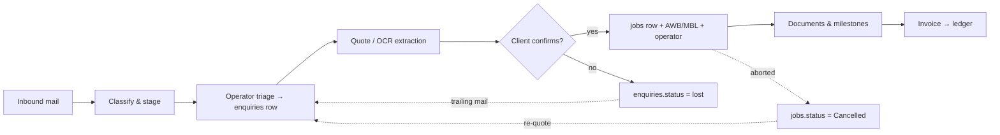
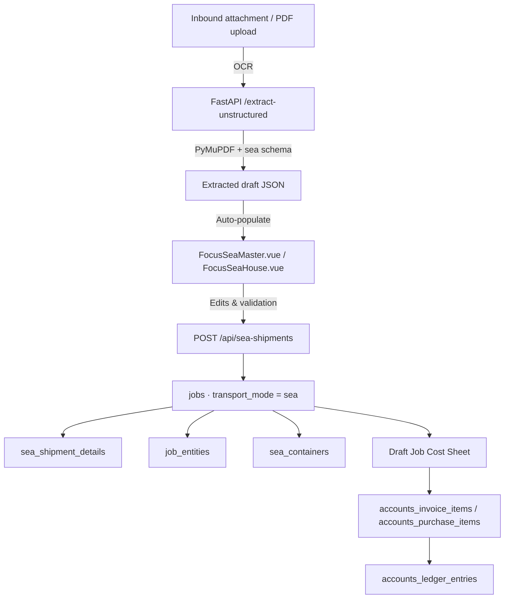
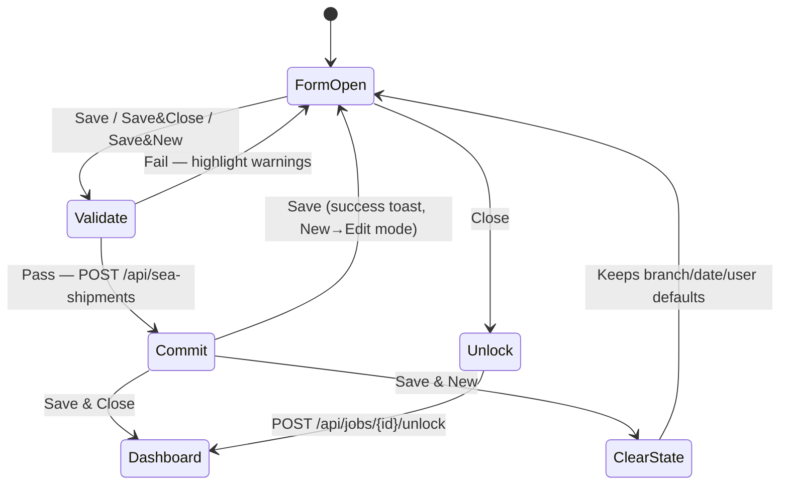
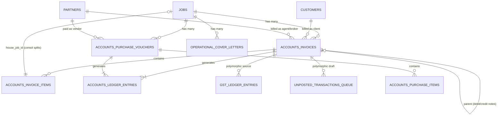
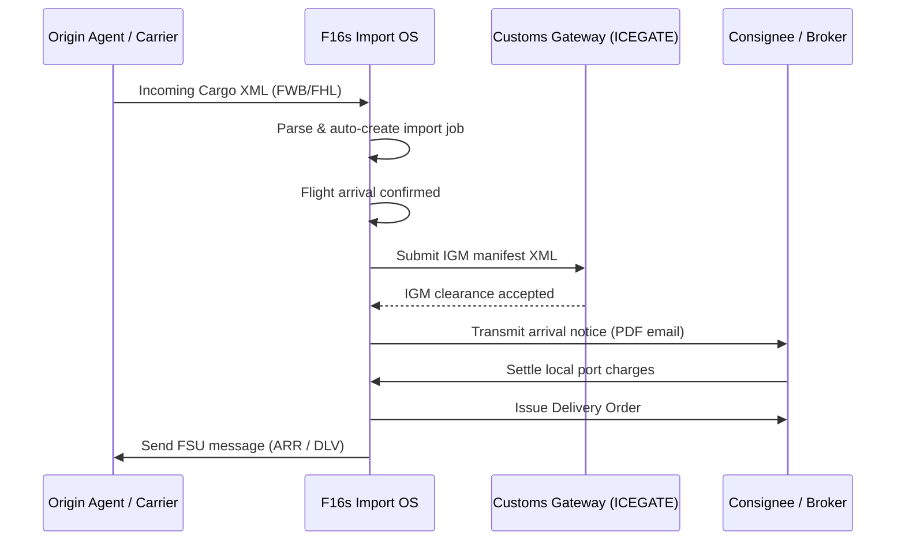

# 📘 F16s Freight OS — Product Requirements Document (PRD)

**Product:** F16s Freight Operations OS — a multi-tenant SaaS that turns a freight forwarder's inbound email into triaged enquiries, confirmed shipments, compliant documents, and posted double-entry accounting, with minimal manual re-keying.

**Status:** Living specification. This document is the *what* and *why*. It does not contain SQL.

---

## 0. Document Map — Which File Owns What

Three documents form the specification set. Each has exactly one responsibility; content must not be duplicated across them.

| Document | Owns | Never contains |
|---|---|---|
| **[`database_relations_tree.md`](file:///Users/jomygeorge/Desktop/f16sefreight/database_relations_tree.md)** | **Every table.** Column-level schema, types, keys, foreign-key trees, polymorphic morph targets, indexes, and the runnable DDL script. | Product rationale, workflows, UI behaviour |
| **[`implementation_guide.md`](file:///Users/jomygeorge/Desktop/f16sefreight/implementation_guide.md)** | **The build order.** Ordered, verifiable developer steps — infrastructure, migration batches, services, controllers, views, tests — with a checkpoint after each. | Column definitions, product justification |
| **`PRD.md`** *(this file)* | **The product.** Roles and access, tiers, workflows, screen-by-screen behaviour, business rules, formulas, non-functional requirements. | `CREATE TABLE` statements, column lists |
| **`ui_ux_guide.md`** | **The interface.** Design tokens, component library, states, layout & responsive rules, accessibility, micro-copy. | Permissions, workflows, column definitions |

> [!IMPORTANT]
> **Rule for this document:** when a table is referenced, reference it *by name only*. If a column materially drives a product rule (e.g. `enquiries.lost_reason`), name it inline — but never restate its type, nullability, or DDL. Before referencing any table here, verify it exists in `database_relations_tree.md` §*Database Relational Tables Mappings*. Section 10 carries the verified inventory.

---

## 📖 Table of Contents

1. [Product Summary](#1-product-summary)
2. [Access Model — Logins, Roles & UI](#2-access-model--logins-roles--ui)
3. [Subscription Tiers & Feature Gates](#3-subscription-tiers--feature-gates)
4. [Information Architecture & Navigation](#4-information-architecture--navigation)
5. [Segment A — Core Operations OS](#5-segment-a--core-operations-os)
6. [Segment B — Automated Financials & Reconciliation](#6-segment-b--automated-financials--reconciliation)
7. [Analytics & Sales Intelligence](#7-analytics--sales-intelligence)
8. [Segment C — Future Expansion Modules](#8-segment-c--future-expansion-modules)
9. [Non-Functional Requirements](#9-non-functional-requirements)
10. [Data Model Inventory](#10-data-model-inventory)
11. [Deferred & Open Items](#11-deferred--open-items)

---

## 1. Product Summary

### 1.1 The Problem

A freight forwarder's working day begins in an inbox. A client emails "450 kg, 25 pcs, Bombay to Frankfurt, best rate please." Today a human reads it, retypes it into a rate sheet, retypes it into an AWB, retypes it into an invoice, and retypes it into an accounting package. Every retype is a chance to lose the enquiry, mis-key a weight, or bill the wrong party — and none of it is measured, so nobody knows which enquiries were lost, why, or to whom.

F16s Freight OS collapses that chain: **email → enquiry → shipment → document → invoice → ledger**, with each step carrying its data forward and recording what happened.

### 1.2 Tenancy Model

Three nested levels, and the distinction matters for every query in the system:

```
companies        (Platform tenant — the forwarding firm subscribing to F16s)
   └── agents_info   (Branch / office — the isolation boundary for operations & finance)
          └── users  (Staff member, belonging to exactly one branch)
```

- **`company_id` isolates tenant-wide masters** — `customers`, `partners`, `sla_policies`, `gst_ledger_entries`, `unposted_transactions_queue`, `ocr_credit_transactions`. Any branch of a tenant may transact with any of that tenant's customers and partners.
- **`agent_id` isolates operational and financial records** — `enquiries`, `jobs`, `email_threads`, `accounts_invoices`, `job_documents`, and every analytical table.
- **`customers.branch_id` is advisory, not a wall.** It records the *managing / proximity branch* used for routing and sales assignment. It is **not** an isolation boundary. (If a tenant later needs hard per-branch client walls, that becomes an explicit product feature, never a silent default.)

### 1.3 The Three Portals

Resolved by subdomain; the hostname binds the session scope.

| Subdomain | Portal | Session binding | Who logs in here |
|---|---|---|---|
| `focusair.f16sefreight.com` | **Focus Air** | `active_portal_scope = 'air'` | Pricing, Operations, Sales, Accounts |
| `focussea.f16sefreight.com` | **Focus Sea** | `active_portal_scope = 'sea'` | Pricing, Operations, Sales, Accounts |
| `admin.f16sefreight.com` | **Platform Admin** | none — platform level, no tenant | Platform Superadmin only |

Tenant **Boss / Director** users are deliberately **not portal-scoped**: they enter through either operational subdomain and see both modes side by side, because their job is cross-mode comparison.

### 1.4 Build Segments

| Segment | Scope |
|---|---|
| **A — Core Operations OS** | Multi-portal document workspace (Focus Air, Focus Sea), Gmail/Outlook inbox sync, AI/OCR extraction, enquiry→job lifecycle, Kanban operations, role dashboards |
| **B — Automated Financials** | Invoices, purchase vouchers, GST register, double-entry ledger, bank (Plaid/Setu) and IATA CASS reconciliation, financial reports |
| **C — Future Expansion** | Air/Sea import documentation & customs transmission (IGM, CGM/SCMTR, FSU), direct carrier/airline booking integrations |

### 1.5 Technology Stack

- **Backend:** Laravel 7+ (PHP-FPM) + Horizon queue workers, MySQL 8.0, Redis, Soketi (Pusher-compatible WebSockets)
- **AI / OCR microservice:** Python **FastAPI** — PyMuPDF (`fitz`) for fast text extraction, local **Ollama / Gemma 4 E4B** for JSON mapping, **Gemini 2.5 Flash** cloud fallback for scanned/visual OCR, **ChromaDB** + `nomic-embed-text` for SOP retrieval
- **Frontend:** Vue 2.7 SPA with the drawer-workspace pattern, `vuedraggable` Kanban, ApexCharts, Driver.js tours, `html2canvas` for visual bug reports
- **Infrastructure:** Docker Compose locally; AWS ECS/Fargate + RDS + ElastiCache in production; a dedicated AWS `t4g.large` (Graviton) instance inside a private VPC for the AI stack

### 1.6 Delivery Methodology

> [!IMPORTANT]
> **Small increments, verified at each step.** Every phase ships as a vertical slice. Run the verification checkpoint (migration status, tinker counts, feature test, browser check) *before* starting the next step. A half-migrated schema or an untested observer compounds into an unrecoverable state faster than any other class of mistake in this codebase.

---

## 2. Access Model — Logins, Roles & UI

This is the authoritative description of **who can log in, what each login type is entitled to, and exactly which screens deliver it.**

### 2.1 Authentication & Session Binding

1. **Pre-login company selection.** Before credentials are entered, the user picks their company from the registered tenant list. This binds `company_id` to the session.
2. **Subdomain resolves the portal.** Nginx passes the hostname to Laravel, which binds `active_portal_scope` (`air` | `sea`) — or, on `admin.`, enters the platform-level context with no tenant binding at all.
3. **Authentication.** On success the session carries: `user_id`, `company_id`, `agent_id` (from `users.branch_name`), `designation`, `active_portal_scope`, and `company.tier`.
4. **The frontend receives `currentUser`** including `user.company.tier` and `user.designation`. Route guards and component-level gates read from it; the backend re-checks everything (the frontend gate is convenience, never security).

*DNS:* the three subdomains are CNAME records at the DNS provider pointing at the application load balancer. Nginx virtual hosts inside the `web` container forward all three to the same Laravel entrypoint.

### 2.2 Registration & Onboarding

**Company registration.** A forwarding firm registers with its corporate details and declares its official corporate `@` domain(s) — stored on `companies.email_domain`, supporting a comma-separated multi-domain list (`xyzcompany.com, xyzcompany.co.in`). This list is used *only* to validate which mailboxes may be OAuth-connected.

**User self-registration.** Once the parent company exists, employees register under it. Registration **requires** selecting a default origin port (airport or seaport from the `ports` UN/LOCODE directory) → `users.origin_port_id`.

**PIMA assignment.** The Boss assigns each user's PIMA address (`users.pima_address`) for SITA/IATA Type B message routing. Not self-serve — it is an operational routing identity.

**Client onboarding & proximity routing** *(Command tier only)*: when a new customer is created, the system captures their default port (`customers.default_port_id`), resolves the nearest branch by LOCODE proximity into `customers.branch_id`, and auto-assigns a `designation = 'sales'` user from that branch into `customers.sales_id`. That column is the scoping key for the entire Command-tier client book.

**Client lookup by domain suffix.** The customer search box matches on both company name and `customers.email_domain` (searching `globex.com` or `@globex.com` finds *Globex Corp*), which is what makes manual triage fast.

> **Two `email_domain` columns, two different jobs — do not confuse them.**
> `companies.email_domain` = *our* tenant's own domain, used to validate OAuth mailbox connections.
> `customers.email_domain` = the *client's* domain, used to attribute inbound mail → customer → `sales_id`.

### 2.3 Role Catalogue

**Role separation is itself a tier feature.**

| Tier | Logins | Who exists |
|---|:---:|---|
| **`core`** | **1** | One undifferentiated user. `users.designation` is carried but **inert** — no roles, no inbox, no jobs. Standalone Focus Air / House Waybill with `pdfplumber` only |
| **`tactical`** | **4** | `pricing` · `operations` · `sales` · `boss` — real, distinct logins |
| **`command`** | **5** | adds `accounts`; upgrades `sales` and `boss` to client-book / financial scope |

**`superadmin`** (F16s staff) sits outside all of it — platform-level, not a `designation`, unaffected by tier.

> [!NOTE]
> **`documentation` is not a login.** Legacy `designation` value only. Document work — e-docket, cover letters, manifest filing, DSC signing — is done by the *same* operations user who executes the shipment (`jobs.ops_id`). One job, one operations owner.
> **`admin`** is the legacy value for **Boss**. Migrate `admin → boss`, `documentation → operations`.

---

#### Master matrix — what each login gets at each tier

| Login | `core` | `tactical` | `command` |
|---|---|---|---|
| **🎯 Pricing** | — | Full role: triage · quote · convert · assign · OLI · cancel | + cost sheet feeds real invoices/vouchers |
| **🛠️ Operations** | — | Full role: claim · extract · verify · generate · file customs | *no change* — the upgrade is commercial, not operational |
| **📈 Sales** | — | **Branch aggregates only.** Wins/losses, conversion %, tonnage, lane movement, staff load. **No client names, no money** | **Client book, `sales_id = me`.** Per-client revenue & tonnage, receivables, credit, loss intelligence, NBA queue |
| **💰 Accounts** | — | — *(no financial module to run)* | Full role: finalize · post · reconcile · close periods |
| **🏛️ Boss** | — | Operational oversight: audit matrix, OLI grid, latency heatmap, targets | + **read** P&L / BS / TB, leakage queue, dispute panel, exec brief |
| **🔧 Superadmin** | Platform administration at every tier — unaffected by the tenant's subscription | | |

Read a `—` as *"this login does not exist yet"*, not a reduced version of itself.

---

#### 2.3.1 🎯 Pricing — *the commercial owner*

**Owns** `enquiries.pricing_id` / `jobs.pricing_id` · **Scope** all enquiries + jobs in their branch, active mode only

**Does** — triage inbound mail (the act that **mints `enquiry_no`**) · quote & record `quoted_amount` · `[Mark as Lost]` + reopen · **`[Confirm Shipment]` — the only action that creates a `jobs` row** · `[Cancel Shipment]` + re-initiate · assign/reassign operators directly · accept/reject handover requests from the bell · edit Job Cost Sheet rates · upload & extract PDFs

**Never** — analytics dashboards (`403`, nav hidden) · post to the ledger · other branches

**Screens** — `/inbox` (`JobInbox.vue`: `[Classify As…]`, `[Confirm Shipment]`, `[Mark as Lost]`) · `/kanban` (`OpsDashboard.vue`: both views, Unassigned Pool, **cross-staff matrix**, OLI panel) · bell (approvals pinned top) · `JobCostSheet.vue`

---

#### 2.3.2 🛠️ Operations — *the executor*

**Owns** `jobs.ops_id` · **Scope** **only their own jobs** (`ops_id = me`); Process-View cards show ops + pricing names for shared context; no cross-staff matrix

> **One operations user per job.** Execution and paperwork are not split — no "Doc User" field, no second login. The `ops_id` user owns extraction → verification → documents → e-docket → cover letters → customs filing.

**Does** — claim from the pool (atomic; loser gets `409`) · extract, verify, correct low-confidence fields · generate MAWB/HAWB/MBL/HBL · advance milestones · approve/reject staged client emails · e-docket, container stuffing, arrival notices, DO release, cover letters, `manifest_filings` (CGM/SCMTR/IGM + DSC), approved-drafts queue · **request** a handover (staged as `pending_ops_id`) and **withdraw** it (auto-dissolves the bell notification)

**Never** — `[Confirm Shipment]` / `[Assign Task]` (hidden) · mark anything Lost · reassign directly · analytics · financials

**Screens** — `/kanban` (own queue, landing) · `/inbox` + `[Analyze PDF]` dropzone · drawer forms (`FocusAir`, `HouseWayBill`, `FocusSea*`, `FocusAirImport`) · E-Docket tab · `/manifest-filing` · `/cover-letters` · `/message-log`

---

#### 2.3.3 📈 Sales — *the account manager*

**Owns** `customers.sales_id` + `enquiries.sales_id` · **Scope** tier-driven — the sharpest upgrade boundary in the product

| | Tactical | Command |
|---|---|---|
| Scope | branch aggregate (`agent_id`) | **`sales_id = me`** |
| Sees | wins/losses, conversion %, shipment counts, gross-weight tonnage, lane/country movement, per-staff load | + per-client revenue MTD/YTD, tonnage, movement, aged receivables (0–30/31–60/60+), credit exposure vs `credit_limit`, per-client loss reasons, AI account tools, ranked NBA queue |
| Client names | ❌ | ✅ |
| Money | ❌ | ✅ revenue only |

- **Mode scoping is absolute** — one transport mode at a time, bound to `active_portal_scope`. No "Both" toggle; cross-mode is Boss-only.
- **Never sees margin at any tier** — buy-side cost and sell − buy stay with pricing, accounts and the Boss P&L. Sales sees the top line, never the spread.
- Unattributed enquiries (`sales_id IS NULL`) sit in a shared **Unattributed** bucket until accounts registers the customer, then backfill assigns them (§7.4).

**Never** — create, convert or cancel anything · assign operators · another rep's clients · margin

**Screens** — `/sales` (`SalesDashboard.vue`, chart-first + period selector) · Today's Actions panel · My Accounts grid **(Command)** · Outstanding & Credit **(Command)** · `/customers` · `UpgradeTeaser.vue` lock on Command widgets

---

#### 2.3.4 💰 Accounts — *the bookkeeper* · **Command only**

**Owns** `created_by` on invoices, vouchers and the unposted queue · **Scope** all financial documents in their branch, **both transport modes** (a register split by air/sea is useless at month-end)

**Does** — **finalize & post** invoices, debit/credit notes, brokerage, consol invoices, purchase vouchers · unposted-transactions queue + `[Post Ledger]` · bank reconciliation (write-off / short-paid / discount) · CASS upload + mismatch disputes · **open/close/reopen `accounting_periods`** · GST register & GSTR-1 · chart of accounts + rate cards · override a credit hold, adjust `credit_limit` / `payment_terms_days` · Unbilled Jobs leakage queue · bank-to-branch mapping

**Never** — triage, quote, convert, assign, cancel · edit a manifest or waybill · the sales client book · tenant users or tiers

> #### 🔒 Segregation of duties
> **Pricing edits the cost sheet; Accounts finalizes and posts it.** The person who sets the margin never books the revenue. Enforced by policy *and* the `created_by` designation check. **Posting and period control are exclusive to `accounts` — not even the Boss may do either.**

**Screens** — `/financials` (registers, `[Finalize]`/`[Post Ledger]`) · `/unposted` · `/reconciliation` (`ReconciliationView.vue`) · `/cass` · `/unbilled` · `/periods` · `/reports` · `/settings/finance` · `JobCostSheet.vue` (**the only role with `[Finalize]`**)

---

#### 2.3.5 🏛️ Boss / Director (`designation = 'boss'`)

**Scope** **company-wide and cross-mode** — the only tenant role not scoped by branch, portal or mode

**Does** — company-wide audit matrix (by branch, by staff) · target assigner (revenue or tonnage) · Weekly Executive Brief · **read** every financial report, leakage queue and dispute panel · milestone latency heatmap · staff workload/OLI grid · **profit margin** on any job · tenant settings (§2.3.7)

**Never** — post to the ledger · open/close a period · triage, convert or cancel

> **Why the Boss cannot post.** The role that sets targets must not book the revenue those targets are measured in. The Boss reads everything and signs nothing.

**Screens** — `/boss` (`BossDashboard.vue`) · `/financials` **read-only** · `/settings/*` · read access to `/kanban` and `/inbox`

---

#### 2.3.6 🔧 Superadmin — the F16s owner (`admin.f16sefreight.com`)

**Scope** **cross-tenant, tier-independent** — the only login not scoped by `company_id`, `agent_id`, `transport_mode` or `tier`. Gated by `superadmin` middleware; unreachable by any tenant user at any tier.

**Does** — tenant management (create/edit companies, set `tier`, register corporate domains) · OCR credit administration (allowance, overdraft ceiling, one-off top-ups — **every change needs a reason**, logged to `ocr_credit_transactions` as `custom_override`) · infrastructure health monitor (`platform:status:ai_server`, Horizon, CPU/RAM) · tail log viewer (last 100 lines) · Horizon failed-job inspector + retry · support desk (`support_tickets` → `investigating`/`resolved` with developer notes emailed back) · global AWB tracking + CSV export · classification analytics (accuracy ratios, confusion matrix, optimisation-hook export)

**Never** — operate a tenant's business. No triage, quoting, conversion, assignment, invoicing, posting or period control. Superadmin can see *that* a tenant's AI server is down; it does not run their shipments or touch their books.

**Screens** — `SuperadminMonitor.vue` · `SupportDeskTickets.vue` · tenant management · AWB tracking · classification analytics


#### 2.3.7 Settings Ownership — Platform vs Tenant

This split is authoritative; it resolves the earlier ambiguity about what "the admin portal" means.

| Setting | Owner | Where |
|---|---|---|
| Create/edit tenant companies, assign `tier` | **Platform superadmin** | `admin.f16sefreight.com` |
| Register corporate email domain (`companies.email_domain`) | **Platform superadmin** | `admin.f16sefreight.com` |
| OCR credit allowance / overdraft / top-up | **Platform superadmin** | `admin.f16sefreight.com` |
| Support tickets, health monitor, logs, failed queues | **Platform superadmin** | `admin.f16sefreight.com` |
| Users, designations, PIMA addresses, branches | **Boss** | in-app `/settings/users` |
| Email triage rules (`email_classification_rules`) | **Boss** | in-app `/settings/email-triage-rules` |
| SLA policies (`sla_policies`) | **Boss** | in-app `/settings/sla` |
| OLI complexity coefficients & capacity caps | **Boss** | in-app `/settings/workload` |
| Chart of accounts, rate cards, bank-to-branch mapping | **Accounts** (Command) | in-app `/settings/finance` |
| Accounting period open / close | **Accounts only** (Command) | in-app `/financials/periods` |
| Customer & partner masters | **Boss / Sales** | in-app `/customers`, `/partners` |
| Mailbox OAuth connections | **Each user**, domain-validated | in-app `/settings/mailboxes` (`MailboxSettings.vue`) |

### 2.4 Role × Screen Matrix

Legend: ✅ full · 👁️ read-only / scoped subset · ❌ blocked (`403` + hidden nav) · 🔒 tier-gated

| Screen | Pricing | Operations | Sales | Accounts | Boss | Superadmin |
|---|:---:|:---:|:---:|:---:|:---:|:---:|
| `/inbox` — unified mail workspace | ✅ | ✅ | ❌ | ❌ | 👁️ | ❌ |
| Triage `[Classify As…]` / mint enquiry | ✅ | ❌ | ❌ | ❌ | ❌ | ❌ |
| `[Confirm Shipment]` → create job | ✅ | ❌ | ❌ | ❌ | ❌ | ❌ |
| `[Mark as Lost]` / reopen | ✅ | ❌ | ❌ | ❌ | ❌ | ❌ |
| `[Cancel Shipment]` / re-initiate | ✅ | ❌ | ❌ | ❌ | 👁️ | ❌ |
| `/kanban` Process View | ✅ | 👁️ own | ❌ | ❌ | ✅ | ❌ |
| `/kanban` Staff/clearance matrix | ✅ | ❌ | ❌ | ❌ | ✅ | ❌ |
| Assign / reassign operations user | ✅ | ❌ | ❌ | ❌ | ✅ | ❌ |
| Request / withdraw handover | ❌ | ✅ | ❌ | ❌ | ❌ | ❌ |
| Operator Load Index panel | ✅ | ❌ | ❌ | ❌ | ✅ | ❌ |
| Drawer: PDF extract & verify | ✅ | ✅ | ❌ | ❌ | ❌ | ❌ |
| Drawer: Job Cost Sheet — **edit rates** | ✅ | ❌ | ❌ | ✅ 🔒 | 👁️ 🔒 | ❌ |
| Drawer: Job Cost Sheet — **`[Finalize]`** | ❌ | ❌ | ❌ | **✅ 🔒** | ❌ | ❌ |
| Drawer: E-Docket | ✅ | ✅ | ❌ | 👁️ | 👁️ | ❌ |
| `/manifest-filing`, `/cover-letters` | 👁️ | ✅ | ❌ | ❌ | 👁️ | ❌ |
| `/sales` branch view | ❌ | ❌ | ✅ 🔒 | ❌ | ✅ | ❌ |
| `/sales` client book + receivables | ❌ | ❌ | ✅ 🔒 | ❌ | ✅ 🔒 | ❌ |
| Profit margin (sell − buy) | ✅ | ❌ | **❌ never** | ✅ 🔒 | ✅ 🔒 | ❌ |
| **Post to general ledger** | ❌ | ❌ | ❌ | **✅ 🔒 sole** | ❌ | ❌ |
| `/financials` registers & unposted queue | ❌ | ❌ | ❌ | ✅ 🔒 | 👁️ 🔒 | ❌ |
| `/financials` bank & CASS reconciliation | ❌ | ❌ | ❌ | ✅ 🔒 | 👁️ 🔒 | ❌ |
| `/financials` reports (P&L, BS, TB, GST) | ❌ | ❌ | ❌ | ✅ 🔒 | ✅ 🔒 | ❌ |
| Open / close accounting periods | ❌ | ❌ | ❌ | **✅ 🔒 sole** | ❌ | ❌ |
| Credit-limit override / release blocked DO | ❌ | ❌ | ❌ | ✅ 🔒 | ✅ 🔒 | ❌ |
| `/boss` executive dashboards | ❌ | ❌ | ❌ | ❌ | ✅ 🔒 | ❌ |
| Tenant settings (users, rules, SLA) | ❌ | ❌ | ❌ | ❌ | ✅ | ✅ |
| `/settings/finance` (CoA, rate cards, banks) | ❌ | ❌ | ❌ | ✅ 🔒 | ✅ 🔒 | ❌ |
| `admin.` platform portal | ❌ | ❌ | ❌ | ❌ | ❌ | ✅ |

**Two exclusive powers.** Posting to the general ledger and opening/closing an accounting period are marked **sole** — no other role, including the Boss, may perform them. The boss reads every report but signs no journal entry.

### 2.5 Scoping Rules — the Four Filters

Every list query in the system is the intersection of up to four independent filters. They are not interchangeable and must not be collapsed.

1. **Tenant / branch isolation** — a **Laravel Global Scope**, applied automatically, branching on which column the table carries: `agent_id` for operational/financial tables, `company_id` for tenant-wide masters. This is the security boundary.
   - **Escape hatch:** background daemons, console commands, webhooks and supervisors call `withoutTenantScope()` explicitly (e.g. `Job::withoutTenantScope()->find($id)`).
2. **Portal / mode scoping** — a **named, non-global** scope `scopeForActivePortal()` filtering `transport_mode`, chained explicitly in HTTP controllers. **Deliberately not global**, so queue workers, WebSocket broadcasts and crons — which have no session — are never silently mis-filtered.
3. **Role scoping** — operators see `ops_id = me`; sales on Command sees `customers.sales_id = me`; pricing and admin see the full branch.
4. **Tier gating** — the `CheckCompanyTier` middleware plus Vue route guards, implemented against the matrix in §3.2.

**Cross-tenant referential integrity is application-enforced.** A job's branch and its parties (`jobs.customer_id`, `job_entities.party_id`, `accounts_invoices.billed_party_id`, voucher `vendor_id`) are not composite-keyed to the same tenant at the database level. Every `FormRequest`/service **must** assert that each referenced customer or partner shares the acting user's `company_id` before persisting. Dedicated cross-tenant security tests cover this.

### 2.6 Session Safety, Row Locks & Real-Time Authorization

- **Concurrent edit locking:** opening a shipment form takes a Redis optimistic lock (`shipment_lock:{jobId}`, 45 min). A header countdown shows the remaining time; the frontend heartbeats via `POST /api/jobs/{id}/heartbeat`. On expiry or `[Close]`, the row unlocks and the user is routed back to the dashboard.
- **WebSocket authorization:** real-time pushes ride private branch channels (`private-branch.{agent_id}`). The `Broadcast::channel()` callback **must** verify the authenticated user's branch matches the requested `{agent_id}`.
- **Reply authorization:** `POST /api/jobs/{id}/reply` runs an explicit policy check (`$this->authorize('reply', $job)`) confirming the operator owns or may send from the mailbox connected to that thread.

---

## 3. Subscription Tiers & Feature Gates

### 3.1 Tier Definitions

Carried on `companies.tier`.

| Tier | In one line | Logins |
|---|---|:---:|
| **`core`** | Single-user document tool — `pdfplumber` extraction only. No AI, no email, no jobs, no financials | 1 |
| **`tactical`** | Becomes a **team system** — AI parsing, inbox sync, full operational workflow, **branch-level** analytics | 4 |
| **`command`** | Becomes a **business system** — **client-level** intelligence, ledger, reconciliation, Boss dashboards | 5 |

### 3.2 Tier Feature Matrix *(authoritative gate reference)*

`CheckCompanyTier` middleware and the Vue route guards implement against this table. Keep inline gating comments in sync with it.

| Capability | `core` | `tactical` | `command` |
|---|:---:|:---:|:---:|
| **Multi-role logins / role separation** | ❌ **1 login only** | ✅ 4 roles | ✅ 5 roles |
| Coordinate-based PDF extraction (`pdfplumber` templates) | ✅ | ✅ | ✅ |
| AI unstructured parsing (PyMuPDF + Gemma) & vision OCR (Gemini) | ❌ | ✅ | ✅ |
| Unified Gmail/Outlook inbox sync & triage | ❌ | ✅ | ✅ |
| Operational workflows (enquiries, jobs, Kanban, assignment, OLI) | ❌ | ✅ | ✅ |
| Cancellation / re-initiation & audit trail | ❌ | ✅ | ✅ |
| **Sales — branch performance** (wins/losses, shipment counts & gross-weight tonnage, country/lane movement from AWB routing, per-staff job load) | ❌ | ✅ | ✅ |
| **Sales — client book** (per-client revenue, tonnage & movement, scoped by `sales_id = me`) | ❌ | ❌ | ✅ |
| **Outstanding receivables, credit exposure & collections** | ❌ | ❌ | ✅ |
| Automated financials (invoices, vouchers, GST, double-entry ledger) | ❌ | ❌ | ✅ |
| Bank (Plaid/Setu) & IATA CASS reconciliation | ❌ | ❌ | ✅ |
| Director / Boss executive dashboards | ❌ | ❌ | ✅ |
| Client onboarding proximity routing & sales auto-assignment | ❌ | ❌ | ✅ |
| Structured analytical data & exports | ❌ | Basic | ✅ Full |

> **Core → Tactical is the *team* boundary** — one login becomes four, each with its own dashboard and data scope. That is the upgrade, not merely "more features".
> **Tactical → Command is the *money* boundary** — *"how is my branch doing?"* becomes *"how is each of **my** clients doing, and who owes me money?"*, and adds the fifth login (`accounts`) because there is finally a ledger to run.
> **Margin (sell − buy) is never in the sales view at any tier.** Per-login detail: §2.3.

### 3.3 Enforcement Layers

Gating is applied at **four** independent layers, because any one of them alone is bypassable.

1. **Database / configuration** — `companies.tier` is the single source of truth; `sla_policies` are keyed by tier.
2. **Route middleware (`CheckCompanyTier`)** — registered as `'tier'` in `Http/Kernel.php`.
   `Route::group(['middleware' => 'tier:tactical,command'], …)` for mailbox sync and AI extraction; `Route::group(['middleware' => 'tier:command'], …)` for reconciliation and ledger endpoints.
   **Check tier before role.** On `core` every user resolves to the one Core login and all role routes are unreachable, whatever `designation` the row carries; role policies start evaluating at `tactical`, and `accounts` only at `command`. This ordering stops a Core tenant reaching a role-scoped endpoint by setting a designation directly in the database.
3. **Background jobs** — the `mailboxes:poll` daemon only pulls for connections whose company is `tactical` or `command`. `ProcessPdfOcrJob` branches on tier before choosing an extraction path.
4. **Frontend** — Vue route guards block `/inbox`, `/financials`, `/sales` client-book widgets and `/boss` for disallowed tiers, rendering a blurred `UpgradeTeaser.vue` lock overlay with a **"Request Upgrade"** CTA that raises a support request to the account administrator.

**Downgrade behaviour:** connected mailboxes are **soft-deactivated** (`mailbox_connections.is_active = false`), pausing sync while keeping tokens encrypted and intact, so an upgrade restores service without re-authorization.

### 3.4 OCR Credit Economy

Text-selectable PDFs are parsed locally on our own hardware and are **free**. Only **vision OCR** (scanned documents and images dispatched to Gemini 2.5 Flash) consumes credits.

**Runtime gate** — executed inside a DB transaction with a row-level write lock (`SELECT … FOR UPDATE` on the `companies` row) so concurrent uploads by the same tenant cannot race past the ceiling:

- `ocr_credits_balance > ocr_credits_limit` → proceed, decrement by 1, commit, log to `ocr_credit_transactions`.
- `balance ≤ limit` → commit, halt the job, set status `failed` with reason **Credits Exhausted**, push a WebSocket recharge alert.

`ocr_credits_limit` is an **overdraft floor** (default `0`, may be set negative per client) — a soft ceiling below zero before background parsing starts failing.

**MIME guard:** every upload is validated by strict server-side MIME sniffing (PHP `finfo_file`, **not** extension checks). HTML, SVG and other unsupported formats are rejected before any processing, closing a parser-exploit vector.

---

## 4. Information Architecture & Navigation

### 4.1 Global Sidebar (app level)

The leftmost persistent rail, present on every operational route:

| Item | Icon | Route | Visible to |
|---|---|---|---|
| **Mail / Inbox** | `mailbox` | `/inbox` → `JobInbox.vue` | Pricing, Operations, Boss |
| **Kanban Board** | `kanban` | `/kanban` → `OpsDashboard.vue` | Pricing, Operations, Boss |
| **Focus Air** | `file-earmark-text` | standalone MAWB generation | Air portal |
| **House Waybill** | `file-earmark` | standalone HAWB generation | Air portal |
| **Focus Sea** | `water` | Master / House / Consol | Sea portal |
| **Sales** | `graph-up` | `/sales` → `SalesDashboard.vue` | Sales, Admin |
| **Financials** | `cash` | `/financials` | Accounts (full), Admin (read-only) — hidden below Command |
| **Boss** | `speedometer` | `/boss` → `BossDashboard.vue` | Admin — Command |
| **Settings** | `gear` | `/settings/*` | scoped per §2.3.7 |

### 4.2 The Three-Column Inbox Workspace

Gmail-inspired, inside `/inbox`:

- **Column 1 — Folders:** `Inbox`, `Assigned`, `Unassigned`, `Processing`, `Awaiting Client`, `Completed`
- **Column 2 — Thread feed:** chronological, showing customer name, subject, timestamp, and colour-coded SLA countdown
- **Column 3 — Conversation:** message timeline, collapsed-history accordions, attachment chips, rich-text quick-reply editor, and the staged automated-message consent banners

### 4.3 The Drawer Workspace & Split-Pane Collapse

The signature interaction of the product: verify a document **side by side** with the email that carried it, without leaving the thread.

Clicking the **split-window icon** in the top-right header opens a right-side drawer and reflows the layout:

- The **global sidebar** collapses to a 60 px icon-only rail (routes remain reachable)
- **Columns 1 and 2 slide off-screen left**
- **Column 3 (conversation)** expands to exactly **50%** of the viewport
- The **drawer** occupies the other **50%**
- **Below 1200 px** the split collapses to a full-width stacked form with a toggle back to the timeline

Closing the drawer reverses the transition.

**Drawer tab bar** (top of the drawer, styled like a mobile app header):

| Tab | Component | Purpose |
|---|---|---|
| **Upload** *(default)* | dropzone | Drag-and-drop or click-to-select PDFs from the thread or local disk |
| **Focus Air** | `FocusAir.vue` | MAWB draft verification |
| **House Waybill** | `HouseWayBill.vue` | HAWB draft verification |
| **Focus Sea** | `FocusSeaMaster.vue` / `FocusSeaHouse.vue` / `FocusSeaConsol.vue` | MBL / HBL / consolidation |
| **Air Import** | `FocusAirImport.vue` | Import consol, arrival notice, DO release |
| **Job Cost Sheet** | `JobCostSheet.vue` | Buy/sell rates, DO charges, cartage, doc fees |
| **E-Docket** | document manager | `job_documents` upload & typing |
| **Search** | global search | Look up AWBs / enquiries / jobs without losing context |

Form actions available in every document tab: **`[Save Draft]`** (persists a draft row) and **`[Generate PDF]`** (compiles the final document). Extracted values arrive pre-populated; validation warnings (unrecognized airport codes, mismatched dimensions, failed checksums) are highlighted **orange inline**.

**Drawer toolbar:** a prominent **"View Source Email"** button always returns the operator to the originating thread in `JobInbox.vue`.

### 4.4 Contextual Form Loading

The drawer swaps its document tools based on `active_portal_scope` and `jobs.direction`:

- `air` + `export` → `FocusAir.vue`, `HouseWayBill.vue`
- `air` + `import` → `FocusAirImport.vue` (arrival notice, DO release)
- `sea` + `export` → `FocusSeaMaster.vue`, `FocusSeaHouse.vue`, `FocusSeaConsol.vue`
- `sea` + `import` → sea import consol, Delivery Order [Sea], CGM filing

---

## 5. Segment A — Core Operations OS



### 5.1 Document Ingestion & the Hybrid Parsing Engine

**Hybrid by document class** — one parser cannot serve both:

- **Structured documents (AWBs)** → keep **`pdfplumber`** coordinate-based cell extraction (`extract_awb_new.py`). The layout is fixed; coordinates are the fastest correct answer.
- **Unstructured documents (invoices, packing lists)** → **PyMuPDF (`fitz`)**, written in C and **10–50× faster** than `pdfplumber`, extracting full text blocks in milliseconds to feed the LLM.

**Routing inside `/extract-unstructured` (FastAPI):**

| Input | Path | Cost |
|---|---|---|
| Text-selectable digital PDF | PyMuPDF → local **Gemma 4 E4B** (Ollama) → JSON | free |
| Scanned PDF / image (no selectable text) | **Gemini 2.5 Flash** vision OCR | 1 OCR credit |

**Pydantic schemas** (`python/schemas.py`) validate structure, types and confidence metadata before anything returns to Laravel. Every parsed field carries a **confidence score** (high / medium / low) based on whether the value matched exact coordinates or was extrapolated from structure.

**Translation:** foreign-language documents (descriptions, names, addresses) are auto-translated to standard English during LLM processing so the JSON schema stays uniform. The original payload and confidence scores are retained for audit.

**Extraction correction loop:** when the operator clicks `[Confirm & Approve]` on the *initial verified draft*, the backend diffs the operator's values against the original LLM output in `pdf_processing_jobs.extracted_data` and logs each corrected field to `pdf_extraction_corrections`.

> **Why diff at draft-verification, not against final records:** final cargo weight, dimensions and pieces legitimately change later at the warehouse and airline terminal. Comparing against execution records would manufacture false "LLM errors" and poison the accuracy metric.

**UI:** `OcrUploadModal.vue` provides the drag-and-drop handler; extracted fields pre-populate `FocusAir.vue` / `HouseWayBill.vue` inline, with **medium and low confidence fields highlighted orange** to force manual review even when the string format is valid.

### 5.2 The Unified Inbox

#### 5.2.1 Mailbox Connection (OAuth)

- Providers: **Google** (Google API Client) and **Microsoft** (Graph API). Tokens stored encrypted at rest in `mailbox_connections`.
- **Domain enforcement (Tactical & Command):** the connecting mailbox address must carry one of the company's registered corporate suffixes from the comma-separated `companies.email_domain` list. Mismatch returns `403`. This prevents staff attaching personal mailboxes to tenant data.
- **Downgrade:** soft-deactivate (`is_active = false`), preserve encrypted tokens.
- **UI:** `MailboxSettings.vue` — connected mailbox list, provider connect buttons, connection status alerts.

#### 5.2.2 Background Polling

`php artisan mailboxes:poll`, scheduled **every minute**:

- Gmail → `/users/me/messages`; Outlook → `/me/mailFolders/inbox/messages`
- Normalizes headers (from/to, subject, body, attachments), computes the `thread_key`, upserts `email_threads` and `inbound_emails`, indexes `inbound_attachments`
- **Delta syncing:** Microsoft delta queries and Google history IDs so only *new* mail is fetched — never a full mailbox scan
- **Lazy attachments:** binary files are downloaded to storage only when a user actually initiates parsing or opens the extraction tab
- **Antivirus:** every attachment is streamed through a ClamAV daemon before being persisted
- **XSS:** `body_html` is sanitized server-side with HTMLPurifier **before** storage
- Computes the **SLA reply countdown** per thread from the tenant's `sla_policies` tier row

**Everything is ingested into one unified feed** — customer enquiries and automated airline notices alike. Nothing is dropped; classification decides what reaches the operational queue, not what gets saved.

#### 5.2.3 The Configurable Regex Classification Engine

A database-driven rule engine (`email_classification_rules`, cached in Redis hash maps) rather than an LLM — it processes up to **10,000 emails/day at zero token cost**.

**Canonical classifications:**

| Value | Meaning | Creates an enquiry? |
|---|---|---|
| `customer_enquiry` | Client business enquiry | **Yes** — on operator confirmation |
| `airline` | Airline notices, flight confirmations, AWB tracking, schedule changes | No |
| `clearance` | Customs status updates, documents, ICEGATE alerts | No |
| `trucking_road` | Road freight tracking, trucker dispatch notices | No |

**Matching order:**

1. **Domain match** (`rule_type = 'domain_blocklist'`) — sender domain (e.g. `@emirates.com`) maps the thread to a target classification.
   *This is **not** a blocklist in the traditional sense: the mail is never dropped, blocked, or hidden. It stays fully visible in the unified feed; it simply does not enter the operational queue.*
2. **Subject / header regex** (`subject_keyword`) — e.g. `/flight\s*change|booking\s*confirm|cargo\s*status/i`
3. **Body cargo extraction** (`body_keyword`) — pieces, weight, volume. Their presence classifies the mail as `customer_enquiry`.
4. **Safest default:** no rule matched → `customer_enquiry`, so no potential business is ever silently discarded.
5. **Hit counters:** every successful match increments the rule's `hit_count`.

> ##### 🔑 Authoritative rule: regex *stages*, the operator *mints*
> When the parser scores a mail as `customer_enquiry` it **pre-selects** that classification and parks the extracted cargo variables on the `email_threads` row. **No `enquiry_no` is consumed and no `enquiries` row is created until an operator confirms via the triage dropdown.**
>
> This is not caution for its own sake. Because step 4 defaults *unmatched* mail to `customer_enquiry`, auto-minting would burn a sequence number on every stray newsletter and inflate the conversion denominator with junk — corrupting exactly the funnel the `enquiries` table exists to measure. Staging keeps the funnel honest while preserving zero-touch classification.

**Non-enquiry threads** are saved with **both `enquiry_id` and `job_id` NULL** — no number consumed, no Kanban card, still fully readable in the feed.

#### 5.2.4 Operator Overrides & the Learning Loop

An operator can change the classification from the inbox or Kanban dropdown at any time.

- **Promotion** to `customer_enquiry` → creates the `enquiries` row, mints the mode-scoped `enquiry_no`, copies the staged cargo variables across, and drops a card into the unassigned pool.
- **Demotion** away from `customer_enquiry` → clears `email_threads.enquiry_id` (and `job_id`), sets the orphaned enquiry to `status = 'lost'` (`lost_reason = 'other'`, `lost_reason_custom = 'Incorrectly triaged via operator override'`), archives the thread, and **does not recycle** the consumed number — sequence gaps are acceptable and expected.
  **Guard:** demotion is refused with `422` if the enquiry already has a child `jobs` row. A confirmed shipment must be *cancelled*, never demoted.
  `email_threads.first_triage_at` remains **immutable** — it is the audit record of the original mistake.

**Every override writes to `email_classification_overrides`** (thread, matched rule, original vs corrected classification, subject, sender domain, sender email) and increments the rule's `override_count`.

**Self-improvement surfaces (platform admin portal):**
- **Rule accuracy ratio:** `Accuracy = 1 − (override_count / hit_count)`. Low-accuracy rules are flagged for correction or deactivation.
- **Confusion matrix:** how often `airline` was corrected to `customer_enquiry`, etc.
- **Agent-swarm middleware hook:** `GET /api/admin/classification-overrides/export` serializes the append-only override log plus rule hit/override counts as JSON, and a `[Trigger Pattern Optimization Hook]` button dispatches it to an external consumer. **We build only the middleware structure** — the choice of agent or LLM that parses the export and proposes rule updates stays deliberately open-ended.

**Rule authoring UI** (`/settings/email-triage-rules`): `[+ Add New Rule]` → Rule Name, Type (`Domain Blocklist` / `Subject Regex` / `Body Regex` / `Destination Keyword`), Pattern, Route To (target classification), Priority. Saving writes the row and dispatches a model event that syncs the Redis cache for zero-latency lookups.

#### 5.2.5 Mode-Specific Rule Sets — Air ≠ Sea

Rules are **scoped by `transport_mode`**; the polling service loads only the active portal's set. Air and sea speak different languages, quote different units, and convert into different documents — a shared pattern set mis-parses both.

| | **Air** | **Sea** |
|---|---|---|
| Weight basis | Chargeable vs volumetric (`/6000`) | Gross weight; volume drives LCL pricing |
| Units | kg, pieces | kg/MT, CBM, TEU/FEU, container counts |
| Routing tokens | IATA 3-letter airport codes (`BOM`, `FRA`) | UN/LOCODE 5-char port codes (`INBOM`, `DEHAM`) |
| Unit/container | ULD types | `20GP`, `40HC`, `40RF`, FCL/LCL |
| Reference no. | AWB `/\b\d{3}-\d{8}\b/` | Booking / BL number |
| **Converts to** | **MAWB / HAWB** (`air_way_bills`, `house_way_bills`) | **MBL / HBL** (`sea_shipment_details`) |

**Split the weight regex by label.** A single pattern such as `/(\d+\.?\d*)\s*(kgs?|kg|wgt|weight)/i` cannot distinguish gross from chargeable from net and simply takes whichever matches first — so a mail quoting gross 450 kg and chargeable 520 kg records the wrong figure. Use **labelled capture rules** (`gross`, `chargeable`, `net`, and for sea `cbm`), storing an unlabelled fallback as gross with reduced confidence.

**Consequences to honour everywhere:**

- **A sea shipment never has air details.** `air_shipment_details` and `sea_shipment_details` are separate 1-to-1 tables; a job populates exactly one. `jobs.awb_number` is **air-only** — sea carries MBL/HBL on `sea_shipment_details` and leaves it NULL. Enforce in the model boot and assert in tests.
- **Sequence prefixes differ.** The trailing letter is the mode marker — `A` = air, `S` = sea — consistent across both lifecycle stages:

  | | Air | Sea |
  |---|---|---|
  | Enquiry (`enquiries.enquiry_no`) | `ENQA-{agent_code}-26-0001` | `ENQS-{agent_code}-26-0001` |
  | Job (`jobs.execution_job_no`) | `JOBA-{agent_code}-26-0001` | `JOBS-{agent_code}-26-0001` |

  Each of the four counters increments **independently** in `sequence_counters`. Note that **`JOBS-` is the *sea* prefix** (`JOB` + `S` for sea), not a plural of "job". Any other spelling (e.g. `SSEA-`) is obsolete and must not be reintroduced.

### 5.3 Cargo Data — Declared vs Actual

Cargo figures describe **two different facts**, and both must survive:

- **Declared** — what the client *said* they would ship. Lives permanently on the **`enquiries`** row (regex at intake, refined by OCR).
- **Actual** — what *actually* shipped. Lives on **`air_/sea_shipment_details`** once the operator verifies the parsed document.

Because they live in separate tables, **neither can overwrite the other**, and the delta between them is itself the commercial signal:

```
declared   = enquiries.extracted_weight
actual     = air_/sea_shipment_details.gross_weight
variance % = |actual − declared| / declared × 100      -- > 20% flags the card
```

A client who habitually enquires at 450 kg and ships 780 kg is systematically under-declaring, which distorts the quoted rate and silently erodes margin. This computes as a join whenever needed — never stored as a lossy scalar. It doubles as the `declaration_accuracy` sales signal.

**Within the enquiry, the trust ladder is monotonic** — `regex` may be replaced by `ocr`, never the reverse:

| Tier | Source | Written to | `cargo_data_source` | Trust |
|---|---|---|---|---|
| **1** | Mode-specific regex over the email body | `enquiries.extracted_*` | `regex` | Indicative — Kanban tags, quoting |
| **2** | Gemma/Gemini PDF extraction | `pdf_processing_jobs.extracted_data` → `enquiries.extracted_*` | `ocr` | Good — pre-fills forms |
| **3** | Operator-verified form submit | `air_/sea_shipment_details` | *(separate table)* | **Authoritative** — the only tier billing, manifests and analytics may consume |

**`CargoDataPromotionService`** fires when `pdf_processing_jobs.status → 'completed'`:

1. Resolve the target row via `enquiry_id` (the common case — extraction normally runs **pre-conversion** at status step 2) or `job_id` (when a document arrives after confirmation).
2. Map `extracted_data` onto pieces / weight / volume / description and `origin_code` / `dest_code`.
3. **Promote only where `cargo_data_source IN ('regex', NULL)`** — never downgrade an operator-verified value.
4. Stamp `cargo_data_source = 'ocr'` and `cargo_data_promoted_at`; write before/after to `audit_logs`.
5. Actual figures are written on operator form submit to `air_/sea_shipment_details` and **never** back onto the enquiry.

**Lanes are captured at enquiry time, deliberately.** Origin/destination otherwise exist *only* in `air_/sea_shipment_details`, which is populated **after conversion** — so a lost enquiry would carry no lane, and every lane-level sales metric (win rate by lane, `rates_high` by lane) would be blind exactly where it matters most. Hence `enquiries.origin_code` / `dest_code`, populated at intake by a **`destination_keyword` rule class** in `email_classification_rules` (admin-configurable, self-improving on the same override loop) and refined by the Tier-2 promotion.

### 5.4 Lifecycle — Enquiry → Job

> **The structural split.** `enquiries` is the pre-conversion funnel; `jobs` is post-conversion execution. **`Lost` exists only on `enquiries.status`; `Cancelled` only on `jobs.status`.** Neither table can hold the other's state, so the conversion funnel cannot be polluted by construction rather than by convention.
>
> Cardinality is **many jobs : one enquiry** — one client request may confirm as several shipments (partial shipments, or a consol master with child houses).

#### State 1 — Enquiry (inbound triage)

New mail sits in the `Unassigned / Inbox` queue. The regex engine pre-selects a classification and stages cargo variables; nothing is minted yet.

**Triage dropdown** in the thread header:

| Option | Effect |
|---|---|
| **`[Job / Enquiry]`** | Creates the `enquiries` row, generates the mode-scoped `enquiry_no`, copies staged cargo across, sets `email_threads.enquiry_id`, places the card in the unassigned pool |
| **`[Link to Existing Job]`** | Search selector to merge the thread into an existing enquiry (`enquiry_no`) or confirmed job (`execution_job_no`) |
| **`[Airline Mail]`** | Carrier notices/logs — bypasses enquiry creation |
| **`[Clearance Mail]`** | Customs clearance instruction — bypasses enquiry creation |
| **`[Escalation Mail]`** | Flags for supervisor attention |

**Responder-based auto-assignment.** There is **no default operator mapping per client**. `ops_id` and `assigned_ops_id` start NULL; the system assigns the first staff member who *replies* to the thread. Until someone does, the card sits in the public **Unassigned Pool** tab for anyone to claim.

**Atomic claim (race-safe):** `UPDATE jobs SET ops_id = ? WHERE id = ? AND ops_id IS NULL`. Zero affected rows → `409 Conflict` for the second claimant.

#### State 2 — Confirmed shipment (conversion)

**`[Confirm Shipment]`** sits in the **top-right header** of the thread workspace — deliberately not at the bottom, which stays free for `[Reply]` / `[Reply All]`.

It opens a compact floating popover (three inputs only; a full side panel would be overkill):
- **AWB Number** (air) or **MBL Number** (sea)
- **Assign Operator** — the picker shows live workloads to prevent overload
- **Planned Clearance Date**

**`[Assign Task]`** executes, in **one transaction**: insert the `jobs` row with `enquiry_id`, generate the mode-scoped `execution_job_no`, link the AWB/MBL, set operator and clearance date, and flip `enquiries.status = 'converted'`.

- **This is the moment a job first exists.** Everything before it lives solely on the enquiry.
- Each additional `[Assign Task]` against the same enquiry adds **another** `jobs` row sharing that `enquiry_id`.
- **Declared cargo is not copied onto the job.** It stays on the enquiry as the permanent record of what the client said (§5.3).

**Processing stages** tracked on `jobs.status`, each logged to `milestone_performance_logs`:

| # | Status | Meaning |
|---|---|---|
| 1 | `Intake` | Job created; no PDFs uploaded yet |
| 2 | `AI Extraction` | PDF queued/processing in the FastAPI OCR worker |
| 3 | `Verification` | Draft JSON saved, awaiting operator verification |
| 4 | `Generation` | Operator verified and saved the draft |
| 5 | `PDF Generated` | Document officially compiled |
| 6 | `Sent to Airline` | Transmitted to carrier via EDI/XML or email |
| 7 | `Airline Confirmed` | Carrier confirmed booking/space |
| 8 | `Completed` | Shipment finalized and dispatched |
| 9 | `Cancelled` | Confirmed shipment aborted — **the only abort state valid on `jobs`** |

> **`Lost` is not in this list.** It is a state of `enquiries.status`, reachable only before a job exists.

**Enforce the invariant at two layers:**
1. **Database (authoritative):** a positive allow-list `CHECK` constraint on both `jobs.status` and `enquiries.status`. An allow-list beats `status <> 'Lost'` because it also blocks typos and any future enquiry-phase state from leaking in. Requires **MySQL 8.0.16+** — earlier versions parse `CHECK` and silently ignore it, so verify with `SHOW CREATE TABLE jobs` that the constraint is actually present. A silently-dropped constraint is worse than none, because it gives false confidence.
2. **Application:** back both columns with a PHP enum cast so violations surface as validation errors rather than raw SQL failures. The DB constraint remains the authority — it cannot be bypassed by tinker, seeders, or raw queries.

> **A second `CHECK` guards `transport_mode` against the number prefix.** `transport_mode` is the source of truth — it is known from `active_portal_scope` before `enquiry_no`/`execution_job_no` even exist, and every scoped query and background job reads this column, never the prefix. The prefix is generated *from* it. `chk_enq_mode_prefix` and `chk_jobs_mode_prefix` simply make it impossible for the two to disagree once both are populated — an `air` enquiry can never carry an `ENQS-` number, in either direction.

#### State 3 — Lost enquiry (pre-conversion)

**`[Mark as Lost]`** sits next to `[Confirm Shipment]`. A compact popover requires a reason:

`Rates High` · `Delay in Response` · `Client Cancelled` · `Space/Capacity Issue` · `Other` (free text → `lost_reason_custom`)

Submitting sets `enquiries.status = 'lost'`, stamps `lost_at`, halts SLA timers, and moves the card out of the active columns into the Lost/Archived section for Boss aggregations.

**Inactivity nudge — prompting an explicit decision.** An unconfirmed enquiry must not silently rot. `php artisan enquiries:nudge-stale` (hourly) flags enquiries with **no child `jobs` row** and no client mail for the tenant's configured stale window, and pushes a **bell notification to pricing / the job owner** suggesting they mark it Lost with a reason. Debounced via `enquiries.stale_nudged_at`; cleared on any new client reply. This keeps the funnel honest — stale leads get a decision instead of lingering as phantom "open" enquiries.

**Reopen on trailing mail — Lost is reversible.** If the client resumes the conversation on the same thread (or via `POST /api/enquiries/{id}/reopen`), the enquiry **revives in place**: status returns to an active value, `lost_reason` / `lost_at` are cleared, `reopened_at` is stamped, SLA timers resume, and the card returns to the active columns. It **keeps its original `enquiry_no`** — it is the same lead re-awakened, not a new one.

**This reopen path is exclusive to `Lost`.** A cancelled shipment is never reopened (see State 4).

#### State 4 — Cancelled shipment & re-initiation (post-conversion)

**When:** a shipment that already converted — possibly with an AWB/MBL attached — can no longer proceed: customs hold, cargo not ready, credit hold, lost carrier space.

**`[Cancel Shipment]`** requires a `cancellation_reason` from a fixed dropdown:

`Customs Hold Unresolved` · `Client Cancelled` · `Cargo Not Ready / No-Show` · `Documentation Incomplete` · `Payment / Credit Hold` · `Carrier Space Lost` · `Cargo Damaged` · `Prohibited / Regulatory` · `Rate Expired (Re-quote)` · `Duplicate` · `Other` (free text)

- **Soft, never destructive.** Cancellation sets `status = 'Cancelled'` plus `cancelled_at` / `cancelled_by`. The row is **never hard-deleted** — the boss must be able to review every cancellation and its reason. Financial `RESTRICT` foreign keys and `audit_logs` independently forbid deletion.
- **Financial guard:** blocked with `422` if the job has posted invoices or vouchers (`is_posted = true`) until they are voided or credit-noted — real costs (DO fees, cartage) may already exist.
- **AWB release:** on success, any assigned AWB/HWB is detached (`job_id → NULL`) and returned to stock.

**Re-initiation.** Freight rates are time-sensitive, so restarting a cancelled shipment spawns a **new `enquiries` row with a fresh `enquiry_no`** (the old number is never recycled), sets `enquiries.reinitiated_from_job_id` to the cancelled job, and dispatches a fresh client email carrying the re-quoted rate through the consent engine. The cancelled job stays visible, linked to its successor.

Re-entering the funnel as an enquiry is deliberate: **a re-quote *is* a fresh sales conversation and should be measured as one.**

#### Header button swap — the lifecycle gate

| Lifecycle stage | Header shows |
|---|---|
| Pre-confirmation (enquiry only) | `[Confirm Shipment]` + `[Mark as Lost]` |
| Post-confirmation (job exists) | `[Cancel Shipment]` — `[Mark as Lost]` is **removed** |

A confirmed shipment can only be cancelled, never lost.

---

### 5.5 Assignment, Load Balancing & the Approval Bell

#### Pricing owns assignment

Pricing staff assign and reassign operators **directly** — dragging a card in the Staff-View grid, or using the assignment overlay, sets `jobs.ops_id` immediately. The atomic-claim guard still protects the unassigned pool.

#### Operators request; they do not reassign

When an operator wants to hand a job to a colleague from the split view, the change is **staged**, not applied:

1. `pending_ops_id` is set (plus `pending_ops_requested_by`, `pending_ops_requested_at`). The live `ops_id` is unchanged — the job keeps moving.
2. A `ReassignmentRequested` notification row is written to `notifications` and pushed live via Soketi to the job's pricing owner (`pricing_id`).
3. **It pins to the top of the bell.** The notification carries an elevated `priority`, and the bell orders `priority DESC, created_at DESC`. Acceptance is top-priority work; everything else stacks below it.

**Withdrawal auto-dissolves the request.** If the operator changes his mind and reverts the pending assignment back to himself, the staged fields are cleared **and** the matching notification is **hard-deleted** (matched on `type = ReassignmentRequested` + `data.job_id`) — so it disappears from the pricing owner's bell with no manual dismissal. The pricing owner never has to action a request the operator already took back.

**Resolution.** Pricing **accepts** (promotes `pending_ops_id` → `ops_id`, clears the pending fields, notifies both operators) or **rejects** (clears the request; the job stays where it is). Either resolution also removes the pinned notification. Unactioned requests **never auto-expire** — they stay pinned until resolved or withdrawn.

#### Operator Load Index (OLI)

The load-balancing metric pricing uses to decide who gets the next job. **Lower OLI = more capacity.**

**There is exactly one OLI formula.** It multiplies *how much work a job is* by *how urgent it is*:

$$\text{OLI} = \sum_{j \in \text{ActiveJobs}} \Big[ \big(\text{Complexity}_j + \alpha D_j + \beta H_j\big) \times U_j \Big]$$

where the urgency multiplier $U_j$ is:

| Clearance date | $U_j$ |
|---|:---:|
| Today or overdue | **3** |
| Tomorrow | **2** |
| Anything else | **1** |

counting only jobs with `status NOT IN ('Completed', 'Cancelled')`. *(`Lost` is deliberately absent — it is not a valid job status.)*

> **Why one formula and not two.** An earlier draft carried a simple urgency count *and* a separate complexity sum, both labelled "OLI", both compared against the same 15.0 cap. They produce different numbers for the same operator, so a badge reading `18.5` was ambiguous as to which was meant — and load balancing on the wrong one is actively misleading. Urgency without complexity says a sea import consol clearing tomorrow equals a simple air export clearing tomorrow; complexity without urgency says a job clearing today equals one clearing next month. The product needs both, so they multiply.

| Parameter | Default | Meaning |
|---|---|---|
| Complexity — Air Export | `1.0` | Base job complexity |
| Complexity — Air Import | `1.5` | |
| Complexity — Sea Export | `2.0` | |
| Complexity — Sea Import | `2.5` | |
| $\alpha$ (dimensions factor) | `0.2` per line | Distinct L×W×H cargo dimension lines |
| $\beta$ (house factor) | `0.5` per HAWB | House waybills under the master |
| $U_j$ (urgency multiplier) | `3 / 2 / 1` | Today-or-overdue / tomorrow / later |
| Capacity cap | `15.0` | Per-operator, admin-adjustable |

All parameters are admin-configurable at `/settings/workload`; the cap applies to the single formula above.

**Worked example** — an operator holding: one air-export job clearing today with 2 dimension lines and no houses, plus one sea-import consol clearing next week with 4 houses:

```
air export today   : (1.0 + 0.2×2 + 0.5×0) × 3 = 4.2
sea import later   : (2.5 + 0.2×0 + 0.5×4) × 1 = 4.5
OLI                                            = 8.7   🟢 under the 15.0 cap
```

**Display:** `Ravi: 18.5 OLI` 🔴 **Overloaded** (blocks new assignment with a warning) · `Priya: 7.0 OLI` 🟢 **Available**.

Backed by the `idx_jobs_ops_clearance` composite index. **Individual operators never see other operators' boards** — the cross-staff view is pricing and admin only.

### 5.6 The Kanban Workspace (`OpsDashboard.vue`)

#### Unassigned Tasks Scroller

A horizontal scroll container pinned to the top with a `[+]` / `[-]` toggle. Collapsed (`[-]`) it reclaims screen estate; expanded (`[+]`), clicking a card opens an assignment overlay offering **`[Assign to Myself]`** (claim) or a search to delegate to any pricing/operations staff member.

#### Perspective A — Process View (4 columns, exactly)

`Processing` → `Awaiting Customer` → `In Transit` → `Completed`

**Card anatomy:** Job ID, assigned AWB/MBL number, a prominent **stage badge** (`[Intake]`, `[Verification]`, `[PDF Generated]`, …), regex-extracted cargo tags (`📦 25 pcs | ⚖️ 450 kg`), customer metadata, and — on Process View cards — **both the operator and job-owner names** so collaborators share context.

**Click behaviour:**

| Target | Action |
|---|---|
| **Mail icon** (all 4 columns) | Navigate to `/inbox`, loading that job's thread |
| **Message-log icon** (`In Transit` only) | Navigate to `/message-log` for the SITA/IATA transmission audit |
| **Card body — `In Transit`** | Opens the drawer workspace directly on the **Routing & Voyage/Flight Details** tab |
| **Card body — any other column** | Opens the Job Workspace (3-column email layout); the drawer auto-opens on the view matching the current stage — `[Verification]` loads the pre-populated draft form, `[PDF Generated]` renders the compiled PDF preview |
| **AWB number** | Slides open the cargo tracking drawer over the board |

#### Perspective B — Staff View (clearance grid matrix)

A vertically paginated matrix: **Y-axis = day and date of clearance**, **columns = staff members**, cards at the intersections showing the AWB or enquiry/job number.

**SLA colour coding:**

| Colour | Condition |
|---|---|
| 🔴 **Red** | Clearance date is **today** and the document has not been sent to the airline |
| 🟡 **Yellow** | Clearance is **tomorrow** and the document was not sent a day before |
| 🟢 **Green** | On track, or already sent |

**Magnetic drag-and-drop:** dragging a card between staff columns and date rows updates `ops_id` and `planned_clearance_date` in one call, and the card snaps to the target grid cell like a magnet.

#### Cargo tracking drawer

Clicking an AWB slides open a vertical milestone feed polled from carrier status entries:

`[Cargo Accepted]` → `[Manifested]` → `[Departed]` → `[Arrived at Destination]` → `[Customs Cleared]` → `[Out for Delivery]` → `[Delivered]`

A companion **AWB Milestone Filter Dashboard** groups all active shipments by current milestone, so a pricing manager can isolate everything flagged *Customs Hold* or *Delayed* instantly.

#### Filters & the staff detail widget

**Triple filtering:** by staff · by progress/processed state · by date range with a quick **`[Today]`** shortcut.

When filtered to one staff member, a summary banner shows **Active Jobs**, **Pending Jobs**, and an **Idle Duration tracker** listing exactly how long each pending card has been waiting (`Job #10234: Pending for 2h 15m`) — so the manager immediately sees who is stuck.

#### Notifications & alerts

- **Bell / notification centre:** unread badge driven by `notifications`, live via Soketi, ordered `priority DESC, created_at DESC` so reassignment approvals pin to the top for inline accept/reject.
- **Real-time assignment push:** private branch-scoped channels (`private-branch.{agent_id}`) via Laravel Echo + Soketi. Any assignment immediately pops a notification on the assignee's dashboard.
- **Automated overdue & SLA alerts** are routed to:
  - the **assigned operations staff member** (backlog requiring clearance),
  - the **sales rep managing that customer** (so they can coordinate with the client during delays),
  - the **pricing staff / job owner** for **stale unconfirmed enquiries** (the inactivity nudge, §5.4 State 3).

### 5.7 Automated Client Messaging & Consent Engine

Pre-defined milestone emails keep clients informed without adding manual workload. The system **fully prepares** each email; the operator gets a simple **Accept / Reject** box in the conversation feed. All operator details (name, greeting phrases, signature) come from the user's Profile Settings (`users.signature_text`). The staged draft, attachment list and type live on `email_threads.pending_client_notification`.

| Trigger status | Message | Attachments |
|---|---|---|
| `Intake` | *"Hi [Client Contact], I am [User Name], I will be servicing you today to fetch you quick rates."* | — |
| `AI Extraction` | *"Your extraction is under process powered by f16s."* | — |
| `Sent to Airline` | *"Please find attached the compiled Master Air Waybill along with all associated House Air Waybills for your shipment."* | Compiled MAWB PDF + every HAWB PDF under the job |
| Re-initiation | Fresh re-quoted rate after a cancelled shipment | — |

Each renders as a prompt in the conversation feed with **`[Accept & Send]`** / **`[Reject]`**. Endpoint: `POST /api/jobs/{id}/confirm-notification`.

> [!WARNING]
> **Mandatory operator consent.** The system must **NEVER** auto-dispatch any email or attachment to a client without explicit operator acceptance. This is enforced in `ClientNotificationService`, not just in the UI. Sending the wrong document to a client is unrecoverable.

**Quick replies:** `[Send Reply]` hits `POST /api/jobs/{id}/reply`. The backend authorizes via policy, retrieves the mailbox connection's credentials, compiles the HTML, and sends through the Gmail or Graph API **as a reply on the original thread** so the conversation stays threaded on the client's side.

### 5.8 Focus Sea — Maritime Operations

Runs under `active_portal_scope = 'sea'`, rendered by `FocusSeaMaster.vue` (master shipments) and `FocusSeaHouse.vue` (house shipments).



#### Global header fields

| Field | Control | Options / behaviour | Target |
|---|---|---|---|
| Shipment No | read-only on new | Auto-generated `JOBS-26-0001` | `jobs.execution_job_no` |
| Shipment Date | date picker | Validated against `accounting_periods` | `jobs.planned_clearance_date` |
| Consol Type | dropdown | `agent_consol` *(default)*, `buyers_consol`, `direct`, `back_to_back`, `none` | `jobs.consol_type` |
| Cargo Type | dropdown | `liquid_cont` *(default)*, `fcl`, `lcl`, `break_bulk`, `liquid_bulk`, `bulk`, `ro_ro` | `jobs.cargo_type` |
| Job Order No | lookup + `[Initialize]` | Calls `GET /api/bookings/{no}`; copies routes, HS codes, entities | `jobs.job_order_no` |
| Delivery Mode | dropdown | `fcl`, `lcl` — driven by Cargo Type | `jobs.delivery_mode` |
| Booking Thru | dropdown | `self`, `agent` — dictates commission routing | `jobs.booking_thru` |
| Job Owner | lookup | Defaults to `auth()->id()` | `jobs.pricing_id` |
| Quotation No | lookup | `GET /api/quotations/{no}` auto-inserts agreed buy/sell lines into Charges | `jobs.quotation_no` |
| Sub Shipment | checkbox | Reveals a parent-master lookup → `jobs.parent_job_id` | `jobs.is_sub_shipment` |

#### Tab architecture

| # | Tab | Purpose & key behaviour | Data target |
|---|---|---|---|
| 1 | **Entity** | Shipper/Consignee/Customer search boxes + address textareas. Customers query `GET /api/customers`; agents query `GET /api/partners?partner_type=agent`. The **Customer** field sets the default debtor. `[Add/Remove Entity]` appends roles like `notify_party`, `customs_broker`, or a custom label | `job_entities` |
| 2 | **Shipping Dtls.** | Vessel name, voyage, flag, IMO (`^[0-9]{7}$`), carrier lookup (`partner_type=shipping_line`), service contract cross-checked against pricing rates | `sea_shipment_details` |
| 3 | **Routing** | POR/POL/POD/DEL + up to 3 transshipment hubs from the `ports` LOCODE directory; ETA/ETD compute transit days client-side | `sea_shipment_details` |
| 4 | **Goods Dtls.** | Commodity description, HS code (`^\d{6,10}$`), marks & numbers, IMDG class, UN number. Selecting an IMDG class marks the shipment high-risk, **requires** a UN number, and alerts the compliance officer over WebSocket | `sea_shipment_details` |
| 5 | **Item** | Package type, pieces, gross/net/chargeable weight, weight unit (KGS/LBS), volume (CBM/CFT). CBM auto-computes from L×W×H | `sea_shipment_details` |
| 6 | **BL Info** | HBL/MBL numbers, BL type, release type (original/telex/seaway), freight terms. **Freight terms drive billing direction:** `Prepaid` → invoice the shipper; `Collect` → invoice the consignee | `sea_shipment_details` |
| 7 | **Container** | Dynamic rows: container number (**ISO 6346 check-digit validated client-side**), seal number, size/type (`20GP`, `40GP`, `40HC`, `20RF`, `40RF`, `20TK`, `40OT`) | `sea_containers` |
| 8 | **Pick Up** | Inland haulage provider lookup, pickup address, empty depot | `sea_shipment_details` |
| 9 | **Charges** | Charge code, currency, exchange rate, **buy rate**, **sell rate**, tax code. Feeds the decoupled cost sheet — edits here never touch the manifest tabs | `accounts_invoice_items`, `accounts_purchase_items` |
| 10 | **Financials** | Read-only totals (revenue, cost, estimated profit) + credit-limit banner from `GET /api/customers/{id}/credit-check`; `[Generate Invoice]` | aggregates |
| 11 | **Customs** | Shipping bill number/date, filing status (`not_filed`/`submitted`/`cleared`/`rejected`). Setting `Cleared` dispatches an outstanding-charge check and an automated release email to the consignee | `sea_shipment_details` |
| 12 | **E-Docket** | Dropzone + document-type labelling; triggers FastAPI extraction fallback where useful | `job_documents` |

#### Cargo-type conditional locking

A watcher on `form.cargo_type` applies this matrix:

| Cargo type | Delivery Mode | Container tab | Item/Goods tab |
|---|---|---|---|
| `liquid_cont`, `fcl` | Locked to **`fcl`** | **Enabled & required** | Enabled |
| `lcl` | Locked to **`lcl`** | **Disabled & cleared** (boxes managed at master level) | **Enabled & mandated** — requires dimensions and CBM |
| `break_bulk`, `liquid_bulk`, `bulk`, `ro_ro` | Disabled & cleared | Disabled & cleared | Enabled — vessel voyage details take priority |

#### Supplementary locking rules

- **Status indicator** is read-only (`Active`) while the shipment has no database ID; it unlocks only in Edit mode. An inline validation banner explains why.
- **Address textareas are read-only by default** and populate only when a valid entity is chosen from the lookup above them — standardizing addresses and preventing free-typed variants from reaching customs messages.

#### Footer actions



#### Toolbar utilities

- **Copy Job** — `POST /api/jobs/{id}/copy` clones header, routing and goods into a new draft with a fresh shipment number
- **Module quick-switcher** — jump to invoice ledger, container tracking, or XML builder while preserving the shipment context
- **Branch Hub link** (e.g. `CHENNAI`) — populates default POL (`INMAA`), local brokers and terminal details
- **EDI status check** — verifies whether the selected partner is cleared for automated customs filing; green (Cleared) / red (Not Setup)
- **Vessel map (⊕)** — queries maritime schedules by IMO and renders live position on a Leaflet popup
- **History / audit log** — slide-over drawer reading `audit_logs` (who changed what, old vs new, when)
- **Pop-out** — maximizes the container grid or charges ledger into a fullscreen modal

#### HBL / MBL mapping & consolidation

The same relational fields carry **different companies** depending on document context:

| Role | House BL (HBL) | Master BL (MBL) |
|---|---|---|
| **Shipper** | The actual exporter (from `customers`) | The forwarder branch itself |
| **Consignee** | The overseas buyer (from `customers`) | The counterpart destination agent (from `partners`) |
| **Notify Party** | The buyer or their local broker | Same as consignee — the destination agent |

- **Roll-up engine:** saving a sub-shipment sums its pieces, weights and volumes up to the parent master. Implemented as a model observer dispatching a **debounced** queued roll-up (a 2-second cache lock prevents a storm of jobs when several houses are saved in sequence).
- **Routing cascade:** updating routing/vessel fields (POR, POL, POD, DEL, vessel, voyage, IMO, flag) on the master **cascades to every child house** — manifest mismatches between master and house are a customs rejection.

**`FocusSeaConsol.vue`** provides: an MBL search header with routing/cargo summary; a grid of linked child HBLs (unlink/edit, shipper, consignee, pieces, weight, CBM); an association panel querying unassociated houses (`GET /api/jobs?transport_mode=sea&is_sub_shipment=true&unassociated=true`) with `[Link HBL]` → `POST /api/jobs/{master_id}/link-hbl`; and a **container stuffing matrix** allocating pieces/weight/volume per HBL-container pair into `sea_container_items`.

#### Sea import

- **Sea Import Consol** — tabs: Entity · Shipping Details · Routing · Container · Attached House · Packing Details · DI Charges · Financials · Customs · E-Docket
- **Delivery Order [Sea]** — header toggles between Shipment No / Consol No and between CAN Number / Invoice No; `DO Given To` free text; tabs Entity · Shipment · Payment · History. **`[Print DO]` unlocks only after the record is saved *and* payment/credit requirements are satisfied** — enforced server-side with `422`, never by UI state alone
- **CGM Filing (Sea)** — filter grid (Filing Type `CGM`/`SCMTR`, consol job no, transaction status, custom house 6-char ICEGATE code, date range, ICEGATE ID) and a **Submit CGM Data** modal (date/time, consol no, amendment no, CGM file-at, sending method `Auto File`/`Manual`/`Email`, read-only status log). Actions: `[Submit]`, `[Send for Signature]` (DSC token), `[Get Signature Tool]`, `[Close]`

**ICEGATE hard limits enforced on submit** — exceeding any of these fails structural validation: MBL 20 chars · HBL 20 chars · container 11 chars (ISO) · seal 15 chars · package code 3 chars · gross weight 14 digits with 3 decimals. Piece counts across houses **must** total the master exactly.

### 5.9 Focus Air — Air Operations

**Export** uses `FocusAir.vue` (MAWB) and `HouseWayBill.vue` (HAWB), sharing the drawer pattern, the same entity/routing/packing/charges/customs/e-docket tab architecture, and the same footer commit workflow as Focus Sea.

**Chargeable weight** for loose cargo:

$$\text{Chargeable Weight} = \max\left(\text{Gross Weight},\ \frac{\text{Volume in cm}^3}{6000}\right)$$

Selecting `ULD` instead of `Loose` shifts the Packing Details tab to ULD numbers and tare weights.

**IATA character constraints** — many fields pass straight into Cargo-XML / Cargo-IMP messages, which enforce a legacy **35 characters per line** for company names and addresses. Longer text is truncated or triggers an EDI transmission error at the Customs tab. Additional limits: MAWB 11 chars (`NNN-NNNNNNNN`) · HAWB max 20 chars alphanumeric, no spaces or special characters · ICEGATE ID max 20 chars · organisation/agent name max 50 · shipper & consignee names max 50 per line · addresses max 500 cumulative.

**Delivery Order [Air]** mirrors the sea DO: Entity tab (consignee, transporter, high sea buyer, customs broker, pick-up, delivery address), Shipment tab (HAWB/MAWB, flight number & date, gross/chargeable weight, packages, commodity), and a **Payment tab** that gatekeeps printing:

```
[Shipment No / Consol No] ──► fetches ──► HAWB/MAWB, weight, default consignee
       ├─► [CAN Number] ──────────────► validates cargo arrival notice
       └─► [Consignee Master] ────────► populates Entity tab
                 └─► [Credit Master] ─► validates Payment tab (release vs hold)
```

**Credit limits are enforced server-side** during finalization and DO release — `422 Unprocessable Entity` on breach. Client-side checks are a courtesy, never the gate.

**CGM Filing (Air)** matches the sea version with air-specific custom house codes (e.g. `INMAA4` for Chennai Air).

### 5.10 Help Copilot, Visual Ticketing & Platform Monitoring

#### Internal Docs RAG Help Guide

An interactive sidebar copilot (`HelpCopilotChatbox.vue`) where staff ask procedural questions ("How do I upload an OCR invoice?").

1. **ChromaDB** on the AI server holds vector embeddings of internal SOP documents. Chunks are tagged with routing metadata: `{"route": "/inbox", "steps": [{"selector": "#btn-upload-ocr", "instruction": "Click here"}]}`.
2. Laravel forwards the query to `POST /api/help/query`; the AI server embeds it with `nomic-embed-text` and runs similarity search over local loopback.
3. **Gemma 4 E4B** returns a structured dual payload: a short text explanation **and** an ordered array of `{selector, instruction}` steps.
4. **`HighlightTourDriver.js`** (Driver.js) dims the background and highlights each element in sequence, waiting for the user's click before advancing.

#### Visual Ticketing (deterministic — no LLM in the loop)

The chatbot presents two **static** quick actions: **"Connect to Support Agent"** and **"Raise a Ticket"**. Clicking *Raise a Ticket* bypasses conversational parsing entirely and launches `VisualReporter.vue`, which:

- Enters element-selection mode (cursor change, hover highlighting)
- On click captures the **exact CSS selector path**, the current route and query params, active UI state, console logs, and an `html2canvas` screenshot
- Presents a short description form, then `POST /api/tickets` → `support_tickets`

Keeping the LLM out of this path is deliberate: a hallucinated selector or route makes a bug report worse than useless.

**Notifications:** `SendTicketConfirmationJob` emails the reporter a receipt; a webhook posts the ticket, screenshot link and selector to the internal support channel. Marking a ticket `resolved` in `SupportDeskTickets.vue` dispatches `SendTicketResolvedMail` with the developer's notes.

#### Superadmin Health Monitor

**Passive and event-driven — no polling crons.** The system assumes healthy (green) by default:

- **Reactive exception catching:** any failed HTTP call to FastAPI or Ollama writes a failure payload to the Redis key `platform:status:ai_server`.
- **Self-healing:** the next successful call deletes the key, restoring green automatically.
- **Tail log viewer:** last 100 lines of `storage/logs/laravel.log` via resource-buffered pointers — safe on gigabyte files.
- **Horizon failed-job inspector:** stack traces from the Redis failed queue with one-click retry.

UI: `SuperadminMonitor.vue` on `admin.f16sefreight.com`, gated by `superadmin` middleware.

---

## 6. Segment B — Automated Financials & Reconciliation

**Goal:** an independent accounting framework anchored to the operational `jobs` record, linking sent AWBs, imports, delivery orders and local services to unique job numbers; reconciling bank statements via Plaid/Setu; and producing audit-grade statements.

**Tier:** Command only.
**Owner:** the **`accounts`** role (§2.3.4). Every action in this section is performed by an accounts user unless stated otherwise. Pricing edits rates on the cost sheet; **only accounts finalizes and posts.** The Boss reads the output and signs nothing.

### 6.1 The Financial Anchor & Party Model

One operational job carries **both** receivables (from clients) and payables (to vendors/carriers). The `jobs` row is the anchor; `job_id` foreign keys use **`ON DELETE RESTRICT`** because financial records are immutable and a job with money attached must never disappear.

**Two distinct party concepts, deliberately not merged:**

- **`customer_id` → `customers`** — the **customer debtor**. Drives AR, collections and credit, which are customer-only concepts. **NULL** when the document bills a partner.
- **`billed_party_type` / `billed_party_id`** — the polymorphic **actual recipient** (`customers` or `partners`). Equals `customer_id` for customer invoices; points at a **partner** for brokerage, consol and agent invoices.
- **`billed_party_role`** — the semantic label paired with the above: `client`, `agent`, `broker`, `notify_party`.

**Semantic rules:**

| `type` | `billed_party_type` | `customer_id` | `billed_party_role` |
|---|---|---|---|
| `invoice`, `debit_note`, `credit_note` | `customer` | set | `client` |
| `brokerage` | `partner` | **NULL** | `broker` or `agent` |
| `consol_invoice` | `partner` | **NULL** | `agent` |



### 6.2 The Ten Billing Documents, Registers & Queues

All client-facing billing documents share the `accounts_invoices` table, discriminated by `type`. Each type keeps its **own** sequence counter per branch and fiscal year.

#### 1. Customer Invoice — `type = 'invoice'` · prefix `INV-`
Primary billing document to the shipper, consignee or third-party client for freight and local charges.
- **Validation:** `document_date` must fall in an open `accounting_periods` row; `due_date ≥ document_date`; `customer_id` must belong to the acting tenant with active credit status; `job_id` required; every line needs a valid `charge_type`, `hsn_sac_code` and positive rate/quantity.
- **Ledger on finalization:** *Debit* AR `1200-AR` (grand total) · *Credit* revenue accounts (`4000-Freight-Revenue`, `4200-Customs-Clearance-Revenue`, …) · *Credit* `2200-GST-Output` (tax).

#### 2. Revenue Debit Note — `type = 'debit_note'` · prefix `DN-`
Additional charges raised **after** the original invoice was finalized (demurrage, weight correction, customs examination).
- Requires `parent_invoice_id` pointing at a `finalized` or `sent` invoice, plus a reason. Client and job are auto-locked to the parent's.
- **Ledger:** *Debit* `1200-AR` · *Credit* revenue (e.g. `4500-Storage-Demurrage-Revenue`) · *Credit* `2200-GST-Output`.

#### 3. Revenue Credit Note — `type = 'credit_note'` · prefix `CN-`
Reduces or writes off already-billed charges (rate dispute, invoicing error, goodwill).
- **Hard cap:** total credit cannot exceed `parent_invoice.grand_total − Σ(previous credit notes against it)`.
- **Ledger:** *Debit* `4900-Sales-Adjustments` (subtotal) · *Debit* `2200-GST-Output` (tax) · *Credit* `1200-AR` (grand total).

#### 4. Brokerage Invoice — `type = 'brokerage'` · prefix `BRK-`
Billed to carriers or overseas agents for sales commission, booking brokerage or handling commission. Extension row in `accounts_invoice_brokerage_details` (basis: `percentage_of_freight` / `flat_rate` / `per_kg` / `per_container`; commission rate; base freight cost).
- **Ledger:** *Debit* `1210-Commission-Receivable` · *Credit* `4800-Commission-Revenue` · *Credit* `2200-GST-Output`.

#### 5. Consol Invoice — `type = 'consol_invoice'` · prefix `CSINV-`
Settles charges, local handling splits and profit shares across **multiple house shipments** bundled under one consol job. Extension row in `accounts_invoice_consol_details` (profit share ratio, counterpart agent).
- **Validation:** `job_id` must point at a master job with active children; **every line item must declare a valid child `house_job_id`** belonging to that consolidation.
- **Ledger:** *Debit* `1220-AR-Agents` · *Credit* `4050-Consol-Revenue` · *Debit/Credit* `5050-Agent-Profit-Share-Expense` · *Credit* `2200-GST-Output` if the agent is domestic.

#### 6. Purchase Voucher (payables) — prefix `PV-`
Vendor and carrier costs (co-loaders, airlines, customs brokers, truckers) in `accounts_purchase_vouchers`, with buy-rate lines in `accounts_purchase_items`. `vendor_id` references `partners`.

#### 7. GST Register — `gst_ledger_entries`
Historical CGST/SGST/IGST liabilities on every outbound invoice, note and purchase voucher, for ICEGATE and GSTR-1 compliance. Written whenever a parent document reaches finalized status.

> **Split rule:** if the first two digits of the counterparty GSTIN match our branch state code, apply **CGST + SGST** (each 50% of the rate). Otherwise apply **IGST** (100% of the rate).

#### 8. Unposted Transactions Queue — `unposted_transactions_queue`
Draft-saved or authorized billing records **not yet posted** to the general ledger. Creating a document inserts a draft entry; approval moves it to `approved_draft`. **`[Post Ledger]`** runs validation — on pass, balanced lines are written to `accounts_ledger_entries` and the queue row is deleted; on fail, blocking errors are stored as JSON (`{"fiscal_period": "closed", "currency": "exchange rate missing"}`).

#### 9. Approved Drafts Queue — `approved_drafts_queue`
Supervisor-signed OCR extractions, draft waybills and invoice calculations awaiting promotion. Promotion freezes modifications, generates the locked legal PDF, and pushes to the ledger (financials) or the EDI gateway (waybills).

#### 10. Cover Letter — `operational_cover_letters` · prefix `CL-`
Structured document-transit packets forwarded to counterpart agents or brokers, with a JSON checklist of enclosed physical documents. Submitting dispatches a background worker that pulls the checked PDFs from `job_documents`, **verifies they share the same `agent_id`** (blocking cross-tenant leakage), merges them, and emails the packet.

#### Plus: Unbilled Jobs (billing delay queue)
A database view / CTE — not a table. Selects jobs that reached execution milestones but have no non-draft, non-void invoice. Displays job no, mode, status, completion date, client, MBL/MAWB, `delay_days = DATEDIFF(now(), completed_at)`, estimated costs (sum of buy items) and expected revenue.
**Rule:** `delay_days > 7` raises a warning on the billing dashboard. Double-clicking opens the split-pane cost sheet to finalize rates and generate the invoice immediately.

#### Also: Cargo Arrival Notices — `cargo_arrival_notices` · prefix `CAN-`
Issued to consignees and brokers on flight/vessel arrival, carrying free storage days and the demurrage start date.

### 6.3 Sequence Generation

All numbers — enquiry, job, invoice, notes, CAN, cover letter, manifest filing — flow through the **single** `sequence_counters` table, scoped `(agent_id, prefix, fiscal_year)`.

| Document | Format |
|---|---|
| Enquiry (air / sea) | `ENQA-26-0001` / `ENQS-26-0001` |
| Job (air / sea) | `JOBA-26-0001` / `JOBS-26-0001` |
| Invoice | `INV-26-0001` |
| Debit note | `DN-26-0001` |
| Credit note | `CN-26-0001` |
| Brokerage | `BRK-26-0001` |
| Consol invoice | `CSINV-26-0001` |
| Purchase voucher | `PV-26-0001` |
| Cargo arrival notice | `CAN-26-0001` |
| Cover letter | `CL-26-0001` |
| Manifest filing | `MF-26-0001` |

**Concurrency:** every increment runs inside a database transaction holding a row-level write lock:

```sql
SELECT current_value FROM sequence_counters
WHERE agent_id = ? AND prefix = ? AND fiscal_year = ?
FOR UPDATE;
```

Redis distributed locks are **not** used for sequence generation — the database row lock is authoritative and simpler. Redis locks are reserved for non-database concerns (Plaid webhook deduplication, API idempotency).

**Fiscal rollover** (April 1st for Indian GST) resets counters to `0001`. To avoid the calendar-vs-fiscal bug where February 2027 emits `27` during the 2026-27 fiscal year:

```php
protected function fiscalYear(): string {
    $now = now();
    return $now->month >= 4 ? $now->format('y') : $now->subYear()->format('y');
}
```

`EnquirySequenceService` is the **single centralized path** for all sequence generation across the application, verified by parallel-process concurrency tests.

### 6.4 Bank Ingestion & Reconciliation

**Connectors:** Plaid (international) and Setu (India), read-only, with other regional alternatives kept swappable.

**Ingestion:** real-time via Plaid webhooks (`transaction-added`) into `bank_transactions`. A scheduled cron every **3 days** performs a fallback sweep so a missed webhook never leaves a gap.

**Branch mapping:** HQ **accounts** staff manage the connections centrally but map each bank account to a specific branch ledger account, keeping branch-isolated P&L correct.

**Matching engine (PHP, rule-based):**

- **Level 1 — direct:** regex for job number (`Job #10234`) or AWB (`17612345678`) in the wire memo
- **Level 2 — fuzzy/amount:** exact payment amount combined with client name or code

**Realized FX gain/loss:** when a settlement in one currency matches an invoice booked in another, the engine computes the rate difference between `document_date` and settlement date (using `exchange_rates`), closes the AR balance, and posts the difference to **`5500-Forex-Gain-Loss`**.

**Interactive discrepancy resolution:** under/overpayments are flagged visually and resolved in one click — **`Write-off to Bank Charges`** (closes the invoice, registers the expense), **`Keep as Short-Paid`** (partial balance stays open), or **`Mark as Discount`**.

Successful matches set `accounts_invoices.status` to `paid`/`partially_paid`, write the balanced ledger pair (reduce receivables, increase cash), and flag the bank row `matched`.

### 6.5 CASS Reconciliation & Airline Cost Pre-matching

On AWB verification and draft generation, the system compiles the **expected** airline cost voucher:

$$\text{Estimated Purchase Cost} = (\text{AWB Chargeable Weight} \times \text{Airline Net Contract Rate}) + \text{Security Surcharge} + \text{Fuel Surcharge}$$

saved to `accounts_purchase_vouchers` as `unpaid`. When the monthly IATA CASS statement is uploaded into `accounts_cass_statements`, the tallying engine compares estimate against actual:

$$\text{Weight Variance (\%)} = \frac{\text{CASS Chargeable Weight} - \text{AWB Chargeable Weight}}{\text{AWB Chargeable Weight}} \times 100$$

> **Compare chargeable against chargeable.** Airlines bill on **chargeable** weight, and for light/bulky cargo chargeable exceeds gross (it is `max(gross, volume/6000)`). Comparing the airline's *gross* figure against our *chargeable* figure would therefore report a large variance on every low-density shipment even when the billing is perfectly correct — flooding the review queue with false mismatches. `accounts_cass_statements` stores both `cass_chargeable_weight` and `cass_gross_weight` so the reconciliation compares like with like. Guard the denominator: if `AWB chargeable weight` is `0` or NULL, flag the row `unmatched` rather than computing a variance.

Discrepancies beyond the configured tolerance (default ±1.0% on weight and on rate, adjustable per branch) flag the row `weight_mismatch` or `rate_mismatch` for manager review.

### 6.6 Import DO Auto-Calculation

When an import shipment reaches DO release and the operator clicks the release button, the system automatically inserts a `delivery_order_fee` line into the job's draft invoice from the preset agent tariff in `rate_cards` — so no import release goes out unbilled.

### 6.7 Decoupled Job Cost Sheet

Pricing and sales must be free to adjust buy/sell figures **without corrupting IATA and customs manifests**. The platform therefore enforces strict decoupling:

1. **Operational manifests** — `air_way_bills`, `house_way_bills`, `sea_shipment_details` — store official cargo weights, dimensions and carriers **as parsed**. Changing an accounting rate never touches them.
2. **Financial cost sheet** — `accounts_invoice_items` (sell) and `accounts_purchase_items` (buy) — store billing lines only.
3. **Auto-populated intake:** verifying a document spawns a draft cost sheet, copying chargeable weight into `quantity` and suggesting default tariff rates from `rate_cards`.
4. **Editing pane:** the `JobCostSheet.vue` drawer tab lets pricing/sales override any pre-populated value and add local charges (cartage, documentation).
5. **Finalization locks it:** an **accounts** user clicks `[Finalize]`; the sheet compiles into the invoice/voucher, blocks further edits, and posts the journal entry. **Pricing cannot finalize its own cost sheet** — see the segregation rule in §2.3.4.

**Charge types** shared by both sides: `air_freight`, `ocean_freight`, `delivery_order_fee`, `customs_clearance`, `cartage`, `terminal_handling`, `storage_demurrage`, `documentation`, `miscellaneous`.
**Charge bases:** `per_container`, `per_cbm`, `per_bl`, `flat_rate`, `per_weight_ton`.
**Tax statuses:** `taxable`, `exempt`, `zero_rated`.

### 6.8 Financial Reports Engine

- **Profit & Loss** — sums revenue-account credits minus cost/expense debits. Filterable by date range, branch, customer, or a **single job** to measure individual shipment profitability.
- **Balance Sheet** — assets (bank cash + AR balance on `1200-AR`), liabilities (AP balance on `2100-AP`), equity (reinvested earnings).
- **Trial Balance** — all accounts, proving total debits equal total credits before audit.
- **`financial_snapshots`** pre-aggregate daily indicators (receivables, payables, net cash flow, cash on hand, unbilled revenue, accrued expenses) every **30 minutes** via `php artisan snapshots:compute`, so executive dashboards never scan the raw ledger. Dashboards display a staleness banner if `last_computed_at` is older than one hour.

> **Strict period lock.** Locking a fiscal period is absolute — no posting may be backdated into a closed month. Late corrections require an **accounts** user explicitly reopening the period, editing, and re-closing it, with every status change logged. Period control is exclusive to `accounts`; not even the Boss may reopen a closed month.

### 6.9 Account-Level Isolation for Sales

Sales representatives see customer directories, invoicing sheets, transaction histories, payment alerts and AI suggestions **only for clients assigned to them**. No visibility into other reps' clients — and no profit-margin figures in any case.

---

## 7. Analytics & Sales Intelligence

### 7.1 Funnel Reporting (DSR / MSR / YSR)

Three database views — **`dsr_funnel_view`** (daily), **`msr_funnel_view`** (monthly), **`ysr_funnel_view`** (yearly) — compile the conversion funnel, partitioned separately for air and sea.

| Metric | Definition |
|---|---|
| **Enquiries Raised** | Count of `enquiries` rows created (i.e. `enquiry_no` minted) |
| **Enquiries Replied** | Enquiries that received an outbound reply or draft proposal |
| **Pending / Delayed** | Awaiting operator action, highlighting those near or past the SLA limit |
| **Converted** | Enquiries with at least one child `jobs` row (`status = 'converted'`) |
| **Conversion Rate %** | $\dfrac{\text{Converted enquiries}}{\text{Total enquiries}} \times 100$ — **NULL when the period has zero enquiries**, never `0 %` |

Because `Lost` lives only on `enquiries` and `Cancelled` only on `jobs`, **a converted-then-aborted shipment can never pollute the funnel**. The separation is structural, not a filter someone might forget to apply.

**Two reporting rules that keep the funnel honest:**

- **A quiet day is not a bad day.** A period with no enquiries has an *undefined* conversion rate. Rendering it as `0 %` would drag every weekly and monthly average down with days the branch simply had no inbound work.
- **Count the enquiry in the period it was raised**, not the period it converted in — otherwise a long sales cycle silently moves the numerator and denominator into different buckets and the rate can exceed 100 %.

### 7.2 Business Intelligence Formulas

#### Operational & SLA

- **Response latency** = `FirstReplyTime − EmailReceivedTime`. Target: under **15 minutes** (900 s) for Tactical/Command, configurable per tier in `sla_policies`.
- **Operator Load Index (OLI)** — see §5.5.
- **Milestone telemetry** (from `milestone_performance_logs`):

| Measurement | Duration of stage |
|---|---|
| Document generation speed | `Generation` → `PDF Generated` |
| Airline transmission latency | `PDF Generated` → `Sent to Airline` |
| Airline confirmation latency | `Sent to Airline` → `Airline Confirmed` |
| Completed dispatch latency | `Airline Confirmed` → `Completed` |

#### Financial

- **Gross margin per job** = $\dfrac{\text{Revenue} - \text{Cost of Sales}}{\text{Revenue}} \times 100$, where revenue aggregates `accounts_invoice_items.net_amount` and cost aggregates `accounts_purchase_items.net_amount` for that `job_id`. **If revenue is `0` (an unbilled job) the margin is NULL, not `−100 %`** — an unbilled job has no margin yet, and reporting it as a total loss would corrupt every P&L roll-up that averages it. **Computed for pricing, accounts and the boss P&L; never surfaced in the sales view.**
- **DSO** = $\dfrac{\text{Average AR for period}}{\text{Total credit sales billed}} \times \text{Days in period}$
- **CASS weight variance** — see §6.5.

#### Import clearance

- **Demurrage countdown (days)** = `Storage Start Date − Current Date`. At ≤ 1 day the workspace panel renders a critical red storage warning.
- **Custom House Release Velocity** = `Customs Clearance Date − Arrival Date`.

### 7.3 Sales Intelligence Engine

#### 7.3.1 Design principle — algorithms compute, Gemma only narrates

Gemma 4 E4B is a ~4B-parameter local model. Feeding it a client's raw history — jobs, shipment details, invoices, threads — is **50k–200k tokens per client per run**, and a model that size still miscounts and mis-averages. Small LLMs are unreliable at arithmetic and reliable at phrasing. The engine separates the two absolutely:

```
Layer 1  NIGHTLY ROLLUP (SQL)      raw tables  →  customer_performance_snapshots
Layer 2  SCORING (pure PHP)        snapshots   →  indices + ranked action queue
Layer 3  NARRATION (Gemma, weekly) fact packet →  talking points  (~600 tokens in)
```

Layers 1–2 are deterministic, unit-testable and reproducible. **Layer 3 is disposable** — if the AI server is down the dashboard still renders every number; it merely loses the prose.

> [!IMPORTANT]
> **Do not use ChromaDB/RAG for these analytics.** Vector search belongs to the SOP help copilot (§5.10); embeddings cannot compute a trend. Every number comes from SQL. Gemma receives a pre-computed fact packet and may **never** derive, sum, or compare a figure itself.

#### 7.3.2 Strict air/sea separation (non-negotiable)

**Air sales staff see air only; sea staff see sea only.** This is not a display filter — it partitions the analytics substrate:

- **Every** analytical table is keyed by `transport_mode`. Snapshots are `(customer_id, transport_mode, snapshot_date)`, never `(customer_id, snapshot_date)`. Cadence profiles, lane stats and the action queue are all per-mode.
- **No blended metric is ever computed or stored.** A client's air rhythm and sea rhythm are different businesses with different cadences, competitors and price sensitivities; averaging them produces a number describing nobody.
- Query scoping rides `active_portal_scope` and `scopeForActivePortal()`.
- **Deliberate consequence:** a client may be `DORMANT` on air while healthy on sea. Per-mode partitioning is precisely what *surfaces* that mode-shift signal; a blended score would hide it as "roughly flat." Cross-mode comparison is a **boss/director** view, since those roles are not portal-scoped.

#### 7.3.3 Signal inventory

| Signal class | Source | Feeds |
|---|---|---|
| **Volume** | `air_/sea_shipment_details` gross & chargeable weight, `enquiries.extracted_*`, `cargo_type`, `consol_type`, `delivery_mode` | tonnage trend, density profile |
| **Lanes** | `sea_shipment_details` POR/POL/POD/DEL, air equivalents, **`enquiries.origin_code/dest_code`** (lanes on *lost* enquiries too), `carrier_id` | lane mix, concentration, consolidation |
| **Funnel** | `enquiries.status` + existence of a child job, `created_at` | win rate by lane / weight break |
| **Loss** | `enquiries.lost_reason` / `lost_at` / `reopened_at` / `stale_nudged_at` | price-vs-service attribution |
| **Abort** | `jobs.cancellation_reason`, `cancelled_at`, `enquiries.reinitiated_from_job_id` | post-conversion friction |
| **Service** | `milestone_performance_logs`, `sla_policies`, `email_threads.first_triage_at` / `first_response_at` | stage latency vs branch median |
| **Money** | `accounts_invoices`, `bank_transactions`, `customers.credit_limit` / `payment_terms_days` | DSO, aging, credit exposure |
| **Defects** | `pdf_extraction_corrections`, `accounts_cass_statements.reconciliation_status`, declared-vs-actual delta | declaration accuracy, dispute rate |
| **Ownership** | `customers.sales_id` / `email_domain` / `branch_id` | scoping for all of the above |

##### Recording gaps that must be closed *first*

These cannot be retro-fitted usefully — the models need trailing history, so **every day they are missing is a permanently blind day**:

- 🔴 **`enquiries.quoted_amount` + `quoted_currency`.** `quotation_no` is only a reference string. Without the amount, `lost_reason = 'rates_high'` records *that* we lost on price but never *by how much* — so price elasticity, "how close were we", and any defensible renegotiation target are uncomputable. `rates_high` is the most common loss reason; this is the **highest-value column in this document**.
- 🔴 **`email_threads.first_response_at`.** The table records `latest_message_received_at` (inbound) and `first_triage_at` (internal triage, *not* a reply), and `inbound_emails` stores inbound mail only — outbound replies are never timestamped. True response latency is therefore unmeasurable, which is exactly the accusation `lost_reason = 'delay_in_response'` makes. **We can currently neither prove nor disprove our own service failures.**
- 🟡 **`enquiries.origin_code` / `dest_code`** and **`pdf_processing_jobs.enquiry_id`** — without the latter, the extraction is orphaned and no cargo promotion is possible.
- 🟡 Lower priority: invoices carry no `paid_at` (DSO is derivable through `bank_transactions.matched_invoice_id`, just a heavier join).

#### 7.3.4 The algorithms

All evaluated **per `(customer_id, transport_mode)`**.

##### Shared guard rails (apply to every algorithm below)

These are not optional hardening — without them several formulas below are undefined on real data.

| Rule | Why |
|---|---|
| **Every denominator is guarded.** If a divisor is `0` or NULL, the output index is **NULL**, never `0` and never infinity. NULL means *"not enough data"* and must render as "—", not as a score | `customers.credit_limit` **defaults to `0.00`**, a client may have zero losses, and a brand-new client has no baseline. Each of these divides by zero as written |
| **Minimum sample before any index is emitted:** ≥ 5 shipments (cadence, momentum), ≥ 5 closed enquiries (win rate, loss split), ≥ 3 settled invoices (payment). Below that → NULL | One loss out of one enquiry is a 100 % service-loss rate. Firing that at a rep destroys trust in the whole tool |
| **Normalization contract:** every component feeding the composite score is mapped to **[0, 1] where 1 = healthiest**, using the stated mapping. Raw indices are stored *alongside* the normalized ones — the dashboard shows raw, the composite consumes normalized | A weighted sum is only meaningful if the terms share a scale and a direction |
| **Clamp before storing.** `momentum` and `overdue_ratio` are stored `DECIMAL(6,3)` (max `999.999`); clamp to that range so a near-zero baseline cannot overflow the column | |
| **Same-day shipments collapse to one event** for cadence purposes | Three shipments on one day are one shipping occasion, not two zero-day gaps |

**A. Cadence & churn risk** ⭐ *highest ROI*

Freight clients ship on a **rhythm**; a broken rhythm is the earliest churn signal available — far earlier than revenue decline, which only registers after the business is already gone. Over trailing 12 months of confirmed jobs:

```
days       = DISTINCT shipment dates, trailing 365d      -- same-day collapses to one event
if count(days) < 5            → profile NULL, stop        -- min sample
gaps       = [days between consecutive shipment days]     -- every gap ≥ 1 by construction
expected   = max(median(gaps), 1)   // median, not mean — robust to seasonal spikes; floored at 1
volatility = MAD(gaps)              // median(|gap − median(gaps)|)
overdue    = min(days_since_last_shipment / expected, 999.999)

RISK = LOW      if overdue < 1.0
       WATCH    if 1.0 ≤ overdue < 1.5
       AT_RISK  if 1.5 ≤ overdue < 2.5
       DORMANT  if overdue ≥ 2.5

churn_norm = 1.0 (LOW) | 0.67 (WATCH) | 0.33 (AT_RISK) | 0.0 (DORMANT)   -- for the composite
```

**Median + MAD, never mean + stddev** — one Christmas rush must not permanently reset a client's baseline.

**Why `expected` is floored at 1 and dates are de-duplicated:** a client shipping three consignments on the same day would otherwise produce zero-length gaps, and a median of `0` makes `overdue` a division by zero. Collapsing to distinct shipment *days* is also the correct business reading — that is one shipping occasion.

**Suppress the flag entirely when `volatility / expected > 1.2`** (`is_irregular`), because a genuinely irregular shipper has no rhythm to break, and false alarms destroy rep trust in the tool faster than missing signals do.

Yields: *"Globex normally ships air every 9 days; it has been 26. Last contact 3 weeks ago."*

**B. Volume momentum**

```
buckets     = tonnage summed per ISO week      -- fixed bucket; α is per-bucket, not per-shipment
EWMA_recent = EWMA(last 13 weeks  ≈ 90d),  α = 0.3
EWMA_base   = EWMA(last 52 weeks  ≈ 365d), α = 0.3

if EWMA_base <= 0  → momentum NULL, stop        -- no baseline to compare against
momentum    = clamp((EWMA_recent − EWMA_base) / EWMA_base, −1.0, 999.999)

momentum_norm = clamp((momentum + 1) / 2, 0, 1)   -- −1 ⇒ 0.0, 0 ⇒ 0.5, +1 ⇒ 1.0
```

EWMA rather than a plain slope, so recent months dominate without a hard cutoff discarding history. Flag `|momentum| > 0.25`.

**Bucket by ISO week before smoothing.** α is a per-observation decay, so it is only meaningful against a fixed cadence; applying it per-shipment would make a client's momentum depend on how often they happen to ship rather than on how much.

**The baseline window contains the recent window** (52 weeks includes the last 13). That is intentional — the comparison is *recent vs. long-run average*, not two disjoint periods — but it damps the ratio, so the `0.25` flag threshold is calibrated for that and must not be reused on a disjoint-window variant.

**C. Loss-reason attribution split**

```
lost_n = COUNT(enquiries WHERE status = 'lost')
if lost_n < 5  → both rates NULL, stop           -- min sample; 1-of-1 is not a 100% signal

service_loss_rate = COUNT(lost_reason = 'delay_in_response') / lost_n
price_loss_rate   = COUNT(lost_reason = 'rates_high')        / lost_n
```

`service_loss_rate > 0.2` → escalate to ops; **do not** route the rep to renegotiate. `price_loss_rate > 0.4` **on a specific lane** → a real rate problem on that lane. This split is the guard that stops a rep discounting away margin to fix what is actually an internal latency failure.

**A client with zero losses yields NULL, not `0.0`.** Zero would render as "perfect service", which is indistinguishable from "we have no evidence" — and the two must not look alike on a dashboard a rep acts from.

**D. Lane concentration (HHI) & whitespace**

```
lane        = (origin_code, dest_code)            -- from customer_lane_stats
lane_n      = COUNT(DISTINCT lane), trailing 365d
if lane_n = 0  → HHI NULL, stop                   -- no lanes ≠ diversified

lane_share  = lane_tonnage / total_tonnage        -- SHARE OF TONNAGE, not shipment count
HHI         = Σ (lane_share²)                     -- ∈ (0, 1]; 1 = single lane, 1/n = n equal lanes
```

`HHI > 0.5` = single-lane dependency (fragile — one competitor undercut takes the account; 0.5 is the level of exactly two equal lanes). `HHI < 0.2` = diversified (five or more balanced lanes). **Whitespace** = lanes the branch serves in this mode that the client does not use → the cross-sell list.

**Share is measured on tonnage, not shipment count** — ten courier-sized shipments on one lane do not represent the same commercial exposure as one full container on another, and concentration risk is about revenue exposure.

**Zero lanes yields NULL, not `0`.** An empty sum is `0`, which would score a client with no shipments at all as *maximally diversified* — the exact opposite of the truth.

**E. Consolidation opportunity detector**

Bucket by `(origin_code, dest_code, ISO week, transport_mode)` — the same lane pair used everywhere else in the engine:

```
if count(shipments) ≥ 3
   and every chargeable_weight < consol_threshold
   and cargo_type compatible          // never mix Hazmat with Perishable
   → candidate
   est_saving = Σ(individual rate) − consolidated_rate(Σ weight)
   if est_saving <= 0 → discard        -- consolidation is not always cheaper
```

> **Use one lane vocabulary.** The schema carries two naming families — `origin_code`/`dest_code` on `enquiries` and `customer_lane_stats`, and `pol_code`/`pod_code` on `air_/sea_shipment_details`. The engine standardises on **`origin_code`/`dest_code`**, mapping `pol_code → origin_code` and `pod_code → dest_code` at rollup time. Never mix one from each family in a single bucket key.

Priced from `rate_cards` weight breaks. Runs branch-wide for Tactical (no client names) and per-client for Command — making the weekly opportunity job quantitative rather than heuristic.

**F. Payment behaviour**

```
-- Settled invoices: actual days to pay. Open invoices: days outstanding SO FAR.
-- Both are included; excluding open ones would hide the worst payers entirely.
settled = avg(settlement_date − document_date)   over paid invoices      -- via bank_transactions
open    = avg(today          − document_date)    over unpaid invoices past due
if count(settled) + count(open) < 3 → payment indices NULL, stop

DSO_client  = weighted avg of settled and open, by invoice value
drift       = DSO_client − customers.payment_terms_days      -- terms default 30

if customers.credit_limit <= 0 → credit_util NULL             -- limit DEFAULTS to 0.00
else credit_util = outstanding / customers.credit_limit
```

`drift > 15` **and** `credit_util > 0.8` → collections contact *before* the credit gate blocks their DO release. Today a rep discovers the problem only when ops freezes the shipment; this fires days earlier.

**Two traps this formulation closes:**

- **Survivorship bias.** Averaging only *settled* invoices measures the clients who paid. A client who has never paid contributes no settlement rows at all and so scores a flawless DSO — the worst payer looks like the best. Ageing open invoices to today is what makes the metric honest.
- **`credit_limit` defaults to `0.00`.** Dividing by it is the single most likely runtime failure in this engine, because it hits every customer whose limit was never explicitly set. `credit_util` is NULL for them — *"no limit on file"*, which is a different statement from *"0 % utilised"* and should read differently on screen.

**G. Internal ops scorecard — *"are we the problem?"***

```
-- POSITIVE delta = client's stage takes LONGER than the branch median = WORSE
stage_delta[s]  = median_client[s] − median_branch[s]        -- same mode, same stage, in days
if stages with ≥ 3 client observations < 2 → ops_health NULL, stop

raw_penalty     = Σ over stages ( w[s] × max(stage_delta[s], 0) )   -- only lateness penalised
                  + w_cancel × cancellation_rate
                  + w_corr   × pdf_extraction_correction_rate
                  + w_cass   × cass_weight_mismatch_rate
                  + w_decl   × declared_vs_actual_variance

-- INVERTED so that, like every other component, 1 = healthiest
ops_health      = clamp(1 − (raw_penalty / penalty_scale), 0, 1)
```

All weights `w[*]` and `penalty_scale` live in config, not code.

> **The inversion is not cosmetic.** `stage_delta` is defined so that *bigger is worse* (the client's clearance takes longer than the branch norm), whereas every other component of the composite score is *bigger is better*. Summing them without inverting would make a slow, problem-ridden account score as **healthy** — a sign error that silently reverses the meaning of the headline number.

Combined with cancellation rate, `pdf_extraction_corrections` rate on their documents (messy paperwork → slow clearance), CASS `weight_mismatch` rate, and the declared-vs-actual weight delta (§5.3).

This separates two conversations that look identical on a revenue chart: *"we are 2 days slower than our average on your clearances"* (fix internally; sales promises nothing) versus *"your declared weights run 8% under airline-reported, which is costing you re-rate charges"* (a credible, data-backed client conversation that also recovers our margin).

**H. Composite Client Health Score**

Every component is first mapped to **[0, 1] where 1 = healthiest** (per the normalization contract above):

| Component | Source | Mapping to [0, 1] |
|---|---|---|
| `momentum_norm` | **B** | `clamp((momentum + 1) / 2, 0, 1)` |
| `churn_norm` | **A** | `LOW 1.0 · WATCH 0.67 · AT_RISK 0.33 · DORMANT 0.0` |
| `win_rate` | funnel | already `[0, 1]` — used directly |
| `payment_norm` | **F** | `clamp(1 − (max(drift, 0) / drift_scale), 0, 1)` — on-time or early = 1.0 |
| `ops_health` | **G** | already inverted to `[0, 1]` |

```
CHS = 0.30·momentum_norm      -- weights sum to exactly 1.00
    + 0.25·churn_norm
    + 0.20·win_rate
    + 0.15·payment_norm
    + 0.10·ops_health

-- Any component NULL (below min sample) ⇒ drop that term and RE-NORMALIZE the
-- remaining weights to sum to 1. If < 3 components survive ⇒ CHS is NULL.
-- Never substitute 0 for a missing component: absent evidence is not bad news.
```

Weights live in config, not code. **Always render the component bars, never the bare number** — a rep cannot act on "amber" without knowing which component caused it.

> **`churn_risk` is a band, not a number.** The earlier form `1 − churn_risk` could not be implemented: `churn_risk` is one of `LOW`/`WATCH`/`AT_RISK`/`DORMANT`, and subtracting a label from 1 is undefined. The explicit `churn_norm` mapping above is what makes the composite computable — which matters, because the whole design principle of this engine is that every figure is reproducible in plain SQL and PHP without an LLM.

**I. Next-Best-Action ranking**

```
-- impact is ALWAYS annualized revenue in base currency — one unit for every action type.
-- Tonnage-shaped opportunities are converted via the client's realised revenue-per-tonne
-- on that lane, so a churn risk and a consolidation pitch are directly comparable.
impact   = annualized_base_currency_value_at_stake
urgency  = exp(−days_until_irreversible / 14)     -- ∈ (0, 1]; ~0.5 at two weeks out
effort   = 1 (call) | 2 (quote rework) | 3 (rate renegotiation)

priority = (impact × urgency) / effort            -- effort ∈ {1,2,3}, never 0
```

The rep lands on a **ranked list of ~5 actions**, not 40 charts. This is what "optimised" means operationally — the engine decides what matters today so the rep does not have to.

> **One unit, or the ranking is meaningless.** If some actions are scored in rupees and others in tonnes, sorting them into a single list compares unlike quantities and the ordering is arbitrary. Everything is normalized to annualized base-currency value before ranking; `sales_action_queue.impact_value` stores that converted figure, and the fact packet still carries the original tonnage for the rep to read.

#### 7.3.5 Engine tables

Four tables, all carrying `agent_id` + `transport_mode` and covered by `scopeForActivePortal()`. Schema in `database_relations_tree.md`.

| Table | Grain | Carries |
|---|---|---|
| `customer_performance_snapshots` | `(customer_id, transport_mode, snapshot_date)` | tonnage MTD/YTD, shipment & enquiry counts, win rate, loss split, momentum, lane HHI, revenue, DSO, payment drift, aging buckets, credit utilization, ops health, declaration accuracy, CHS |
| `customer_lane_stats` | `(customer_id, transport_mode, origin_code, dest_code, period_month)` | shipments, tonnage, revenue, win rate, `rates_high` losses, avg quoted vs won |
| `customer_cadence_profiles` | `(customer_id, transport_mode)` | expected gap, volatility MAD, last shipment, overdue ratio, risk band, sample size, irregularity flag |
| `sales_action_queue` | per action | customer (NULL = branch-level Tactical action), sales rep, action type, priority score, impact value, fact packet JSON, narrated text, status, expiry |

**Rollup command:** `php artisan sales:compute-snapshots` (nightly), strictly partitioned by `(customer_id, transport_mode)`. **Funnel and loss metrics read `enquiries`; tonnage and revenue read `jobs` → `*_shipment_details` → invoices.** Declared-vs-actual variance is the `enquiries` ↔ `shipment_details` join. Tests must assert that no row blends modes.

#### 7.3.6 Gemma narration contract

Runs **once per client per week, batched overnight**, plus on-demand from cache. Input is a bounded packet of **pre-computed** values:

```json
{ "client":"Globex", "mode":"air",
  "cadence":{"expected_days":9,"days_since":26,"risk":"AT_RISK"},
  "momentum":{"90d_vs_365d":-0.31},
  "losses":{"total":4,"rates_high":3,"lane":"BOM→FRA","service":1},
  "payment":{"dso":47,"terms":30,"credit_util":0.83},
  "ops":{"clearance_delta_days":2.1,"declared_vs_actual_pct":8.0},
  "whitespace":["BOM→AMS","BOM→LHR"] }
```

Hard rules:

1. **Every number is pre-computed and passed through verbatim.** Gemma may not derive, sum, or compare.
2. Output is structured JSON — `{talking_points[], suggested_action, tone}` — validated by Pydantic, the same pattern already used for OCR extraction.
3. The packet states its `mode`; narration must **never** reference the other transport mode.
4. Cache the system prompt and schema via Ollama `num_ctx`.
5. Log tokens to `llm_usage_logs`.
6. **On failure, degrade to raw indices** — leave `narrated_text` NULL. The numbers are the product; the prose is garnish.

≈600 tokens in, ≈250 out. A 500-client book is roughly **7 minutes** of nightly batch on the `t4g.large` — versus computationally impossible if fed raw rows.

#### 7.3.7 Tier mapping

- **Tactical** — algorithms run at **branch aggregate within the active mode**, no client attribution: lane momentum, branch win rate by lane, loss-reason mix, consolidation candidates, capacity/OLI. Gemma narrates a branch brief.
- **Command** — the same algorithms partitioned by `customers.sales_id = me`, **plus** cadence/churn, payment behaviour, per-client ops scorecard, whitespace, the NBA queue and per-client talking points.

> Tactical says *the branch's* FRA lane is softening. Command says *which three accounts* caused it and what to say to them.

#### 7.3.8 Build sequence

1. **Close the recording gaps first** (§7.3.3) — trailing history cannot be reconstructed later.
2. Ship `CargoDataPromotionService` and the mode-specific regex rule sets; verify lanes land on **lost** enquiries, not just converted ones.
3. Build the nightly rollup into the four engine tables.
4. Ship algorithms **A, B, C, F** — cadence, momentum, loss attribution, payment. These four carry most of the practical value. Unit-test each against fixtures; every formula must be reproducible without an LLM.
5. Add `sales_action_queue` and NBA ranking; render the top-5 panel.
6. Wire Gemma narration **last**, once the numbers are trusted. Reps judge the tool by whether its arithmetic is right; prose added before that is actively counterproductive.

### 7.4 Dashboards by Role

#### Sales cockpit — Tactical (branch view)

Charts scoped to the whole branch (`agent_id = my branch`), in the active mode:

- **Branch scoreboard** — wins vs losses, conversion %, loss breakdown by `lost_reason`, all aggregated
- **Shipment volume & tonnage (headline)** — stacked trend of total gross-weight tonnage, plotted over day/month/year, with shipment counts as a secondary series
- **Per-staff job load** — how many jobs each operator/pricing member carries, with status distribution
- **Country / lane movement** — derived from AWB routing LOCODEs: *"Branch moved 42 shipments to DE, 30 to AE, 18 to US this month."* Aggregate lanes only
- **Static lane analyzer** — weekly branch-level recommendations (*"Frankfurt lane exceeds 5 shipments this week — consider a direct tariff"*)

> Tactical answers *"how is my branch performing and where is our cargo going?"* — but a rep **cannot** see which client drives that volume, any client's revenue or tonnage, or who owes money. That gap is the upsell.

#### Sales cockpit — Command (client book)

Every Tactical chart re-rendered over the rep's own clients, **plus**:

- **My Book — tonnage & revenue** with a **per-client contribution breakdown** (stacked bar / donut showing which accounts drive the volume) — the question Tactical deliberately cannot answer
- **My Accounts grid** — one row per client: active enquiries/jobs, conversion %, revenue MTD/YTD, tonnage shipped, last-activity/dormancy flag
- **Per-client movement & lanes** — each client's shipment history and lane mix
- **Outstanding, credit & collections** — aged receivables (0–30 / 31–60 / 60+), overdue highlights, credit exposure vs `credit_limit`, alerts at 80% of limit
- **Client win/loss intelligence** — per-client lost enquiries with reasons: `rates_high` (renegotiate) vs `delay_in_response` (internal SLA failure to escalate)
- **Client volume & wallet-share leaderboards** — accounts sorted by tonnage alongside billed revenue, exposing *high-volume/low-revenue* accounts (rate renegotiation targets) and *low-volume/high-revenue* accounts (expansion candidates)
- **AI account tools** — on-demand per-customer summary plus the weekly opportunity/reactivation/churn-risk feed
- **Today's Actions** — the ranked top-5 from `sales_action_queue`, rendered **above** the charts

#### Attribution chain — how an AWB traces back to a sales rep

**`enquiries.sales_id` is the anchor**, and it carries down the whole lifecycle:

```
inbound sender @suffix
   → customers.email_domain  (tenant-scoped, case-insensitive)
   → customers.id  →  customers.sales_id
   → enquiries.sales_id          ← stamped here; the anchor
   → jobs        (via enquiry_id)
   → air_way_bills / house_way_bills   (via job_id)
```

So every AWB is attributable to a rep without denormalizing `sales_id` onto `jobs` or the waybill — the chain does it.

**`enquiries.sales_id` is nullable by design.** A brand-new enquiry from a company that is not yet registered has no customer record and therefore no rep. The enquiry is still created, still triaged, still quoted — it simply carries `customer_id = NULL` and `sales_id = NULL` and sits unattributed.

**Backfill on registration.** The moment **accounts** registers that company as a `customers` row and `customers.sales_id` is set, a backfill stamps `sales_id` (and `customer_id`) onto **every existing enquiry** whose sender domain matches. Nothing is lost — the enquiry that arrived before the customer existed still lands in the right rep's book retroactively, along with any jobs and AWBs already created from it.

Backed by indexes on `customers(company_id, email_domain)` and `enquiries(sales_id, transport_mode, status, created_at)`.

**Per-rep KPIs:** enquiries raised, enquiries won (converted), and **outstanding payments to collect** — assigning direct collection responsibility to the managing rep.

#### Admin & director cockpit

- **Staff workload balancing grid** — current assignments by OLI, highlighting overload before it becomes an SLA breach
- **Milestone latency heatmap** — average duration per stage, exposing where the process blocks (e.g. verification bottlenecked on scanned-image OCR failures)
- **Revenue leakage queue** — completed jobs without invoices, sorted by delay days
- **Carrier auditing & dispute panel** — CASS and bank-matching discrepancies, exposing overcharged rates and wrong exchange multipliers
- **Company-wide audit matrix** — funnel metrics by branch and by individual staff member
- **Target assigner** and the **Weekly Executive Brief**

---

## 8. Segment C — Future Expansion Modules

### 8.1 Air Import Documentation & Transmission

Runs under `active_portal_scope = 'air'` with `jobs.direction = 'import'`, managing the cargo landing cycle, import documentation, and automated electronic messaging.

> ⚠️ **Schema note:** this module needs a dedicated `air_import_details` table (flight arrival info, free storage days, storage-charge start, IGM number/date, customs filing status, DO number/date/status/fee, handling agent). **It is not yet defined in `database_relations_tree.md`** — it must be added there *before* Segment C implementation begins. Everything else this module touches (`jobs`, `job_entities`, `cargo_arrival_notices`, `manifest_filings`, `accounts_invoice_items`, `partners`) already exists.

**Workspace forms** (`FocusAirImport.vue`):

1. **Air Import Manager** — pulls incoming MAWB data (origin airport, flight manifests, weight totals) through FastAPI extraction of airline cargo flight plans; validates airline prefix codes and IATA/LOCODE airport codes. Header fields: Consol No, Date, Cargo Type (`Loose` default / `ULD`), Consol Owner, Consol Type (`Agent Consolidation` default / `Buyer's Consolidation`), Destination Agent, Origin Agent, Selling Agent. Tabs: Entity · Shipping Details · Routing · Attached House · Packing Details · DI · Charges · Financials · Customs · E-Docket.
2. **Arrival Notice generator** — branded PDF with flight arrival times, storage grace period, terminal details and estimated release fees; auto-distributed to the consignee and their broker on arrival confirmation (`POST /api/import-shipments/{id}/send-arrival-notice`).
3. **Delivery Order release** — renders the legal DO, auto-calculates warehouse handling and DO release charges, and injects the line items into the draft invoice before issuance.

**Field relationships to honour:** `Agent Consolidation` implies an origin agent consolidating to a destination agent; `Buyer's Consolidation` shifts the logic toward a single buyer sourcing from multiple suppliers. The destination agent dictates which EDI customs gateway receives the manifest. **The Financials and Charges tabs cannot be finalized until house waybills are linked under Attached House**, because the master freight cost has nothing to split across.

**EDI & transmission protocols:**



- **IGM filing** — standardized customs XML with flight details and sub-manifests → `POST /api/customs/file-igm`
- **FSU (Freight Status Update)** messages back to the origin booking system / airline network: `ARR` (arrived at airport), `RCF` (received from flight), `AWD` (documents delivered), `DLV` (cargo delivered, on DO issue)

### 8.2 Direct Carrier & Airline Booking Integration

Integration with cargo booking portals, shipping line portals and airline APIs (Cargo.one, WebCargo, or direct EDI/XML channels), enabling booking confirmations and e-booking requests **directly from the shipment workspace** without leaving the F16s console.

---

## 9. Non-Functional Requirements

### 9.1 Performance

| Area | Approach |
|---|---|
| **PDF processing** | Never write uploads to disk on the FastAPI server — `fitz.open(stream=…)` processes the binary buffer in memory, eliminating disk I/O |
| **LLM prompts** | Bake system prompts and Pydantic schemas into the Ollama `Modelfile` (`ollama create gemma-custom -f ./Modelfile`); use Gemini context caching (300 s TTL) for vision requests. Cuts prompt token cost by up to 80% |
| **Model residency** | `OLLAMA_KEEP_ALIVE=-1` keeps the model permanently in RAM |
| **Email sync** | Microsoft delta queries + Google history IDs; attachments downloaded lazily. Keeps `mailboxes:poll` under 1–2 s per run |
| **Indexing** | Single-column on `inbound_emails.message_id`, `email_threads.thread_key`, `manifest_filings.icegate_id`, `jobs.transport_mode`, `pdf_processing_jobs.status`. Composite on `email_threads(agent_id, status, latest_message_received_at)`, `jobs(agent_id, transport_mode, status)`, `jobs(ops_id, planned_clearance_date)`, `accounts_ledger_entries(agent_id, posting_date, chart_of_account_id)`, `customers(company_id, email_domain)`, `customers(company_id, sales_id)` |
| **Aggregation** | Never run `COUNT`/`SUM`/`AVG` on live transactional tables for dashboards. Read the funnel views, `financial_snapshots`, or the engine tables — all maintained by background jobs |
| **N+1 prevention** | Enforce eager loading: `EmailThread::with(['assignedOperator','job'])`, `Job::with(['client','operator','waybill','entities','containers'])`, `Invoice::with(['client','items'])` |
| **Partitioning** | **Do NOT** use MySQL range/list partitioning on InnoDB tables — it does not support foreign keys, and integrity matters more than the marginal scan gain. Rely on snapshots + heavy indexing instead |
| **Queues** | Dispatch email parsing, PDF compilation, CASS tallies, audit logging and roll-ups to Horizon workers. Target HTTP response under 100 ms |

### 9.2 Security & Tenancy

- **Tenant isolation** — global scopes keyed by `agent_id` or `company_id` per §2.5, with an explicit `withoutTenantScope()` escape hatch for background work.
- **Cross-tenant tests** — authenticate as a user of branch A, attempt to read/edit branch B records, assert `403`/`404`.
- **PII encryption at rest** — `bank_account_no` and `bank_ifsc_code` on both `customers` and `partners` use Laravel's `encrypted` cast (AES-256-CBC via `APP_KEY`). OAuth access/refresh tokens likewise.
- **Attachment antivirus** — every inbound attachment streams through a ClamAV daemon before storage.
- **XSS** — `body_html` sanitized with HTMLPurifier before persistence.
- **MIME sniffing** — `finfo_file`, never extension checks.
- **Secrets** — production keys (Gemini, Plaid/Setu, Google/Microsoft OAuth) live in AWS Secrets Manager or HashiCorp Vault, injected at runtime. Never in the repository or a production `.env`.
- **WebSocket authorization** — `Broadcast::channel()` verifies the user's branch matches the requested `private-branch.{agent_id}`.
- **AI server isolation** — the `t4g.large` instance sits in a private VPC subnet with no public IP; inbound is restricted to ports `11434` (Ollama) and `8000` (FastAPI) from the web/Horizon application servers only. This protects proprietary SOP vectors from external exposure.

### 9.3 Data Integrity & Retention

**Soft deletes — a deliberate split:**

- **Operational tables** (`jobs`, `enquiries`, `sea_shipment_details`, `job_entities`, `sea_containers`, `mailbox_connections`, `companies`) use `SoftDeletes`. A model observer dispatches a queued cascade to soft-delete child structures.
- **Financial tables** (`accounts_invoices`, `accounts_purchase_vouchers`, `accounts_ledger_entries`, `gst_ledger_entries`) **must never use soft deletes.** Once committed, financial entries are immutable; corrections happen through credit notes, debit notes, or counter-journal postings.
- **`audit_logs` is append-only**, enforced by a database-level `BEFORE UPDATE OR DELETE` trigger that halts the operation.

**Backup & archival:**
- Daily incremental database backups plus hourly transaction-log shipping to an isolated S3 bucket encrypted with AWS-KMS; 30-day retention. A sidecar backup container runs `mysqldump` snapshots alongside the database container.
- Financial year-end exports `accounts_ledger_entries` and `gst_ledger_entries` to compressed JSON/Parquet in S3 with **Object Lock (WORM)**.
- `job_documents` stay in hot storage for 12 months, then move to S3 Glacier Flexible Retrieval for 5 years to meet customs statute, before automated purge.

**DPDP Act 2023 compliance:** customer/contact PII is anonymized or deleted on request (Right to Erasure) unless retention is legally mandated for tax, accounting or customs audit. Example retention: general-ledger lines **8 fiscal years**; transient email text and support screenshots purged after **2 years**.

### 9.4 Resilience

- **Decoupled retry queues** — all network-bound API calls (FastAPI, Gmail, Graph, Plaid, ICEGATE) run inside Laravel queue jobs.
- **Exponential backoff with jitter** — $\text{Delay} = 2^{\text{attempt}} \times 100\,\text{ms} \pm \text{jitter}$, capped at 5 attempts.
- **Circuit breaker** — after 5 consecutive failures on a critical endpoint, a Redis-keyed breaker fails fast and warns operators for 15 minutes before probing recovery.
- **Dead letter queue** — exhausted retries land in `failed_jobs` and notify branch admins with the raw request payload.

### 9.5 Infrastructure

**Local development** — `docker-compose.yml` over a private bridge network `f16s-network`:

| Service | Contents |
|---|---|
| `web` | Laravel on PHP-FPM behind Nginx |
| `db` | MySQL 8.0 with persistent volume `db_data:/var/lib/mysql` |
| `redis` | Cache, Horizon queues, distributed locks |
| `soketi` | Node WebSocket server (Pusher-compatible) |
| `ai-server` | FastAPI + ChromaDB + Ollama |

**Service names, not IPs:** `DB_HOST=db`, `REDIS_HOST=redis`, `AI_SERVER_URL=http://ai-server:8000`.

**Production:**
- **Web & workers** — Laravel and Soketi images on AWS ECS/Fargate; ElastiCache for Redis; RDS for MySQL
- **AI stack** — FastAPI + ChromaDB + Ollama via Docker Compose on a dedicated AWS **`t4g.large`** (2 vCPU, 8 GB RAM, Graviton ARM) in a private subnet
- **Cohosting rationale** — FastAPI, ChromaDB and Ollama all execute over localhost loopback on the same instance, eliminating cross-network latency and keeping RAG and inference sub-second, while completely isolating compute-heavy work from Laravel's HTTP throughput
- **DNS** — CNAME records for `focusair.`, `focussea.` and `admin.` pointing at the load balancer; Nginx virtual hosts forward all three to the Laravel entrypoint for dynamic session scope binding

**Architectural gates** (resolve before writing functional logic):

| # | Decision |
|---|---|
| 1 | `QUEUE_CONNECTION=redis` — Redis is the driver for queues, cache and locks |
| 2 | `BROADCAST_DRIVER=pusher` with self-hosted Soketi; frontend uses `laravel-echo` + `pusher-js` |
| 3 | **Model namespacing:** new models go in the root `app/` directory under namespace `App`, matching the existing codebase (`app/AirwayBills.php`, `app/PdfProcessingJob.php`) |
| 4 | **Morph maps** registered in `AppServiceProvider::boot()` via `Relation::morphMap` — short strings for `source_type`, `voucher_type`, and the `customer`/`partner` party morph |
| 5 | Third-party credentials in env: `GOOGLE_CLIENT_ID/SECRET`, `MICROSOFT_CLIENT_ID/SECRET`, `GEMINI_API_KEY` |
| 6 | **Small increments, verified at each step** |

### 9.6 Testing Requirements

| Suite | File | Asserts |
|---|---|---|
| Triage & sequences | `JobTriageTest.php` | `ENQA-`/`ENQS-` generation; the initial `Intake` milestone log is seeded by the observer |
| Lifecycle integrity | `LifecycleSplitTest.php` | Inserting `jobs.status = 'Lost'` is **rejected by the database** (verify the constraint exists via `SHOW CREATE TABLE` first); `jobs.enquiry_id` is never NULL; converting twice yields two jobs sharing one `enquiry_id`; a sea job has no air details and a NULL `awb_number`; declared cargo on the enquiry is never mutated by shipment verification |
| Concurrency | `EnquirySequenceConcurrencyTest.php` | Parallel processes produce non-overlapping numbers; all generation routes through `EnquirySequenceService` |
| Claiming | `ConcurrencyClaimingTest.php` | Simultaneous claims — second gets `409` |
| Portal scoping | `MultiPortalScopingTest.php` | Background jobs bypass portal scope correctly |
| Tenancy | `CrossTenantIsolationTest.php` | Branch A cannot read/write branch B; party references share the acting `company_id` |
| Ledger | `InvoiceFinalizeTest.php` | Balanced double-entry lines; GST split 9+9 intrastate vs 18 IGST; posting to a closed period returns `403`; concurrency locks prevent duplicate invoice numbers |
| OCR tiering | `PdfOcrTierBranchingTest.php` | Core → `pdfplumber`; Tactical → FastAPI + `llm_usage_logs` row; credit exhaustion halts with `Credits Exhausted` |
| Tier + mode gating | `TierModeGatingTest.php` | Tactical sales sees no client names and no money; Command sales sees only `sales_id = me`; an air user sees zero sea rows in every engine table |
| FastAPI | `pytest python/` | Sample AWB and vendor invoice parsing against fixtures |
| Frontend | `JobInboxDrawer.spec.js` | `isDrawerOpen` starts false; toggling collapses the sidebar to 60 px, hides columns 1–2, and sets column 3 to exactly 50% |

---

## 10. Data Model Inventory

**Full schema, columns, foreign keys, indexes and DDL live in [`database_relations_tree.md`](file:///Users/jomygeorge/Desktop/f16sefreight/database_relations_tree.md).** This section is the verified inventory only — **56 tables**, grouped by concern. Do not add table definitions here.

| Group | Tables |
|---|---|
| **Tenancy & parties** | `companies`, `agents_info`, `users`, `customers`, `partners`, `ports` |
| **Lifecycle** | `enquiries`, `jobs` |
| **Mode-specific operations** | `air_shipment_details`, `sea_shipment_details`, `air_way_bills`, `house_way_bills`, `sea_containers`, `sea_container_items` |
| **Shipment support** | `job_entities`, `job_documents`, `cargo_arrival_notices`, `manifest_filings`, `milestone_performance_logs` |
| **Inbox & classification** | `mailbox_connections`, `inbound_emails`, `inbound_attachments`, `email_threads`, `email_classification_rules`, `email_classification_overrides` |
| **AI / extraction** | `pdf_processing_jobs`, `pdf_extraction_corrections`, `llm_usage_logs`, `ocr_credit_transactions` |
| **Receivables** | `accounts_invoices`, `accounts_invoice_items`, `accounts_invoice_brokerage_details`, `accounts_invoice_consol_details` |
| **Payables** | `accounts_purchase_vouchers`, `accounts_purchase_items` |
| **Ledger & tax** | `chart_of_accounts`, `accounting_periods`, `accounts_ledger_entries`, `gst_ledger_entries` |
| **Reconciliation** | `bank_transactions`, `accounts_cass_statements`, `exchange_rates` |
| **Queues & documents** | `unposted_transactions_queue`, `approved_drafts_queue`, `operational_cover_letters` |
| **Pricing & policy** | `rate_cards`, `sla_policies`, `sequence_counters` |
| **Analytics** | `financial_snapshots`, `customer_performance_snapshots`, `customer_lane_stats`, `customer_cadence_profiles`, `sales_action_queue` |
| **Platform** | `notifications`, `support_tickets`, `audit_logs` |

**Database views (not tables):** `dsr_funnel_view`, `msr_funnel_view`, `ysr_funnel_view`, plus the Unbilled Jobs CTE.

**Legacy table still in use:** `airlines` — retained for the email exclusion engine's carrier-domain list. Carrier records used for accounting and operations live in `partners`, **not** here.

---

## 11. Deferred & Open Items

### Deferred modules

| Item | Status |
|---|---|
| **C.2 Direct Carrier & Airline Booking Integration** | Deferred |
| **Road transport** (`FocusRoadWaybill.vue`, `TruckManifest.vue`) | Deferred — not in current scope |
| **Predictive cash-flow modelling & AI risk profiling** | Deferred. Preparation only: keep compiling structured trend tables, and maintain logical separation between debtor identity and numerical payment logs so future exports can be masked (`Client_A`, `Client_B`) |

### Open schema items to resolve before their module ships

1. **`air_import_details`** — required by Segment C.1, not yet in `database_relations_tree.md`.
2. **`enquiries.quoted_amount` / `quoted_currency`** — highest-value analytics column; must exist before any trailing history accumulates.
3. **`email_threads.first_response_at`** — without it, response-latency claims are unprovable in either direction.

### Conventions worth restating

- **Sequence gaps are acceptable.** A consumed number is never recycled — not on demotion, not on cancellation, not on re-initiation.
- **`JOBS-` is the sea prefix**, not a plural.
- **Profit margin never reaches the sales view**, at any tier.
- **Nothing leaves the system to a client without explicit operator consent.**

