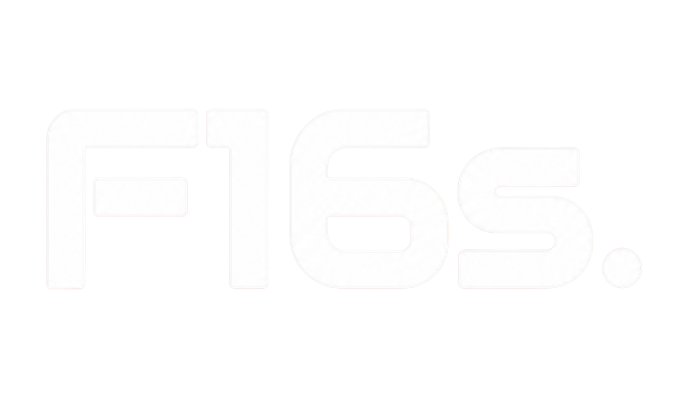

# F16s - Modern Freight Logistics Platform



F16s is a high-performance, premium freight logistics platform designed to streamline global supply chain management with a focus on speed, security, and transparency. Built with a modern **Glassmorphism** design language, the platform offers a seamless experience across all devices, from desktop to mobile.

---

## ✨ Key Features

### 🏢 Modern UI/UX
- **Glassmorphism Design**: A sleek, translucent interface using modern CSS techniques for a premium feel.
- **Micro-Animations**: Smooth cross-fade transitions and hover effects for enhanced user engagement.
- **Fully Responsive**: Optimized for high-fidelity performance across mobile, tablet, and desktop breakpoints.

### 📦 Comprehensive Services
- **Cloud Storage**: Secure, scalable data management for logistics documentation.
- **End-to-End Service**: Holistic freight management from origin to final destination.
- **Small Business Solutions**: Tailored logistics support for growing enterprises.
- **EDI & Smart Tracking**: Real-time tracking and automated data exchange.

### 📰 Content & Engagement
- **Blogs & News**: A dynamic section for industry insights, company updates, and logistics trends.
- **Dynamic Product Descriptions**: Detailed views for specific logistics solutions.
- **Interactive Solutions**: Dedicated modules for Air, Sea, and Road freight.

---

## 🛠 Tech Stack

- **Backend**: Laravel (PHP Framework)
- **Frontend**: Vue.js 2
- **UI Framework**: Bootstrap Vue
- **Styling**: SASS / Vanilla CSS
- **Asset Management**: Laravel Mix
- **State Management**: Vuex

---

## 🚀 Getting Started

### Prerequisites
- PHP >= 7.3
- Composer
- Node.js & NPM
- MySQL

### Installation

1. **Clone the repository**:
   ```bash
   git clone git@github.com:dkdharmatmaa/f16s_main.git
   cd f16s_main
   ```

2. **Install Backend Dependencies**:
   ```bash
   composer install
   ```

3. **Install Frontend Dependencies**:
   ```bash
   npm install
   ```

4. **Environment Setup**:
   ```bash
   cp .env.example .env
   php artisan key:generate
   ```

5. **Database Migration**:
   ```bash
   php artisan migrate --seed
   ```

6. **Build Assets**:
   ```bash
   npm run dev
   # or for production
   npm run prod
   ```

7. **Run the Application**:
   ```bash
   php artisan serve
   ```

---

## 🎨 Design System

The F16s platform follows a strict design system centered around **Glassmorphism**:
- **Backgrounds**: Deep gradients with blurred overlays.
- **Typography**: Modern, clean sans-serif fonts (Inter/Roboto).
- **Icons**: Custom SVG icons for high-resolution clarity.
- **Colors**: A professional palette of deep blues, sleek whites, and vibrant accents.

---

## 📄 License

This project is proprietary and confidential. All rights reserved.

---

Built with ❤️ by the F16s Development Team.
