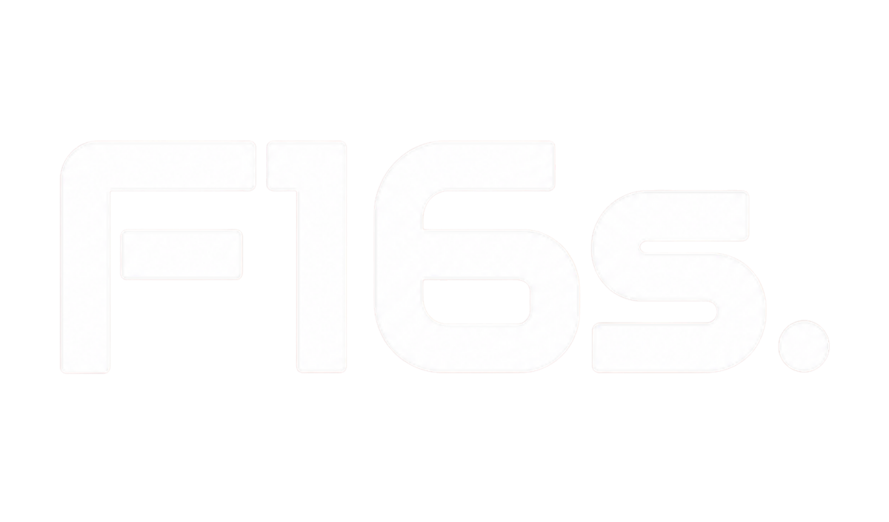

# F16s — Freight Logistics Platform



F16s is a freight logistics platform: a public website, the air waybill dashboard, a superadmin panel, and the
Freight OS portals. This README covers setup and the public website; the development guide is `guide.md`, and the
Freight OS is documented in `docs/plan/` (start with `docs/plan/HANDOFF.md`).

---

## Public website

### Design
- **Glassmorphism** look — translucent cards, layered backgrounds.
- **Micro-animations** — cross-fades and hover effects.
- **Responsive** — mobile, tablet and desktop.

Details (colours, fonts, style rules): `guide.md` → Branding.

### Services
- **Cloud Storage** — logistics documentation.
- **End-to-End Service** — from origin to final destination.
- **Small Business Solutions** — for growing businesses.
- **EDI & Smart Tracking** — tracking and automated data exchange.

### Content
- **Blogs & News** — industry insights and company updates.
- **Product descriptions** — pages for each logistics solution.
- **Solutions** — air, sea and road freight.

---

## Tech stack

| Part | Uses |
|---|---|
| Backend | Laravel 9 (PHP) |
| Frontend | Vue.js 2, Bootstrap Vue, Vuex |
| Styling | SASS / CSS |
| Build | Laravel Mix |
| SEO / meta | [Vue Meta](https://vue-meta.nuxtjs.org/) |

---

## Getting started

### Prerequisites
- PHP 8 (Laravel 9 needs 8.0.2 or newer)
- Composer
- Node.js & npm
- MySQL

### Installation

```bash
git clone <repository-url>
cd <repository-folder>
composer install
npm install
cp .env.example .env
php artisan key:generate
php artisan migrate --seed
npm run dev        # or: npm run prod
php artisan serve
```

---

## License

This project is proprietary and confidential. All rights reserved.

Built with ❤️ by the F16s Development Team.
