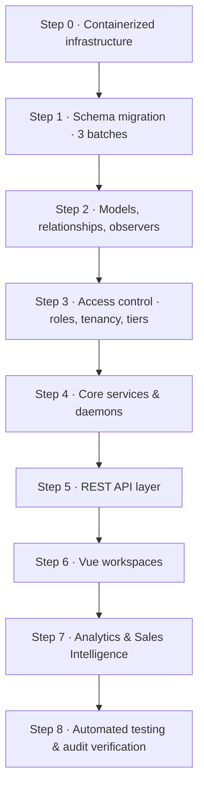

# 🛠️ F16s Freight OS — Implementation Guide

The ordered developer playbook. Build the platform as **vertical slices in a fixed sequence**, verifying at every checkpoint before moving on.

> [!IMPORTANT]
> **Companion documents — do not duplicate their content here.**
> - **Schema (all 59 tables, columns, FKs, indexes, DDL):** [`database_relations_tree.md`](file:///Users/jomygeorge/Desktop/f16sefreight/database_relations_tree.md)
> - **Product spec (roles, tiers, workflows, screens, formulas):** [`PRD.md`](file:///Users/jomygeorge/Desktop/f16sefreight/PRD.md)
> - **Interface spec (tokens, components, states, accessibility):** [`ui_ux_guide.md`](file:///Users/jomygeorge/Desktop/f16sefreight/ui_ux_guide.md)
>
> This file references them by section. It contains no column definitions and no product justification — only *what to build, in what order, and how to prove it worked.*

> [!IMPORTANT]
> **Read [`CONTEXT.md`](CONTEXT.md) first.** This guide was written before the existing codebase was known, so it reads as greenfield. It is not: 6 of its tables already exist and need ALTER rather than CREATE, and 22 live tables it never mentions must be preserved. `CONTEXT.md` carries the reconciliation.

> [!WARNING]
> **The one rule that matters most:** keep each change small and run the checkpoint before starting the next step. A half-applied migration batch or an unverified observer compounds faster than any other class of mistake in this codebase.

---

## 🗺️ Build Sequence



---

> 🕳️ **Open gaps live in `GAPS.md`** — every unresolved decision, deferred obligation and known defect, each with what breaks and the latest step it can safely be fixed. Check it before starting a step; several items come due mid-build (the `encrypted` cast at Step 2, the document codes at Step 4.4, the `ui_ux_guide.md` reconciliation before Step 6).

---

## Step 0 — Containerized Infrastructure

Establish consistent environments, multi-portal subdomains, and VM boundaries before any code.

### 0.1 Local multi-container setup (`docker-compose.yml`)

Private bridge network `f16s-network`:

| Service | Contents |
|---|---|
| `web` | Laravel 7+ on PHP-FPM behind Nginx (port `80`, mapped `8080` locally) |
| `db` | MySQL 8.0 with persistent host volume `db_data:/var/lib/mysql` |
| `redis` | Cache, Horizon queues, distributed locks |
| `soketi` | Node WebSocket server (Pusher-compatible) |
| `ai-server` | FastAPI + ChromaDB + Ollama |

**Resolve services by name, never by IP:** `DB_HOST=db` (3306) · `REDIS_HOST=redis` (6379) · `AI_SERVER_URL=http://ai-server:8000`.

Also create `Dockerfile.laravel` and `Dockerfile.fastapi`.

> ✅ **Built 2026-08-26.** `docker-compose.yml`, `Dockerfile.laravel` (PHP **8.2**, not 8.5 — see `CONTEXT.md` §2), `Dockerfile.fastapi`, `docker/nginx/default.conf`, `docker/php/{supervisord.conf,local.ini}` and `.env.docker.example`. `docker compose config` validates.
>
> Three deliberate departures from the text above, each for a reason:
> - **Host ports are offset** — `db` on `3307`, `redis` on `6380` — so the stack does not collide with a MySQL or Redis already installed on the machine.
> - **`ai-server` builds the real `./python` service** and starts with the rest of the stack. It is light today (FastAPI + pdfplumber). **Ollama and ChromaDB are deliberately not in that image** — Gemma needs ~6 GB resident, and `PRD.md` §9.6 says to point a laptop at a shared dev AI instance rather than run the model locally.
> - **A `queue` service runs `queue:work` across all seven named queues in §4.10's priority order**, since `laravel/horizon` is not yet a dependency. Replace the command with `php artisan horizon` when it is.
>
> **This is additive.** The `php artisan serve` + SQLite workflow is untouched and remains the default; the committed `.env` still points at SQLite. Reach for the stack when you need MySQL 8 semantics — the CHECK constraints, the generated column and the triggers behaving exactly as production will.

### 0.2 Production DNS & subdomain routing

CNAME records at the DNS provider (Route 53 / Cloudflare) pointing at the application load balancer:

**Six hosts — settled 2026-08-27** (`PRD.md` §1.3). Tenant binding and portal binding are independent axes:

| Host | Tenant bound? | `active_portal_scope` | Who |
|---|---|---|---|
| `focusair.f16sefreight.com` | ✅ | `'air'` | Pricing, Operations, Sales |
| `focussea.f16sefreight.com` | ✅ | `'sea'` | Pricing, Operations, Sales |
| `focusroad.f16sefreight.com` | ✅ | `'road'` | Pricing, Operations, Sales *(mode live, UI deferred)* |
| `accounts.f16sefreight.com` | ✅ | none — cross-mode | Accounts (Command only) |
| `admin.f16sefreight.com` | ✅ | none — cross-mode | **The client tenant's Boss / Director** |
| `superadmin.f16sefreight.com` | ❌ **none** | none | **F16s's own staff** — platform operator |

> 🔒 **`admin.` ≠ `superadmin.`** `admin.` is an ordinary *tenant* user (the onboarded client's boss), fully bound to their `company_id` and merely unrestricted as to mode. `superadmin.` is F16s staff operating across every tenant, and is the **only** host with no tenant binding. An earlier revision used `admin.` for the platform operator; binding a tenant director to a host the middleware treats as untenanted would return unfiltered cross-tenant rows.

Add Nginx virtual hosts inside the `web` container listening on all six server names and forwarding to the single Laravel entrypoint, so Laravel can bind the request scope from the host.

### 0.3 AI instance provisioning (AWS EC2)

- **Instance:** dedicated **`t4g.large`** (2 vCPU, 8 GB RAM, Graviton ARM), separate from the web tier
- **Networking:** private VPC subnet, **no public IP**. Security group allows inbound TCP on `11434` (Ollama) and `8000` (FastAPI) **only** from the web/Horizon server addresses
- **Deployment:** install Docker + Compose, clone the `/python` microservice, build and run, then verify connectivity from the `web` container

✅ **Checkpoint 0**
```bash
docker compose up -d
docker compose ps                                   # all 5 services healthy
docker compose exec web php artisan migrate:status  # DB container reachable
dig focusair.f16sefreight.com                       # resolves to the ALB (repeat for all six)
curl http://ai-server:8000/health                   # from inside the web container
```

---

## Step 1 — Schema Migration (three ordered batches)

Run in **three batches with a verification checkpoint between each**. Executing all migrations in one shot risks an unrecoverable partial schema if a foreign key reference fails mid-way.

Column definitions live in `database_relations_tree.md`. This section fixes only **order and dependency**.

### Batch 1a — Prerequisites & tenancy

No inbound foreign key dependencies; these run absolutely first.

> [!IMPORTANT]
> **Two prerequisites before the first migration in this batch.**
>
> 1. **`composer require doctrine/dbal`** — Laravel 9's `->change()` cannot alter a column type without it, and it is **not currently installed**. Step 7 below needs it. (Laravel 10 dropped the requirement; this project is on 9.52.)
> 2. **Run the four production data checks in `CONTEXT.md` §6** before converting `users.branch_name`. The local SQLite DB is empty, so nothing here is verified against real data.
>
> Remember `export PATH="/usr/local/opt/php@8.2/bin:$PATH"` — system PHP is 8.5 and this project cannot run on it.

1. **`sequence_counters`** — must be first; all numbering depends on it
2. **`ports`** — UN/LOCODE master reference
3. **Alter `companies`** — add `tier`, `email_domain`, `ocr_credits_balance`, `ocr_credits_monthly_allowance`, `ocr_credits_limit`, **`deleted_at`** (`PRD.md` §9.3 lists `companies` among the soft-deleting tables)
   - ✅ **Built 2026-08-27** — `2026_08_27_010200_add_tenancy_columns_to_companies_table`. Two columns are **`NOT NULL`** where the DDL left it implicit: `tier` (so tier resolution stays total per §4.1.1 — a NULL tier reintroduces the "tenant with no tier" case the whole OCR routing avoids) and `ocr_credits_balance` (a NULL balance is not a number and cannot be debited). `ocr_credits_monthly_allowance` and `ocr_credits_limit` stay **NULL with no SQL default** — NULL means *inherit from `config/f16s.php`*, and a default here would be a second home for the number.
3a. **Alter `companies` + `agents_info` — the `{agent_code}` pair.** ✅ **Decided and built 2026-08-27** — `2026_08_27_010300_add_document_code_to_companies_and_branches`. Adds `companies.code` (VARCHAR(6), unique globally) and `agents_info.branch_code` (VARCHAR(5), unique **within** a company). Concatenated with no inner separator, they form the `{agent_code}` segment of every document number: `F16` + `BOM` → `ENQA-F16BOM-26-0001`.
   - **Why it is not in the DDL:** `{agent_code}` appeared in exactly two lines of `PRD.md` (§5.2.7) and had **no column anywhere in the schema**, while §6.3 contradicted it with a shorter three-part form. Resolved by the owner on 2026-08-27 in favour of the four-part form, with the segment sourced from company + branch so a number names the tenant *and* the branch without a lookup. `PRD.md` §6.3 has been corrected to match.
   - ⚠️ **Both columns are nullable and EMPTY.** Existing rows have no codes and none could be invented. **Backfill and tighten to `NOT NULL` before `EnquirySequenceService` goes live (§4.4)** — until then a number formats as `ENQA--26-0001`. Uniqueness is the load-bearing part: counters are scoped per `agent_id`, so two branches sharing a code emit byte-identical invoice numbers onto customs paperwork.
4. **Create `customers`** — including tax/address/banking fields, `payment_terms_days`, `credit_limit`
   - Add composite indexes **`(company_id, email_domain)`** and **`(company_id, sales_id)`**. The first is hit on *every inbound mail*; the second on *every sales-dashboard query*. Adding them later means a table scan on the hottest paths in the product.
   - ✅ **Built 2026-08-27** — `2026_08_27_010400_create_customers_table`. Both indexes verified in use via `EXPLAIN`.
   - 🔐 **`bank_account_no` / `bank_ifsc_code` are `TEXT`, not `VARCHAR` — a correction, not a preference.** The schema doc gave two different widths (`VARCHAR(50)` in the column table, `VARCHAR(255)` in the DDL) and measurement showed both fail: a 10-char account number encrypts to **200** chars, a 34-char IBAN to **256**. `VARCHAR(50)` breaks on every row; `VARCHAR(255)` truncates a legal maximum-length IBAN by one character and loses it unrecoverably. Verified by round-tripping a 34-char IBAN through the column. Both doc blocks corrected.
   - ⚠️ **The column type encrypts nothing — the `encrypted` cast on the model does, and the model is Step 2.** Any write before that cast exists stores customer bank details **in plaintext**. Add the cast together with the model.
   - **FKs declared inline rather than deferred to the Batch 1c cyclic ALTER.** The deferral exists because the greenfield DDL creates `users` *after* `customers`; in this codebase `users` and `agents_info` are live and `ports` was built in step 2, so there is no cycle and integrity is enforced from the first row.
   - ❓ **Open: `default_port_id` / `branch_id` / `sales_id` are `RESTRICT`** (the DDL carries no `ON DELETE` clause, so MySQL defaults to it). But `CONTEXT.md` §8's inventory counts only **3** RESTRICT FKs and names all three — none of them these — which implies `SET NULL` was intended, at least for `sales_id` (a departing rep should leave the client unattributed, not block the delete). Implemented as RESTRICT because a blocked delete is loud and reversible whereas a silent unassignment is neither. **Decide before Segment C.**
5. **Create `customer_contacts`** — the per-client address book (FK → `companies`, `customers`). Unique `(customer_id, email)`; index `(customer_id, include_in_cc, opted_out_at)` for the outreach CC lookup. **`include_in_cc` defaults to FALSE** — harvesting is automatic, CC'ing is a human decision
   - ✅ **Built 2026-08-27** — `2026_08_27_010500_create_customer_contacts_table`. The CC gate was verified behaviourally, not just structurally: four harvested contacts CC nobody until a human ticks the box, and a contact carrying `opted_out_at` drops out of the recipient list **while `include_in_cc` is still 1** — confirming the DPDP override is unconditional (`PRD.md` §7.3.7, §9.3). `idx_contacts_cc` confirmed in use by `EXPLAIN`.
   - ❓ **Open: nothing enforces one `is_primary` per customer.** The DDL specifies no such constraint, so two rows can both claim to be the default `To:` recipient and the outreach draft addresses whichever the optimiser returns first — a client-facing email to the wrong person, with nothing raised. The schema already has the tool for this (`job_entities.unique_role_gate` uses a generated column for exactly this shape of partial uniqueness), but adding an 8th CHECK/30th UNIQUE would break the audited constraint inventory in `CONTEXT.md` §8, so it is flagged rather than invented. **Decide before Segment C outreach ships.**
6. **Create `partners`** — airlines, shipping lines, brokers, transporters, vendors
   - ✅ **Built 2026-08-27** — `2026_08_27_010600_create_partners_table`. 🔐 `bank_account_no`/`bank_ifsc_code` are **`TEXT`**, the same correction applied to `customers` in step 4 (both doc blocks said `VARCHAR`, both widths fail the encrypted cast). Vendor payouts run through these columns, so a truncated account number is a payment to nowhere.
   - **One table for all nine `partner_type` values, deliberately.** The same company is routinely the co-loader on one shipment and the transporter on another; per-type tables would duplicate the party and split its ledger. **Role belongs to the relationship** (`job_entities.role`, the five party FKs on `sea_shipment_details`), not to the party — `partner_type` is only the primary classification.
   - **`airlines` stays and is not a duplicate** (`PRD.md` §10): it feeds the email exclusion engine's carrier-*domain* list, while accounting and operational carrier records live here. Do not write new accounting logic against `airlines`.
7. **Alter `users`** — add `origin_port_id`, `designation`, `signature_text`; convert `branch_name` to `BIGINT UNSIGNED` + FK
   - ⚠️ **`pima_address` already exists on the live table — do NOT add it.** Verified 2026-08-26; adding it again fails the migration.
   - ✅ **`origin_airport_code` and `origin_port_id` both stay — decided 2026-08-26.** They are different things: `origin_airport_code` is a plain IATA string on `users` with no foreign key; `origin_port_id` is an **FK into the new `ports` table** (step 2 of this batch), which is the UN/LOCODE master covering seaports as well as airports. Add `origin_port_id` **nullable** now and leave it empty — the `ports` directory is being loaded later. Backfill it from `origin_airport_code` once that data lands. **Registration cannot require it until then**, though `PRD.md` §2.2 says it eventually must.
   - **`branch_name` is live as `VARCHAR` but already stores `agents_info.id`** — verified in code, not assumed (`NewUsers.vue:241` saves the dropdown's `id` while displaying `agent_city`; ~40 readers do `Agent::where('id', $user->branch_name)`). Converting the type therefore changes **no data**. Keep the column *name* — renaming costs ~40 call sites for no functional gain, and the DDL keeps it too.
     **Why it can't stay `VARCHAR`:** without a numeric type and an FK, MySQL coerces text in numeric comparisons — `'3abc'` → `3`. A corrupted value resolves to a real, *different* branch and leaks another tenant's data silently. This is the isolation column for the entire product.
     **Make it `NOT NULL`** — project rule, set 2026-08-26: *every user has a branch, and therefore a company and a tier.* That is what makes tier resolution total (§4.1.1) with no "user without a tier" branch to design around.
     ✅ **Written and verified 2026-08-27** — `2026_08_27_000000_convert_users_branch_name_to_agent_fk`. It changes **no data**: the values are already `agents_info.id`, so the migration only tightens the column to match and adds the FK.
     **The four production checks are now inside the migration**, not a runbook step you have to remember. It aborts *before* altering anything — which matters because MySQL has no transactional DDL, so a half-applied `ALTER` cannot be rolled back — and names the offending rows instead of surfacing a driver error. Verified against MySQL 8 on all four paths: a non-numeric value, a branch that does not exist, a user with no branch, and clean data. Only the last one migrates.
     Registration no longer creates the problem either: `UserController` validated `branch_name` as `nullable|max:50` — that is how the NULLs got there — and is now `required|integer|exists:agents_info,id`.
   - **Do not** start writing new logic against `users.company_name` — it stores a company **ID** despite the name, and `LoginController.php:45` looks it up by name. Company resolves via `user → branch → company` (§3.0). See `CONTEXT.md` §6.
8. **Alter `air_way_bills` & `house_way_bills`** — add `uuid`, `job_id`
   - ⚠️ **Add only those two columns.** The DDL blocks for both tables are stale: the live `air_way_bills` PK is `INTEGER AUTO_INCREMENT` (not `VARCHAR(20)` of `awb_code + awb_no`) and both tables carry ~50 live columns. Anything treating `air_way_bills.id` as the AWB number is wrong against this codebase.
   - ✅ **Built 2026-08-27** — `2026_08_27_010800_add_uuid_and_job_id_to_waybill_tables`. Column counts went 47→49 and 53→55; `uuid` is `CHAR(36)` nullable unique, `job_id` `BIGINT UNSIGNED` nullable and indexed.
   - **Live PKs, measured — the guide previously recorded only the air one:** `air_way_bills.id` is `BIGINT UNSIGNED AUTO_INCREMENT`, but **`house_way_bills.id` is `VARCHAR(50)`** (the DDL says `VARCHAR(30)`). Neither table carries **any foreign key at all** today.
   - **`uuid` is nullable on purpose.** It is the secure outward-facing tracker reference — sequential ids would let anyone holding one share link enumerate the tenant's whole waybill history — but live rows predate it, so it cannot be `NOT NULL` until a backfill runs. UNIQUE is what matters now: a tracker link must resolve to exactly one document.
   - 🔴 **`job_id` HAS NO FOREIGN KEY YET — this is a follow-up, not an omission.** `jobs` does not exist until Batch 1b, so the column ships unconstrained (verified: it currently accepts `999999`). **Add the FK in Batch 1b immediately after `jobs` is created**, or these two columns stay unconstrained permanently. See `GAPS.md` #17.

**Encrypt at rest:** `bank_account_no` and `bank_ifsc_code` on both `customers` and `partners`, via the Eloquent `encrypted` cast.

> **Soft deletes:** `deleted_at` was added on 2026-08-26 to **six** tables — `jobs`, `enquiries`, `sea_shipment_details`, `job_entities`, `sea_containers`, `companies` — having been missing from the schema entirely. **No financial table gets one**, per `PRD.md` §9.3.
> **`mailbox_connections` is deliberately NOT among them.** Its `email_address` is globally unique, so a soft-deleted row would block that mailbox for every tenant forever. It uses **two explicit deactivation columns** instead — and they are not interchangeable:
> - **`is_active = false`** — a **superadmin** tier downgrade, tenant-wide. Tokens kept, so an upgrade restores sync with no re-auth.
> - **`disconnected_at` / `disconnected_by`** — the **user** removing their own mailbox. Tokens cleared.
>
> Sync requires **all three**: `is_active = 1 AND disconnected_at IS NULL AND auth_state = 'connected'`. The upgrade restore must read `WHERE is_active = 0 AND disconnected_at IS NULL`, or it reconnects mailboxes their owners removed. Do not put the `SoftDeletes` trait on that model.
> Before adding the trait anywhere in Step 2, read the UNIQUE-collision table in `database_relations_tree.md` §*Triggers & Views*.

✅ **Checkpoint 1a** — `php artisan migrate:status` shows every batch-1a migration as `Ran`; `php artisan tinker` → `Port::count()` returns `0` without exception.

### Batch 1b — Core operations & AI

**`enquiries` must precede `jobs`** — `jobs.enquiry_id` is `NOT NULL`.

1. **`enquiries`** — scope uniqueness to `(agent_id, enquiry_no)`
   - `reinitiated_from_job_id` is **cyclic** (→ `jobs.id`); add it via `ALTER TABLE` at the end of the script, alongside the `customers` cyclic constraints
2. **`jobs`** — scope uniqueness to `(agent_id, execution_job_no)`
   - **Enforce the status invariant at two layers.** `jobs.status` must **not** accept `Lost`; `enquiries.status` must not accept job states:
     ```sql
     ALTER TABLE jobs ADD CONSTRAINT chk_jobs_status CHECK (status IN
       ('Intake','AI Extraction','Verification','Generation','PDF Generated',
        'Sent to Airline','Airline Confirmed','Completed','Cancelled'));
     ALTER TABLE enquiries ADD CONSTRAINT chk_enq_status CHECK (status IN
       ('new','quoted','awaiting_client','converted','lost'));
     ```
     A **positive allow-list** beats `status <> 'Lost'` because it also blocks typos and any future enquiry-phase state from leaking in.
     ⚠️ **Requires MySQL 8.0.16+.** Earlier versions parse `CHECK` and silently ignore it. **Verify with `SHOW CREATE TABLE jobs` that the constraint is actually present** — a silently-dropped constraint is worse than no constraint, because it grants false confidence.
   - **Also add the mode/prefix drift guard on both tables** — `transport_mode` is the source (known from `active_portal_scope` before any number exists), and `enquiry_no`/`execution_job_no` merely format it visually. A `CHECK` makes the two impossible to disagree:
     ```sql
     ALTER TABLE enquiries ADD CONSTRAINT chk_enq_mode_prefix CHECK (
       (transport_mode = 'air'  AND enquiry_no LIKE 'ENQA-%') OR
       (transport_mode = 'sea'  AND enquiry_no LIKE 'ENQS-%') OR
       (transport_mode = 'road' AND enquiry_no LIKE 'ENQR-%'));
     ALTER TABLE jobs ADD CONSTRAINT chk_jobs_mode_prefix CHECK (
       (transport_mode = 'air'  AND execution_job_no LIKE 'JOBA-%') OR
       (transport_mode = 'sea'  AND execution_job_no LIKE 'JOBS-%') OR
       (transport_mode = 'road' AND execution_job_no LIKE 'JOBR-%') OR
       execution_job_no IS NULL);
     ```
   - Add `idx_jobs_ops_clearance` on `(ops_id, planned_clearance_date)` — the OLI query depends on it
   - ✅ **Steps 1-2 built 2026-08-27** — `2026_08_27_020000_create_enquiries_table`, `2026_08_27_020100_create_jobs_table`, `2026_08_27_020200_add_deferred_job_foreign_keys`.
   - 🔴 **All four CHECK constraints force `COLLATE utf8mb4_bin`, and this is load-bearing.** The columns collate `utf8mb4_unicode_ci`, which is **case-insensitive**: a plain `status IN (...)` accepts `'Lost'`, `'cancelled'` and `'INTAKE'`. Proven against MySQL 8.0.46 — `chk_enq_status` reported present in `information_schema` while silently admitting `'Lost'`. MySQL's own reads are case-insensitive too so the backend never notices, but the value is serialised to JSON and Vue compares with `===`. **Apply the same to `chk_saq_audience`, `chk_saq_internal_no_draft` and `chk_share_approval`** when those tables are built.
   - ⚠️ **Every migration running more than one DDL statement needs a `Schema::hasTable` guard and idempotent constraint adds.** The first `enquiries` run created the table then failed in its own verification helper — leaving a partial, *unrecorded* schema, so the retry died on `1061`/`1050`. MySQL has no transactional DDL. Both paths (clean create and recovery) are now verified.
   - **The deferred FKs are closed in step 2, not later.** `enquiries.reinitiated_from_job_id` is a genuine cycle; `air_way_bills.job_id` / `house_way_bills.job_id` were left unconstrained in Batch 1a·8 and nothing later in the plan revisits them.
3. `mailbox_connections`, then **`email_threads`**, then `email_messages`, `email_attachments`
   - ⚠️ **ORDER CORRECTED 2026-08-27 — `email_threads` must precede `email_messages`.** This list previously had messages at step 3 and threads at step 4, but `email_messages.thread_key` carries an inline FK to `email_threads.thread_key`, so messages cannot be created first. No cycle exists (threads reference only `agents_info`, `users`, `enquiries`, `jobs`), so threads simply build first.
   - ✅ **Built 2026-08-27** — `2026_08_27_020300` … `020600`.
   - 🔴 **`email_messages.idempotency_key` is declared UNIQUE here, which the DDL block omitted.** The column table marks it `UK` and calls it the double-send guard; the runnable DDL had the word UNIQUE in a *comment* and no constraint. Without it a double-click sends the client the same email twice — which `PRD.md` calls unrecoverable. Verified: a duplicate key is rejected, while many inbound rows still share NULL.
   - 🔴 **`mailbox_connections` has TWO deactivation axes and they are not interchangeable.** `is_active = 0` is a **superadmin** tier downgrade (tokens KEPT); `disconnected_at`/`_by` is **the user** removing their own mailbox (tokens CLEARED). Restore on upgrade must read `WHERE is_active = 0 AND disconnected_at IS NULL`; sync requires **all three** of `is_active = 1`, `disconnected_at IS NULL`, `auth_state = 'connected'`. Verified end-to-end — the naive `WHERE is_active = 0` restore reconnects a mailbox its owner deliberately removed.
   - ❓ **New gap found while testing this (GAPS.md #19):** a user who reconnects *after* a downgrade-then-upgrade cycle silently never syncs, because `is_active` stays stale at `0` and the reconnect flow never re-evaluates it. Fix belongs in the Step 5 reconnect endpoint.
   - **No `SoftDeletes` on `mailbox_connections`** — `email_address` is globally unique, so a tombstone would block that mailbox for every tenant forever. Six tables soft-delete, not seven.
5. `job_documents`, then **`document_share_links`** (FK → `job_documents` CASCADE, `jobs`, `users`). `expires_at` is **NOT NULL**; unique on `token_hash`
6. `milestone_performance_logs`
7. **`audit_logs`** — register the append-only `BEFORE UPDATE OR DELETE` trigger here
   - ✅ **Built and the MySQL triggers EXECUTED for the first time, 2026-08-27** — `2026_08_27_021000`. Verified on MySQL 8.0.46: `INSERT` allowed; `UPDATE`, single-row `DELETE` and blanket `DELETE` all refused with `ERROR 1644 (45000)`.
   - 🔴 **`log_bin_trust_function_creators = 1` is REQUIRED or no trigger can be created at all.** Binary logging is on by default in MySQL 8; with the flag at `0` the app user needs `SUPER` to `CREATE TRIGGER` and every trigger fails with `ERROR 1419` — despite holding `ALL PRIVILEGES` on the schema. Added to the `db` service in `docker-compose.yml`. **Production needs the same setting.** See `GAPS.md` #20. This blocks the `jobs` and `accounts_*` designation guards too, not only this one.
   - **`updated_at` is deliberately omitted** from the table. The DDL carries it with `ON UPDATE CURRENT_TIMESTAMP`, which can never fire where `UPDATE` aborts — the schema doc itself flags it as advertising a capability the table does not have.
   - ⚠️ **Both FKs must stay `RESTRICT`.** MySQL does not fire triggers for rows removed by `ON DELETE CASCADE`, so changing either to CASCADE silently voids the append-only guarantee while leaving the triggers visibly in place. Confirmed `NO ACTION` on both.
   - ⚠️ **`TRUNCATE` still bypasses the DELETE trigger** (demonstrated during verification — it is how the test row was removed). The mitigation is a privilege one: **the production application user must not hold `DROP` on this schema.**
8. `sea_containers`, `sea_container_items`, `cargo_arrival_notices`
9. **`job_entities`** — polymorphic `party_type`/`party_id` → `customers.id` or `partners.id`. Uses a generated virtual column `unique_role_gate` to enforce partial uniqueness on `(job_id, role)` **except** for `notify_party`, which may repeat
10. `sea_shipment_details` (carrier/haulage FKs → `partners.id`), `air_shipment_details`
11. `llm_usage_logs`, `pdf_processing_jobs` — **both carry `enquiry_id` *and* `job_id`**. Extraction normally runs pre-conversion at status step 2, so `enquiry_id` is the common case. Without one of them the parsed payload is orphaned and cargo promotion is impossible. Index both
12. `rate_cards`, `exchange_rates`, `sla_policies`, **`tenant_policies`** — the OLI coefficients, undo-send window, stale-enquiry window and CASS tolerances. Every column NULLable: NULL means *inherit from `config/f16s.php`*, so defaults have one home and this table stores only overrides. Resolution is **branch → company → config**
13. `manifest_filings`, `approved_drafts_queue`, `operational_cover_letters`
14. `email_classification_rules`, `email_classification_overrides`
15. `ocr_credit_transactions` (→ `companies`, `enquiries`, `jobs`), `pdf_extraction_corrections`
16. `support_tickets`
17. **`notifications`** — UUID PK, includes the `priority` column so reassignment-approval requests pin to the top of the bell

> **Do not defer the analytics columns.** `enquiries.quoted_amount`/`quoted_currency`, `origin_code`/`dest_code`, `cargo_data_source`/`cargo_data_promoted_at`, and `email_threads.first_response_at` ship **now**, with the table. Trailing history cannot be reconstructed later — every day they are missing is a permanently blind day (see `PRD.md` §7.3.3).

✅ **Checkpoint 1b**
```bash
php artisan tinker
>>> Enquiry::count(); Job::count(); EmailThread::count(); EmailClassificationRule::count();  # all 0, no exceptions
```
```sql
SHOW CREATE TABLE jobs\G   -- confirm chk_jobs_status is present
INSERT INTO jobs (..., status) VALUES (..., 'Lost');  -- must FAIL
```

### Batch 1c — Financial ledger

1. `chart_of_accounts` (self-referencing `parent_account_id`)
2. `accounting_periods`
3. **`accounts_invoices`** — `job_id` **`ON DELETE RESTRICT`**; `customer_id` **nullable** (customer-only, drives AR/collections); polymorphic `billed_party_type`/`billed_party_id` so brokerage/consol/agent invoices bill a partner
4. `accounts_invoice_items` (cascade), `accounts_invoice_brokerage_details` (1-to-1), `accounts_invoice_consol_details` (1-to-1, `partner_agent_id` → `partners.id`)
5. `accounts_purchase_vouchers` (`job_id` RESTRICT, `vendor_id` → `partners.id`), `accounts_purchase_items` (cascade)
6. `accounts_ledger_entries` — **no list/range partitioning**, which would break foreign key integrity
7. `gst_ledger_entries`, `unposted_transactions_queue`
8. `bank_transactions` (invoice/voucher FKs `SET NULL`), `accounts_cass_statements` (`airline_id` → `partners.id`)
9. `financial_snapshots`

**Finally, execute the cyclic constraints** via `ALTER TABLE`: `customers` → `ports` / `agents_info` / `users`, and `enquiries.reinitiated_from_job_id` → `jobs`.

✅ **All four were already in place by the time Batch 1c finished (2026-08-27), so this step is a no-op here.** The three `customers` FKs were declared **inline** in Batch 1a·4 — the deferral is an artifact of the greenfield script ordering, where `users` is created after `customers`, and in this codebase every target already existed. `enquiries.reinitiated_from_job_id` is a genuine cycle and was closed in Batch 1b·2 the moment `jobs` existed, together with the two waybill `job_id` FKs.

✅ **Batch 1c built 2026-08-27** — `2026_08_27_030000` … `030300`. 78 tables total. Checkpoint 1c passes: counts return 0, and deleting an invoiced job fails with `ERROR 1451`, proving RESTRICT is live. Exercised end to end — two revenue lines and one cost line producing a **34.62% gross margin**, and a **balanced** double-entry pair (195,880.00 debit / 195,880.00 credit).
- ❓ **`chart_of_accounts` was built WITHOUT `parent_account_id`** — see `GAPS.md` #21. The column is named only in step 1 above and appears nowhere in `database_relations_tree.md`.
- ⚠️ **Remember to migrate `f16s_test` too.** `php artisan migrate` targets `f16s` only; the test database needs `DB_DATABASE=f16s_test php artisan migrate --force` or the new feature tests fail on missing tables.

✅ **Checkpoint 1c**
```bash
php artisan tinker
>>> AccountsInvoice::count(); AccountsLedgerEntry::count();   # 0
```
Attempt to delete a `jobs` row that has an invoice — it must fail with an integrity constraint error, proving `RESTRICT` is live.

### Batch 1d — Analytics engine tables

Build these when Step 7 starts, not before — but they belong to the same schema family:

`customer_performance_snapshots` · `customer_lane_stats` · `customer_cadence_profiles` · `sales_action_queue`

**Every one is keyed by `(customer_id, transport_mode)`.** Air sales staff see air only; sea staff sea only. Blended cross-mode rows are never written.

Also create the funnel views: `dsr_funnel_view`, `msr_funnel_view`, `ysr_funnel_view`.

---

## Step 2 — Models, Relationships & Observers

Create Eloquent models in the **root `app/` directory under namespace `App`**, matching the existing codebase convention (`app/AirwayBills.php`, `app/PdfProcessingJob.php`).

### 2.1 Relationships

- **`Enquiry`** — belongsTo `Customer` (client) and `User` (operator, owner); **hasMany `Job`** (one request may confirm as several shipments); hasMany `EmailThread`, `PdfProcessingJob`. Scopes: `scopeLost()`, `scopeConverted()`, `scopeStale()`, `scopeForActivePortal()`
- **`Job`** — **belongsTo `Enquiry` (required)**; belongsTo `Customer`, `User` as ops user / pending ops user / pricing owner; belongsTo self as parent consolidation; hasOne `SeaShipmentDetail`, hasOne `AirShipmentDetail`; hasMany invoices, vouchers, entities, containers, documents
- **`Customer`** — belongsTo `Company`; hasMany `CustomerContact`, `Job`, `AccountsInvoice`. Scope `scopeGroup()` returns every customer sharing `(company_id, email_domain)` — the derived client group (`PRD.md` §2.2); there is **no** `parent_customer_id`
- **`CustomerContact`** — belongsTo `Customer`. Scope `scopeCcEligible()` = `include_in_cc = true AND opted_out_at IS NULL`. **Never** set `include_in_cc` from harvesting code
- **`DocumentShareLink`** — belongsTo `JobDocument`, `Job`, `User` (creator). Scope `scopeLive()` = `revoked_at IS NULL AND expires_at > now()`. Accessor generates the raw token **once** on create and stores only its SHA-256
- **`AccountsInvoice`** — belongsTo `Customer` as client, morphTo `billedParty`, belongsTo self as parent (debit/credit notes), hasMany items
- **`AccountsPurchaseVoucher`** — belongsTo `Partner` as vendor, hasMany items

> **Guard the mode invariant.** A job with `transport_mode = 'sea'` must **never** load `airShipmentDetails`, and vice versa; a sea job never populates `awb_number`. Enforce in the model `boot()` and assert it in tests.

### 2.2 Casts

```php
// app/MailboxConnection.php
protected $casts = [
    'access_token'  => 'encrypted',
    'refresh_token' => 'encrypted',
    'is_active'     => 'boolean',
    'expires_at'    => 'datetime',
];

// app/Job.php  — DB CHECK constraint remains the authority; this only surfaces
// violations as validation errors instead of raw SQL failures
protected $casts = ['status' => \App\Enums\JobStatus::class];

// app/Enquiry.php
protected $casts = ['status' => \App\Enums\EnquiryStatus::class];
```

### 2.3 Observers

| Observer | Responsibility |
|---|---|
| **`JobObserver`** | On create, flips the parent `enquiries.status` to `converted`. Writes SLA entries to `milestone_performance_logs` on every status transition. Debounces container roll-up counts |
| **`EnquiryObserver`** | Stamps `lost_at` / `reopened_at`; clears `stale_nudged_at` on any new client reply; **blocks a `lost` transition if a child `jobs` row exists** — a converted enquiry cannot be lost, the job must be cancelled instead |
| **`EmailThreadObserver`** | Locks `first_triage_at` and `first_response_at` once populated (`isDirty()` check), preventing silent tampering. On re-triage, `job_id` resets but `first_triage_at` survives as the immutable audit record of the mistake |
| **`InvoiceObserver`** | On posting, moves drafts from `unposted_transactions_queue` into `accounts_ledger_entries` and computes the `gst_ledger_entries` tax split |
| **`SeaShipmentDetailObserver`** | Rolls house pieces/weights/volumes up to the parent master, and cascades routing/vessel fields down to children. **Debounced** with a 2-second cache lock so saving several houses in sequence dispatches one job, not five |

```php
$lockKey = "job_rollup_lock:{$parentJobId}";
if (! Cache::add($lockKey, true, 2)) return;   // debounced
ProcessConsolRollupJob::dispatch($parentJobId)->delay(now()->addSeconds(2));
```

### 2.4 Morph map

In `AppServiceProvider::boot()`:

```php
Relation::morphMap([
    'invoice'          => \App\AccountsInvoice::class,
    'purchase_voucher' => \App\AccountsPurchaseVoucher::class,
    'awb'              => \App\AirwayBills::class,
    'hawb'             => \App\HousewayBills::class,
    // Party morph — resolves job_entities.party_type, rate_cards.party_type
    // and accounts_invoices.billed_party_type
    'customer'         => \App\Customer::class,
    'partner'          => \App\Partner::class,
]);
```

✅ **Checkpoint 2** — `php artisan tinker`: instantiate each model, traverse one relationship in each direction, and confirm a sea job returns `null` for `airShipmentDetails`.

✅ **Built and passed 2026-08-27.** 24 models, 3 enums, 4 observers, the morph map. Suite 62 → 80. Checkpoint verified: the full `user → branch → company → tier` chain, `enquiry ↔ job` both ways, and a sea job returning NULL for `airShipmentDetails`.
- 🔐 **`GAPS.md` #3 is closed** — `encrypted` casts on `Customer`/`Partner` bank columns and `MailboxConnection` tokens, all `$hidden`. Column holds ciphertext, model reads plaintext, `toArray()` omits them.
- 🐞 **Found while running the checkpoint: a model does not know its database defaults.** `$job->status` was NULL until refreshed, so `JobObserver` wrote milestone rows with an **empty** `milestone_name` — silently skewing every stage-duration statistic. Fixed with `$attributes` defaults on `Job` and `Enquiry` mirroring the DDL, plus a fallback in the observer. Regression-tested.
- **`SeaShipmentDetailObserver` holds the 2-second debounce but does not yet dispatch** — `ProcessConsolRollupJob` arrives in Step 4. Deliberately left unwired rather than referencing a class that does not exist.
- **`Company` and `Agent` needed `$fillable` entries** (`code`, `branch_code`, tier, credits) before anything could be created through Eloquent.

---

## Step 3 — Access Control (roles, tenancy, tiers)

Build this **before** any controller, so no endpoint is ever written unprotected. Specification: `PRD.md` §2 and §3.

### 3.0 The auth model — stateless JWT, not sessions *(resolved 2026-08-26)*

> [!IMPORTANT]
> This codebase authenticates with **`tymon/jwt-auth`**, not Laravel sessions. Earlier drafts of this guide and of `PRD.md` §2.1 described binding context "to the session"; that was written before the codebase was known and **would not work here.** `session()` is empty on every API request, so anything reading it degrades to a silent no-op rather than an error.

**Three rules follow, and everything in §3.1–§3.6 is written against them:**

| # | Rule | Why |
|---|---|---|
| 1 | **Portal scope comes from the request `Host`**, resolved per request by middleware — never from a session or a token claim | The subdomain is already on every request. It is also self-correcting: a user legitimately works both portals, and the host they are on *is* the answer |
| 2 | **Entitlement is resolved per request from the user row; only identity goes in the JWT** | A JWT cannot be revoked before it expires. Bake `tier` or `designation` into it and a Command→Tactical downgrade — or a Boss demoting a user — keeps working for the token's whole lifetime |
| 3 | **Pre-login company selection is UX, not a security binding** | `company_id` is derived from the authenticated user (`user → branch → company`). The picker may narrow the login form; it must never be what scopes a query |

**The two role systems are different axes and both survive.** The legacy `roles` table (`email → user \| admin \| superAdmin`) selects the *auth guard* — i.e. which model the login resolves to. The new `users.designation` is the *in-tenant role* (`pricing`/`operations`/`sales`/`accounts`/`boss`). `PRD.md` §2.3 is explicit that `superadmin` is platform-level and "not a `designation`", so the two coexist by design.

> **Two dead references to clean up in passing** (neither blocks Batch 1a): `config/auth.php` registers an `admin-api` guard pointing at `App\Admin::class`, which **does not exist** in `app/` and has no `admins` table — any login with `roles.role = 'admin'` 500s. `App\User::GetAssosName()` likewise references a non-existent `App\Association`. Removing the `admin-api` guard also needs the `'admin'` branch dropped from `PasswordResetRequestController.php:29`.
>
> `PRD.md` §2.3's note to "migrate `admin → boss`, `documentation → operations`" refers to legacy **`designation`** values. This codebase has no `designation` column at all yet, so there is nothing to migrate — that note is stale here.

### 3.1 Tenant isolation global scope

A global scope applied automatically, **branching on which column the table carries**:

- **Branch-scoped** (`agent_id`) — `enquiries`, `jobs`, `email_threads`, `accounts_invoices`, `job_documents`, all analytics tables → `WHERE agent_id = auth()->user()->branch_name`
- **Tenant-scoped** (`company_id`) — `customers`, `partners`, `sla_policies`, `gst_ledger_entries`, `unposted_transactions_queue`, `ocr_credit_transactions` → `WHERE company_id = auth()->user()->branch->company_id`

Provide the escape hatch `withoutTenantScope()` for daemons, console commands, webhooks and supervisors that run outside a session.

> **Customers and partners are tenant-wide, shared across all of a tenant's branches.** `customers.branch_id` is an advisory *managing/proximity* branch for routing and sales assignment — **not** an isolation boundary.

### 3.2 Cross-tenant referential guards

A job's branch and its parties are not composite-keyed to the same tenant at the database level. Every `FormRequest`/service **must** assert that each referenced customer or partner shares the acting user's `company_id` before persisting — `jobs.customer_id`, `job_entities.party_id`, `accounts_invoices.billed_party_id`, voucher `vendor_id`.

> 🟡 **Partial groundwork already landed 2026-08-27**, built ahead of order and then paused when work returned to Step 1. It is **additive and inert** — verified: app boots, 127 routes, login unchanged, 26 tests green. Do not rebuild these from scratch:
> - `config/f16s.php` → **`portals`** — the six-host topology as data; the single source of truth. Nothing else may hardcode a hostname.
> - `App\Support\Portal` — resolves a portal from the Host's first label, so `focusair.f16sefreight.com`, `focusair.f16s.local` and `focusair.localhost:8000` share one code path. An unknown host **fails closed** (treated as tenant-bound).
> - `App\Support\UserContext` — per-request `company_id`/`agent_id`/`designation`/`tier`, cache-memoized, **never** from the JWT.
> - `App\Http\Middleware\BindPortalScope` — registered on the `api` group.
> - `App\Http\Middleware\EnforcePortalAccess` (`portal`) and `CheckCompanyTier` (`tier`) — registered in `Kernel`, **not yet applied to any route**.
> - `App\User::branch()` / `->company()` / `->originPort()`, `App\Company::TIERS` / `tierAtLeast()` / `creditAllowance()`. Dead `GetAssosName()` removed (`GAPS.md` #13) — nothing referenced it.
>
> **Still to do here:** wire the portal into `LoginController` (the null-portal case must stay byte-identical — the live app logs in at plain `localhost`), the tenant isolation scope (§3.1), role gates (§3.4), and the two Checkpoint-3 tests.

### 3.3 Portal scope (deliberately not global)

> 🔴 **Do not implement this against `session()`.** Under stateless JWT (§3.0) the session is always empty, so a session-backed scope returns **unfiltered** rows — air users silently seeing sea data, with no error raised anywhere. Derive the scope from the request `Host`.

`BindPortalScope` middleware, registered on the `api` group, resolves the subdomain once per request and binds it into the container:

```php
// app/Http/Middleware/BindPortalScope.php
$scope = match (explode('.', $request->getHost())[0]) {
    'focusair'  => 'air',
    'focussea'  => 'sea',
    'focusroad' => 'road',
    // accounts. / admin. / superadmin. bind NOTHING — they are cross-mode by design
    // (one ledger spans every mode; the Boss compares modes). So does every CLI and
    // queue context, which never runs this middleware at all.
    default     => null,
};
if ($scope !== null) {
    app()->instance('active_portal_scope', $scope);
}
```

```php
public function scopeForActivePortal($query) {
    if (app()->bound('active_portal_scope')) {
        return $query->where('transport_mode', app('active_portal_scope'));
    }
    return $query;
}
```

Chain it explicitly in HTTP controllers (`Job::forActivePortal()->get()`). **Never make it global** — queue workers, WebSocket broadcasts and crons never run that middleware, so the binding is absent and the scope passes through unfiltered. That is exactly the behaviour the session version was reaching for, achieved without a session.

**Boss users are not portal-scoped** (`PRD.md` §1.3) — they enter at `admin.` and compare every mode, so their controllers simply do not chain the scope. Same for accounts users on `accounts.`: there is one ledger across all modes.

> ⚠️ **Binding the portal is NOT the same as binding the tenant, and this middleware only does the first.** Five of the six hosts are fully tenant-bound; only `superadmin.` is not. Do not infer "no portal scope" ⇒ "no tenant scope" — `accounts.` and `admin.` bind no portal yet must still filter by `company_id`. Conflating the two is how a client's Boss would end up reading another tenant's books. Tenant binding comes from `user → branch → company` (§3.0), never from the host.

### 3.4 Role gates

> **Role separation is tier-gated — build this ordering explicitly.** On `core` there is exactly **one** login type: `users.designation` is carried but **inert**, every user resolves to the same undifferentiated Core user, and every role-specific route is unreachable. Role policies begin evaluating only at `tactical` (4 roles: `pricing`, `operations`, `sales`, `boss`); `accounts` becomes live only at `command` (5 roles). Implement the tier check **before** the role check in every gate, so a Core tenant can never reach a role-scoped endpoint by setting a designation value directly in the database.

Implement policies and middleware against the **Role × Screen matrix** (`PRD.md` §2.4):

| Guard | Rule |
|---|---|
| `can:triage` / `can:convert` / `can:markLost` | `designation = 'pricing'` only |
| `can:requestReassignment` | `designation = 'operations'` only |
| `can:assignOperator` | `designation IN ('pricing','boss')` |
| Analytics endpoints | **`403` for `operations` and `pricing`**; frontend hides the nav item and redirects direct navigation to `/inbox` |
| Sales endpoints | `designation IN ('sales','boss')`; on Command, additionally scoped `customers.sales_id = auth()->id()` |
| Profit-margin fields | **Stripped from every sales-facing API response at any tier** — enforce in the API Resource, not the Vue component |
| **`can:finalizeInvoice` / `can:postLedger`** | **`designation = 'accounts'` only — `boss` included is a bug.** Pricing edits the cost sheet; accounts posts it |
| **`can:managePeriod`** (open/close/reopen) | **`designation = 'accounts'` only** |
| `can:reconcile` (bank, CASS, discrepancies) | `designation = 'accounts'`; `boss` gets read-only |
| `can:overrideCreditHold` | `designation IN ('accounts','boss')` |
| Financial **read** endpoints (reports, registers) | `designation IN ('accounts','boss')`, all `tier:command` |
| `superadmin` middleware | Platform routes only; independent of `company_id` |

**Database triggers** additionally enforce designation on assignment: `jobs.ops_id` must reference a user with `designation = 'operations'`; `jobs.pricing_id` must reference `designation = 'pricing'`; and `accounts_invoices.created_by` / `accounts_purchase_vouchers.created_by` must reference `designation = 'accounts'`.

> #### 🔒 Segregation of duties
> **Posting to the ledger and opening/closing an accounting period are exclusive to `accounts`.** No other designation — including `boss` — may perform them. The role that sets targets must not book the revenue those targets are measured in, and the role that sets the margin must not book it either. Write a test that asserts a `boss` user receives `403` on both endpoints; it is the single most likely permission to get wrongly widened during development.

### 3.5 Tier middleware

Register `CheckCompanyTier` as `'tier'` in `app/Http/Kernel.php`:

```php
Route::group(['middleware' => 'tier:tactical,command'], ...);  // mailbox sync, AI extraction
Route::group(['middleware' => 'tier:command'], ...);           // ledger, reconciliation, client book
```

### 3.6 Request context, locks & broadcast authorization

- **Resolve entitlement per request; keep the JWT to identity only.** `App\User::getJWTCustomClaims()` stays empty. `company_id`, `agent_id`, `designation` and `tier` are read from the authenticated user each request — `auth()->user()->branch->company_id`, `->branch->company->tier` — memoized in Redis under `user_ctx:{id}` with a short TTL, busted on `User` and `Company` save.
  **Never put `tier` or `designation` in the token.** See §3.0 rule 2: a downgrade or a demotion would not take effect until the token expired.
- Expose `tier` and `designation` on the `currentUser` payload returned by login and by the token-verify endpoint, so Vue route guards can read them. The backend re-checks everything regardless.
- Redis row lock on form open: `Cache::put("shipment_lock:{$jobId}", auth()->id(), now()->addMinutes(45))`, refreshed by `POST /api/jobs/{id}/heartbeat`
- `Broadcast::channel('branch.{agentId}', …)` must verify the user's branch matches the requested channel. **Under JWT the broadcast auth route needs the token explicitly** — configure Laravel Echo with an `authEndpoint` plus an `Authorization: Bearer …` header, and put that route behind the `user-api` guard. Echo's default cookie-session auth will not authenticate here.

✅ **Checkpoint 3** — run `CrossTenantIsolationTest` and `TierModeGatingTest` (Step 8). Both must pass before writing a single controller.

✅ **Built and both passing 2026-08-28.** Suite 80 → 100. `TenantScope` + `BelongsToTenant` (17 models), role gates in `AuthServiceProvider`, portal gating wired into `LoginController`, and the dead `admin-api` guard removed.
- 🔴 **The isolation scope initially checked the WRONG GUARD and would have been INERT in production** — `auth()->hasUser()` resolves the default `web` guard, which is session-based and always empty under JWT, while every controller uses `auth()->guard('user-api')`. Every query would have returned every tenant's rows. Fixed; see `GAPS.md`. **Caught only because the test asserted a count rather than the scope's existence.**
- ⚠️ **Portal tests must pass the host as a FULL URL.** `withHeader('Host', …)` does not reach `$request->getHost()` in the test client, so such a test silently resolves to the null portal — the permissive path — and passes for the wrong reason.
- 🔴 **The null-portal login path is asserted unchanged.** The live application signs in at plain `localhost`, which names no portal; that request must behave exactly as it did before portal gating existed.
- **`admin-api` guard removed** along with the `App\Admin` provider and the `'admin'` branch in `PasswordResetRequestController`. It pointed at a class that never existed, so `roles.role = 'admin'` always 500'd — and leaving a broken guard called `admin-api` is now an active hazard, because "admin" means the **client tenant's Boss**, who is an ordinary `users` row on `user-api`.

---

## Step 4 — Core Services & Daemons

### 4.1 Python FastAPI parsing engine (`python/ocr_server.py`)

> ✅ **This service already exists in-repo — you are extending it, not writing it.** Verified 2026-08-26.
>
> | In `python/` today | |
> |---|---|
> | `ocr_server.py` | FastAPI app. `GET /health` · `POST /extract` (file + `document_type` + optional `coordinates`) |
> | `extract_awb_new.py` | ~9,100 lines — the pdfplumber coordinate engine, `extract_all_boxes()` |
> | `geo_constants.py` · `boxes_config.json` | Airport/geo lookups; fallback coordinate templates |
> | `requirements.txt` | `pdfplumber`, `fastapi`, `uvicorn`, `python-multipart` — **and nothing else yet** |
>
> Laravel already calls it: `ProcessPdfOcrJob` posts to `config('services.ocr.url') . '/extract'`, passing coordinates pulled from `system_templates`. **This is the structured-document path `PRD.md` §5.1 says to keep** — the steps below are additive, and `/extract` must keep working unchanged.
>
> **What is genuinely missing:** `/extract-unstructured`, PyMuPDF, `google-generativeai`, `schemas.py`, and any Ollama/ChromaDB client.
>
> ⚠️ **One existing behaviour contradicts `PRD.md` §9.1.** `ocr_server.py` writes each upload to a `tempfile.NamedTemporaryFile` on disk before parsing, while §9.1 requires the binary buffer be processed **in memory**. pdfplumber accepts a file-like object, so `pdfplumber.open(io.BytesIO(contents))` removes the disk round-trip for the existing path too — not just the new one. Worth fixing while you are in the file.

1. **Dependencies:** add `PyMuPDF` and `google-generativeai` to `requirements.txt`
2. **Getting form-ready JSON is THREE mechanisms, not one.** Prompt caching is none of them — caching makes the schema cheaper to *send*, it does not make the model *obey* it.

   | Layer | Mechanism | Without it |
   |---|---|---|
   | **Constrain** | Gemini `response_mime_type: "application/json"` + `response_schema`; Ollama `format: <json-schema>` | The model returns prose, markdown-fenced JSON, or invented field names |
   | **Validate** | Pydantic schemas in `python/schemas.py` — Invoice, Packing List, per-field `confidence` (high/medium/low) | Malformed payloads reach Laravel and blow up in the Vue form |
   | **Map** | One shared key vocabulary → `FocusAir.vue` / `FocusSea*.vue` fields | Three codebases invent three sets of names and silently drift |

   **Constrain first.** Pydantic is the last line of defence, not the mechanism — validating after the fact only tells you the model went off-script; it does not stop it.

   ##### Three levels of "force it to return JSON" — use the third

   | Level | How | Guarantees |
   |---|---|---|
   | 1. Ask in the prompt | *"Reply with JSON"* | **Nothing.** Usually works, fails unpredictably |
   | 2. JSON mode | Gemini `response_mime_type: "application/json"` · Ollama `format: "json"` | Valid JSON **syntax** — but any shape. Fields may be renamed, nested differently, or missing |
   | 3. **Schema-constrained decoding** | Gemini `response_schema` (+ the mime type) · Ollama `format: <json-schema object>` | **The shape.** The decoder is grammar-constrained, so a token that would break the schema is literally not sampleable |

   Use **level 3 on both models.** It is not a prompt hint — it is enforced during generation, so a malformed response is impossible rather than unlikely.

   > ⚠️ **Gemini accepts a subset of JSON Schema (OpenAPI-flavoured) and has historically been restrictive about `$ref`/`$defs`.** Ollama passes the schema through to a GBNF grammar and is more permissive. **Author one flat schema that satisfies the stricter of the two** rather than maintaining separate versions — verify the currently supported subset against Google's docs before building.

   ##### 🔴 Constrained decoding guarantees the shape, NOT the truth

   This is the failure mode to design against. Force a schema with a required `gross_weight` and the model **must** emit one — so when the value is genuinely not on the page, it invents a plausible number rather than admitting it cannot see one. **You have converted a visible failure into a silent one**, which is strictly worse on a document that becomes a customs declaration.

   Four rules that avoid it:

   1. **Every extracted value is nullable.** `"value": {"type": ["string", "null"]}`. An explicit `null` is a correct, useful answer; a hallucinated weight is not.
   2. **`confidence` is required on every field**, and is the one thing the model may never omit. It drives the orange highlighting (`PRD.md` §5.1) — which only works if low confidence can actually be expressed.
   3. **Enums wherever the value set is closed** — `weight_unit: ["KGS","LBS"]`, currency, package type. Free accuracy: the model cannot emit `"kilos"` if the grammar has no path to it.
   4. **Keep the schema flat and small.** Gemma 4 E4B is a ~4B model; a deep, 60-field schema costs context and degrades output quality under grammar constraint. **One schema per document type** — Invoice, Packing List, AWB — never one union schema covering all three.

   ```jsonc
   // the wrapper every field shares
   { "value":      { "type": ["string", "null"] },   // null is a legitimate answer
     "confidence": { "type": "string", "enum": ["high", "medium", "low"] } }  // required
   ```

   **Then validate with Pydantic anyway.** Constrained decoding cannot catch semantic nonsense — a shipment date in 2085, a negative weight, an IATA code that is three valid letters but not a real airport. On a validation failure, retry **once** with the error appended to the prompt, then give up with `failure_code = 'extraction_failed'`. Do not loop: a small model that failed the schema twice will fail it a third time, and each attempt on the vision path is another paid call.

3. **🔑 `/extract-unstructured` must return the SAME key vocabulary as `/extract`.** This contract already exists in code: `extract_all_boxes()` returns `result[box_name]` keyed by the region names in `boxes_config.json` — `shipper`, `consignee`, `departure`, `destination`, `transit`, `cargo`, `weight_charge`, `piece_weight`. `FocusAir.vue` already consumes those names. **A second endpoint emitting different keys means `OcrUploadModal.vue` needs two mappers, and they will drift the first time either side changes.**

   One shape difference to reconcile deliberately: `/extract` returns bare values, while the new path returns `{value, confidence}`. **Unify upward** — have `/extract` wrap its values too, stamping `confidence: "high"` (a coordinate hit *is* high confidence, exactly as `PRD.md` §5.1 defines it). Then one mapper and one orange-highlight rule serve both paths.
3. **`/extract-unstructured` endpoint:**
   - `fitz.open(stream=…)` — process the binary buffer **in memory**, never to disk
   - Text-selectable PDF → local **Gemma 4 E4B** via Ollama at `http://<ai-private-ip>:11434`
   - Scanned PDF / image → **Gemini 2.5 Flash** vision fallback, translating foreign documents to standard English
#### 4.1.2 Field constraints — what the schema enforces, and what it must NOT

*Specified 2026-08-26. Sources: `PRD.md` §5.9 (IATA/Cargo-XML), §5.8 (ICEGATE). This table is the single contract for **both** the extraction schema and form validation — one place, so Python, Laravel and Vue cannot drift.*

> 🔴 **Split format from length. They behave differently and belong in different layers.**
>
> | | Goes in the extraction schema? | Why |
> |---|---|---|
> | **Format** — `pattern`, `enum` | ✅ **Yes** | The model physically cannot emit `"kilos"` when the grammar only allows `KGS`/`LBS`. Free accuracy, no downside |
> | **Length** — `maxLength` | ❌ **NO** | A `maxLength: 35` on a shipper name makes the model **silently truncate a 60-character legal name**. You would destroy data at parse time and never know |
>
> **Extract at full fidelity; validate afterwards; let the operator resolve.** A name too long for Cargo-XML is a real problem that a human must decide how to abbreviate — it is not the parser's call, and a truncated consignee on a customs declaration is not a recoverable error.

##### Air — Cargo-XML / Cargo-IMP (`PRD.md` §5.9)

| Field | Constraint | Layer |
|---|---|---|
| Company name / address **per line** | **35 chars** — the legacy Cargo-IMP line limit | validate + flag |
| MAWB number | 11 chars, `^\d{3}-\d{8}$` | **schema `pattern`** |
| HAWB number | ≤ 20, alphanumeric only, no spaces or specials — `^[A-Za-z0-9]{1,20}$` | **schema `pattern`** |
| ICEGATE ID | ≤ 20 chars | validate |
| Organisation / agent name | ≤ 50 chars | validate + flag |
| Shipper & consignee name | ≤ 50 chars per line | validate + flag |
| Address | ≤ 500 cumulative | validate + flag |
| Weight unit | `KGS` \| `LBS` | **schema `enum`** |
| Chargeable weight | `max(gross, volume_cm³ / 6000)` | **computed, never extracted** |

##### Sea — ICEGATE (`PRD.md` §5.8)

| Field | Constraint | Layer |
|---|---|---|
| MBL / HBL number | ≤ 20 chars each | validate |
| Container number | 11 chars, **ISO 6346 check digit** | **schema `pattern`** + check-digit validate |
| Seal number | ≤ 15 chars | validate |
| Package code | ≤ 3 chars | validate |
| Gross weight | 14 digits, 3 decimals | **schema `pattern`** |
| IMO number | `^[0-9]{7}$` | **schema `pattern`** |
| HS code | `^\d{6,10}$` | **schema `pattern`** |
| Container size/type | `20GP` `40GP` `40HC` `20RF` `40RF` `20TK` `40OT` | **schema `enum`** |
| Cargo type | `liquid_cont` `fcl` `lcl` `break_bulk` `liquid_bulk` `bulk` `ro_ro` | **schema `enum`** |
| Volume unit | `CBM` \| `CFT` | **schema `enum`** |
| Piece counts across houses | **must total the master exactly** | cross-row validate, not per-field |

> **Two rules that are not per-field checks and will be missed if this table is read literally:** house piece counts must sum to the master exactly, and an IMDG class **requires** a UN number (`PRD.md` §5.8 tab 4). Both are form-level assertions.

##### Mandatory fields

Required-ness is defined per tab in `PRD.md` §5.8 and §5.9, not here — and **"required on the form" is not "required in the schema."** Every extracted `value` stays nullable (§4.1 above): the model must be able to say *"not on this page"* rather than invent a shipper. The form then blocks submission on a missing mandatory field, which is a **different and later** gate, with a human in front of it.

#### 4.1.3 Party matching — reuse the existing Levenshtein matcher

**Do not write a new one.** `resources/js/src/core/mixins/airWayBillMixin.js` already implements it and `FocusAir.vue` / `HouseWayBill.vue` already use it:

| Function | Behaviour |
|---|---|
| `normalizeText(str)` | Lowercase, strip to `[a-z0-9]` |
| `calculateSimilarity(a, b)` | Levenshtein ratio; short-circuits to `0.95` when one string contains the other and `min/max ≥ 0.65` |
| `findMatchingAddress(ocrEntity, savedList)` | Name **≥ 0.90** *and* address **≥ 0.85** (or address absent/substring); returns the highest-scoring saved record |

**This is what makes the 35-character problem mostly disappear**, and it is the reason the address book earns its place:

```
extract shipper/consignee at FULL fidelity
   └─► findMatchingAddress() against saved_addresses (agent-scoped)
         ├─ match ≥ 0.90 ──► use the SAVED record
         │                   Already curated, already within every limit,
         │                   already spelled consistently. Nothing to flag.
         └─ no match ─────► keep the OCR text
                             validate against the tables above
                             flag violations orange
                             offer [Save to address book]
```

A client curates each trading partner **once** in settings, and every future shipment for that partner arrives clean — correct spelling, correct abbreviation, within the line limits, identical every time. That last property matters beyond tidiness: **customs rejects a master/house mismatch**, and free-typed party names are where those mismatches come from.

> **Settings is where the curation happens.** The address book is the existing `saved_addresses` table behind `AddressBookController` (already agent-scoped). The `[Save to address book]` action on an unmatched party is what keeps it growing without anyone doing data entry as a chore — the first shipment for a new partner seeds the record, every later one matches it.

> ⚠️ **Match, then confirm — never silently substitute.** Replacing an extracted consignee with a *similar* saved one is exactly the class of error that ships cargo to the wrong company. Show which saved record matched and at what score, and let the operator reject it. `PRD.md` §5.8 already requires address textareas to be read-only until an entity is chosen from the lookup, for the same reason.

4. **Retain `pdfplumber`** in `extract_awb_new.py` for structured AWBs — coordinate extraction is the correct tool for a fixed layout
5. **Ollama configuration:** `OLLAMA_KEEP_ALIVE=-1` pins the model **weights** in RAM (kills cold-start load time — *not* prompt caching, a separate thing). Bake system prompts and JSON schemas into a custom `Modelfile` (`ollama create gemma-custom -f ./Modelfile`) so they are neither re-sent nor re-processed, and size `num_ctx` to hold prompt + payload so the prefix cache can actually be reused. **All of this is a latency win — Gemma is local and free, so there is no token bill to cut here.**
6. **Gemini context caching — measure before you build it.** See the caching note in `PRD.md` §9.1. Two things make the naive version a loss: the cached block (Pydantic schema + SOP prompt) may fall **below Google's minimum cacheable size**, and the specified **300 s TTL** is billed by storage duration, so at realistic upload density the cache expires between nearly every request — creation cost paid, no reuse gained. Verify the current minimum and pricing against Google's docs, then either raise the TTL to match observed density or skip it.
   **On the vision path the prompt is not the expensive part** — the page image is. The cost levers that matter, in order: the opt-in consent gate (§4.1.1), sending fewer pages, and downscaling images before upload (vision tokens scale with resolution).
7. **ChromaDB** cohosted on the same instance; embeddings via `nomic-embed-text` queried over loopback

#### 4.1.1 Tier branching & the credit gate — `ProcessPdfOcrJob`

*Specified 2026-08-26. `PRD.md` §3.3 said only "branches on tier"; this is the mechanism.*

**Resolving the tier is a guaranteed three-hop join:**

```
users.branch_name → agents_info.company_id → companies.tier
```

**Every user has a branch, and therefore a company and a tier** — a project rule, enforced by `users.branch_name NOT NULL` plus its foreign key (Batch 1a·7). There is no "user without a tier" case to design around, and no fallback to invent.

Two mechanical points, both easy to get wrong:
- The job runs in a **queue worker with no session**, so it must resolve through `withoutTenantScope()` or the tenant global scope returns nothing and the tier reads as missing.
- Eager-load the chain (`User::with('branch.company')`) and memoize per company. This runs on every upload; three lazy queries per PDF is a needless N+1 on the hottest background path.

**The route is decided by tier × document class, not tier alone:**

| Tier | Structured (AWB, has a `system_templates` layout) | Unstructured (invoice, packing list) | Scanned / image |
|---|---|---|---|
| `core` | `/extract` — coordinates, **free** | ❌ `upgrade_required` | ❌ `upgrade_required` |
| `tactical` · `command` | `/extract` — coordinates, **free** | `/extract-unstructured` → PyMuPDF + Gemma, **free** | `/extract-unstructured` → Gemini, **1 credit** |

> **A Core tenant uploading an invoice must be told, not silently disappointed.** `pdfplumber` needs a coordinate template, and no template exists for an arbitrary client invoice — so extraction returns an empty form and looks broken. Fail the job **before** processing with `failure_code = 'upgrade_required'` and surface the `UpgradeTeaser.vue` CTA. Core is the upsell tier; this is the moment the upsell happens, and a blank form wastes it.

##### The credit gate: never spend a credit the operator did not authorise

> 🔴 **Vision OCR is opt-in.** When PyMuPDF finds no usable text layer, the job does **not** silently reach for Gemini. It stops, tells the operator *"this looks like a scan — spend 1 credit to read it?"*, and waits. Spending someone's money is exactly the kind of irreversible act `PRD.md` §5.7 already refuses to do without explicit acceptance; a credit is no different from an email.

This also removes the sequencing problem that otherwise dogs the credit gate: Laravel cannot know a PDF is scanned until the parser looks, but with consent in the middle there is a **human decision** between the two calls, so the second round trip is doing real work rather than papering over an ordering bug.

```
upload
  └─► /extract-unstructured  (allow_vision = false)
        ├─ text layer found ──► parse with Gemma ──► completed        ← free, no prompt
        └─ no text layer ─────► extraction_path = "none"
                                 status = awaiting_vision_consent      ← NOTHING spent
                                    │
                    ┌───────────────┴───────────────┐
             operator declines                operator accepts
                    │                               │
             status = cancelled          reserve 1 credit (FOR UPDATE)
                                                    │
                                    /extract-unstructured (allow_vision = true)
                                                    │
                                         ├─ ok ──► keep the credit ──► completed
                                         └─ fail ► REFUND ──► ai_unavailable
```

1. **First call is always free.** `allow_vision = false`. PyMuPDF either finds text — parsed locally by Gemma, no credit, no prompt — or reports `extraction_path = "none"`.
2. **`none` parks the job** at `status = 'awaiting_vision_consent'`. No reservation, no Gemini call, nothing spent. The drawer shows the cost and an `[Use 1 credit to read this]` action.
3. **On acceptance**, `POST /api/pdf-jobs/{id}/authorize-vision`:
   - Reserve inside one transaction, `SELECT … FOR UPDATE` on the `companies` row. `balance <= limit` → `failure_code = 'credits_exhausted'` + WebSocket recharge alert, **and still no FastAPI call**.
   - Otherwise decrement, write a `consumption` row carrying `pdf_processing_job_id`, commit, then call with `allow_vision = true`.
4. **Refund only on failure now** — a timeout, a rejected call, or an open circuit breaker refunds the reservation and sets `failure_code = 'ai_unavailable'`. The speculative-charge case is gone entirely, because nothing is charged speculatively.
5. **Log** `llm_usage_logs` with the model actually used, tokens and `execution_ms`.

**Double-refund is impossible by construction.** `ocr_credit_transactions.reverses_transaction_id` is `UNIQUE`, so a retried job's second refund violates the constraint rather than quietly crediting twice. Do not rely on an application check — retries are exactly when those get skipped.

> **Core tier never reaches this prompt.** A `core` tenant uploading a scan or an invoice fails at step 0 with `upgrade_required`. Offering to spend credits a tier cannot buy would be a worse experience than the upgrade CTA.

> ⚠️ **`awaiting_vision_consent` needs its own expiry.** The existing scheduler sweeps `pending`/`processing` jobs older than 30 minutes, and it must **not** sweep this state — an operator may reasonably answer an hour later. But the uploaded PDF is sitting in `storage/app/pdf_temp` while it waits, so give the state a longer, explicit window (24 h is sensible) after which the job is cancelled and the temp file deleted. Without that, unanswered prompts silently accumulate files forever.

##### FastAPI request & response contract

The request gains one field; the response **must** report which route actually ran, because Laravel cannot infer it:

```jsonc
// request  (multipart)
//   file, document_type, allow_vision: false
{ "extraction_path": "text",     // "text" | "vision" | "none"
                                 //   text   → Gemma read it, free
                                 //   vision → Gemini read it, 1 credit
                                 //   none   → no text layer AND allow_vision was false;
                                 //            nothing was spent, ask the operator
  "page_count": 3,
  "model": "gemma-custom",
  "tokens_in": 1840, "tokens_out": 260,
  "execution_ms": 4120,
  "fields": { "...": { "value": "...", "confidence": "high" } } }
```

`page_count` rides along because vision cost scales with pages — it is what lets the prompt say *"3 pages, 1 credit"* and what makes per-document cost analysis possible later.

Without `extraction_path` every extraction bills as vision, and text-selectable PDFs — which `PRD.md` §3.4 promises are free — quietly consume the customer's credits.

✅ **§4.1.1 (orchestration), §4.6 and §4.9 built 2026-08-28.** Suite 117 → 133. The **Gemini/Ollama HTTP calls themselves are deliberately NOT wired** — everything around them is, so wiring the provider later is a single call site rather than a redesign.
- **`OcrRoutingService`** — tier × document class. A Core tenant uploading an invoice fails *before* processing with `upgrade_required`; a structured AWB is free at every tier; the first unstructured call **always** has `allow_vision = false`. Tier resolves via `withoutGlobalScopes()`, verified with no authenticated user (a queue worker reading it through the tenant scope would route every upload as Core).
- **`OcrCreditService`** — reserve under `lockForUpdate`, honour the negative overdraft floor, refund only on post-reservation failure. Verified: a refused reservation does not move the balance, and a **retried refund cannot credit twice** because the UNIQUE index rejects it.
- **`CircuitBreaker`** — keyed **per connection** (`breaker:mailbox:{id}`), with `platform:status:ai_server` the one deliberate shared key. Verified one mailbox tripping leaves another untouched.
- **`ClientNotificationService`** — consent enforced **in the service**, not the UI. `release()` refuses without a real operator id, and clears the draft so a second confirm cannot resend.
- **`pdf:expire-vision-consent`** (hourly, 24h cutoff) and **`enquiries:nudge-stale`** (hourly) scheduled alongside `credits:grant-monthly`.

### 4.2 `PollMailboxes` daemon

`php artisan mailboxes:poll`, the **15-minute reconciliation sweep** registered in `Kernel.php` (push is primary — see below):

- Skip connections where `is_active = false` (superadmin tier downgrade), where `disconnected_at IS NOT NULL` (the user removed their own mailbox), where `auth_state <> 'connected'`, or whose company tier is `core`. **All four conditions, every run** — the first two look alike and are not (`PRD.md` §3.3)
- Google API Client + Microsoft Graph; **delta queries / history IDs only** — never a full mailbox scan
- ⚠️ **Set the Google OAuth consent screen to "In production" on day one.** In *Testing* status refresh tokens expire after **7 days** — this is the single most common false "token storage bug" in Gmail integrations. Publishing is independent of verification; an unverified production app still works, just with the interstitial and the 100-user cap.
- **Evaluate domain-wide delegation before budgeting CASA** (`PRD.md` §5.2.1) — for Workspace tenants it removes the consent screen, the interstitial, the 100-user cap and the assessment. Both flows must exist regardless, since consumer Gmail cannot use DWD.
- 🔴 **Push is primary; polling is the safety net.** Register Gmail Pub/Sub (`users.watch()`) and Graph change-notification subscriptions at connect time and drive sync from webhook deliveries. Polling drops to a **reconciliation sweep every 15 minutes**, not every minute — it exists to catch what push missed, not to be the mechanism. At 1,000 mailboxes minute-polling is ~1.44 M calls/day of which the overwhelming majority return nothing; push collapses that to near zero while *improving* latency from ≤60 s to ~1 s.
- **Both paths converge on the same handler.** A webhook carries a notification, not the message — the handler still reads the delta cursor, so push and poll share one idempotent code path and a lost webhook simply means the sweep picks it up.
- **Scopes:** Google **`gmail.modify`** + `gmail.send`; Microsoft **`Mail.ReadWrite`** + `Mail.Send` + `offline_access`. Read/write is required because the portal replaces the mail client (`PRD.md` §5.2.3). ⚠️ Still a **restricted** scope requiring CASA — but `gmail.readonly` already was, so widening costs nothing extra in compliance
- 🔴 **Sync the whole mailbox, not the Inbox folder.** Graph `/me/messages/delta` (**not** `/mailFolders/inbox/messages/delta`); Gmail backfill query `in:anywhere`. A reply typed in Outlook lands in Sent Items only — inbox-scoped sync loses half of every conversation
- **Thread matching is three-tier:** `provider_thread_id` (Gmail `threadId` / Graph `conversationId`) → `In-Reply-To`/`References` chain → normalised subject + participants within 30 days. **Never let tier 3 override tiers 1–2**
- **Echo suppression:** persist the provider message id at send time with `sent_via_portal = true`; the unique `message_id` makes the Sent-folder echo an idempotent upsert that must **not** re-fire classification, SLA timers or notifications
- **Backfill resumes, never restarts:** rewrite `backfill_page_cursor` after **every committed page**, each page in its own transaction. Resume automatically on the next run
- **Sending is delegated, never app-only.** Replies and outreach go out through the *user's own* mailbox (`users.messages.send` / `/me/sendMail`), so SPF/DKIM/DMARC are the provider's problem, not ours. Set `In-Reply-To` + `References` and pass `threadId` / use `/messages/{id}/reply` so replies stay threaded on the client's side
- **Transactional mail (tickets, arrival notices) does NOT use this path** — it needs a separate provider and a decided sending domain (`PRD.md` §5.2.1, open item)
- Compute `thread_key`, upsert `email_threads` / `email_messages`, index `email_attachments`
- **Lazy attachments** — download binaries only when parsing is actually initiated
- **ClamAV** scan before any attachment is persisted
- **HTMLPurifier** on `body_html` before storage
- Compute the SLA reply deadline from the tenant's `sla_policies` tier row

### 4.3 `RegexClassificationService`

Loads rules from `email_classification_rules` into Redis hash maps (synced by a model event on save).

- Match order: domain → subject → body cargo extraction → default `customer_enquiry`
- 🔴 **Classify `direction = 'inbound'` only.** Outbound messages are stored on the thread and stamp `first_response_at`, but **never** run through the classifier, never mint an `enquiry_no`, never reset `latest_message_received_at` and never clear `stale_nudged_at` (`PRD.md` §5.2.3). A reply quoting the client's own cargo figures matches every extraction pattern — classify it and you mint a second enquiry for a conversation that already has one, inflating the conversion denominator.
- **Rules are scoped by `transport_mode`** — load only the active portal's set. Air and sea use different units, routing tokens and reference formats (`PRD.md` §5.2.5)
- **Split the weight regex by label** (`gross`, `chargeable`, `net`, and `cbm` for sea). A single unlabelled pattern takes whichever number matches first and silently records the wrong one
- Increment `hit_count` on match; write every operator correction to `email_classification_overrides` and increment `override_count`
- **Regex stages; the operator mints.** Never create an `enquiries` row or consume an `enquiry_no` automatically — see §5.2.3 of the PRD for why auto-minting corrupts the conversion denominator

### 4.4 `EnquirySequenceService`

The **single centralized path** for all sequence generation across the application.

```php
protected function fiscalYear(): string {
    $now = now();
    return $now->month >= 4 ? $now->format('y') : $now->subYear()->format('y');
}
```

Increment inside a transaction holding `SELECT … FOR UPDATE` on the `sequence_counters` row scoped `(agent_id, prefix, fiscal_year)`. **Do not use Redis locks for this** — the database row lock is authoritative. Reserve Redis locks for Plaid webhook deduplication and API idempotency.

✅ **§4.3, §4.4, §4.5 and the `credits:grant-monthly` half of §4.7 built 2026-08-28.** Suite 100 → 117.
- **`EnquirySequenceService`** closes `GAPS.md` #8: `insertOrIgnore` runs **before** `lockForUpdate()`, so the row always exists and the lock is a row lock, not the gap lock two branches could deadlock on when minting the first number of a fiscal year. It also **refuses to mint** when either document code is missing (#2), naming the branch and column — `ENQA--26-0001` can no longer reach a client.
- **`credits:grant-monthly`** verified against all three of its rules: NULL allowance resolves from the tier (500 / 2000), a negotiated override survives untouched at 5000, an overdrawn tenant **resets** to full rather than accumulating, and a re-run is a no-op (one `monthly_grant` row per tenant, not two).
- 🐞 **`PdfProcessingJob` was missing all six Freight OS columns from `$fillable`.** The migration added them in Batch 1b but the model was never updated, so every one was silently dropped on mass assignment and `CargoDataPromotionService` could not find its target. **Adding a column is only half the change.**
- ✅ **`GAPS.md` #22 closed 2026-08-28 — the reserved system actor.** `audit_logs.user_id` is NOT NULL with an FK, but promotion, the credit grant and the sweeps run in queue workers with no acting user; promotion used to *skip* the audit row, leaving the change least witnessed by a human as the one unrecorded. Each tenant now has one reserved `users` row (`App\Services\SystemActor`) and **`App\Services\AuditLogger` is the single write path** — every audit call writes, attributing to the acting user when there is one and to the system actor when there is not.
  **The actor can do nothing:** `designation = 'system'` is outside the real set so it matches no gate with no special-casing anywhere, `is_active = 0` keeps it out of operator pickers (`User::realPeople()`), its password is random and discarded, and the designation triggers reject it for `jobs.ops_id`/`pricing_id`.
  🐞 **Found while building it: `User::$fillable` was missing `company_name` and `is_active`**, so the actor was created with a NULL company and stayed active — a duplicate was minted on every call. Same class of bug as `PdfProcessingJob`: **adding a column is only half the change.**

### 4.5 `CargoDataPromotionService`

Fires on `pdf_processing_jobs.status → 'completed'`.

1. Resolve the target via `enquiry_id` (the common case — extraction runs pre-conversion) or `job_id`
2. Map `extracted_data` onto `enquiries.extracted_*` plus `origin_code` / `dest_code`
3. **Promotion is monotonic** — write only where `cargo_data_source IN ('regex', NULL)`. Never overwrite an operator-verified value
4. Stamp `cargo_data_source = 'ocr'` and `cargo_data_promoted_at`; write before/after to `audit_logs`
5. **Declared cargo stays on the enquiry permanently.** Actual figures land in `air_/sea_shipment_details` on operator verification and **never** write back. Variance is computed as a join when needed — flag above 20%

Also ship the **`destination_keyword`** rule class so lanes are captured at enquiry time. Without it, lost enquiries carry no lane and every lane-level sales metric is blind exactly where it matters most.

### 4.6 `ClientNotificationService`

Stages consent-gated automated emails at `Intake`, `AI Extraction`, `Sent to Airline` and re-initiation, storing the draft on `email_threads.pending_client_notification`. Released only through `POST /api/jobs/{id}/confirm-notification`.

> [!WARNING]
> **Enforce consent in the service, not the UI.** No email or attachment may leave the system without explicit operator acceptance. Sending the wrong document to a client is unrecoverable.

### 4.7 Scheduled commands

| Command | Cadence | Purpose |
|---|---|---|
| `mailboxes:poll` | **every 15 min** | Reconciliation sweep — the safety net behind push, not the primary mechanism |
| `mail:dispatch-queued` | every 10 s | Send `email_messages` where `send_state='queued'` and `scheduled_send_at <= now()`. The undo window lives here |
| `attachments:evict-cache` | daily | Drop bytes where `cache_expires_at` has passed; set `fetch_state = 'evicted'`. **Never touches `job_documents`** — those are statutory |
| **`credits:grant-monthly`** | **monthly, 1st** | Reset every active tenant's balance to `companies.ocr_credits_monthly_allowance ?? config("f16s.credits.{$tier}.monthly_allowance")` and write a `monthly_grant` row. **NULL on the company means "follow the tier"** — resolve the default, never treat NULL as zero. ⚠️ **Nothing else refills a balance** — without this command credits only ever decrease and every tenant eventually hard-stops. **Reset to the allowance, do not add to it**, so an unused month does not accumulate into an open-ended liability; the negative `ocr_credits_limit` floor is what stops a busy month failing mid-shipment. **Must be idempotent** — skip any company that already has a `monthly_grant` row in the current calendar month, or a re-run doubles everyone's balance |
| `pdf:expire-vision-consent` | hourly | Cancel `awaiting_vision_consent` jobs older than 24 h and delete their temp PDFs. **The existing 30-minute stale sweep must exclude this state** — an operator may legitimately answer an hour later, and sweeping it would cancel a live prompt |
| `mailboxes:sync-read-state` | every 5 min | Push local read/archive changes upstream; **the provider wins any conflict** |
| `mailboxes:renew-watch` | **daily** | Re-call Gmail `users.watch()` where `watch_expires_at < 48h`. The subscription dies at 7 days **with no error** — a daily cadence survives six failed runs, a weekly one survives none |
| `enquiries:nudge-stale` | hourly | Bell-nudge pricing to decide on inactive unconfirmed enquiries; debounced via `stale_nudged_at`, cleared on any new client reply |
| `snapshots:compute` | every 30 min | `financial_snapshots` refresh |
| `sales:compute-snapshots` | nightly | The four analytics engine tables |
| `NarrateClientInsightsJob` | weekly, batched | Gemma narration (Step 7) |
| Plaid fallback sweep | every 3 days | Catch transactions missed by webhooks |

### 4.8 Financial services

- **Ledger poster** — generates balanced double-entry lines and GST splits on finalization; validates `document_date` against open `accounting_periods`
- **Cash reconciler** — matches `bank_transactions` credits against outstanding invoices (Level 1: job/AWB regex in the memo; Level 2: amount + client name), computes exchange-rate variance between document and settlement dates using `exchange_rates`, and posts realized FX to `5500-Forex-Gain-Loss`
- **CASS tally** — compares uploaded statement rows against estimated purchase vouchers, flagging `weight_mismatch` / `rate_mismatch` beyond the configured tolerance (default ±1.0%)

### 4.10 Queue Topology & Throughput

> **This is what decides whether the product feels fast.** Every background job on one queue means a 30-second OCR extraction sits in front of a one-second mail sync, and mail arrives minutes late for reasons the user cannot see. Separate the queues or accept that failure mode.

#### Named queues

| Queue | Carries | Job runtime | Workers | Why isolated |
|---|---|---|---|---|
| `sync` | `PollMailboxes`, delta pages, read-state push | 0.2–2 s | **10–20** | Highest volume, most latency-sensitive. Must never queue behind anything slow |
| `backfill` | `BackfillMailboxJob` pages | 1–5 s | **2–4** | Long-running and bursty at onboarding. Capped deliberately so a new tenant importing 60 days cannot starve live sync |
| `ocr` | `ProcessPdfOcrJob`, FastAPI/Gemini calls | **5–60 s** | **4–8** | The slowest work in the system. Isolated so it cannot block anything |
| `mail-out` | Replies, outreach, consent-engine sends | 1–3 s | **4** | User-visible: a send that appears stuck reads as data loss |
| `documents` | PDF compilation, cover-letter merges | 3–15 s | **2–4** | CPU-heavy |
| `analytics` | `sales:compute-snapshots`, narration, rollups | minutes | **1–2** | Nightly, entirely latency-insensitive. **Lowest priority** |
| `notifications` | Soketi pushes, bell writes | < 0.5 s | **4** | Tiny and instant; never behind a heavy job |

**Horizon priority order:** `notifications` → `sync` → `mail-out` → `documents` → `ocr` → `backfill` → `analytics`.

#### Throughput sizing

At **1,000 mailboxes** (50 tenants × 20 staff):

```
polling      1,000 jobs/min ÷ 60 = ~17 jobs/sec
round trip   ~300 ms per job
required     17 × 0.3 ≈ 5 concurrent workers to break even
provision    10–20  (3–4× headroom absorbs latency spikes and retries)
```

Neither provider's quota is the constraint at this scale — Gmail runs ~2.9 M units/day against a 1.2 B ceiling, and Graph sees ~200 requests/10 min per tenant against ~10,000. **Worker concurrency is the constraint**, and it is a provisioning decision, not a code one.

#### Ingest volume

50,000 messages/day is ~35 inserts/min — trivial for MySQL. **Storage is the number to plan:** ~2.5 GB/day, ~900 GB/year of message bodies, which is why bodies are offloaded to object storage and only `body_snippet` stays inline.

### 4.9 Resilience wrapper (applies to every external call)

Wrap FastAPI, Gmail, Graph, Plaid and ICEGATE calls in queue jobs with exponential backoff plus jitter ($2^{\text{attempt}} \times 100\,\text{ms}$, max 5 attempts), a Redis circuit breaker after 5 consecutive failures (fail fast for 15 minutes), and a dead-letter path to `failed_jobs` that notifies branch admins.

> 🔴 **Key the breaker per connection, never globally.** `breaker:mailbox:{mailbox_connection_id}` — **not** `breaker:graph`. One tenant hitting a 429 must not stop mail sync for every other tenant on the platform. Widen only deliberately: a *provider-wide* breaker (`breaker:provider:graph`) is justified only on a confirmed provider outage, and should trip on a high threshold across many distinct connections, not on one mailbox failing five times. The AI server keeps its single `platform:status:ai_server` key because it genuinely is one shared dependency. Write AI-server failures to `platform:status:ai_server`; clear the key on the next success.

✅ **Checkpoint 4**
```bash
uvicorn python.ocr_server:app --reload
curl -F file=@sample_invoice.pdf http://localhost:8000/extract-unstructured   # returns JSON + confidence
php artisan mailboxes:poll                    # threads appear, no enquiry_no consumed
php artisan tinker
>>> app(EnquirySequenceService::class)->next($agentId, 'ENQA');   # ENQA-…-26-0001
```

---

## Step 5 — REST API Layer (`routes/api.php`)

### 5.1 Triage — `EmailInboxController`

| Endpoint | Behaviour |
|---|---|
| `POST /api/inbox/threads/{thread_key}/classify` | Manual operator override (airline / clearance / trucking / enquiry). **Promotion** mints an `enquiries` row; **demotion** sets the orphaned enquiry to `lost` and returns **`422`** if it already has a child `jobs` row |
| `POST /api/inbox/threads/{id}/claim` | Atomic claim — `UPDATE … WHERE ops_id IS NULL`; **`409 Conflict`** if zero rows affected |
| `POST /api/jobs/{id}/reply` | Policy-checked (`$this->authorize('reply', $job)`), sends through the connected mailbox as a threaded reply |
| `POST /api/jobs/{id}/confirm-notification` | Releases a staged consent-gated draft |
| **`POST /api/pdf-jobs/{id}/authorize-vision`** | Operator accepts the credit cost on a job parked at `awaiting_vision_consent`. Reserves 1 credit under `SELECT … FOR UPDATE`, then re-calls FastAPI with `allow_vision = true`. **`422` with `credits_exhausted` if the balance is at or below the overdraft floor — and no FastAPI call is made.** Rejects unless the job is in that exact state, so a double-click cannot charge twice |
| **`POST /api/pdf-jobs/{id}/decline-vision`** | Operator declines. Sets `cancelled`, deletes the temp PDF. Nothing was ever spent |
| `POST /api/documents/{id}/share` | Creates a `document_share_links` row. Body: `requires_approval`, `expires_in_days` (default 14, **max 90**). Returns the raw token **once** — only its SHA-256 is stored |
| `DELETE /api/documents/share/{id}` | Sets `revoked_at`. Immediate |
| `POST /api/documents/share/{id}/send` | Hands the link to `ClientNotificationService` as a staged consent message — **does not send** |

**Public, unauthenticated** (separate route group — no `auth`, no tenant scope, rate-limited):

| Endpoint | Behaviour |
|---|---|
| `GET /d/{token}` | Hashes the token, looks up by `token_hash`. Rejects revoked/expired with a plain message. Stamps `first_viewed_at`, `last_viewed_at`, increments `view_count`. Serves `noindex, nofollow`. **Returns one document — never the job** |
| `POST /d/{token}/respond` | Approval mode only. Records `approved` / `changes_requested`, `approver_name`, `approver_email`, `client_comment`, `responded_at`; raises a bell notification to the operator and appends to the job's `email_threads` row |

### 5.2 Lifecycle — `EnquiryController` / `JobController`

| Endpoint | Behaviour |
|---|---|
| `GET /api/enquiries` | The pre-conversion pool (pricing's board), mode-scoped |
| `POST /api/enquiries` | Mints `enquiry_no` on operator triage confirmation |
| `POST /api/enquiries/{id}/lost` | Lost is **enquiry-only**; `422` if a child job exists |
| `POST /api/enquiries/{id}/reopen` | Revives in place — clears `lost_*`, stamps `reopened_at`, **keeps the original `enquiry_no`**, resumes SLA timers. Also auto-triggered by trailing client mail |
| **`POST /api/enquiries/{id}/convert`** | **The only path that creates a `jobs` row.** One transaction: insert the job with `enquiry_id`, generate `execution_job_no`, attach AWB (air) or MBL (sea), set operator + clearance date, flip the enquiry to `converted` |
| `GET /api/jobs` | Confirmed shipments, `scopeForActivePortal()` + role scoping |
| `GET /api/jobs/operator-load` | Per-operator active jobs, clearance schedule and computed **OLI** for the pricing load-balancing view |
| `PUT /api/jobs/{id}/status` | Milestone transitions |
| `POST /api/jobs/{id}/cancel` | Requires `cancellation_reason`; **`422`** if posted invoices/vouchers exist; on success detaches the AWB/HWB (`job_id → NULL`), releasing the number to stock |
| `POST /api/jobs/{id}/reinitiate` | Creates a **fresh `enquiries` row** (new number, `reinitiated_from_job_id` → this cancelled job) and queues the re-quote client email |
| `POST /api/jobs/{id}/reassign` | Pricing sets `ops_id` directly |
| `POST /api/jobs/{id}/reassign/request` | Operator stages `pending_ops_id` and notifies the pricing owner's bell with **elevated `priority`** so it pins to the top |
| `POST /api/jobs/{id}/reassign/withdraw` | Clears the pending fields **and hard-deletes** the matching `ReassignmentRequested` notification (matched on `data.job_id`) so it auto-dissolves from the bell |
| `POST /api/jobs/{id}/reassign/{accept\|reject}` | Accept promotes pending → live; reject clears it. Either removes the pinned notification |
| `POST /api/jobs/{id}/heartbeat` · `/unlock` · `/copy` | Row-lock lifecycle and job duplication |

### 5.3 Financial — `InvoiceController` / `PurchaseVoucherController` / `ReconciliationController`

Draft finalization, tax evaluation, ledger posting, Plaid/Setu matching, discrepancy resolution. **Credit limits are checked server-side before finalization and DO release, aborting with `422` on breach** — never client-side only.

### 5.4 Customs — `ManifestFilingController`

Generates flat-file CGM/SCMTR/IGM manifests for ICEGATE, validating ICEGATE character limits before compilation.

### 5.5 Analytics — `SalesDashboardController` / `AnalyticsController`

Reads the engine tables and funnel views. **Never aggregates `jobs` live.** Enforces mode scoping, `sales_id` scoping on Command, and strips margin fields from every sales-facing resource.

### 5.6 Platform — `AdminHealthController` / `SupportTicketController`

`GET /api/admin/health` (Redis state, Horizon metrics, CPU/RAM) · `GET /api/admin/logs` (streamed tail of the last 100 lines) · ticket CRUD and status transitions · `GET /api/admin/classification-overrides/export`. All behind `superadmin` middleware.

✅ **Checkpoint 5** — exercise the full lifecycle with `curl`/Postman: triage → convert → cancel → reinitiate. Confirm `409` on double-claim, `422` on demoting a converted enquiry, `422` on cancelling a job with posted invoices.

✅ **STEP 5 COMPLETE — Checkpoint 5 RE-RUN AND PASSED 2026-08-30**, now covering the whole layer (§5.1–§5.6) rather than §5.2 alone. Suite 153 → 255. Driven over real HTTP with `curl` against `php artisan serve`.

```
1. TRIAGE      thread 142 -> ENQA-DEMOBOM-26-0544        (promotion mints the number)
2. CLAIM       first 200, second HTTP 409 already_claimed
3. CONVERT     HTTP 201  ENQA-DEMOBOM-26-0544 -> JOBA-DEMOBOM-26-0544
4. DEMOTE      HTTP 422  has_job
5. CANCEL      HTTP 200  Cancelled / client_cancelled
6. REINITIATE  HTTP 201  ENQA-DEMOBOM-26-0545 from_job=1297, quoted_amount ABSENT
7. CANCEL with a posted invoice -> HTTP 422 has_posted_financials
```

- **`quoted_amount` is absent from the re-initiated enquiry, not null-valued** — the rate is the reason for re-quoting, so it is never carried.
- **Step 4 is the §5.1 addition to this checkpoint.** Demotion is refused once a job exists because a shipment is already moving against that enquiry.

🐞 **Found while running it, twice:** the checkpoint script read `["id"]` and `["quoted_amount"]` off the convert and reinitiate responses, which actually wrap their payloads (`{"job": {...}}`, `{"enquiry": {...}}`) and name the job number `execution_job_no`. Worth knowing before writing any client against these endpoints.

🐞 **`REDIS_PORT` was 6379 while docker-compose publishes 6380, and `REDIS_CLIENT` was `phpredis` with no such extension installed.** Every Redis call threw *"Please make sure the PHP Redis extension is installed"* — which surfaces as a dead queue, an inert circuit breaker and OCR credit reservations that cannot take a lock, none of which name Redis in their own error. `predis/predis` was already a dependency. Fixed in `.env`, `.env.example` and `phpunit.xml`.

✅ **§5.2 built and Checkpoint 5 PASSED 2026-08-28.** Suite 143 → 153. Driven over real HTTP with `curl` against `php artisan serve`, and locked in by `LifecycleApiTest` (10 assertions).

```
ENQA-CRLBOM-26-0001  new       12pcs 450.5kg  INBOM->DEHAM
JOBA-CRLBOM-26-0001  Intake    enquiry -> converted (JobObserver)
demote converted     HTTP 422  already_converted
status               Verification
cancel               Cancelled  reason=client_cancelled
reinitiate           ENQA-CRLBOM-26-0002  from JOBA-CRLBOM-26-0001, cargo carried, RATE not
```

- **`409` on double-claim** comes from `UPDATE … WHERE ops_id IS NULL` — the race is decided in the database. Reading then writing would let two operators both see NULL and the second silently steal the first one's work.
- **`422` on cancelling with posted financials** is checked before the RESTRICT foreign key fires, so the caller gets a usable error rather than a driver exception.
- **Re-initiation mints a NEW enquiry number and carries the declared cargo but NOT `quoted_amount`** — the rate is the reason for re-quoting.

> ⚠️ **Never `actingAs()` in these tests.** It bypasses both JWT and the Host-derived portal scope, so the suite would pass while air users saw sea data in production. Every request carries a real bearer token through the real middleware.
> 🐞 **And the Host must go in an ABSOLUTE URL, not a `Host` header.** Laravel's test client builds `http://localhost/...` from a relative path and Symfony's `Request::create` then overrides `HTTP_HOST` from the URI, silently discarding the header — every request resolves to the null portal and returns `404 Unknown portal`. This cost an hour; it is the kind of failure that looks like a broken portal rather than a broken test.

---

## Step 6 — Vue Workspaces

> ✅ **FOUNDATION BUILT 2026-08-28 — structure only, no visual design.** Deliberately plain: everything reads from the tokens in `resources/css/app.css`, so the design pass later is changing token values and adding polish, not rewriting markup.
>
> **What exists and is proven in a browser:**
> - `AppShell.vue` — rail + header, role/tier-aware navigation, the §8.4 portal chip and per-portal accent.
> - `context.module.js` — designation/tier/portal from the login payload, persisted. **Convenience, never security** — every route it guards is re-checked server-side.
> - `navigation.js` — `visibleNavFor()` implements §8.1's three treatments, and `LANDING_ROUTE` implements §8.2.
> - `format.js` — §4.4 in one place. A weight is `450.500 kg` everywhere, a date `04-Sep-2026` everywhere.
> - `EnquiryBoard.vue`, `JobBoard.vue`, `UpgradeTeaser.vue`, `StatusChip.vue`, `Figure.vue`.
> - A `beforeEach` guard: role-forbidden → the login's landing route; tier-forbidden → `/upgrade`.
>
> **Verified live, not asserted:** pricing sees Enquiries + Customers and a `[Confirm shipment]` action; operations sees neither and is redirected from `/enquiries` to `/kanban`; a **tactical** boss sees `Financials 🔒` and the teaser explaining it; a boss is **refused at FocusAir** with `reason: designation`; the air portal lists 3 air enquiries and **excludes the sea one**.
>
> 💡 **Local hosts need no `/etc/hosts` edit.** `Portal::fromHost` matches the first label, so `http://focusair.localhost:8000` and `http://admin.localhost:8000` resolve — macOS maps `*.localhost` to 127.0.0.1.
>
> 🐞 **Found while building:** dates rendered as raw ISO (`2026-09-03T18:30:00.000000Z`) and weights at one decimal. §4.4 is not cosmetic — a weight shown to one decimal in one table and three in another reads as two different measurements of the same shipment. Centralised in `format.js`.
>
> **Superseded by the item-by-item progress below (2026-08-31).** The foundation note above describes 2026-08-28; four of the twelve items are now done.

---

#### Step 6 progress — items 1, 2, 3, 4, 9 complete; 5 partly

| # | Item | State |
|---|---|---|
| 1 | `JobInbox.vue` | ✅ three columns, triage, claim, **split-pane collapse** |
| 2 | `OcrUploadModal.vue` | 🟡 modal + confidence highlighting built; **pre-population of the legacy `FocusAir.vue` form still to do**, and end-to-end extraction is blocked by GAPS #29 |
| 3 | `OpsDashboard.vue` | ✅ four Process columns, Staff matrix, Unassigned Pool, filters, OLI badges, **bell** |
| 4 | `JobCostSheet.vue` | ✅ buy/sell tables in the drawer, margin gated, locks on finalization |
| 5 | FocusSea forms | 🟡 `FocusSeaMaster.vue` — 12 tabs, cargo-type matrix, ISO 6346, container grid. **House and Consol still to build** |
| 6 | FocusAir forms | ⬜ (legacy `FocusAir.vue` / `HouseWayBill.vue` still in use) |
| 7–8 | Sales / Boss dashboards | 🟡 screens exist and read live endpoints; **ApexCharts not wired** — tables and tiles only |
| 9 | `UpgradeTeaser.vue` | ✅ |
| 10 | Copilot · VisualReporter · tours | ⬜ (ticket API exists — §5.6) |
| 11 | Superadmin screens | ⬜ (health/logs/desk API exists — §5.6) |
| 12 | `MailboxSettings.vue` | ⬜ blocked with §4.2 on GAPS #15 |

**Components added since the foundation note:** `FxDrawer.vue` (§5.4, focus restored to the trigger on close) · `OcrUploadModal.vue` · `BellPanel.vue` · `Financials.vue` · `SalesDashboard.vue` · `BossDashboard.vue` · `DirectoryTable.vue`.

**Services added for these screens:** `ExtractionNormaliser` (§4.1.2 "unify upward") · `OperatorLoadService` (the single OLI formula) · `BellNotificationService`.

🐞 **Four defects found only by rendering the screens, none caught by tests:**

1. **The login page was unreachable.** The freight `AppShell` was registered first at `path: "/"` and vue-router takes the first match, so it shadowed the public `/` where Sign In lives. Every screen looked broken because nobody could authenticate. The block must stay **below** the public routes and **above** the `*` catch-all.
2. **The seeder wrote our job number into the client's column.** `execution_job_no` is ours (`JOBA-…`); `job_order_no` is the client's own reference. Every Kanban card rendered `—`.
3. **No seeded job had a `planned_clearance_date`**, so the Staff matrix had zero rows and every SLA bar was "later" — the whole urgency dimension was invisible, including the OLI multiplier.
4. **The inbox list showed our own address as the sender**, because it took `from` off the latest message rather than the first inbound one.

📋 **Verifying in the headless browser pane:** it runs with `document.hidden = true`, which freezes `requestAnimationFrame` and leaves Vue transitions stuck on `v-enter`. A drawer will *measure* as off-screen while being positioned correctly. Check `requestAnimationFrame` actually fires before treating a stuck transition as an application bug.

💡 **Demo data:** `php artisan db:seed --class='\FreightDemoSeeder'` then `php artisan sales:compute-snapshots`. Two tenants (Command + Tactical), five designations each, password `demo1234`, e.g. `demo-pricing@demo.test`. Idempotent; identity and `audit_logs` survive a re-run.


1. **`JobInbox.vue`** — three-column layout (folders → thread feed → conversation), `[Classify As…]` dropdown, Claim/Take Over toolbar, consent banners for staged client emails, and the **split-pane collapse**: opening the drawer slides the sidebar to a 60 px rail, pushes columns 1–2 off-screen, and gives the conversation and the drawer exactly 50% each. Below 1200 px, collapse to a full-width stacked form with a toggle back to the timeline
2. **`OcrUploadModal.vue`** — drag-and-drop upload, pre-populating `FocusAir.vue` / `HouseWayBill.vue` inline with **medium/low confidence fields highlighted orange**
3. **`OpsDashboard.vue`** — `vuedraggable` Kanban with the four Process columns, the Staff clearance matrix, the Unassigned Pool scroller (`[+]`/`[-]`), SLA colour coding, magnetic drag-and-drop, triple filters, OLI badges, and the bell ordered `priority DESC, created_at DESC`
4. **`JobCostSheet.vue`** — buy/sell tables inside the drawer, writing to the accounts tables without touching the legal manifest
5. **FocusSea** — `FocusSeaMaster.vue`, `FocusSeaHouse.vue`, `FocusSeaConsol.vue`: 12-tab architecture, ISO 6346 check-digit validation, cargo-type conditional locking, container stuffing grid
6. **FocusAir** — `FocusAir.vue`, `HouseWayBill.vue`, `FocusAirImport.vue`: IATA 35-char line constraints surfaced inline before EDI submission
7. **`SalesDashboard.vue`** — **chart-first ApexCharts** (tonnage trend, lane/country breakdown, win-loss donut) with tables only as drill-down and a day/month/year selector. The chart components are **shared across tiers — only the query scope changes.** Renders one transport mode at a time, bound to `active_portal_scope`. Surfaces the ranked **"Today's Actions" (top ~5)** *above* the charts. Gate client-book components behind `tier:command`
8. **`BossDashboard.vue`** — cross-branch, cross-mode comparison, target assigner, executive brief, snapshot staleness banner when `last_computed_at` is over an hour old
9. **`UpgradeTeaser.vue`** — blurred lock overlay with an "Upgrade Required" CTA over Command-gated surfaces
10. **`HelpCopilotChatbox.vue` + `VisualReporter.vue` + `HighlightTourDriver.js`** — RAG help copilot, deterministic visual bug reporter (CSS selector + route + console logs + `html2canvas`, **no LLM in the capture path**), Driver.js guided tours
11. **`SuperadminMonitor.vue` + `SupportDeskTickets.vue`** — the `admin.` portal
12. **`MailboxSettings.vue`** — OAuth connection management with domain validation feedback

✅ **Checkpoint 6** — `npm run test:unit` green (§8.3 — a component is not done until its spec passes), then `npm run dev` and walk one enquiry end-to-end in the browser: mail arrives → triage → drawer verification → confirm → Kanban card → cost sheet. Confirm the drawer collapse geometry and that a Tactical login sees no client names.

---

## Step 7 — Analytics & Sales Intelligence

Order matters here more than anywhere else in the build.

1. **Close the recording gaps first** — `enquiries.quoted_amount`/`quoted_currency`, `origin_code`/`dest_code`, `email_threads.first_response_at`, `pdf_processing_jobs.enquiry_id`. Backfill whatever is derivable. **These cannot be retro-fitted usefully**
2. **Cargo promotion** — `CargoDataPromotionService` + the `destination_keyword` rule class + mode-specific rule sets (air: IATA codes, chargeable weight; sea: LOCODEs, CBM, container types) with labelled gross/chargeable/net patterns. Verify declared-vs-actual variance computes and that **lanes land on lost enquiries**, not just converted ones
3. **Rollups** — `php artisan sales:compute-snapshots` (nightly) writing the four engine tables, strictly partitioned by `(customer_id, transport_mode)`. **Funnel and loss metrics read `enquiries`; tonnage and revenue read `jobs` → `*_shipment_details` → invoices.** Assert in tests that no row blends modes
4. **Scoring (pure PHP)** — implement algorithms A–I from `PRD.md` §7.3.4. **Start with A (cadence), B (momentum), C (loss attribution), F (payment)** — these four carry most of the value. Unit-test each against fixtures; every formula must be reproducible without an LLM.

   **Implement the shared guard rails first** (`PRD.md` §7.3.4, *Shared guard rails*) — they are not hardening, they are correctness. Write a test for each:

   | Guard | Test |
   |---|---|
   | Zero denominators → **NULL**, never `0` or `Inf` | A client with `credit_limit = 0.00` (**the schema default**) yields `credit_util = NULL`; a client with zero losses yields NULL loss rates; a client with no 365-day baseline yields `momentum = NULL` |
   | Same-day shipments collapse; `expected_gap` floored at 1 | Three shipments on one date produce **no** zero-length gap and no division by zero |
   | Minimum sample | Below 5 shipments / 5 closed enquiries / 3 settled invoices → index NULL, not a score |
   | Normalization to `[0,1]`, 1 = healthiest | `churn_norm` maps the **band** (`LOW`…`DORMANT`) to a number — `1 − churn_risk` on a label is not computable; `ops_health` is **inverted**, since a positive `stage_delta` means slower, i.e. worse |
   | CHS weight re-normalization | With a NULL component, surviving weights re-normalize to sum to 1; **never substitute `0`** for missing evidence. Fewer than 3 components → CHS NULL |
   | Clamp before store | `momentum` and `overdue_ratio` fit `DECIMAL(6,3)` (max `999.999`) |
   | One lane vocabulary | Buckets use `origin_code`/`dest_code`; `pol_code`/`pod_code` are mapped in at rollup, never mixed into one key |
   | One impact unit | `sales_action_queue.impact_value` is always annualized base currency — tonnage is converted before ranking, or the ordering is meaningless |

5. **Action queue** — populate `sales_action_queue` with `(impact × urgency) / effort` ranking and render the top-5 panel. Set `audience` on every row (`internal` | `client`)

6. **Contact directory & client outreach** — `customer_contacts` + drafted emails (`PRD.md` §7.3.7):
   - Harvest inbound senders in `mailboxes:poll` — upsert address, name, `last_seen_at`, `message_count`. **Never set `include_in_cc` programmatically**
   - Resolve recipients at draft time: `is_primary` → To; `include_in_cc = true AND opted_out_at IS NULL` → Cc. **Snapshot** into `draft_to` / `draft_cc` so later list edits cannot silently change a pending draft
   - On send: dispatch via the rep's own `mailbox_connections` row, create an `email_threads` row, store `sent_thread_key`, stamp `sent_at` / `sent_by`
   - **Tests that must exist:**
     | Test | Asserts |
     |---|---|
     | `AudienceFirewallTest` | Inserting `audience='internal'` **with any `draft_*` column populated is rejected by `chk_saq_internal_no_draft`** — at the database, not the application |
     | `ContactOptOutTest` | A contact with `opted_out_at` never appears in `draft_cc`, even with `include_in_cc = true` |
     | `SendIdempotencyTest` | Posting the same `idempotency_key` twice sends **one** mail and returns the original result — the UNIQUE constraint, not application logic, is what guarantees it |
   | `UndoSendTest` | Cancelling inside `scheduled_send_at` sets `cancelled` and **no provider call is ever made** |
   | `EmailHtmlSafetyTest` | Composer output carries inline CSS only — no `<style>`, no flexbox/grid — and always emits a `text/plain` alternative |
   | `PasteSanitisationTest` | Word/Outlook paste is stripped of `mso-*`, conditional comments, `class`/`id` and `<o:p>`, server-side via HTMLPurifier |
   | `AttachmentRefetchTest` | An evicted attachment re-fetches via `provider_attachment_id` and streams **in-portal**; a disconnected mailbox yields `fetch_state = 'unavailable'` with metadata intact, never a 404 |
   | `StatutoryRetentionTest` | The eviction job **never** deletes a `job_documents` row or its bytes, at any age |
   | `OutboundNotClassifiedTest` | A synced Sent-folder message stamps `first_response_at` and stops the SLA clock, but produces **no** classification, **no** `enquiry_no` and does not touch `latest_message_received_at` or `stale_nudged_at` |
   | `HarvestTest` | Polling never sets `include_in_cc`; harvesting an opted-out address updates recency but does not re-enable it |
   | `SentFolderSyncTest` | A message created in the provider's **Sent** folder (simulating a reply typed in Outlook) is ingested and joins the **existing** thread via `provider_thread_id` |
   | `EchoSuppressionTest` | Sending via the portal then running a sync produces **one** row, not two, and fires no second notification |
   | `BackfillResumeTest` | Killing the backfill mid-run and re-dispatching resumes from `backfill_page_cursor` with no duplicates and no lost pages |
   | `ReadStateConflictTest` | Local read flag and provider unread flag disagree → provider value wins |
     | `DraftSnapshotTest` | Editing the contact list after generation does not mutate an existing `draft_cc` |
7. **Document share links** — `document_share_links` (`PRD.md` §5.7):
   - Token: 256-bit CSPRNG. **Store only `hash('sha256', $token)`**; return the raw value once at creation and never again
   - `expires_at` is **NOT NULL** — reject any attempt to create a non-expiring link
   - Public routes live outside the tenant global scope, so the lookup **must** filter on `revoked_at IS NULL AND expires_at > NOW()` explicitly
   - **Tests:** a revoked link returns 410 · an expired link returns 410 · a valid token exposes **only** its own document and leaks no job or pricing payload · `view_count` increments · an approval response raises the bell and lands on the job's thread

8. **Narration last** — only once the numbers are trusted, add `NarrateClientInsightsJob`. Validate Gemma output against the schema, log to `llm_usage_logs`, and **confirm the dashboard still renders correctly with the AI server switched off**

> Do **not** route these analytics through ChromaDB. Vectors serve the SOP copilot; embeddings cannot compute a trend. Gemma receives a ~600-token fact packet of pre-computed values and may never derive, sum, or compare a figure itself.

Also build: `financial_snapshots` via `snapshots:compute` (30 min), the DSR/MSR/YSR funnel views, and the P&L / Balance Sheet / Trial Balance reports with strict period lockout.

✅ **Checkpoint 7** — verify tier + mode gating end-to-end: a Tactical sales user sees branch aggregates with no client names and no money; a Command sales user sees only `customers.sales_id = me`; an **air** sales user sees **zero** sea rows in every engine table, and vice versa.

---

## Step 8 — Automated Testing & Audit Verification

> [!IMPORTANT]
> ### 🧪 Standing rule: every segment gets a full test pass on live test data
> *Set by the project owner, 2026-08-26.*
>
> The suites below are not a one-off gate at the end of the build. **As each segment goes live, it is seeded with realistic test data and put through a complete pass before the next segment starts** — not just the unit tests for the code written that week, but the whole suite, against data that looks like production.
>
> | | |
> |---|---|
> | **When** | Whenever a segment is live — A (Core Ops), B (Financials), C (Import/Customs) — not deferred to Step 8 |
> | **With** | Seeded test data covering the awkward cases, not empty tables. The local DB being empty is exactly why several bugs in this plan went unnoticed until 2026-08-26 |
> | **Scope** | The full suite, every time. Regressions surface in the segment you are *not* working on |
> | **Blocks** | Starting the next segment |
>
> #### What this catches — and what it does not
>
> Of the defects found in the 2026-08-26 reconciliation pass, **most would not have been caught by any test suite**, because they were specification gaps rather than behavioural regressions. Worth being clear-eyed about:
>
> | Class | Example from this project | Tests catch it? |
> |---|---|---|
> | Regression in decided behaviour | A refactor lets `boss` post to the ledger | ✅ **Yes** — this is what tests are for |
> | Database invariant | Inserting `jobs.status = 'Lost'` | ✅ **Yes**, and the DB enforces it even if the test is deleted |
> | Edge case with a seeded fixture | `credit_limit = 0.00` → `credit_util` must be NULL | ✅ **Yes** — the whole point of the seeding rule below |
> | **Something never built** | No command ever granted the monthly OCR allowance | ❌ **No.** Nothing fails; balances just drain forever |
> | **A screen with no storage** | `/settings/workload` had no table until `tenant_policies` | ❌ **No** |
> | **Two columns meaning one thing** | `mailbox_connections.status` vs `auth_state` | ❌ **No** |
> | **A coherent design that is wrong** | One `is_active` flag for both a tier downgrade and a user removing their mailbox — an upgrade then silently reconnects it | ❌ **No**, unless someone already thought of that exact scenario and wrote it |
>
> **Tests keep decisions decided. They do not make the decisions.** Reviewing the spec against the code — which is how every item above surfaced — is a separate activity, and no amount of green suites replaces it.

> #### 🔴 Two ways this suite can be green and production still broken
>
> 1. **Do not authenticate tests with `actingAs()`.** This app is stateless JWT and resolves portal scope from the request `Host` (§3.0). `actingAs()` bypasses both, so `TierModeGatingTest` would **pass while air users see sea data in production** — the exact failure the test exists to prevent. Tests must send a real token and a real `Host` header, through the same middleware as a live request.
> 2. **Green on SQLite is not green on MySQL.** Local dev is SQLite, production is MySQL 8, and they differ on loose `DECIMAL`/`VARCHAR` typing (which matters for the ledger), on `TRUNCATE` bypassing DELETE triggers, and on FK cascades not firing triggers at all. **Run the suite against MySQL 8 via `docker compose` before signing off each segment**, not only against the local file.

> **Seed the cases that actually break things**, not just happy rows: a customer with `credit_limit = 0.00`; a client with zero losses; an enquiry with no `customer_id`; a user with no branch; a job with several `email_threads`; three shipments on one date; an enquiry that was soft-deleted; a mailbox that was disconnected by its user versus one paused by a downgrade. Every one of those is a documented NULL-guard or invariant somewhere in `PRD.md` §7.3.4, and none of them appear in naive seed data.

### 8.1 Laravel feature tests (`php artisan test`)

| File | Asserts |
|---|---|
| `JobTriageTest.php` | `ENQA-`/`ENQS-` sequence assignment; observer seeds the initial `Intake` milestone |
| **`LifecycleSplitTest.php`** | (a) inserting `jobs.status = 'Lost'` is **rejected by the database**, not merely the application — confirm the constraint exists via `SHOW CREATE TABLE jobs` first, since MySQL < 8.0.16 ignores `CHECK` silently; (b) `jobs.enquiry_id` is never NULL; (c) converting twice against one enquiry yields **two** job rows sharing that `enquiry_id`; (d) a sea job has no `air_shipment_details` row and a NULL `awb_number`; (e) declared cargo on the enquiry is never mutated by shipment verification; (f) inserting `transport_mode = 'air'` with an `enquiry_no`/`execution_job_no` starting `ENQS-`/`JOBS-` (or vice versa) is **rejected by `chk_enq_mode_prefix`/`chk_jobs_mode_prefix`** |
| `EnquirySequenceConcurrencyTest.php` | Parallel processes generate non-overlapping numbers; all generation routes through `EnquirySequenceService` |
| `ConcurrencyClaimingTest.php` | Simultaneous claims — the loser receives `409` |
| `CrossTenantIsolationTest.php` | Branch A cannot read or edit branch B (`403`/`404`); party references share the acting `company_id` |
| `MultiPortalScopingTest.php` | Background jobs correctly bypass portal scope |
| `TierModeGatingTest.php` | Tactical sales sees no client names and no money; Command sales sees only its own book; air sees zero sea rows |
| `InvoiceFinalizeTest.php` | Balanced double-entry posting; GST 9+9 intrastate vs 18 IGST; posting to a closed period returns `403`; concurrency locks prevent duplicate invoice numbers |
| **`SegregationOfDutiesTest.php`** | A `pricing` user gets `403` on `[Finalize]`; an **`admin` user gets `403` on post-to-ledger and on period open/close**; only `accounts` succeeds; `created_by` on a posted invoice always resolves to an accounts user |
| `PdfOcrTierBranchingTest.php` | Core + a structured AWB → `/extract`, no credit; **Core + an invoice or scan → `failure_code = 'upgrade_required'` with no FastAPI call at all**; Tactical + a text PDF → Gemma, an `llm_usage_logs` row, **no credit and no prompt**; **Tactical + a scan → `awaiting_vision_consent` with the balance UNCHANGED and no Gemini call**; declining → `cancelled`, still nothing spent; accepting → exactly 1 credit and a `consumption` row carrying `pdf_processing_job_id`; accepting with `balance <= limit` → `credits_exhausted` **before** any FastAPI call; a Gemini timeout after reserving → refund + `ai_unavailable`; **a retried job cannot refund twice — the second attempt violates `UNIQUE (reverses_transaction_id)`**; an unanswered prompt expires at 24 h, cancels, and deletes the temp PDF |
| `ReassignmentFlowTest.php` | Request pins with elevated priority; **withdraw hard-deletes the notification**; accept promotes pending → live |

### 8.2 FastAPI tests (`pytest python/`)

Mock parser tests against sample airway bills and vendor invoice texts, asserting schema validity and confidence scoring.

### 8.3 Frontend tests (`npm run test:unit`)

> ✅ **The runner exists as of 2026-08-26** — Jest 27 + `@vue/vue2-jest` + `@vue/test-utils@1`, config in `jest.config.js`, specs in `tests/js/**/*.spec.js`. Earlier drafts referenced `npm run test:unit` while no runner, config or script existed. Jest 27 and the Vue 2 line are deliberate pairings; the app bundles with laravel-mix/webpack and Jest transforms independently, so the two need not agree on tooling.
>
> ```bash
> npm run test:unit          # once
> npm run test:unit:watch    # while working
> ```

#### When frontend tests run

Step 6 is a long stretch of UI work, and the same rule applies as everywhere else: **a component is not done until its test runs green, and the whole frontend suite runs before the next component starts.** The two suites are independent — `php artisan test` needs MySQL up, `npm run test:unit` needs nothing — so run the JS suite on every save while working, and both before calling a segment finished.

#### What is worth testing, and what is not

| Test | Do not test |
|---|---|
| **Pure logic in mixins** — matching, normalisation, chargeable-weight and CBM maths, ISO 6346 check digits, date parsing | That a button renders. It will |
| **Layout contracts the product depends on** — the drawer geometry below | Styling, spacing, colour |
| **State machines** — cargo-type conditional locking (§5.8), header button swap at conversion | Anything the backend already asserts |
| **Guards that prevent damage** — a rejected fuzzy match, a disabled `[Print DO]`, margin absent from a sales payload | Third-party components |

**Start with `airWayBillMixin`** — ✅ `tests/js/addressMatching.spec.js` already covers it (9 assertions). It is pure logic, needs no mounting, and is load-bearing: a false party match silently ships cargo to the wrong consignee, so the spec asserts **both** that OCR noise still matches *and* that a genuinely different company does not.

#### The specs the plan calls for

| Spec | Asserts |
|---|---|
| `JobInboxDrawer.spec.js` | `isDrawerOpen` starts `false`; toggling collapses the sidebar to **60 px**, removes columns 1–2 from the DOM, and sets column 3 to exactly **50%**; below 1200 px it stacks full-width with a toggle back to the timeline |
| `CargoTypeLocking.spec.js` | The §5.8 matrix — `lcl` disables and **clears** the Container tab; `break_bulk` disables Delivery Mode; `fcl` locks it to `fcl` |
| `ChargeableWeight.spec.js` | `max(gross, volume_cm³ / 6000)`, including the case where volumetric wins |
| `ContainerCheckDigit.spec.js` | ISO 6346 accepts a valid number and rejects a transposed one |
| `SalesPayload.spec.js` | **No margin field reaches a sales-facing response at any tier** — belt and braces behind the API Resource, since this is the single rule the product must never break |
| ApexCharts | Loading state renders, and NULL renders as `—` rather than `0` (`PRD.md` §7.1) |

> ⚠️ **Assert the drawer geometry in numbers, not classes.** `PRD.md` §4.3 specifies 60 px and exactly 50% — a test that only checks a CSS class passes while the layout is visibly wrong, which is the failure the spec exists to catch.

### 8.4 Audit verification

- Confirm `audit_logs` rejects UPDATE and DELETE at the database level
- Confirm financial tables carry **no** `deleted_at` column
- Confirm `bank_account_no` / `bank_ifsc_code` are unreadable in a raw `SELECT`
- Confirm a `RESTRICT` violation fires when deleting a job with posted financials

✅ **Checkpoint 8** — the full suite green, with the four audit checks confirmed manually against the running database.

---

## 📌 Open Prerequisites

Resolve these before the dependent module starts:

| Item | Blocks |
|---|---|
| ~~3 triggers, never authored~~ · ~~3 views, never authored~~ | ✅ **Authored 2026-08-26**, both dialects, SQLite forms behaviourally tested — `database_relations_tree.md` §*Triggers & Views*. **They will break naive test factories:** any factory attaching a random user to `ops_id` now fails at the database |
| **Load the `ports` UN/LOCODE directory** | Batch 1a·7 leaves `users.origin_port_id` nullable and empty until this data exists; registration cannot require an origin port before then (`PRD.md` §2.2) |
| ~~`composer require doctrine/dbal`~~ | ✅ **Installed 2026-08-26**, pinned `^3.1.4` with `carbonphp/carbon-doctrine-types:^2.0`. **Never let it drift to 4.x** — Laravel 9 supports `^2.13.3\|^3.1.4` only, and a bare `require` pulls 4.4 |
| **The 4 production data checks** (`CONTEXT.md` §6) | Batch 1a·7 — the local DB is empty, so the `branch_name` conversion is unverified against real data |
| **Install `laravel/horizon`** | Step 4. `docker-compose.yml` now runs a plain `queue:work` across the seven named queues in priority order, which is correct but gives no dashboard, no per-queue worker counts and no failed-job inspector (`PRD.md` §2.3.6 expects all three). Swap the `queue` service command to `php artisan horizon` once installed |
| **`air_import_details` table** is not yet defined in `database_relations_tree.md` | Segment C.1 Air Import — add it there first |
| ~~`enquiries.quoted_amount` / `quoted_currency`~~ | ✅ **Present in the DDL** — verified 2026-08-26 |
| ~~`email_threads.first_response_at`~~ | ✅ **Present in the DDL**, and filled automatically by Sent-folder sync (`PRD.md` §5.2.3) |

## 📌 Conventions

- **Sequence gaps are acceptable** — a consumed number is never recycled, not on demotion, cancellation, or re-initiation
- **`JOBS-` is the sea job prefix** (`JOB` + `S` for sea), not a plural. `SSEA-` is obsolete
- **`Lost` lives only on `enquiries`; `Cancelled` only on `jobs`** — enforced by database constraint, not convention
- **Profit margin never reaches a sales-facing response**, at any tier
- **Nothing leaves the system to a client without explicit operator consent**
