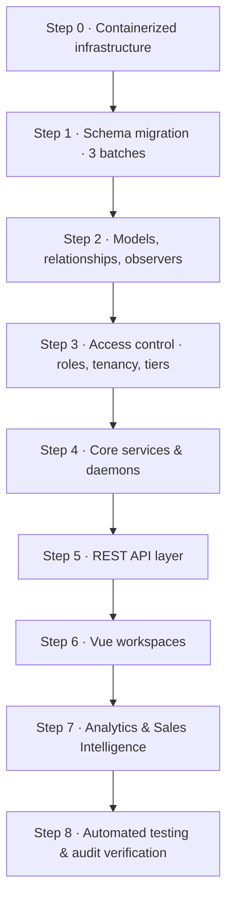

# 🛠️ F16s Freight OS — Implementation Guide

The ordered developer playbook. Build the platform as **vertical slices in a fixed sequence**, verifying at every checkpoint before moving on.

> [!IMPORTANT]
> **Companion documents — do not duplicate their content here.**
> - **Schema (all 58 tables, columns, FKs, indexes, DDL):** [`database_relations_tree.md`](file:///Users/jomygeorge/Desktop/f16sefreight/database_relations_tree.md)
> - **Product spec (roles, tiers, workflows, screens, formulas):** [`PRD.md`](file:///Users/jomygeorge/Desktop/f16sefreight/PRD.md)
> - **Interface spec (tokens, components, states, accessibility):** [`ui_ux_guide.md`](file:///Users/jomygeorge/Desktop/f16sefreight/ui_ux_guide.md)
>
> This file references them by section. It contains no column definitions and no product justification — only *what to build, in what order, and how to prove it worked.*

> [!IMPORTANT]
> **Read [`CONTEXT.md`](CONTEXT.md) first.** This guide was written before the existing codebase was known, so it reads as greenfield. It is not: 6 of its tables already exist and need ALTER rather than CREATE, and 22 live tables it never mentions must be preserved. `CONTEXT.md` carries the reconciliation.

> [!WARNING]
> **The one rule that matters most:** keep each change small and run the checkpoint before starting the next step. A half-applied migration batch or an unverified observer compounds faster than any other class of mistake in this codebase.

---

## 🗺️ Build Sequence



---

## Step 0 — Containerized Infrastructure

Establish consistent environments, multi-portal subdomains, and VM boundaries before any code.

### 0.1 Local multi-container setup (`docker-compose.yml`)

Private bridge network `f16s-network`:

| Service | Contents |
|---|---|
| `web` | Laravel 7+ on PHP-FPM behind Nginx (port `80`, mapped `8080` locally) |
| `db` | MySQL 8.0 with persistent host volume `db_data:/var/lib/mysql` |
| `redis` | Cache, Horizon queues, distributed locks |
| `soketi` | Node WebSocket server (Pusher-compatible) |
| `ai-server` | FastAPI + ChromaDB + Ollama |

**Resolve services by name, never by IP:** `DB_HOST=db` (3306) · `REDIS_HOST=redis` (6379) · `AI_SERVER_URL=http://ai-server:8000`.

Also create `Dockerfile.laravel` and `Dockerfile.fastapi`.

### 0.2 Production DNS & subdomain routing

CNAME records at the DNS provider (Route 53 / Cloudflare) pointing at the application load balancer:

- `focusair.f16sefreight.com` → binds `active_portal_scope = 'air'`
- `focussea.f16sefreight.com` → binds `active_portal_scope = 'sea'`
- `admin.f16sefreight.com` → platform superadmin portal, no tenant binding

Add Nginx virtual hosts inside the `web` container listening on all three server names and forwarding to the single Laravel entrypoint, so Laravel can bind the session scope from the request host.

### 0.3 AI instance provisioning (AWS EC2)

- **Instance:** dedicated **`t4g.large`** (2 vCPU, 8 GB RAM, Graviton ARM), separate from the web tier
- **Networking:** private VPC subnet, **no public IP**. Security group allows inbound TCP on `11434` (Ollama) and `8000` (FastAPI) **only** from the web/Horizon server addresses
- **Deployment:** install Docker + Compose, clone the `/python` microservice, build and run, then verify connectivity from the `web` container

✅ **Checkpoint 0**
```bash
docker compose up -d
docker compose ps                                   # all 5 services healthy
docker compose exec web php artisan migrate:status  # DB container reachable
dig focusair.f16sefreight.com                       # resolves to the ALB
curl http://ai-server:8000/health                   # from inside the web container
```

---

## Step 1 — Schema Migration (three ordered batches)

Run in **three batches with a verification checkpoint between each**. Executing all migrations in one shot risks an unrecoverable partial schema if a foreign key reference fails mid-way.

Column definitions live in `database_relations_tree.md`. This section fixes only **order and dependency**.

### Batch 1a — Prerequisites & tenancy

No inbound foreign key dependencies; these run absolutely first.

1. **`sequence_counters`** — must be first; all numbering depends on it
2. **`ports`** — UN/LOCODE master reference
3. **Alter `companies`** — add `tier`, `email_domain`, `ocr_credits_balance`, `ocr_credits_monthly_allowance`, `ocr_credits_limit`
4. **Create `customers`** — including tax/address/banking fields, `payment_terms_days`, `credit_limit`
   - Add composite indexes **`(company_id, email_domain)`** and **`(company_id, sales_id)`**. The first is hit on *every inbound mail*; the second on *every sales-dashboard query*. Adding them later means a table scan on the hottest paths in the product.
5. **Create `customer_contacts`** — the per-client address book (FK → `companies`, `customers`). Unique `(customer_id, email)`; index `(customer_id, include_in_cc, opted_out_at)` for the outreach CC lookup. **`include_in_cc` defaults to FALSE** — harvesting is automatic, CC'ing is a human decision
6. **Create `partners`** — airlines, shipping lines, brokers, transporters, vendors
7. **Alter `users`** — add `origin_port_id`, `pima_address`, `designation`, `signature_text`
8. **Alter `air_way_bills` & `house_way_bills`** — add `uuid`, `job_id`

**Encrypt at rest:** `bank_account_no` and `bank_ifsc_code` on both `customers` and `partners`, via the Eloquent `encrypted` cast.

✅ **Checkpoint 1a** — `php artisan migrate:status` shows every batch-1a migration as `Ran`; `php artisan tinker` → `Port::count()` returns `0` without exception.

### Batch 1b — Core operations & AI

**`enquiries` must precede `jobs`** — `jobs.enquiry_id` is `NOT NULL`.

1. **`enquiries`** — scope uniqueness to `(agent_id, enquiry_no)`
   - `reinitiated_from_job_id` is **cyclic** (→ `jobs.id`); add it via `ALTER TABLE` at the end of the script, alongside the `customers` cyclic constraints
2. **`jobs`** — scope uniqueness to `(agent_id, execution_job_no)`
   - **Enforce the status invariant at two layers.** `jobs.status` must **not** accept `Lost`; `enquiries.status` must not accept job states:
     ```sql
     ALTER TABLE jobs ADD CONSTRAINT chk_jobs_status CHECK (status IN
       ('Intake','AI Extraction','Verification','Generation','PDF Generated',
        'Sent to Airline','Airline Confirmed','Completed','Cancelled'));
     ALTER TABLE enquiries ADD CONSTRAINT chk_enq_status CHECK (status IN
       ('new','quoted','awaiting_client','converted','lost'));
     ```
     A **positive allow-list** beats `status <> 'Lost'` because it also blocks typos and any future enquiry-phase state from leaking in.
     ⚠️ **Requires MySQL 8.0.16+.** Earlier versions parse `CHECK` and silently ignore it. **Verify with `SHOW CREATE TABLE jobs` that the constraint is actually present** — a silently-dropped constraint is worse than no constraint, because it grants false confidence.
   - **Also add the mode/prefix drift guard on both tables** — `transport_mode` is the source (known from `active_portal_scope` before any number exists), and `enquiry_no`/`execution_job_no` merely format it visually. A `CHECK` makes the two impossible to disagree:
     ```sql
     ALTER TABLE enquiries ADD CONSTRAINT chk_enq_mode_prefix CHECK (
       (transport_mode = 'air' AND enquiry_no LIKE 'ENQA-%') OR
       (transport_mode = 'sea' AND enquiry_no LIKE 'ENQS-%'));
     ALTER TABLE jobs ADD CONSTRAINT chk_jobs_mode_prefix CHECK (
       (transport_mode = 'air' AND execution_job_no LIKE 'JOBA-%') OR
       (transport_mode = 'sea' AND execution_job_no LIKE 'JOBS-%') OR
       execution_job_no IS NULL);
     ```
   - Add `idx_jobs_ops_clearance` on `(ops_id, planned_clearance_date)` — the OLI query depends on it
3. `mailbox_connections`, `email_messages`, `email_attachments`
4. **`email_threads`** — FKs to `agents_info`, `users`, **`enquiries`** *and* `jobs`. The thread spans both lifecycles: `enquiry_id` is set at triage, `job_id` added on conversion, and **both stay NULL** for airline/clearance/trucking mail. Include `first_response_at` (first **outbound** reply — distinct from `first_triage_at`, which is internal triage, not a reply)
5. `job_documents`, then **`document_share_links`** (FK → `job_documents` CASCADE, `jobs`, `users`). `expires_at` is **NOT NULL**; unique on `token_hash`
6. `milestone_performance_logs`
7. **`audit_logs`** — register the append-only `BEFORE UPDATE OR DELETE` trigger here
8. `sea_containers`, `sea_container_items`, `cargo_arrival_notices`
9. **`job_entities`** — polymorphic `party_type`/`party_id` → `customers.id` or `partners.id`. Uses a generated virtual column `unique_role_gate` to enforce partial uniqueness on `(job_id, role)` **except** for `notify_party`, which may repeat
10. `sea_shipment_details` (carrier/haulage FKs → `partners.id`), `air_shipment_details`
11. `llm_usage_logs`, `pdf_processing_jobs` — **both carry `enquiry_id` *and* `job_id`**. Extraction normally runs pre-conversion at status step 2, so `enquiry_id` is the common case. Without one of them the parsed payload is orphaned and cargo promotion is impossible. Index both
12. `rate_cards`, `exchange_rates`, `sla_policies`
13. `manifest_filings`, `approved_drafts_queue`, `operational_cover_letters`
14. `email_classification_rules`, `email_classification_overrides`
15. `ocr_credit_transactions` (→ `companies`, `enquiries`, `jobs`), `pdf_extraction_corrections`
16. `support_tickets`
17. **`notifications`** — UUID PK, includes the `priority` column so reassignment-approval requests pin to the top of the bell

> **Do not defer the analytics columns.** `enquiries.quoted_amount`/`quoted_currency`, `origin_code`/`dest_code`, `cargo_data_source`/`cargo_data_promoted_at`, and `email_threads.first_response_at` ship **now**, with the table. Trailing history cannot be reconstructed later — every day they are missing is a permanently blind day (see `PRD.md` §7.3.3).

✅ **Checkpoint 1b**
```bash
php artisan tinker
>>> Enquiry::count(); Job::count(); EmailThread::count(); EmailClassificationRule::count();  # all 0, no exceptions
```
```sql
SHOW CREATE TABLE jobs\G   -- confirm chk_jobs_status is present
INSERT INTO jobs (..., status) VALUES (..., 'Lost');  -- must FAIL
```

### Batch 1c — Financial ledger

1. `chart_of_accounts` (self-referencing `parent_account_id`)
2. `accounting_periods`
3. **`accounts_invoices`** — `job_id` **`ON DELETE RESTRICT`**; `customer_id` **nullable** (customer-only, drives AR/collections); polymorphic `billed_party_type`/`billed_party_id` so brokerage/consol/agent invoices bill a partner
4. `accounts_invoice_items` (cascade), `accounts_invoice_brokerage_details` (1-to-1), `accounts_invoice_consol_details` (1-to-1, `partner_agent_id` → `partners.id`)
5. `accounts_purchase_vouchers` (`job_id` RESTRICT, `vendor_id` → `partners.id`), `accounts_purchase_items` (cascade)
6. `accounts_ledger_entries` — **no list/range partitioning**, which would break foreign key integrity
7. `gst_ledger_entries`, `unposted_transactions_queue`
8. `bank_transactions` (invoice/voucher FKs `SET NULL`), `accounts_cass_statements` (`airline_id` → `partners.id`)
9. `financial_snapshots`

**Finally, execute the cyclic constraints** via `ALTER TABLE`: `customers` → `ports` / `agents_info` / `users`, and `enquiries.reinitiated_from_job_id` → `jobs`.

✅ **Checkpoint 1c**
```bash
php artisan tinker
>>> AccountsInvoice::count(); AccountsLedgerEntry::count();   # 0
```
Attempt to delete a `jobs` row that has an invoice — it must fail with an integrity constraint error, proving `RESTRICT` is live.

### Batch 1d — Analytics engine tables

Build these when Step 7 starts, not before — but they belong to the same schema family:

`customer_performance_snapshots` · `customer_lane_stats` · `customer_cadence_profiles` · `sales_action_queue`

**Every one is keyed by `(customer_id, transport_mode)`.** Air sales staff see air only; sea staff sea only. Blended cross-mode rows are never written.

Also create the funnel views: `dsr_funnel_view`, `msr_funnel_view`, `ysr_funnel_view`.

---

## Step 2 — Models, Relationships & Observers

Create Eloquent models in the **root `app/` directory under namespace `App`**, matching the existing codebase convention (`app/AirwayBills.php`, `app/PdfProcessingJob.php`).

### 2.1 Relationships

- **`Enquiry`** — belongsTo `Customer` (client) and `User` (operator, owner); **hasMany `Job`** (one request may confirm as several shipments); hasMany `EmailThread`, `PdfProcessingJob`. Scopes: `scopeLost()`, `scopeConverted()`, `scopeStale()`, `scopeForActivePortal()`
- **`Job`** — **belongsTo `Enquiry` (required)**; belongsTo `Customer`, `User` as ops user / pending ops user / pricing owner; belongsTo self as parent consolidation; hasOne `SeaShipmentDetail`, hasOne `AirShipmentDetail`; hasMany invoices, vouchers, entities, containers, documents
- **`Customer`** — belongsTo `Company`; hasMany `CustomerContact`, `Job`, `AccountsInvoice`. Scope `scopeGroup()` returns every customer sharing `(company_id, email_domain)` — the derived client group (`PRD.md` §2.2); there is **no** `parent_customer_id`
- **`CustomerContact`** — belongsTo `Customer`. Scope `scopeCcEligible()` = `include_in_cc = true AND opted_out_at IS NULL`. **Never** set `include_in_cc` from harvesting code
- **`DocumentShareLink`** — belongsTo `JobDocument`, `Job`, `User` (creator). Scope `scopeLive()` = `revoked_at IS NULL AND expires_at > now()`. Accessor generates the raw token **once** on create and stores only its SHA-256
- **`AccountsInvoice`** — belongsTo `Customer` as client, morphTo `billedParty`, belongsTo self as parent (debit/credit notes), hasMany items
- **`AccountsPurchaseVoucher`** — belongsTo `Partner` as vendor, hasMany items

> **Guard the mode invariant.** A job with `transport_mode = 'sea'` must **never** load `airShipmentDetails`, and vice versa; a sea job never populates `awb_number`. Enforce in the model `boot()` and assert it in tests.

### 2.2 Casts

```php
// app/MailboxConnection.php
protected $casts = [
    'access_token'  => 'encrypted',
    'refresh_token' => 'encrypted',
    'is_active'     => 'boolean',
    'expires_at'    => 'datetime',
];

// app/Job.php  — DB CHECK constraint remains the authority; this only surfaces
// violations as validation errors instead of raw SQL failures
protected $casts = ['status' => \App\Enums\JobStatus::class];

// app/Enquiry.php
protected $casts = ['status' => \App\Enums\EnquiryStatus::class];
```

### 2.3 Observers

| Observer | Responsibility |
|---|---|
| **`JobObserver`** | On create, flips the parent `enquiries.status` to `converted`. Writes SLA entries to `milestone_performance_logs` on every status transition. Debounces container roll-up counts |
| **`EnquiryObserver`** | Stamps `lost_at` / `reopened_at`; clears `stale_nudged_at` on any new client reply; **blocks a `lost` transition if a child `jobs` row exists** — a converted enquiry cannot be lost, the job must be cancelled instead |
| **`EmailThreadObserver`** | Locks `first_triage_at` and `first_response_at` once populated (`isDirty()` check), preventing silent tampering. On re-triage, `job_id` resets but `first_triage_at` survives as the immutable audit record of the mistake |
| **`InvoiceObserver`** | On posting, moves drafts from `unposted_transactions_queue` into `accounts_ledger_entries` and computes the `gst_ledger_entries` tax split |
| **`SeaShipmentDetailObserver`** | Rolls house pieces/weights/volumes up to the parent master, and cascades routing/vessel fields down to children. **Debounced** with a 2-second cache lock so saving several houses in sequence dispatches one job, not five |

```php
$lockKey = "job_rollup_lock:{$parentJobId}";
if (! Cache::add($lockKey, true, 2)) return;   // debounced
ProcessConsolRollupJob::dispatch($parentJobId)->delay(now()->addSeconds(2));
```

### 2.4 Morph map

In `AppServiceProvider::boot()`:

```php
Relation::morphMap([
    'invoice'          => \App\AccountsInvoice::class,
    'purchase_voucher' => \App\AccountsPurchaseVoucher::class,
    'awb'              => \App\AirwayBills::class,
    'hawb'             => \App\HousewayBills::class,
    // Party morph — resolves job_entities.party_type, rate_cards.party_type
    // and accounts_invoices.billed_party_type
    'customer'         => \App\Customer::class,
    'partner'          => \App\Partner::class,
]);
```

✅ **Checkpoint 2** — `php artisan tinker`: instantiate each model, traverse one relationship in each direction, and confirm a sea job returns `null` for `airShipmentDetails`.

---

## Step 3 — Access Control (roles, tenancy, tiers)

Build this **before** any controller, so no endpoint is ever written unprotected. Specification: `PRD.md` §2 and §3.

### 3.1 Tenant isolation global scope

A global scope applied automatically, **branching on which column the table carries**:

- **Branch-scoped** (`agent_id`) — `enquiries`, `jobs`, `email_threads`, `accounts_invoices`, `job_documents`, all analytics tables → `WHERE agent_id = auth()->user()->branch_name`
- **Tenant-scoped** (`company_id`) — `customers`, `partners`, `sla_policies`, `gst_ledger_entries`, `unposted_transactions_queue`, `ocr_credit_transactions` → `WHERE company_id = auth()->user()->branch->company_id`

Provide the escape hatch `withoutTenantScope()` for daemons, console commands, webhooks and supervisors that run outside a session.

> **Customers and partners are tenant-wide, shared across all of a tenant's branches.** `customers.branch_id` is an advisory *managing/proximity* branch for routing and sales assignment — **not** an isolation boundary.

### 3.2 Cross-tenant referential guards

A job's branch and its parties are not composite-keyed to the same tenant at the database level. Every `FormRequest`/service **must** assert that each referenced customer or partner shares the acting user's `company_id` before persisting — `jobs.customer_id`, `job_entities.party_id`, `accounts_invoices.billed_party_id`, voucher `vendor_id`.

### 3.3 Portal scope (deliberately not global)

```php
public function scopeForActivePortal($query) {
    if (session()->has('active_portal_scope')) {
        return $query->where('transport_mode', session('active_portal_scope'));
    }
    return $query;
}
```

Chain it explicitly in HTTP controllers (`Job::forActivePortal()->get()`). **Never make it global** — queue workers, WebSocket broadcasts and crons have no session and would be silently mis-filtered.

### 3.4 Role gates

> **Role separation is tier-gated — build this ordering explicitly.** On `core` there is exactly **one** login type: `users.designation` is carried but **inert**, every user resolves to the same undifferentiated Core user, and every role-specific route is unreachable. Role policies begin evaluating only at `tactical` (4 roles: `pricing`, `operations`, `sales`, `boss`); `accounts` becomes live only at `command` (5 roles). Implement the tier check **before** the role check in every gate, so a Core tenant can never reach a role-scoped endpoint by setting a designation value directly in the database.

Implement policies and middleware against the **Role × Screen matrix** (`PRD.md` §2.4):

| Guard | Rule |
|---|---|
| `can:triage` / `can:convert` / `can:markLost` | `designation = 'pricing'` only |
| `can:requestReassignment` | `designation = 'operations'` only |
| `can:assignOperator` | `designation IN ('pricing','boss')` |
| Analytics endpoints | **`403` for `operations` and `pricing`**; frontend hides the nav item and redirects direct navigation to `/inbox` |
| Sales endpoints | `designation IN ('sales','boss')`; on Command, additionally scoped `customers.sales_id = auth()->id()` |
| Profit-margin fields | **Stripped from every sales-facing API response at any tier** — enforce in the API Resource, not the Vue component |
| **`can:finalizeInvoice` / `can:postLedger`** | **`designation = 'accounts'` only — `boss` included is a bug.** Pricing edits the cost sheet; accounts posts it |
| **`can:managePeriod`** (open/close/reopen) | **`designation = 'accounts'` only** |
| `can:reconcile` (bank, CASS, discrepancies) | `designation = 'accounts'`; `boss` gets read-only |
| `can:overrideCreditHold` | `designation IN ('accounts','boss')` |
| Financial **read** endpoints (reports, registers) | `designation IN ('accounts','boss')`, all `tier:command` |
| `superadmin` middleware | Platform routes only; independent of `company_id` |

**Database triggers** additionally enforce designation on assignment: `jobs.ops_id` must reference a user with `designation = 'operations'`; `jobs.pricing_id` must reference `designation = 'pricing'`; and `accounts_invoices.created_by` / `accounts_purchase_vouchers.created_by` must reference `designation = 'accounts'`.

> #### 🔒 Segregation of duties
> **Posting to the ledger and opening/closing an accounting period are exclusive to `accounts`.** No other designation — including `boss` — may perform them. The role that sets targets must not book the revenue those targets are measured in, and the role that sets the margin must not book it either. Write a test that asserts a `boss` user receives `403` on both endpoints; it is the single most likely permission to get wrongly widened during development.

### 3.5 Tier middleware

Register `CheckCompanyTier` as `'tier'` in `app/Http/Kernel.php`:

```php
Route::group(['middleware' => 'tier:tactical,command'], ...);  // mailbox sync, AI extraction
Route::group(['middleware' => 'tier:command'], ...);           // ledger, reconciliation, client book
```

### 3.6 Session, locks & broadcast authorization

- Bind `company_id`, `agent_id`, `designation`, `active_portal_scope` and `company.tier` at login; expose `tier` and `designation` on the `currentUser` payload
- Redis row lock on form open: `Cache::put("shipment_lock:{$jobId}", auth()->id(), now()->addMinutes(45))`, refreshed by `POST /api/jobs/{id}/heartbeat`
- `Broadcast::channel('branch.{agentId}', …)` must verify the user's branch matches the requested channel

✅ **Checkpoint 3** — run `CrossTenantIsolationTest` and `TierModeGatingTest` (Step 8). Both must pass before writing a single controller.

---

## Step 4 — Core Services & Daemons

### 4.1 Python FastAPI parsing engine (`python/ocr_server.py`)

1. **Dependencies:** add `PyMuPDF` and `google-generativeai` to `requirements.txt`
2. **Pydantic schemas** (`python/schemas.py`) for Invoice and Packing List, including per-field `confidence` (high / medium / low)
3. **`/extract-unstructured` endpoint:**
   - `fitz.open(stream=…)` — process the binary buffer **in memory**, never to disk
   - Text-selectable PDF → local **Gemma 4 E4B** via Ollama at `http://<ai-private-ip>:11434`
   - Scanned PDF / image → **Gemini 2.5 Flash** vision fallback, translating foreign documents to standard English
4. **Retain `pdfplumber`** in `extract_awb_new.py` for structured AWBs — coordinate extraction is the correct tool for a fixed layout
5. **Ollama configuration:** `OLLAMA_KEEP_ALIVE=-1` to pin the model in RAM; bake system prompts and JSON schemas into a custom `Modelfile` (`ollama create gemma-custom -f ./Modelfile`) to eliminate repeated instruction tokens
6. **Gemini context caching:** 300 s TTL on the large Pydantic schemas and SOP prompt block
7. **ChromaDB** cohosted on the same instance; embeddings via `nomic-embed-text` queried over loopback

### 4.2 `PollMailboxes` daemon

`php artisan mailboxes:poll`, the **15-minute reconciliation sweep** registered in `Kernel.php` (push is primary — see below):

- Skip connections where `is_active = false` (tier downgrade) or whose company tier is `core`
- Google API Client + Microsoft Graph; **delta queries / history IDs only** — never a full mailbox scan
- ⚠️ **Set the Google OAuth consent screen to "In production" on day one.** In *Testing* status refresh tokens expire after **7 days** — this is the single most common false "token storage bug" in Gmail integrations. Publishing is independent of verification; an unverified production app still works, just with the interstitial and the 100-user cap.
- **Evaluate domain-wide delegation before budgeting CASA** (`PRD.md` §5.2.1) — for Workspace tenants it removes the consent screen, the interstitial, the 100-user cap and the assessment. Both flows must exist regardless, since consumer Gmail cannot use DWD.
- 🔴 **Push is primary; polling is the safety net.** Register Gmail Pub/Sub (`users.watch()`) and Graph change-notification subscriptions at connect time and drive sync from webhook deliveries. Polling drops to a **reconciliation sweep every 15 minutes**, not every minute — it exists to catch what push missed, not to be the mechanism. At 1,000 mailboxes minute-polling is ~1.44 M calls/day of which the overwhelming majority return nothing; push collapses that to near zero while *improving* latency from ≤60 s to ~1 s.
- **Both paths converge on the same handler.** A webhook carries a notification, not the message — the handler still reads the delta cursor, so push and poll share one idempotent code path and a lost webhook simply means the sweep picks it up.
- **Scopes:** Google **`gmail.modify`** + `gmail.send`; Microsoft **`Mail.ReadWrite`** + `Mail.Send` + `offline_access`. Read/write is required because the portal replaces the mail client (`PRD.md` §5.2.3). ⚠️ Still a **restricted** scope requiring CASA — but `gmail.readonly` already was, so widening costs nothing extra in compliance
- 🔴 **Sync the whole mailbox, not the Inbox folder.** Graph `/me/messages/delta` (**not** `/mailFolders/inbox/messages/delta`); Gmail backfill query `in:anywhere`. A reply typed in Outlook lands in Sent Items only — inbox-scoped sync loses half of every conversation
- **Thread matching is three-tier:** `provider_thread_id` (Gmail `threadId` / Graph `conversationId`) → `In-Reply-To`/`References` chain → normalised subject + participants within 30 days. **Never let tier 3 override tiers 1–2**
- **Echo suppression:** persist the provider message id at send time with `sent_via_portal = true`; the unique `message_id` makes the Sent-folder echo an idempotent upsert that must **not** re-fire classification, SLA timers or notifications
- **Backfill resumes, never restarts:** rewrite `backfill_page_cursor` after **every committed page**, each page in its own transaction. Resume automatically on the next run
- **Sending is delegated, never app-only.** Replies and outreach go out through the *user's own* mailbox (`users.messages.send` / `/me/sendMail`), so SPF/DKIM/DMARC are the provider's problem, not ours. Set `In-Reply-To` + `References` and pass `threadId` / use `/messages/{id}/reply` so replies stay threaded on the client's side
- **Transactional mail (tickets, arrival notices) does NOT use this path** — it needs a separate provider and a decided sending domain (`PRD.md` §5.2.1, open item)
- Compute `thread_key`, upsert `email_threads` / `email_messages`, index `email_attachments`
- **Lazy attachments** — download binaries only when parsing is actually initiated
- **ClamAV** scan before any attachment is persisted
- **HTMLPurifier** on `body_html` before storage
- Compute the SLA reply deadline from the tenant's `sla_policies` tier row

### 4.3 `RegexClassificationService`

Loads rules from `email_classification_rules` into Redis hash maps (synced by a model event on save).

- Match order: domain → subject → body cargo extraction → default `customer_enquiry`
- 🔴 **Classify `direction = 'inbound'` only.** Outbound messages are stored on the thread and stamp `first_response_at`, but **never** run through the classifier, never mint an `enquiry_no`, never reset `latest_message_received_at` and never clear `stale_nudged_at` (`PRD.md` §5.2.3). A reply quoting the client's own cargo figures matches every extraction pattern — classify it and you mint a second enquiry for a conversation that already has one, inflating the conversion denominator.
- **Rules are scoped by `transport_mode`** — load only the active portal's set. Air and sea use different units, routing tokens and reference formats (`PRD.md` §5.2.5)
- **Split the weight regex by label** (`gross`, `chargeable`, `net`, and `cbm` for sea). A single unlabelled pattern takes whichever number matches first and silently records the wrong one
- Increment `hit_count` on match; write every operator correction to `email_classification_overrides` and increment `override_count`
- **Regex stages; the operator mints.** Never create an `enquiries` row or consume an `enquiry_no` automatically — see §5.2.3 of the PRD for why auto-minting corrupts the conversion denominator

### 4.4 `EnquirySequenceService`

The **single centralized path** for all sequence generation across the application.

```php
protected function fiscalYear(): string {
    $now = now();
    return $now->month >= 4 ? $now->format('y') : $now->subYear()->format('y');
}
```

Increment inside a transaction holding `SELECT … FOR UPDATE` on the `sequence_counters` row scoped `(agent_id, prefix, fiscal_year)`. **Do not use Redis locks for this** — the database row lock is authoritative. Reserve Redis locks for Plaid webhook deduplication and API idempotency.

### 4.5 `CargoDataPromotionService`

Fires on `pdf_processing_jobs.status → 'completed'`.

1. Resolve the target via `enquiry_id` (the common case — extraction runs pre-conversion) or `job_id`
2. Map `extracted_data` onto `enquiries.extracted_*` plus `origin_code` / `dest_code`
3. **Promotion is monotonic** — write only where `cargo_data_source IN ('regex', NULL)`. Never overwrite an operator-verified value
4. Stamp `cargo_data_source = 'ocr'` and `cargo_data_promoted_at`; write before/after to `audit_logs`
5. **Declared cargo stays on the enquiry permanently.** Actual figures land in `air_/sea_shipment_details` on operator verification and **never** write back. Variance is computed as a join when needed — flag above 20%

Also ship the **`destination_keyword`** rule class so lanes are captured at enquiry time. Without it, lost enquiries carry no lane and every lane-level sales metric is blind exactly where it matters most.

### 4.6 `ClientNotificationService`

Stages consent-gated automated emails at `Intake`, `AI Extraction`, `Sent to Airline` and re-initiation, storing the draft on `email_threads.pending_client_notification`. Released only through `POST /api/jobs/{id}/confirm-notification`.

> [!WARNING]
> **Enforce consent in the service, not the UI.** No email or attachment may leave the system without explicit operator acceptance. Sending the wrong document to a client is unrecoverable.

### 4.7 Scheduled commands

| Command | Cadence | Purpose |
|---|---|---|
| `mailboxes:poll` | **every 15 min** | Reconciliation sweep — the safety net behind push, not the primary mechanism |
| `mail:dispatch-queued` | every 10 s | Send `email_messages` where `send_state='queued'` and `scheduled_send_at <= now()`. The undo window lives here |
| `attachments:evict-cache` | daily | Drop bytes where `cache_expires_at` has passed; set `fetch_state = 'evicted'`. **Never touches `job_documents`** — those are statutory |
| `mailboxes:sync-read-state` | every 5 min | Push local read/archive changes upstream; **the provider wins any conflict** |
| `mailboxes:renew-watch` | **daily** | Re-call Gmail `users.watch()` where `watch_expires_at < 48h`. The subscription dies at 7 days **with no error** — a daily cadence survives six failed runs, a weekly one survives none |
| `enquiries:nudge-stale` | hourly | Bell-nudge pricing to decide on inactive unconfirmed enquiries; debounced via `stale_nudged_at`, cleared on any new client reply |
| `snapshots:compute` | every 30 min | `financial_snapshots` refresh |
| `sales:compute-snapshots` | nightly | The four analytics engine tables |
| `NarrateClientInsightsJob` | weekly, batched | Gemma narration (Step 7) |
| Plaid fallback sweep | every 3 days | Catch transactions missed by webhooks |

### 4.8 Financial services

- **Ledger poster** — generates balanced double-entry lines and GST splits on finalization; validates `document_date` against open `accounting_periods`
- **Cash reconciler** — matches `bank_transactions` credits against outstanding invoices (Level 1: job/AWB regex in the memo; Level 2: amount + client name), computes exchange-rate variance between document and settlement dates using `exchange_rates`, and posts realized FX to `5500-Forex-Gain-Loss`
- **CASS tally** — compares uploaded statement rows against estimated purchase vouchers, flagging `weight_mismatch` / `rate_mismatch` beyond the configured tolerance (default ±1.0%)

### 4.10 Queue Topology & Throughput

> **This is what decides whether the product feels fast.** Every background job on one queue means a 30-second OCR extraction sits in front of a one-second mail sync, and mail arrives minutes late for reasons the user cannot see. Separate the queues or accept that failure mode.

#### Named queues

| Queue | Carries | Job runtime | Workers | Why isolated |
|---|---|---|---|---|
| `sync` | `PollMailboxes`, delta pages, read-state push | 0.2–2 s | **10–20** | Highest volume, most latency-sensitive. Must never queue behind anything slow |
| `backfill` | `BackfillMailboxJob` pages | 1–5 s | **2–4** | Long-running and bursty at onboarding. Capped deliberately so a new tenant importing 60 days cannot starve live sync |
| `ocr` | `ProcessPdfOcrJob`, FastAPI/Gemini calls | **5–60 s** | **4–8** | The slowest work in the system. Isolated so it cannot block anything |
| `mail-out` | Replies, outreach, consent-engine sends | 1–3 s | **4** | User-visible: a send that appears stuck reads as data loss |
| `documents` | PDF compilation, cover-letter merges | 3–15 s | **2–4** | CPU-heavy |
| `analytics` | `sales:compute-snapshots`, narration, rollups | minutes | **1–2** | Nightly, entirely latency-insensitive. **Lowest priority** |
| `notifications` | Soketi pushes, bell writes | < 0.5 s | **4** | Tiny and instant; never behind a heavy job |

**Horizon priority order:** `notifications` → `sync` → `mail-out` → `documents` → `ocr` → `backfill` → `analytics`.

#### Throughput sizing

At **1,000 mailboxes** (50 tenants × 20 staff):

```
polling      1,000 jobs/min ÷ 60 = ~17 jobs/sec
round trip   ~300 ms per job
required     17 × 0.3 ≈ 5 concurrent workers to break even
provision    10–20  (3–4× headroom absorbs latency spikes and retries)
```

Neither provider's quota is the constraint at this scale — Gmail runs ~2.9 M units/day against a 1.2 B ceiling, and Graph sees ~200 requests/10 min per tenant against ~10,000. **Worker concurrency is the constraint**, and it is a provisioning decision, not a code one.

#### Ingest volume

50,000 messages/day is ~35 inserts/min — trivial for MySQL. **Storage is the number to plan:** ~2.5 GB/day, ~900 GB/year of message bodies, which is why bodies are offloaded to object storage and only `body_snippet` stays inline.

### 4.9 Resilience wrapper (applies to every external call)

Wrap FastAPI, Gmail, Graph, Plaid and ICEGATE calls in queue jobs with exponential backoff plus jitter ($2^{\text{attempt}} \times 100\,\text{ms}$, max 5 attempts), a Redis circuit breaker after 5 consecutive failures (fail fast for 15 minutes), and a dead-letter path to `failed_jobs` that notifies branch admins.

> 🔴 **Key the breaker per connection, never globally.** `breaker:mailbox:{mailbox_connection_id}` — **not** `breaker:graph`. One tenant hitting a 429 must not stop mail sync for every other tenant on the platform. Widen only deliberately: a *provider-wide* breaker (`breaker:provider:graph`) is justified only on a confirmed provider outage, and should trip on a high threshold across many distinct connections, not on one mailbox failing five times. The AI server keeps its single `platform:status:ai_server` key because it genuinely is one shared dependency. Write AI-server failures to `platform:status:ai_server`; clear the key on the next success.

✅ **Checkpoint 4**
```bash
uvicorn python.ocr_server:app --reload
curl -F file=@sample_invoice.pdf http://localhost:8000/extract-unstructured   # returns JSON + confidence
php artisan mailboxes:poll                    # threads appear, no enquiry_no consumed
php artisan tinker
>>> app(EnquirySequenceService::class)->next($agentId, 'ENQA');   # ENQA-…-26-0001
```

---

## Step 5 — REST API Layer (`routes/api.php`)

### 5.1 Triage — `EmailInboxController`

| Endpoint | Behaviour |
|---|---|
| `POST /api/inbox/threads/{thread_key}/classify` | Manual operator override (airline / clearance / trucking / enquiry). **Promotion** mints an `enquiries` row; **demotion** sets the orphaned enquiry to `lost` and returns **`422`** if it already has a child `jobs` row |
| `POST /api/inbox/threads/{id}/claim` | Atomic claim — `UPDATE … WHERE ops_id IS NULL`; **`409 Conflict`** if zero rows affected |
| `POST /api/jobs/{id}/reply` | Policy-checked (`$this->authorize('reply', $job)`), sends through the connected mailbox as a threaded reply |
| `POST /api/jobs/{id}/confirm-notification` | Releases a staged consent-gated draft |
| `POST /api/documents/{id}/share` | Creates a `document_share_links` row. Body: `requires_approval`, `expires_in_days` (default 14, **max 90**). Returns the raw token **once** — only its SHA-256 is stored |
| `DELETE /api/documents/share/{id}` | Sets `revoked_at`. Immediate |
| `POST /api/documents/share/{id}/send` | Hands the link to `ClientNotificationService` as a staged consent message — **does not send** |

**Public, unauthenticated** (separate route group — no `auth`, no tenant scope, rate-limited):

| Endpoint | Behaviour |
|---|---|
| `GET /d/{token}` | Hashes the token, looks up by `token_hash`. Rejects revoked/expired with a plain message. Stamps `first_viewed_at`, `last_viewed_at`, increments `view_count`. Serves `noindex, nofollow`. **Returns one document — never the job** |
| `POST /d/{token}/respond` | Approval mode only. Records `approved` / `changes_requested`, `approver_name`, `approver_email`, `client_comment`, `responded_at`; raises a bell notification to the operator and appends to the job's `email_threads` row |

### 5.2 Lifecycle — `EnquiryController` / `JobController`

| Endpoint | Behaviour |
|---|---|
| `GET /api/enquiries` | The pre-conversion pool (pricing's board), mode-scoped |
| `POST /api/enquiries` | Mints `enquiry_no` on operator triage confirmation |
| `POST /api/enquiries/{id}/lost` | Lost is **enquiry-only**; `422` if a child job exists |
| `POST /api/enquiries/{id}/reopen` | Revives in place — clears `lost_*`, stamps `reopened_at`, **keeps the original `enquiry_no`**, resumes SLA timers. Also auto-triggered by trailing client mail |
| **`POST /api/enquiries/{id}/convert`** | **The only path that creates a `jobs` row.** One transaction: insert the job with `enquiry_id`, generate `execution_job_no`, attach AWB (air) or MBL (sea), set operator + clearance date, flip the enquiry to `converted` |
| `GET /api/jobs` | Confirmed shipments, `scopeForActivePortal()` + role scoping |
| `GET /api/jobs/operator-load` | Per-operator active jobs, clearance schedule and computed **OLI** for the pricing load-balancing view |
| `PUT /api/jobs/{id}/status` | Milestone transitions |
| `POST /api/jobs/{id}/cancel` | Requires `cancellation_reason`; **`422`** if posted invoices/vouchers exist; on success detaches the AWB/HWB (`job_id → NULL`), releasing the number to stock |
| `POST /api/jobs/{id}/reinitiate` | Creates a **fresh `enquiries` row** (new number, `reinitiated_from_job_id` → this cancelled job) and queues the re-quote client email |
| `POST /api/jobs/{id}/reassign` | Pricing sets `ops_id` directly |
| `POST /api/jobs/{id}/reassign/request` | Operator stages `pending_ops_id` and notifies the pricing owner's bell with **elevated `priority`** so it pins to the top |
| `POST /api/jobs/{id}/reassign/withdraw` | Clears the pending fields **and hard-deletes** the matching `ReassignmentRequested` notification (matched on `data.job_id`) so it auto-dissolves from the bell |
| `POST /api/jobs/{id}/reassign/{accept\|reject}` | Accept promotes pending → live; reject clears it. Either removes the pinned notification |
| `POST /api/jobs/{id}/heartbeat` · `/unlock` · `/copy` | Row-lock lifecycle and job duplication |

### 5.3 Financial — `InvoiceController` / `PurchaseVoucherController` / `ReconciliationController`

Draft finalization, tax evaluation, ledger posting, Plaid/Setu matching, discrepancy resolution. **Credit limits are checked server-side before finalization and DO release, aborting with `422` on breach** — never client-side only.

### 5.4 Customs — `ManifestFilingController`

Generates flat-file CGM/SCMTR/IGM manifests for ICEGATE, validating ICEGATE character limits before compilation.

### 5.5 Analytics — `SalesDashboardController` / `AnalyticsController`

Reads the engine tables and funnel views. **Never aggregates `jobs` live.** Enforces mode scoping, `sales_id` scoping on Command, and strips margin fields from every sales-facing resource.

### 5.6 Platform — `AdminHealthController` / `SupportTicketController`

`GET /api/admin/health` (Redis state, Horizon metrics, CPU/RAM) · `GET /api/admin/logs` (streamed tail of the last 100 lines) · ticket CRUD and status transitions · `GET /api/admin/classification-overrides/export`. All behind `superadmin` middleware.

✅ **Checkpoint 5** — exercise the full lifecycle with `curl`/Postman: triage → convert → cancel → reinitiate. Confirm `409` on double-claim, `422` on demoting a converted enquiry, `422` on cancelling a job with posted invoices.

---

## Step 6 — Vue Workspaces

1. **`JobInbox.vue`** — three-column layout (folders → thread feed → conversation), `[Classify As…]` dropdown, Claim/Take Over toolbar, consent banners for staged client emails, and the **split-pane collapse**: opening the drawer slides the sidebar to a 60 px rail, pushes columns 1–2 off-screen, and gives the conversation and the drawer exactly 50% each. Below 1200 px, collapse to a full-width stacked form with a toggle back to the timeline
2. **`OcrUploadModal.vue`** — drag-and-drop upload, pre-populating `FocusAir.vue` / `HouseWayBill.vue` inline with **medium/low confidence fields highlighted orange**
3. **`OpsDashboard.vue`** — `vuedraggable` Kanban with the four Process columns, the Staff clearance matrix, the Unassigned Pool scroller (`[+]`/`[-]`), SLA colour coding, magnetic drag-and-drop, triple filters, OLI badges, and the bell ordered `priority DESC, created_at DESC`
4. **`JobCostSheet.vue`** — buy/sell tables inside the drawer, writing to the accounts tables without touching the legal manifest
5. **Focus Sea** — `FocusSeaMaster.vue`, `FocusSeaHouse.vue`, `FocusSeaConsol.vue`: 12-tab architecture, ISO 6346 check-digit validation, cargo-type conditional locking, container stuffing grid
6. **Focus Air** — `FocusAir.vue`, `HouseWayBill.vue`, `FocusAirImport.vue`: IATA 35-char line constraints surfaced inline before EDI submission
7. **`SalesDashboard.vue`** — **chart-first ApexCharts** (tonnage trend, lane/country breakdown, win-loss donut) with tables only as drill-down and a day/month/year selector. The chart components are **shared across tiers — only the query scope changes.** Renders one transport mode at a time, bound to `active_portal_scope`. Surfaces the ranked **"Today's Actions" (top ~5)** *above* the charts. Gate client-book components behind `tier:command`
8. **`BossDashboard.vue`** — cross-branch, cross-mode comparison, target assigner, executive brief, snapshot staleness banner when `last_computed_at` is over an hour old
9. **`UpgradeTeaser.vue`** — blurred lock overlay with an "Upgrade Required" CTA over Command-gated surfaces
10. **`HelpCopilotChatbox.vue` + `VisualReporter.vue` + `HighlightTourDriver.js`** — RAG help copilot, deterministic visual bug reporter (CSS selector + route + console logs + `html2canvas`, **no LLM in the capture path**), Driver.js guided tours
11. **`SuperadminMonitor.vue` + `SupportDeskTickets.vue`** — the `admin.` portal
12. **`MailboxSettings.vue`** — OAuth connection management with domain validation feedback

✅ **Checkpoint 6** — `npm run dev`; walk one enquiry end-to-end in the browser: mail arrives → triage → drawer verification → confirm → Kanban card → cost sheet. Confirm the drawer collapse geometry and that a Tactical login sees no client names.

---

## Step 7 — Analytics & Sales Intelligence

Order matters here more than anywhere else in the build.

1. **Close the recording gaps first** — `enquiries.quoted_amount`/`quoted_currency`, `origin_code`/`dest_code`, `email_threads.first_response_at`, `pdf_processing_jobs.enquiry_id`. Backfill whatever is derivable. **These cannot be retro-fitted usefully**
2. **Cargo promotion** — `CargoDataPromotionService` + the `destination_keyword` rule class + mode-specific rule sets (air: IATA codes, chargeable weight; sea: LOCODEs, CBM, container types) with labelled gross/chargeable/net patterns. Verify declared-vs-actual variance computes and that **lanes land on lost enquiries**, not just converted ones
3. **Rollups** — `php artisan sales:compute-snapshots` (nightly) writing the four engine tables, strictly partitioned by `(customer_id, transport_mode)`. **Funnel and loss metrics read `enquiries`; tonnage and revenue read `jobs` → `*_shipment_details` → invoices.** Assert in tests that no row blends modes
4. **Scoring (pure PHP)** — implement algorithms A–I from `PRD.md` §7.3.4. **Start with A (cadence), B (momentum), C (loss attribution), F (payment)** — these four carry most of the value. Unit-test each against fixtures; every formula must be reproducible without an LLM.

   **Implement the shared guard rails first** (`PRD.md` §7.3.4, *Shared guard rails*) — they are not hardening, they are correctness. Write a test for each:

   | Guard | Test |
   |---|---|
   | Zero denominators → **NULL**, never `0` or `Inf` | A client with `credit_limit = 0.00` (**the schema default**) yields `credit_util = NULL`; a client with zero losses yields NULL loss rates; a client with no 365-day baseline yields `momentum = NULL` |
   | Same-day shipments collapse; `expected_gap` floored at 1 | Three shipments on one date produce **no** zero-length gap and no division by zero |
   | Minimum sample | Below 5 shipments / 5 closed enquiries / 3 settled invoices → index NULL, not a score |
   | Normalization to `[0,1]`, 1 = healthiest | `churn_norm` maps the **band** (`LOW`…`DORMANT`) to a number — `1 − churn_risk` on a label is not computable; `ops_health` is **inverted**, since a positive `stage_delta` means slower, i.e. worse |
   | CHS weight re-normalization | With a NULL component, surviving weights re-normalize to sum to 1; **never substitute `0`** for missing evidence. Fewer than 3 components → CHS NULL |
   | Clamp before store | `momentum` and `overdue_ratio` fit `DECIMAL(6,3)` (max `999.999`) |
   | One lane vocabulary | Buckets use `origin_code`/`dest_code`; `pol_code`/`pod_code` are mapped in at rollup, never mixed into one key |
   | One impact unit | `sales_action_queue.impact_value` is always annualized base currency — tonnage is converted before ranking, or the ordering is meaningless |

5. **Action queue** — populate `sales_action_queue` with `(impact × urgency) / effort` ranking and render the top-5 panel. Set `audience` on every row (`internal` | `client`)

6. **Contact directory & client outreach** — `customer_contacts` + drafted emails (`PRD.md` §7.3.7):
   - Harvest inbound senders in `mailboxes:poll` — upsert address, name, `last_seen_at`, `message_count`. **Never set `include_in_cc` programmatically**
   - Resolve recipients at draft time: `is_primary` → To; `include_in_cc = true AND opted_out_at IS NULL` → Cc. **Snapshot** into `draft_to` / `draft_cc` so later list edits cannot silently change a pending draft
   - On send: dispatch via the rep's own `mailbox_connections` row, create an `email_threads` row, store `sent_thread_key`, stamp `sent_at` / `sent_by`
   - **Tests that must exist:**
     | Test | Asserts |
     |---|---|
     | `AudienceFirewallTest` | Inserting `audience='internal'` **with any `draft_*` column populated is rejected by `chk_saq_internal_no_draft`** — at the database, not the application |
     | `ContactOptOutTest` | A contact with `opted_out_at` never appears in `draft_cc`, even with `include_in_cc = true` |
     | `SendIdempotencyTest` | Posting the same `idempotency_key` twice sends **one** mail and returns the original result — the UNIQUE constraint, not application logic, is what guarantees it |
   | `UndoSendTest` | Cancelling inside `scheduled_send_at` sets `cancelled` and **no provider call is ever made** |
   | `EmailHtmlSafetyTest` | Composer output carries inline CSS only — no `<style>`, no flexbox/grid — and always emits a `text/plain` alternative |
   | `PasteSanitisationTest` | Word/Outlook paste is stripped of `mso-*`, conditional comments, `class`/`id` and `<o:p>`, server-side via HTMLPurifier |
   | `AttachmentRefetchTest` | An evicted attachment re-fetches via `provider_attachment_id` and streams **in-portal**; a disconnected mailbox yields `fetch_state = 'unavailable'` with metadata intact, never a 404 |
   | `StatutoryRetentionTest` | The eviction job **never** deletes a `job_documents` row or its bytes, at any age |
   | `OutboundNotClassifiedTest` | A synced Sent-folder message stamps `first_response_at` and stops the SLA clock, but produces **no** classification, **no** `enquiry_no` and does not touch `latest_message_received_at` or `stale_nudged_at` |
   | `HarvestTest` | Polling never sets `include_in_cc`; harvesting an opted-out address updates recency but does not re-enable it |
   | `SentFolderSyncTest` | A message created in the provider's **Sent** folder (simulating a reply typed in Outlook) is ingested and joins the **existing** thread via `provider_thread_id` |
   | `EchoSuppressionTest` | Sending via the portal then running a sync produces **one** row, not two, and fires no second notification |
   | `BackfillResumeTest` | Killing the backfill mid-run and re-dispatching resumes from `backfill_page_cursor` with no duplicates and no lost pages |
   | `ReadStateConflictTest` | Local read flag and provider unread flag disagree → provider value wins |
     | `DraftSnapshotTest` | Editing the contact list after generation does not mutate an existing `draft_cc` |
7. **Document share links** — `document_share_links` (`PRD.md` §5.7):
   - Token: 256-bit CSPRNG. **Store only `hash('sha256', $token)`**; return the raw value once at creation and never again
   - `expires_at` is **NOT NULL** — reject any attempt to create a non-expiring link
   - Public routes live outside the tenant global scope, so the lookup **must** filter on `revoked_at IS NULL AND expires_at > NOW()` explicitly
   - **Tests:** a revoked link returns 410 · an expired link returns 410 · a valid token exposes **only** its own document and leaks no job or pricing payload · `view_count` increments · an approval response raises the bell and lands on the job's thread

8. **Narration last** — only once the numbers are trusted, add `NarrateClientInsightsJob`. Validate Gemma output against the schema, log to `llm_usage_logs`, and **confirm the dashboard still renders correctly with the AI server switched off**

> Do **not** route these analytics through ChromaDB. Vectors serve the SOP copilot; embeddings cannot compute a trend. Gemma receives a ~600-token fact packet of pre-computed values and may never derive, sum, or compare a figure itself.

Also build: `financial_snapshots` via `snapshots:compute` (30 min), the DSR/MSR/YSR funnel views, and the P&L / Balance Sheet / Trial Balance reports with strict period lockout.

✅ **Checkpoint 7** — verify tier + mode gating end-to-end: a Tactical sales user sees branch aggregates with no client names and no money; a Command sales user sees only `customers.sales_id = me`; an **air** sales user sees **zero** sea rows in every engine table, and vice versa.

---

## Step 8 — Automated Testing & Audit Verification

### 8.1 Laravel feature tests (`php artisan test`)

| File | Asserts |
|---|---|
| `JobTriageTest.php` | `ENQA-`/`ENQS-` sequence assignment; observer seeds the initial `Intake` milestone |
| **`LifecycleSplitTest.php`** | (a) inserting `jobs.status = 'Lost'` is **rejected by the database**, not merely the application — confirm the constraint exists via `SHOW CREATE TABLE jobs` first, since MySQL < 8.0.16 ignores `CHECK` silently; (b) `jobs.enquiry_id` is never NULL; (c) converting twice against one enquiry yields **two** job rows sharing that `enquiry_id`; (d) a sea job has no `air_shipment_details` row and a NULL `awb_number`; (e) declared cargo on the enquiry is never mutated by shipment verification; (f) inserting `transport_mode = 'air'` with an `enquiry_no`/`execution_job_no` starting `ENQS-`/`JOBS-` (or vice versa) is **rejected by `chk_enq_mode_prefix`/`chk_jobs_mode_prefix`** |
| `EnquirySequenceConcurrencyTest.php` | Parallel processes generate non-overlapping numbers; all generation routes through `EnquirySequenceService` |
| `ConcurrencyClaimingTest.php` | Simultaneous claims — the loser receives `409` |
| `CrossTenantIsolationTest.php` | Branch A cannot read or edit branch B (`403`/`404`); party references share the acting `company_id` |
| `MultiPortalScopingTest.php` | Background jobs correctly bypass portal scope |
| `TierModeGatingTest.php` | Tactical sales sees no client names and no money; Command sales sees only its own book; air sees zero sea rows |
| `InvoiceFinalizeTest.php` | Balanced double-entry posting; GST 9+9 intrastate vs 18 IGST; posting to a closed period returns `403`; concurrency locks prevent duplicate invoice numbers |
| **`SegregationOfDutiesTest.php`** | A `pricing` user gets `403` on `[Finalize]`; an **`admin` user gets `403` on post-to-ledger and on period open/close**; only `accounts` succeeds; `created_by` on a posted invoice always resolves to an accounts user |
| `PdfOcrTierBranchingTest.php` | Core → `pdfplumber`; Tactical → FastAPI + a `llm_usage_logs` row; credit exhaustion halts with `Credits Exhausted` |
| `ReassignmentFlowTest.php` | Request pins with elevated priority; **withdraw hard-deletes the notification**; accept promotes pending → live |

### 8.2 FastAPI tests (`pytest python/`)

Mock parser tests against sample airway bills and vendor invoice texts, asserting schema validity and confidence scoring.

### 8.3 Frontend tests (`npm run test:unit`)

`JobInboxDrawer.spec.js` — `isDrawerOpen` starts `false`; toggling collapses the sidebar to `60px`, removes columns 1–2 from the DOM, and sets column 3 to exactly `50%`. Plus ApexCharts loading and responsive shift checks.

### 8.4 Audit verification

- Confirm `audit_logs` rejects UPDATE and DELETE at the database level
- Confirm financial tables carry **no** `deleted_at` column
- Confirm `bank_account_no` / `bank_ifsc_code` are unreadable in a raw `SELECT`
- Confirm a `RESTRICT` violation fires when deleting a job with posted financials

✅ **Checkpoint 8** — the full suite green, with the four audit checks confirmed manually against the running database.

---

## 📌 Open Prerequisites

Resolve these before the dependent module starts:

| Item | Blocks |
|---|---|
| **`air_import_details` table** is not yet defined in `database_relations_tree.md` | Segment C.1 Air Import — add it there first |
| `enquiries.quoted_amount` / `quoted_currency` | All price-elasticity and renegotiation analytics |
| `email_threads.first_response_at` | Any defensible response-latency claim |

## 📌 Conventions

- **Sequence gaps are acceptable** — a consumed number is never recycled, not on demotion, cancellation, or re-initiation
- **`JOBS-` is the sea job prefix** (`JOB` + `S` for sea), not a plural. `SSEA-` is obsolete
- **`Lost` lives only on `enquiries`; `Cancelled` only on `jobs`** — enforced by database constraint, not convention
- **Profit margin never reaches a sales-facing response**, at any tier
- **Nothing leaves the system to a client without explicit operator consent**
