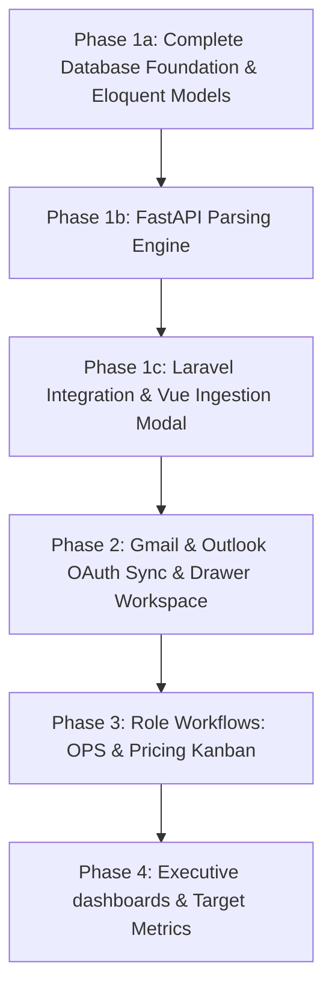
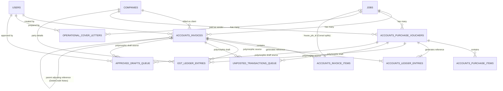
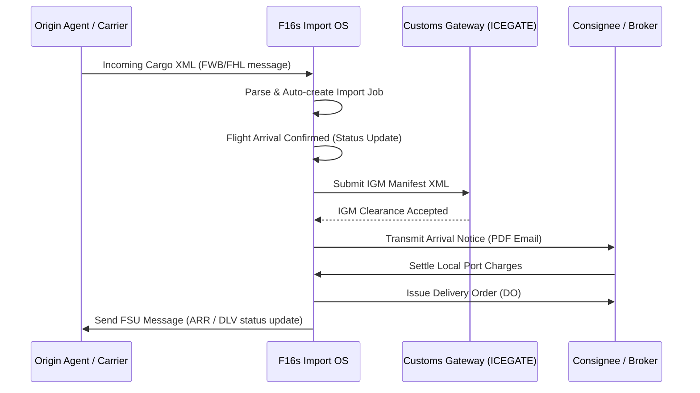
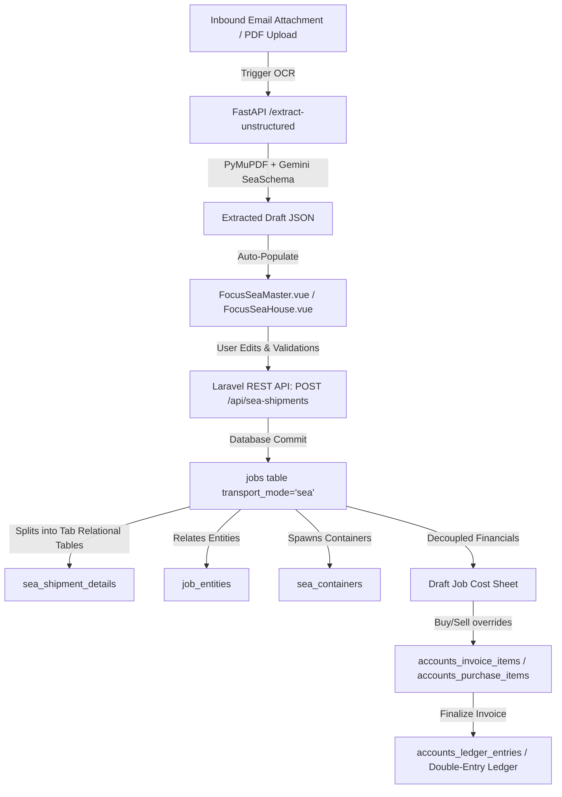
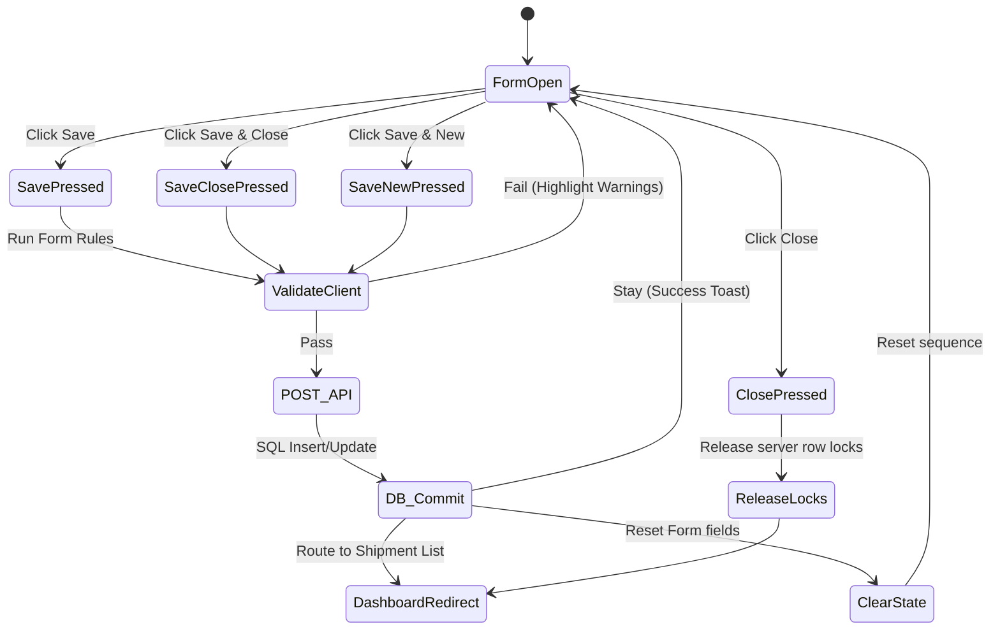

# 🚀 Implementation Blueprint: F16s Freight Operations OS

The step-by-step roadmap for upgrading the F16s platform into an **inbox-driven logistics operating system** — turning inbound customer email into triaged jobs, operational documents, and posted accounting entries with minimal manual re-keying.

## ⭐ At a Glance (Master Summary)

**What it is**
-   A multi-tenant SaaS for freight forwarders: each **company** (tenant) runs one or more **branches** (`agents_info`), with strict per-branch data isolation.
-   Three access **portals**, resolved by subdomain: `focusair.` (air), `focussea.` (sea), and `admin.` (platform superadmin).
-   Driven end-to-end from a unified **email inbox** → AI/OCR document extraction → Kanban operations → double-entry financials.

**The three build segments**
-   **Segment A — Core Operations OS (Phases 1–4):** multi-portal document workspace (Focus Air, Focus Sea), Gmail/Outlook inbox sync, Kanban workflows, role dashboards, and analytics.
-   **Segment B — Automated Financials & Reconciliation:** invoices/vouchers, GST, double-entry ledger, bank (Plaid/Setu) + IATA CASS reconciliation, and financial reports.
-   **Segment C — Future Expansion:** air/sea import documentation & customs transmission, and direct carrier/airline booking integrations.

**Technology stack**
-   **Backend:** Laravel (PHP-FPM) + Horizon queue workers, MySQL 8.0, Redis, Soketi (Pusher-compatible WebSockets).
-   **AI/OCR microservice:** Python **FastAPI** — PyMuPDF (`fitz`) for fast text extraction, local **Ollama / Gemma 4 E4B** for JSON mapping, **Gemini 2.5 Flash** cloud fallback for scanned/visual OCR, **ChromaDB** + `nomic-embed-text` for RAG.
-   **Frontend:** Vue.js (drawer-workspace SPA), `vuedraggable` Kanban, ApexCharts.
-   **Infra:** Docker Compose locally; dedicated AWS `t4g.large` (Graviton) instance for the AI/Ollama server inside a private VPC.

**Subscription tiers** (gated at DB, middleware, background-job, and frontend layers)
-   **`core`** — local coordinate-based PDF extraction only (`pdfplumber`); no AI, no email, no financials.
-   **`tactical`** — adds AI unstructured parsing + unified Gmail/Outlook sync + operational workflows + basic analytics.
-   **`command`** — adds accounting, bank/CASS reconciliation ledger, structured analytics, and Director/Boss dashboards.

**Data model** — 45 tables (see [`database_relations_tree.md`](file:///Users/jomygeorge/Desktop/f16sefreight/database_relations_tree.md)), grouped as:
-   **Tenancy & parties:** `companies`, `agents_info`, `users`, `customers` (debtors), `partners` (vendors/carriers), `ports`.
-   **Operations:** `jobs`, `air_/sea_shipment_details`, `air_/house_way_bills`, `sea_containers(_items)`, `job_entities`, `cargo_arrival_notices`, `manifest_filings`, `job_documents`.
-   **Inbox & AI:** `mailbox_connections`, `inbound_emails(_attachments)`, `email_threads`, `email_classification_rules`/`_overrides`, `pdf_processing_jobs`, `pdf_extraction_corrections`, `llm_usage_logs`, `ocr_credit_transactions`.
-   **Financials:** `accounts_invoices(_items/_brokerage/_consol)`, `accounts_purchase_vouchers(_items)`, `accounts_ledger_entries`, `gst_ledger_entries`, `chart_of_accounts`, `accounting_periods`, `bank_transactions`, `accounts_cass_statements`, `exchange_rates`, `rate_cards`, `financial_snapshots`, queues (`unposted_transactions_queue`, `approved_drafts_queue`, `operational_cover_letters`), `sequence_counters`, `sla_policies`, `audit_logs`, `support_tickets`.
-   **Platform:** `notifications` (bell / notification center — reassignment approvals, alerts).

**Core workflows**
-   **Triage:** inbound mail is classified (customer enquiry / airline / clearance / trucking); enquiries spawn `jobs` with a per-branch `enquiry_no`; the first staff responder is auto-assigned as operator (atomic claim, `409` on conflict).
-   **Extraction:** documents parsed to a draft JSON payload; low-confidence fields highlighted orange; corrections logged for accuracy auditing.
-   **Operations:** dual-view Kanban (Process columns + Staff clearance grid) with SLA color-coding and magnetic drag-and-drop. Pricing owns assignment and balances load via the **Operator Load Index (OLI)**; operators request handovers, pricing approves them via a **bell notification**.
-   **Cancellation & re-init:** a confirmed shipment that can't proceed is **soft-cancelled** with a required reason (kept analytically separate from `Lost` enquiries) and can be **re-initiated as a fresh job + re-quoted client email**, linked back via `reinitiated_from_job_id`.
-   **Financials:** finalized invoices/vouchers post balanced double-entry lines + GST splits; bank & CASS feeds auto-reconcile and post realized FX gain/loss.

**Delivery method**
-   Vertical-slice, **small incremental changes**, verifying and checking for errors at every step before moving on (see the phase roadmap and migration order checklist below).

> [!IMPORTANT]
> **Implementation Methodology (Small Increments & Testing):** to keep the platform stable, code changes for each phase/segment must be small and incremental. Verify and check for errors at each step before moving to the next.

## 📖 Table of Contents

-   [⚡ PDF Parsing Hybrid Engine Strategy](#pdf-parsing-hybrid-engine-strategy)
-   [🗺️ Core Operations OS Roadmap (Segment A)](#core-operations-os-roadmap-segment-a)
-   [🌲 Implementation Tree (Phase-by-Phase Component Roadmap)](#implementation-tree-phase-by-phase-component-roadmap)
-   [🗄️ Database Schema Design (Segment A)](#database-schema-design-segment-a)
    -   [Reused/Modified Existing Tables](#reusedmodified-existing-tables)
    -   [New Segment A Tables to Create](#new-segment-a-tables-to-create)
    -   [Database Views for Analytics](#database-views-for-analytics)
-   [🎖️ Subscription Tier Feature Gates](#subscription-tier-feature-gates)
    -   [Tier definitions:](#tier-definitions)
    -   [🎯 Tier Feature Matrix (Authoritative Gate Reference)](#tier-feature-matrix-authoritative-gate-reference)
    -   [Implementation Strategy:](#implementation-strategy)
-   [🌲 Segment A: Component & Function Breakdown](#segment-a-component-function-breakdown)
    -   [Phase 1: Document Processing, Database & AI Ingestion](#phase-1-document-processing-database-ai-ingestion)
    -   [Phase 2: Gmail & Outlook Account Integration](#phase-2-gmail-outlook-account-integration)
    -   [Phase 3: Operations & Pricing Workflows](#phase-3-operations-pricing-workflows)
    -   [Phase 4: Executive dashboards, Target Metrics & Sales AI](#phase-4-executive-dashboards-target-metrics-sales-ai)
-   [🎨 System Mockup: Toggled Drawer Workspace](#system-mockup-toggled-drawer-workspace)
-   [🛠️ Phase 1: Document Processing, Database & AI Ingestion](#phase-1-document-processing-database-ai-ingestion)
    -   [Phase 1a: Complete Database Foundation & Eloquent Models](#phase-1a-complete-database-foundation-eloquent-models)
    -   [Phase 1b: FastAPI Parsing Engine](#phase-1b-fastapi-parsing-engine)
    -   [Phase 1c: Laravel Integration & Vue Ingestion Modal](#phase-1c-laravel-integration-vue-ingestion-modal)
-   [📧 Phase 2: Unified Gmail & Outlook Sync](#phase-2-unified-gmail-outlook-sync)
    -   [2.1 Database & OAuth Schema](#21-database-oauth-schema)
    -   [2.2 Background Polling Service](#22-background-polling-service)
    -   [2.3 The Configurable Regex Classification Engine (Learning Feedback Loop)](#23-the-configurable-regex-classification-engine-learning-feedback-loop)
    -   [2.4 Global Sidebar & Gmail-Inspired Workspace UI](#24-global-sidebar-gmail-inspired-workspace-ui)
    -   [2.5 Quick Replies](#25-quick-replies)
    -   [2.5a Automated Client Messaging & Consent Engine (Permission-Based)](#25a-automated-client-messaging-consent-engine-permission-based)
    -   [2.6 Vue 2 Frontend Drawer Workspace & Split-Pane Column Hiding](#26-vue-2-frontend-drawer-workspace-split-pane-column-hiding)
-   [🗂️ Phase 3: Operations & Pricing Workflows](#phase-3-operations-pricing-workflows)
    -   [3.0 Job Lifecycle & Transition Flow](#30-job-lifecycle-transition-flow)
    -   [3.1 Kanban Board (OPS View)](#31-kanban-board-ops-view)
    -   [3.2 Pricing / Triage Dashboard](#32-pricing-triage-dashboard)
-   [📊 Phase 4: Executive Sales & Admin Dashboard](#phase-4-executive-sales-admin-dashboard)
    -   [4.1 Aggregations & Status Reporting (DSR/MSR/YSR)](#41-aggregations-status-reporting-dsrmsrysr)
    -   [4.2 Sales Dashboard & Static Insights](#42-sales-dashboard-static-insights)
    -   [4.3 Boss / Director Dashboard](#43-boss-director-dashboard)
    -   [4.4 Internal Docs RAG Help Guide (Interactive Copilot Tour Agent)](#44-internal-docs-rag-help-guide-interactive-copilot-tour-agent)
    -   [4.5 Superadmin Infrastructure Health Monitor & Debugging Console (Platform Level)](#45-superadmin-infrastructure-health-monitor-debugging-console-platform-level)
    -   [4.6 Visual Ticketing & Automated Client Notifications](#46-visual-ticketing-automated-client-notifications)
-   [💰 Segment B: Automated Financials & Statement Reconciliation](#segment-b-automated-financials-statement-reconciliation)
    -   [B.1 Accounts Database Schema & Isolation](#b1-accounts-database-schema-isolation)
    -   [B.2 Bank Statement Ingestion (Plaid / Setu APIs)](#b2-bank-statement-ingestion-plaid-setu-apis)
    -   [B.3 Automated Payment Reconciliation (Tallying Matching Engine)](#b3-automated-payment-reconciliation-tallying-matching-engine)
    -   [B.4 Future-Ready Analytical Infrastructure](#b4-future-ready-analytical-infrastructure)
    -   [B.5 Financial Reports Engine (P&L, Balance Sheet, Trial Balance)](#b5-financial-reports-engine-pl-balance-sheet-trial-balance)
    -   [B.6 Import DO & Airline Cost Auto-Calculation Rules](#b6-import-do-airline-cost-auto-calculation-rules)
    -   [B.7 Decoupled Job Cost Sheet Workflow (Operational vs Financial Data)](#b7-decoupled-job-cost-sheet-workflow-operational-vs-financial-data)
    -   [B.8 Logistics Invoicing, Reporting & Queue Specifications (Sea and Air)](#b8-logistics-invoicing-reporting-queue-specifications-sea-and-air)
-   [🔮 Segment C: Future Expansion Modules (Later Stage)](#segment-c-future-expansion-modules-later-stage)
    -   [C.1 Air Import Documentation & Transmission](#c1-air-import-documentation-transmission)
    -   [C.2 Direct Carrier & Airline Booking Integration](#c2-direct-carrier-airline-booking-integration)
-   [🌐 Multi-Portal Scope Segregation (Air vs Sea)](#multi-portal-scope-segregation-air-vs-sea)
    -   [1. Pre-Login Company Selection & Unified Authentication](#1-pre-login-company-selection-unified-authentication)
    -   [2. Database Partitioning (`transport_mode`)](#2-database-partitioning-transport_mode)
    -   [3. Contextual Drawer Workspace Forms](#3-contextual-drawer-workspace-forms)
-   [🌊 Focus Sea: Database Schema Definitions](#focus-sea-database-schema-definitions)
    -   [`sea_shipment_details` (Maritime Voyage & Cargo Metadata)](#sea_shipment_details-maritime-voyage-cargo-metadata)
    -   [`job_entities` (Operational Party Contacts)](#job_entities-operational-party-contacts)
    -   [`sea_containers` (ISO Container Grid)](#sea_containers-iso-container-grid)
    -   [`sea_container_items` (Container Stuffing — HBL Allocation)](#sea_container_items-container-stuffing-hbl-allocation)
    -   [`cargo_arrival_notices` (Pre-Arrival Notice Records) (New)](#cargo_arrival_notices-pre-arrival-notice-records-new)
    -   [`ports` (UN/LOCODE Reference Directory)](#ports-unlocode-reference-directory)
-   [🌊 Focus Sea: Export Form Sheet & Architectural Mapping](#focus-sea-export-form-sheet-architectural-mapping)
    -   [1. Architectural Data Flow Overview](#1-architectural-data-flow-overview)
    -   [2. Global Header Fields Architectural Mapping](#2-global-header-fields-architectural-mapping)
    -   [3. Tab-by-Tab Functional & Database Breakdown](#3-tab-by-tab-functional-database-breakdown)
    -   [4. Form Footer State Actions & Commit Workflows](#4-form-footer-state-actions-commit-workflows)
    -   [5. Detailed Seeder & Dropdown Options Specification](#5-detailed-seeder-dropdown-options-specification)
    -   [6. Field Validation & Character Limitations](#6-field-validation-character-limitations)
    -   [7. Cargo Type Conditional UI & Field Locking Logic](#7-cargo-type-conditional-ui-field-locking-logic)
    -   [8. Supplementary Field Locking Rules](#8-supplementary-field-locking-rules)
    -   [9. Header UI Utilities & Session Control](#9-header-ui-utilities-session-control)
    -   [10. Toolbar Utilities & Right-Side Shortcut Controls](#10-toolbar-utilities-right-side-shortcut-controls)
    -   [11. Comprehensive Data Field Matrix](#11-comprehensive-data-field-matrix)
    -   [12. HBL & MBL Data Mapping & Consolidation Workflow](#12-hbl-mbl-data-mapping-consolidation-workflow)
    -   [13. Focus Sea Consolidation Page Design (`FocusSeaConsol.vue`)](#13-focus-sea-consolidation-page-design-focusseaconsolvue)
-   [🌊 Focus Sea: Import Specifications](#focus-sea-import-specifications)
    -   [1. Form Specification: Sea Import Consol](#1-form-specification-sea-import-consol)
    -   [2. Form Specification: Delivery Order [Sea]](#2-form-specification-delivery-order-sea)
    -   [3. Form Specification: CGM Filing (Sea)](#3-form-specification-cgm-filing-sea)
-   [📊 Backend Analytical Tables & Business Intelligence Formulas](#backend-analytical-tables-business-intelligence-formulas)
    -   [1. New Analytical Tables (Backend Reporting Targets)](#1-new-analytical-tables-backend-reporting-targets)
    -   [2. Business Intelligence Formulas (Backend Metrics Engines)](#2-business-intelligence-formulas-backend-metrics-engines)
    -   [3. Business Intelligence Dashboards: Knowing the Business (Sales vs. Admin Roles)](#3-business-intelligence-dashboards-knowing-the-business-sales-vs-admin-roles)
-   [🗺️ Step-by-Step Implementation Roadmap](#step-by-step-implementation-roadmap)
-   [⚡ Speed & Efficiency Optimization Plan](#speed-efficiency-optimization-plan)
    -   [1. In-Memory PDF Processing (FastAPI)](#1-in-memory-pdf-processing-fastapi)
    -   [2. LLM Prompt Optimization & Caching (Gemma & Gemini)](#2-llm-prompt-optimization-caching-gemma-gemini)
    -   [3. Delta Email Syncing & Lazy-Loading Attachments](#3-delta-email-syncing-lazy-loading-attachments)
    -   [4. Database Indexing & Query Optimizations](#4-database-indexing-query-optimizations)
    -   [5. Eager Loading Optimization (N+1 Query Prevention)](#5-eager-loading-optimization-n1-query-prevention)
    -   [6. Database Partitioning for Large Log & Ledger Tables](#6-database-partitioning-for-large-log-ledger-tables)
    -   [7. Distributed Locks & Asynchronous Queue Workers](#7-distributed-locks-asynchronous-queue-workers)
-   [🔒 Security, Integrity & Infrastructure Strategies](#security-integrity-infrastructure-strategies)
    -   [1. Soft Deletes Policy](#1-soft-deletes-policy)
    -   [2. API Resilience & Gateway Error Handling](#2-api-resilience-gateway-error-handling)
    -   [3. Data Backup, Archival & Retention Strategy](#3-data-backup-archival-retention-strategy)
    -   [4. Invoice Sequence Generation per Billing Type](#4-invoice-sequence-generation-per-billing-type)
-   [📝 Technical Implementation Checklist](#technical-implementation-checklist)
-   [🏗️ Architectural Prerequisites & Decisions](#architectural-prerequisites-decisions)
-   [Existing Codebase Inventory](#existing-codebase-inventory)
-   [Phase 1a: Complete Database Foundation & Eloquent Models](#phase-1a-complete-database-foundation-eloquent-models)
-   [Phase 1b: FastAPI Parsing Engine (In-Memory Unstructured Extraction)](#phase-1b-fastapi-parsing-engine-in-memory-unstructured-extraction)
-   [Phase 1c: Laravel Integration & Vue Ingestion Modal](#phase-1c-laravel-integration-vue-ingestion-modal)
-   [Phase 2: Gmail & Outlook Account Inbound Ingestion](#phase-2-gmail-outlook-account-inbound-ingestion)
-   [Phase 3: Operations & Pricing Workflows & Kanban Board](#phase-3-operations-pricing-workflows-kanban-board)
-   [Phase 4: Multi-Portal Scoping & Air-Sea Segregation](#phase-4-multi-portal-scoping-air-sea-segregation)
-   [Phase 5: Dashboards, Target Metrics & Analytics](#phase-5-dashboards-target-metrics-analytics)
-   [Phase 6: Financial Ledgers & Reconciliation Engine](#phase-6-financial-ledgers-reconciliation-engine)
-   [🧪 Automated Testing Strategy](#automated-testing-strategy)
-   [Proposed Changes Summary](#proposed-changes-summary)
-   [Execution Priority Order (Migration Order Checklist)](#execution-priority-order-migration-order-checklist)
-   [⏳ Pending Modules](#pending-modules)

---

---

## ⚡ PDF Parsing Hybrid Engine Strategy

To maximize processing speed and server efficiency under concurrent loads, we implement a hybrid parsing layer:

-   **Unstructured Documents (Invoices/PLs):** Use **PyMuPDF (`fitz`)**. It is written in C and is **10x to 50x faster** than `pdfplumber`, extracting full text blocks in milliseconds to feed directly to the LLM.
-   **Structured Documents (AWBs):** Retain **`pdfplumber`** for [extract_awb_new.py](file:///Users/jomygeorge/.gemini/antigravity/scratch/f16s_main_ssh/python/extract_awb_new.py) to preserve the existing coordinate-based cell extraction logic.

---

## 🗺️ Core Operations OS Roadmap (Segment A)



---

## 🌲 Implementation Tree (Phase-by-Phase Component Roadmap)

This folder structure indicates exactly which backend/frontend components are introduced or modified in each phase.

```text
📦 F16s Freight OS Implementation Tree
 ┣ 📂 Phase 1: Document Processing Foundation (Core MVP)
 ┃ ┣ 📂 Infrastructure & Dockerization
 ┃ ┃ ┣ 🐋 docker-compose.yml: Local multi-container orchestration definition
 ┃ ┃ ┣ 🐳 Dockerfile.laravel: PHP-FPM / Nginx configuration for Web/Horizon
 ┃ ┃ ┗ 🐳 Dockerfile.fastapi: Python environment for FastAPI parsing engine
 ┃ ┣ 📂 Backend Updates
 ┃ ┃ ┣ 🐍 FastAPI: PyMuPDF integration & /extract-unstructured endpoint
 ┃ ┃ ┣ 🐍 FastAPI: Pydantic schemas (Invoice & Packing List definitions)
 ┃ ┃ ┣ 🐍 FastAPI: Local Ollama client setup (Gemma 4 E4B configuration & keep-alive in RAM)
 ┃ ┃ ┣ 🐍 FastAPI: Cloud Gemini 2.5 Flash API fallback for scanned documents/visual OCR
 ┃ ┃ ┣ 🐘 database/migrations: Reuse existing pdf_processing_jobs columns (document_type, extracted_data)
 ┃ ┃ ┗ 🐘 app/Jobs/ProcessPdfOcrJob.php: Hook up unstructured parser API dispatches
 ┃ ┗ 📂 Frontend Updates
 ┃   ┣ 🎨 OcrUploadModal.vue: Drag-and-drop file upload interface & low-confidence fields alert
 ┃   ┗ 🎨 FocusAir.vue / HouseWayBill.vue: Form pre-population triggers with orange highlights
 ┣ 📂 Phase 2: Gmail & Outlook Account Integration & Drawer Workspace
 ┃ ┣ 📂 Database Models
 ┃ ┃ ┗ 🐘 app/Models: mailbox_connections, inbound_emails, inbound_attachments
 ┃ ┣ 📂 Backend Services
 ┃ ┃ ┣ 🐘 app/Console/Commands: mailboxes:poll daemon (Google API & MS Graph integration)
 ┃ ┃ ┣ 🐘 app/Services: Airline exclusion filtering (domain blocklist & Regex checks)
 ┃ ┃ ┗ 🐘 app/Http/Controllers: OAuth account connect controllers & Token Lifecycle
 ┃ ┗ 📂 Frontend Views & Workspace Updates
 ┃   ┣ 🎨 MailboxSettings.vue: Account OAuth connection configurations
 ┃   ┣ 🎨 JobInbox.vue: Gmail-inspired 3-column layout (Queue list, thread feed, reply box)
 ┃   ┣ 🎨 JobInbox.vue: Slide-out Drawer Workspace with file Dropzone & Click-to-Upload
 ┃   ┣ 🎨 JobInbox.vue: Top-right Split-Window toggle button & Navigation Tabs
 ┃   ┣ 🎨 FocusAir.vue: Verification form & validation inputs (orange-warning highlights)
 ┃   ┣ 🎨 FocusAirImport.vue: Air Import verification, Arrival Notice & DO generation form
 ┃   ┗ 🎨 FocusAir.vue / HouseWayBill.vue: Form pre-population triggers
 ┣ 📂 Phase 3: Operations & Pricing Workflows
 ┃ ┣ 📂 Backend APIs
 ┃ ┃ ┣ 🐘 app/Http/Controllers: Job status transition and user assignment endpoints
 ┃ ┃ ┣ 🐘 app/Http/Controllers: Staff active load & completion duration API
 ┃ ┃ ┗ 🐘 app/Services: ClientNotificationService (Automated client messaging & permission gating)
 ┃ ┗ 📂 Frontend Views & Components
 ┃   ┣ 🎨 OpsDashboard.vue: Kanban Workflow Board (vuedraggable columns)
 ┃   ┣ 🎨 PricingDashboard.vue: Load tracker and task allocator interface
 ┃   ┣ 🎨 JobInbox.vue: Draft approval modal & staged notification composer
 ┃   ┗ 🎨 DashboardWidgets: Staff utilization graphs (apexcharts)
 ┗ 📂 Phase 4: Executive dashboards, Target Metrics & Copilot Chatbot
   ┣ 📂 Backend Analytics & AI Services
   ┃ ┣ 🐘 app/Http/Controllers/HelpGuideController.php: API endpoint for help queries
   ┃ ┣ 🐘 app/Http/Controllers/SupportTicketController.php: API endpoint for ticket CRUD, email notifications & Slack triggers
   ┃ ┣ 🐍 FastAPI: ChromaDB vector client storage & nomic-embed-text similarity search
   ┃ ┣ 🐍 FastAPI: Gemma 4 response translation & instruction step generator
   ┃ ┣ 🐘 database/migrations: DB views for DSR (Daily), MSR (Monthly), YSR (Yearly) reports
   ┃ ┣ 🐘 app/Console/Commands: Weekly sales opportunity analysis cron (Weekly AI)
   ┃ ┗ 🐘 app/Console/Commands: Weekly executive brief compiler (Weekly Admin AI)
   ┗ 📂 Frontend Dashboards & Copilot Help
     ┣ 🎨 HelpCopilotChatbox.vue: Interactive sidebar chatbot panel with Support Ticket creation flow
     ┣ 🎨 VisualReporter.vue: Visual issue reporting widget (captures clicked element path, route & screenshot)
     ┣ 🎨 HighlightTourDriver.js: Step-by-step element highlight manager (Driver.js)
     ┣ 🎨 SalesDashboard.vue: Customer metrics grid & on-demand AI customer summarizer
     ┣ 🎨 SalesDashboard.vue: Weekly AI Sales opportunity notifications feed
     ┣ 🎨 BossDashboard.vue: Branch comparative overview, Target settings, & Executive Brief widget
     ┗ 🎨 FocusSeaConsol.vue: Sea consolidation manager to group multiple HBLs under an MBL
```

> ℹ️ **Road Transport** (`FocusRoadWaybill.vue` / `TruckManifest.vue`) is deferred to a later phase and is not in scope for the current implementation.

## 🗄️ Database Schema Design (Segment A)

To minimize database bloat and leverage F16s' existing data structures, the system will reuse existing schemas where possible and create lightweight, isolated tables for mailbox integration and job tracking:

### Reused/Modified Existing Tables

1.  **`pdf_processing_jobs` (Existing Table):**
    -   _Usage:_ Stores OCR processing jobs and intermediate draft metadata.
    -   _Fields:_
        -   `extracted_data` (JSON): Caches the raw AI-extracted draft payload returned by the Gemini/FastAPI engine before validation.
        -   `document_type` (String): Tracks sub-types (`MAWB`, `HAWB`, `Invoice`, `Packing List`).
        -   `status` (String): Tracks the active AI parsing states (`pending`, `processing`, `completed`, `failed`).
2.  **`air_way_bills` & `house_way_bills` (Existing Tables):**
    -   _Usage:_ Stores the finalized, verified airway bill records.
    -   _Reused Fields:_ `status` (`draft` or `send`), `t_id`, `send_created`, `send_status`, and `agent_id` (representing the branch for tenant isolation).
    -   _New Columns to Add:_
        -   `uuid` (UUID, nullable, unique): Safe random identifier for public tracking and APIs.
        -   `job_id` (BigInteger, nullable, foreign key): References `jobs.id` to link the waybill back to its parent operational job.
3.  **`agents_info` & `companies` (Existing Tables):**
    -   _Usage:_ Tenant management, branch isolation, and customer alignment. All lists, metrics, and actions are filtered by `agent_id` and `company_id`.
    -   _New Columns to Add to `companies` (Strictly SaaS Tenant Settings):_
        -   `tier` (String, default: `'core'`): Controls feature access levels (`core`, `tactical`, or `command`).
        -   `email_domain` (String, Nullable): The authorized corporate email domains (e.g. comma-separated list like `'xyzcompany.com, xyzcompany.co.in'`) used to restrict and validate OAuth mailbox connections for Tactical and Command tiers.
        -   `ocr_credits_balance` (Integer, default: 0): Stores current vision OCR credits balance.
        -   `ocr_credits_monthly_allowance` (Integer, default: 0): Monthly allowance quota.
        -   `ocr_credits_limit` (Integer, default: 0): Overdraft ceiling threshold.

3a. **`customers` (New Table):**
    -   _Usage:_ Stores client debtors (shippers, consignees, notify parties) owned by a platform tenant.
    -   _Key Columns:_
        -   `company_id` (BigInteger, FK referencing `companies.id`): Tenant owning this customer.
        -   `name` (String, max 100): Customer company name.
        -   `email` (String, max 100): Contact email.
        -   `gst_no` (String, max 30): GST number.
        -   `pan_no` (String, max 20): PAN number.
        -   `bank_account_no` (String, Encrypted): Bank account.
        -   `bank_ifsc_code` (String, Encrypted): IFSC code.
        -   `credit_limit` (Decimal(15,2), default: 0.00): Credit limit enforced at backend for DO releases and finalizations.
        -   `payment_terms_days` (Integer, default: 30): Term days.

3b. **`partners` (New Table):**
    -   _Usage:_ Stores operational partners, carriers, airlines, custom brokers, transporters, and other vendors.
    -   _Key Columns:_
        -   `company_id` (BigInteger, FK referencing `companies.id`): Tenant owning this partner.
        -   `name` (String, max 100): Partner name.
        -   `partner_type` (String): e.g., 'airline', 'shipping_line', 'co-loader', 'transporter', 'customs_broker', 'agent', 'broker', 'vendor'.
        -   `bank_account_no` (String, Encrypted): Bank account.
        -   `bank_ifsc_code` (String, Encrypted): IFSC code.

4.  **`airlines` (Existing Table):**
    -   _Usage:_ Used by the exclusion engine to block standard system/airline notice emails. Carrier records for accounting and operational integrations reside in the new `partners` table.
5.  **`users` (Existing Table):**
    -   _Usage:_ Stores operational user accounts, roles, and profiles.
    -   _New Columns to Add:_
        -   `origin_port_id` (BigInteger, Nullable, FK referencing `ports.id`): Stores the user's designated default origin port (airport or seaport).
        -   `pima_address` (String, max 20, Nullable): Printer / Messaging Routing Address for SITA/IATA Type B messaging (e.g. `'MAAF16S'`). Configurable by administrative backend when editing user profiles.

### New Segment A Tables to Create

All core tables (operational, side-details, and financial chart tables) are migrated early during **Phase 1a** to ensure database schema integrity from the start.

1.  **`mailbox_connections`**:
    -   _Purpose:_ Manages connected mailboxes (Gmail/Outlook) and their OAuth token state.
    -   _Columns:_
        -   `id` (BigInteger, PK, Auto-increment)
        -   `user_id` (BigInteger, FK referencing `users.id`): Connects a mailbox connection to a specific operator/user.
        -   `provider` (String): Indicates the email provider (`gmail`, `outlook`).
        -   `email_address` (String, Unique): The synced email address.
        -   `access_token` (Text): OAuth access token (encrypted at rest).
        -   `refresh_token` (Text): Refresh token to fetch new access tokens (encrypted at rest).
        -   `expires_at` (Timestamp, Nullable): Expiration time of the current access token.
        -   `is_active` (Boolean, default: true): Active status flag (gating tier downgrades).
        -   `created_at`, `updated_at` (Timestamps)
2.  **`inbound_emails`**:
    -   _Purpose:_ Local database cache for messages pulled from mail servers, forming the basis of the inbox thread reader.
    -   _Columns:_
        -   `id` (BigInteger, PK, Auto-increment)
        -   `agent_id` (BigInteger, FK referencing `agents_info.id`): Branch-level isolation.
        -   `mailbox_connection_id` (BigInteger, FK referencing `mailbox_connections.id` on delete cascade)
        -   `message_id` (String, Unique): Unique provider message identifier.
        -   `thread_key` (String, Index): Unique hash matching back-and-forth messages in the same conversation thread.
        -   `from` (String): Sender address.
        -   `to` (String): Recipient address.
        -   `subject` (String, Nullable): Email subject.
        -   `body_text` (LongText, Nullable): Plain text email content.
        -   `body_html` (LongText, Nullable): Rich HTML email content (sanitized server-side using HTMLPurifier before storage to prevent stored XSS).
        -   `received_at` (Timestamp): Timestamp when the email was received.
        -   `created_at`, `updated_at` (Timestamps)
3.  **`email_threads`** (New):
    -   _Purpose:_ Cache and group incoming/outgoing message feeds contextually. Rather than running slow subqueries or `GROUP BY` aggregates on million-row `inbound_emails` tables, operational dashboards query this table for rapid inbox timelines.
    -   _Columns:_
        -   `id` (BigInteger, PK, Auto-increment)
        -   `agent_id` (BigInteger, FK referencing `agents_info.id`): Branch-level isolation.
        -   `thread_key` (String, Unique, Index): Matches messages grouped in the same conversational thread.
        -   `subject` (String, Nullable)
        -   `latest_message_received_at` (Timestamp, Index): Chronological sorting.
        -   `participant_emails` (JSON): Inbound/outbound addresses.
        -   `status` (Enum: `'unread'`, `'read'`, `'replied'`, `'archived'`, default: `'unread'`)
        -   `assigned_operator_id` (BigInteger, Nullable, FK referencing `users.id`): Syncs operator queue assignment.
        -   `job_id` (BigInteger, Nullable, FK referencing `jobs.id` on delete set null): Operational link.
        -   `first_reply_at` (Timestamp, Nullable): Tracks the timestamp of the first outbound email reply sent by staff (immutable once set; protected from updates).
        -   `first_triage_at` (Timestamp, Nullable): Tracks the timestamp when the email thread was first triaged (assigned an enquiry number) (immutable once set; protected from updates).
            -   _Re-Triage Flow:_ when a triage decision was wrong (e.g. an email notice mis-triaged as a job), a senior operator can invoke a re-triage action, which:
                -   Nullifies `email_threads.job_id`.
                -   Sets the incorrect `jobs` row to `status = 'Lost'` (`lost_reason = 'other'`, `lost_reason_custom = 'Incorrectly triaged via operator override'`).
                -   Does **not** recycle the consumed `enquiry_no` — sequence gaps are acceptable.
                -   Sets `email_threads.status = 'archived'` (or the correct reclassified status).
                -   Preserves the original `first_triage_at` as an immutable audit record of the mistake.
        -   `created_at`, `updated_at` (Timestamps)
    -   _Indexes:_ Composite index on `(agent_id, status, latest_message_received_at)` to load scoped operator folders in milliseconds.
4.  **`inbound_attachments`**:
    -   _Purpose:_ Indexes all attachment files linked to inbound emails.
    -   _Columns:_
        -   `id` (BigInteger, PK, Auto-increment)
        -   `inbound_email_id` (BigInteger, FK referencing `inbound_emails.id` on delete cascade)
        -   `filename` (String): Original name of the attachment file.
        -   `file_path` (String): Storage path on disk (e.g. `attachments/file-uuid.pdf`).
        -   `mime_type` (String): The file's MIME type (e.g. `application/pdf`, `image/png`) to filter parseable formats.
        -   `file_size` (Integer): File size in bytes.
        -   `created_at`, `updated_at` (Timestamps)
5.  **`jobs`**:

    -   _Purpose:_ Represents the operational job folder created when an email inquiry or file is triaged for execution, tracking the lifecycle from initial enquiry to final shipment execution.
    -   _Columns:_
        -   `id` (BigInteger, PK, Auto-increment): Unique internal identifier.
        -   `agent_id` (BigInteger, FK referencing `agents_info.id`): Branch-level tenant isolation key. All queries are scoped by this.
        -   `transport_mode` (Enum: `'air'`, `'sea'`): Mode of logistics. Used for query scoping and sequence partitioning.
        -   `direction` (Enum: `'export'`, `'import'`, default: `'export'`): Shipment direction.
        -   `enquiry_no` (String): Auto-generated unique enquiry number assigned at intake, scoped unique per agent branch.
            -   _Air Sequence:_ `ENQA-{agent_code}-26-0001` (Incremented separately from Sea)
            -   _Sea Sequence:_ `ENQS-{agent_code}-26-0001` (Incremented separately from Air)
        -   `execution_job_no` (String, Nullable): Auto-generated unique execution job number assigned only when the shipment is confirmed/executed, scoped unique per agent branch.
            -   _Air Sequence:_ `JOBA-{agent_code}-26-0001` (Incremented separately from Sea)
            -   _Sea Sequence:_ `JOBS-{agent_code}-26-0001` (Incremented separately from Air)
        -   `job_order_no` (String, Nullable): Client-side reference job order number, unique per agent branch.
        -   `quotation_no` (String, Nullable): Reference to the quotation draft payload.
        -   `awb_number` (String, Nullable): Reference to the assigned Air Waybill (for Air) or Bill of Lading (for Sea) identifier.
        -   `client_id` (BigInteger, Nullable, FK referencing `customers.id`): Canonical billing debtor for this job.
        -   `operator_id` (BigInteger, Nullable, FK referencing `users.id` on delete set null): The live user (operator) assigned to manage the job. Assigned by the pricing owner (enforced at the DB level via a trigger ensuring the user holds an operator/execution role).
        -   `pending_operator_id` (BigInteger, Nullable, FK referencing `users.id`): A staged reassignment awaiting pricing-owner approval; `operator_id` stays live until the change is accepted.
        -   `pending_operator_requested_by` (BigInteger, Nullable, FK referencing `users.id`): The operator who requested the handover.
        -   `pending_operator_requested_at` (Timestamp, Nullable): When the reassignment was requested.
        -   `job_owner_id` (BigInteger, Nullable, FK referencing `users.id`): Pricing owner — holds **assignment authority** and the OLI load-balancing view (enforced at the DB level via a trigger ensuring the user holds a pricing role).
        -   `doc_user_id` (BigInteger, Nullable, FK referencing `users.id`): Document validation owner.
        -   `planned_clearance_date` (Date, Nullable): Targeted date for customs clearance.
        -   `completed_at` (Timestamp, Nullable): Date/time when the job reached `Completed` status.
        -   `parent_job_id` (BigInteger, Nullable, FK referencing `jobs.id`, self-referencing): Links House shipments to Master parent.
        -   `reinitiated_from_job_id` (BigInteger, Nullable, FK referencing `jobs.id`, self-referencing): Re-init lineage — a fresh job points back to the cancelled/lost job it superseded, so the boss can trace the chain.
        -   `is_sub_shipment` (Boolean, default: false): Indicates child House record under consolidation.
        -   `is_consolidation` (Boolean, default: false): Indicates parent Master record accepting child Houses.
        -   `status` (String): Tracks the active operational stage (e.g. `Intake`, `AI Extraction`, `Verification`, `Generation`, `PDF Generated`, `Sent to Airline`, `Airline Confirmed`, `Completed`, `Lost`, `Cancelled`). Automated client messaging drafts are generated during specific status transitions (acknowledgement of Intake, AI Extraction, and Sent to Airline), each requiring explicit operator permission before transmission.
        -   `lost_reason` (Enum: `'rates_high'`, `'delay_in_response'`, `'client_cancelled'`, `'capacity_issue'`, `'other'`, Nullable): Reason a **pre-conversion enquiry** was lost (never converted). Kept analytically separate from cancellation.
        -   `lost_reason_custom` (String, max 255, Nullable): Custom reason details when `lost_reason` is set to `'other'`.
        -   `lost_at` (Timestamp, Nullable): Timestamp when the job was marked as lost.
        -   `cancellation_reason` (Enum: `'customs_hold_unresolved'`, `'client_cancelled'`, `'cargo_not_ready'`, `'documentation_incomplete'`, `'payment_or_credit_hold'`, `'carrier_space_lost'`, `'cargo_damaged'`, `'prohibited_regulatory'`, `'rate_expired_requote'`, `'duplicate'`, `'other'`, Nullable): Reason a **post-conversion shipment** was aborted (e.g. not clearing customs). Distinct from `lost_reason` to keep conversion-funnel analytics clean.
        -   `cancellation_reason_custom` (String, max 255, Nullable): Free text when `cancellation_reason = 'other'`.
        -   `cancelled_at` (Timestamp, Nullable): When the job was cancelled.
        -   `cancelled_by` (BigInteger, Nullable, FK referencing `users.id`): Operator/manager who cancelled.
        -   `created_at`, `updated_at`, `deleted_at` (Timestamps) — Uses Laravel `SoftDeletes`. **Cancellation is a soft status transition, never a hard delete** — cancelled rows persist for boss tracking + audit.
    -   _Note:_ Mode-specific voyage/flight data columns (e.g. `vessel_name`, `flight_number`) are split into mode-specific details tables (`sea_shipment_details` and `air_shipment_details`), while global classification fields (e.g. `cargo_type`, `delivery_mode`, `consol_type`) live directly in the `jobs` table.

6.  **`sea_shipment_details`** (New):

    -   _Purpose:_ Holds maritime-specific voyage and container details associated with a Job.
    -   _Definition:_ See the full, canonical 40+ column definition including port codes as `CHAR(5)` in Section 13.A: **`sea_shipment_details` (Maritime Voyage & Cargo Metadata)**. Global classification fields (`cargo_type`, `delivery_mode`, `consol_type`) and addresses (`pickup_address`, `delivery_address`) reside directly in the `jobs` table to prevent duplication.

7.  **`air_shipment_details`** (New):

    -   _Purpose:_ Holds flight and air cargo details associated with a Job.
    -   _Columns:_
        -   `id` (BigInteger, PK, Auto-increment)
        -   `job_id` (BigInteger, FK referencing `jobs.id` on delete cascade, Unique)
        -   `flight_number` (String, max 20, Nullable)
        -   `flight_date` (Timestamp, Nullable)
        -   `carrier_name` (String, max 100, Nullable)
        -   `pol_code` (String, max 6, Nullable)
        -   `pod_code` (String, max 6, Nullable)
        -   `do_given_to` (String, max 100, Nullable)
        -   `pickup_address` (String, max 500, Nullable)
        -   `delivery_address` (String, max 500, Nullable)
        -   `piece_count` (Integer, default: 0)
        -   `gross_weight` (Decimal(10,3), default: 0.000)
        -   `chargeable_weight` (Decimal(10,3), default: 0.000)
        -   `volume_cbm` (Decimal(8,3), default: 0.000)
        -   `created_at`, `updated_at` (Timestamps)

8.  **`llm_usage_logs`** (New):
    -   _Purpose:_ Records local (Gemma) and cloud (Gemini) LLM request token counts, execution latency, and cost auditing details.
    -   _Columns:_
        -   `id` (BigInteger, PK, Auto-increment)
        -   `job_id` (BigInteger, FK referencing `jobs.id` on delete set null, Nullable)
        -   `model` (String, max 50)
        -   `tokens_in` (Integer, default: 0)
        -   `tokens_out` (Integer, default: 0)
        -   `cost_usd` (Decimal(8,6), default: 0.000000)
        -   `execution_ms` (Integer, default: 0)
        -   `created_at`, `updated_at` (Timestamps)
9.  **`chart_of_accounts`** (New):
    -   _Purpose:_ Master table defining the chart of accounts for double-entry bookkeeping. All `account_code` references in `accounts_ledger_entries` are validated against this table.
    -   _Columns:_
        -   `id` (BigInteger, PK, Auto-increment)
        -   `agent_id` (BigInteger, FK referencing `agents_info.id`): Branch-level tenant isolation.
        -   `account_code` (String, max 30, Unique per agent): e.g., `'1200-AR'`, `'4000-Freight-Revenue'`.
        -   `account_name` (String, max 100): Human-readable name (e.g., `'Accounts Receivable'`).
        -   `account_type` (Enum: `'asset'`, `'liability'`, `'equity'`, `'revenue'`, `'expense'`): Classification for financial report grouping.
        -   `parent_account_id` (BigInteger, Nullable, FK referencing `chart_of_accounts.id`): Self-referencing for hierarchical grouping (e.g., `4000-Freight-Revenue` under `4000-Revenue`).
        -   `is_system_account` (Boolean, default: false): Locks system-critical accounts from deletion.
        -   `is_active` (Boolean, default: true): Soft deactivation toggle.
        -   `created_at`, `updated_at` (Timestamps)
10. **`accounting_periods`** (New):
    -   _Purpose:_ Controls fiscal period open/close status for ledger posting validation. Prevents postings into closed months.
    -   _Columns:_
        -   `id` (BigInteger, PK, Auto-increment)
        -   `agent_id` (BigInteger, FK referencing `agents_info.id`)
        -   `period_name` (String, max 30): e.g., `'June 2026'`, `'Q2 2026'`.
        -   `start_date` (Date): Period start.
        -   `end_date` (Date): Period end.
        -   `status` (Enum: `'open'`, `'closed'`, `'locked'`): Controls whether new ledger entries can be posted.
        -   `closed_by` (BigInteger, Nullable, FK referencing `users.id`): User who closed the period.
        -   `closed_at` (Timestamp, Nullable)
        -   `created_at`, `updated_at` (Timestamps)
11. **`audit_logs`** (New):
    -   _Purpose:_ Immutable activity trail for compliance tracking (enforced append-only via a database-level `BEFORE UPDATE OR DELETE` trigger that halts operations). Records all create/update/delete operations on business-critical models.
    -   _Columns:_
        -   `id` (BigInteger, PK, Auto-increment)
        -   `agent_id` (BigInteger, FK referencing `agents_info.id`)
        -   `auditable_type` (String): Laravel morph class name (e.g., `'App\Models\Invoice'`, `'App\Models\Job'`).
        -   `auditable_id` (BigInteger): Record ID of the changed entity.
        -   `event` (Enum: `'created'`, `'updated'`, `'deleted'`, `'restored'`)
        -   `old_values` (JSON, Nullable): Snapshot of fields before the change.
        -   `new_values` (JSON, Nullable): Snapshot of fields after the change.
        -   `user_id` (BigInteger, Nullable, FK referencing `users.id`): Actor who triggered the change.
        -   `ip_address` (String, max 45, Nullable)
        -   `user_agent` (String, max 255, Nullable)
        -   `created_at` (Timestamp)
12. **`job_documents`** (E-Docket Attachments) (New):
    -   _Purpose:_ Central document management repository for all physical shipping documents attached to a job (replaces ad-hoc references to `e_docket_attachments`).
    -   _Columns:_
        -   `id` (BigInteger, PK, Auto-increment)
        -   `agent_id` (BigInteger, FK referencing `agents_info.id`)
        -   `job_id` (BigInteger, FK referencing `jobs.id` on delete cascade)
        -   `document_type` (Enum: `'commercial_invoice'`, `'packing_list'`, `'certificate_of_origin'`, `'awb_copy'`, `'hawb_copy'`, `'bl_copy'`, `'delivery_order'`, `'customs_declaration'`, `'igm_manifest'`, `'arrival_notice'`, `'cover_letter'`, `'other'`)
        -   `file_name` (String, max 255): Original uploaded filename.
        -   `file_path` (String, max 500): Storage path on disk or S3.
        -   `mime_type` (String, max 50): e.g., `'application/pdf'`, `'image/png'`.
        -   `file_size` (Integer): Size in bytes.
        -   `uploaded_by` (BigInteger, FK referencing `users.id`)
        -   `created_at`, `updated_at` (Timestamps)
13. **`manifest_filings`** (Customs Manifest Submission Trackers) (New):
    -   _Purpose:_ Central directory for recording digital manifest submissions (CGM/SCMTR) filed to ICEGATE. Shared across Air and Sea.
    -   _Columns:_
        -   `id` (BigInteger, PK, Auto-increment)
        -   `agent_id` (BigInteger, FK referencing `agents_info.id`): Branch-level isolation.
        -   `job_id` (BigInteger, FK referencing `jobs.id` on delete cascade): Master operational Consol job card link.
        -   `transport_mode` (Enum: `'air'`, `'sea'`)
        -   `filing_type` (Enum: `'CGM'`, `'SCMTR'`)
        -   `transaction_status` (Enum: `'pending'`, `'submitted'`, `'received'`, `'accepted'`, `'rejected'`, default: `'pending'`)
        -   `customs_house_code` (String, max 6): Port location code (e.g. `'INMAA4'`, `'INMAA1'`).
        -   `icegate_id` (String, max 30): Active corporate ICEGATE ID profile selected.
        -   `amendment_no` (Integer, default: 0): Sequence tracker for rejected or modified files.
        -   `sending_method` (Enum: `'auto'`, `'manual'`, `'email'`, default: `'manual'`)
        -   `flat_file_path` (String, max 500, Nullable): Saved XML/flat text file S3 path.
        -   `status_log` (Text, Nullable): Read-only log output from ICEGATE.
        -   `submitted_by` (BigInteger, FK referencing `users.id`)
        -   `submitted_at` (Timestamp, Nullable)
        -   `created_at`, `updated_at` (Timestamps)
14. **`rate_cards`** (New):
    -   _Purpose:_ Stores contract tariff rates per customer or partner to auto-calculate local and freight costs.
    -   _Columns:_
        -   `id` (BigInteger, PK, Auto-increment)
        -   `agent_id` (BigInteger, FK referencing `agents_info.id`): Branch-level isolation.
        -   `party_type` (String, max 20) — `'customer'`, `'partner'`.
        -   `party_id` (BigInteger) — Polymorphic ID referencing customers.id or partners.id.
        -   `charge_type` (String, max 50) — e.g. `'delivery_order_fee'`, `'air_freight'`.
        -   `origin_port_id` (BigInteger, FK referencing `ports.id`, Nullable)
        -   `destination_port_id` (BigInteger, FK referencing `ports.id`, Nullable)
        -   `cargo_type` (String, max 20, Nullable)
        -   `weight_break_from` (Decimal(10,2))
        -   `weight_break_to` (Decimal(10,2))
        -   `rate` (Decimal(15,2))
        -   `currency` (String, 3 chars)
        -   `valid_from` (Date), `valid_to` (Date)
        -   `created_at`, `updated_at` (Timestamps)
15. **`exchange_rates`** (New):
    -   _Purpose:_ Daily currency exchange rates cache reference table to calculate realized FX gain/loss.
    -   _Columns:_
        -   `id` (BigInteger, PK, Auto-increment)
        -   `from_currency` (String, 3 chars)
        -   `to_currency` (String, 3 chars)
        -   `rate_date` (Date)
        -   `rate` (Decimal(12,6))
        -   `created_at`, `updated_at` (Timestamps)
16. **`sla_policies`** (New):
    -   _Purpose:_ Configuration table storing target SLA response timelines per subscription tier.
    -   _Columns:_
        -   `id` (BigInteger, PK, Auto-increment)
        -   `company_id` (BigInteger, FK referencing `companies.id`): Platform tenant settings link.
        -   `tier` (String, max 30)
        -   `max_reply_time_minutes` (Integer, default: 15)
        -   `created_at`, `updated_at` (Timestamps)
17. **`notifications`** (New):
    -   _Purpose:_ Laravel `DatabaseNotification`-compatible store powering the **bell / notification center** (reassignment-approval requests, assignment changes, credit alerts). Pushed live via Soketi.
    -   _Columns:_
        -   `id` (UUID / CHAR(36), PK)
        -   `agent_id` (BigInteger, FK referencing `agents_info.id`): Branch-level isolation.
        -   `type` (String, max 255): Notification class (e.g. `App\Notifications\ReassignmentRequested`).
        -   `notifiable_type` (String, max 100) / `notifiable_id` (BigInteger): Polymorphic recipient morph (usually `App\User` → `users.id`).
        -   `data` (JSON): Payload (`job_id`, `from_operator_id`, `to_operator_id`, `requested_by`, …).
        -   `priority` (SmallInteger, default `0`): Bell **sort weight**. Reassignment-approval (acceptance) requests are written with an elevated priority (e.g. `100`) so they **pin to the top** of the bell above ordinary chronological alerts. The bell renders `ORDER BY priority DESC, created_at DESC`.
        -   `read_at` (Timestamp, Nullable): Null = unread; drives the bell badge.
        -   `created_at`, `updated_at` (Timestamps)
    -   _Auto-dissolution:_ A reassignment-approval notification is **hard-deleted** (not just marked read) the moment its underlying request is withdrawn or resolved — i.e. when the requesting operator reverts `pending_operator_id` back to himself, or pricing accepts/rejects it. The row is matched by `type = ReassignmentRequested` and `data.job_id`, so a withdrawn handover **disappears automatically** from the pricing owner's bell with no manual dismissal.

### Database Views for Analytics

1.  **`dsr_funnel_view`** (Daily), **`msr_funnel_view`** (Monthly), and **`ysr_funnel_view`** (Yearly):
    -   _Purpose:_ Materialized or database views that compile aggregate funnel stats.
    -   _Metrics compiled:_ `Jobs Raised`, `Jobs Replied`, `Pending / Delayed` SLA counts, `Jobs Converted`, and `Conversion Rate %`.

---

## 🎖️ Subscription Tier Feature Gates

To monetize the platform and segregate capabilities based on the customer's selected tier, features will be restricted at the Database, Middleware, Background Job, and Frontend layers.

### Tier definitions:

-   **Tier 1 (`core`):** Access to local coordinate-based PDF extraction (`pdfplumber` templates). No AI parsing, no email integrations, and no automated financials.
-   **Tier 2 (`tactical`):** Access to AI-powered unstructured parsing (Gemini/PyMuPDF) via the upload button + Unified Gmail/Outlook email sync, automated operational workflows, and **branch-level** analytics (aggregate performance of the whole branch — no per-client attribution, no money).
-   **Tier 3 (`command`):** All Tier 2 features + **client-level** intelligence (per-client performance, movement, outstanding, credit, collections) + accounts tracking, bank/CASS reconciliation ledger, structured analytical data, and Director/Boss dashboards.

### 🎯 Tier Feature Matrix (Authoritative Gate Reference)

This matrix is the **single source of truth** for what each tier unlocks. The `CheckCompanyTier` middleware and the Vue route guards implement against this table; keep inline gating comments in sync with it.

| Capability | `core` | `tactical` | `command` |
|---|:---:|:---:|:---:|
| Coordinate-based PDF extraction (`pdfplumber` templates) | ✅ | ✅ | ✅ |
| AI unstructured parsing (PyMuPDF + Gemma) & vision OCR (Gemini) | ❌ | ✅ | ✅ |
| Unified Gmail/Outlook inbox sync & triage | ❌ | ✅ | ✅ |
| Operational workflows (jobs, Kanban, assignment, OLI) | ❌ | ✅ | ✅ |
| Cancellation / re-initiation & audit trail | ❌ | ✅ | ✅ |
| **Sales view — branch performance** (wins/losses, shipment counts, country/lane movement from AWB, per-staff job load) | ❌ | ✅ | ✅ |
| **Sales view — client book** (per-client performance & movement, scoped by `sales_rep_id = me`) | ❌ | ❌ | ✅ |
| **Outstanding receivables, credit exposure & collections** | ❌ | ❌ | ✅ |
| Automated financials (invoices, vouchers, GST, double-entry ledger) | ❌ | ❌ | ✅ |
| Bank (Plaid/Setu) & IATA CASS reconciliation | ❌ | ❌ | ✅ |
| Director / Boss executive dashboards | ❌ | ❌ | ✅ |
| Structured analytical data & exports | ❌ | Basic | ✅ Full |

> **The drastic line (what drives the upgrade):** Tactical answers *"how is my branch doing?"* — aggregate wins, losses, volume, and where cargo is moving. **Command answers *"how is each of MY clients doing, and who owes me money?"*** — the per-client performance, movement, outstanding balances, and credit exposure that let a sales rep actually manage and grow (and collect on) their book of business. You cannot see a single client's revenue, margin, or outstanding balance until Command.

### Implementation Strategy:

1.  **Database Migration & Configuration:**
    -   Add a `tier` column (String, default: `core`), `email_domain` column (String, Nullable), and `ocr_credits_limit` column (INT, default: `0`) to the `companies` table.
    -   In the F16s Admin Portal, provide administrative options during company creation and editing to select the subscription tier and register the corporate email domain.
    -   **Administrative Override of OCR Credit Settings (Platform Level):**
        -   The F16s Platform Admin Portal (`admin.f16sefreight.com`) provides controls to customize and override the defaults for each client company individually at any time:
            * **Customize Monthly Allowance:** Administrators can override the default tier allowance to assign custom monthly quotas (e.g., increase a Tactical client from 500 to 800 monthly credits) stored in `companies.ocr_credits_monthly_allowance`.
            * **Customize Overdraft Limit:** Administrators can increase or decrease the negative limit per client based on creditworthiness (e.g., set `companies.ocr_credits_limit` to `-500` or keep it at `0`) to allow a soft overdraft ceiling before background parsing tasks fail.
            * **Add One-Off Credits:** Administrators can manually load additional pre-paid credits or deduct credits directly from `companies.ocr_credits_balance` (e.g., for manual top-up purchases).
            * **Transaction Auditing:** All manual administrative changes require entering a reason (e.g., `"Tier custom upgrade"`, `"Manual top-up purchase"`), which is logged to the `ocr_credit_transactions` table with `transaction_type = 'custom_override'` for full audit traceability.
2.  **Laravel Route Middleware (`CheckCompanyTier`):**
    -   Protects APIs from unauthorized cross-tier calls. Registered in `app/Http/Kernel.php` as `'tier'`.
    -   _Examples:_
        -   `Route::group(['middleware' => 'tier:tactical,command'], ...)` handles mailbox sync and AI extraction endpoints.
        -   `Route::group(['middleware' => 'tier:command'], ...)` handles Plaid reconciliation and accounts ledger endpoints.
3.  **Background Job Sync Filtering:**
    -   The `mailboxes:poll` daemon only queries refresh tokens and pulls new emails for connections whose company is flagged as `tactical` or `command`.
4.  **OCR Processing Branching (`ProcessPdfOcrJob.php`):**
    -   **MIME guard:** strict server-side MIME sniffing via PHP `finfo_file` (not extension checks) — rejects HTML, SVG, and other unsupported formats before any processing.
    -   **Tier routing:**
        -   `core` → template-based `pdfplumber` cell-coordinate extraction only.
        -   `tactical` / `command` → local Gemma 4 parsing engine unlocked.
    -   **Visual OCR credit gate** (scanned docs/images dispatched to Gemini 2.5 Flash), executed inside a DB transaction with a row-level write lock (`SELECT ... FOR UPDATE` on the `companies` row) to prevent race conditions on concurrent uploads by the same tenant:
        -   If `ocr_credits_balance > ocr_credits_limit` (overdraft threshold) → proceed, decrement balance by 1, commit, and log to `ocr_credit_transactions`.
        -   If balance ≤ limit → commit, halt the job, set status `failed` (reason `Credits Exhausted`), and push a WebSocket recharge alert.
5.  **Frontend State & UI Teasers:**
    -   The user object returned on login (`currentUser`) includes `user.company.tier`.
    -   The Vue routing system blocks the `/inbox` (Unified Sync) and `/accounts` (Reconciliation) pages for disallowed tiers, rendering high-conversion "Upgrade Required" teaser panels instead. Blocked pages display a blurred lock overlay containing a "Request Upgrade" button. Clicking this triggers a support request to the account administrator/sales.

---

## 🌲 Segment A: Component & Function Breakdown

Below is the functional specification for each database schema, backend service, and frontend view introduced in Segment A.

### Phase 1: Document Processing, Database & AI Ingestion

#### Phase 1a: Complete Database Foundation & Eloquent Models

-   **Schema Migration:** Migrates modified `companies` and `waybill` schemas, new operational structures (`jobs`, `sea_shipment_details`, `air_shipment_details`, `llm_usage_logs`), mailbox queues, and all Phase 6 accounting/ledger views early.
-   **Eloquent Models:** Creates PSR-4 standard models mapped directly in the `app/` root namespace (e.g., `Job`, `SeaShipmentDetail`, `AirShipmentDetail`, `LlmUsageLog`).
-   **Job Observers:** Tracks milestone timings automatically via the `JobObserver`.

#### Phase 1b: FastAPI Parsing Engine (In-Memory Unstructured Extraction)

-   **FastAPI `/extract-unstructured` Endpoint (`ocr_server.py`):**
    -   _Purpose:_ Ingests uploaded PDF/image documents (Invoices and Packing Lists).
    -   _Function:_
        -   Uses `PyMuPDF` (`fitz`) to extract raw text blocks instantly.
        -   **Digital PDFs** → feeds clean extracted text to a local **Gemma 4 E4B** model (hosted on the separate AI instance via Ollama) to parse into structured JSON.
        -   **Images / scanned PDFs** (no selectable text) → falls back to the **Gemini 2.5 Flash/High API** for high-resolution vision OCR, preventing transcription/character-coordinate errors.
        -   Returns confidence scores (high/medium/low) for each parsed field.
-   **FastAPI Pydantic Schemas:**
    -   _Purpose:_ Declares data schemas for Invoices and Packing Lists.
    -   _Function:_ Validates the structure, data types, and confidence metadata of LLM outputs before returning them to Laravel, ensuring consistency in field mapping.

#### Phase 1c: Laravel Integration & Vue Ingestion Modal

-   **Database Schema Reuse (`pdf_processing_jobs`):**
    -   _Purpose:_ Reuses existing schema to store unstructured document categories.
    -   _Function:_ Utilizes `document_type` to store document categories (MAWB, HAWB, Invoice, Packing List) and the `extracted_data` JSON column to cache parsed drafts before final generation.
-   **`ProcessPdfOcrJob.php`:**
    -   _Purpose:_ Handles document extraction in Laravel's background queue.
    -   _Function:_ Checks the company's tier and credit balance before processing:
        -   **Tier 1 (Core):** bypasses the LLM; runs fast coordinate-based extraction via `pdfplumber`.
        -   **Tier 2 & 3 (Tactical & Command):** validates the file via strict server-side MIME sniffing, then:
            -   **Text-selectable digital PDF** → dispatch to FastAPI for local PyMuPDF + Gemma 4 parsing (no credit cost).
            -   **Scanned PDF / image** → requires `companies.ocr_credits_balance > 0`. If credits available: dispatch to Gemini, decrement balance by 1, insert log into `ocr_credit_transactions`. If zero: block the request, save `failed` status with `Credits Exhausted`, and broadcast a WebSocket recharge notification.
    -   _Translation & Overrides:_ auto-translates foreign documents (descriptions, names, addresses) to standard English during LLM processing to keep JSON schemas standardized; stores the original LLM payload and confidence scores in the database.
    -   _Extraction Correction Tracking Loop:_
        -   On operator `[Confirm & Approve]` of the initial verified draft, the backend diffs the user-verified values against the original LLM output in `pdf_processing_jobs.extracted_data`.
        -   Any corrected field (e.g. weight, pieces, shipper name) is logged to `pdf_extraction_corrections` to isolate and audit LLM extraction errors.
        -   **Why at draft-verification (not vs. final records):** final cargo weight/dimensions/pieces naturally change later at the customs warehouse/airline terminal, so comparing against execution records would produce false "errors."
-   **F16s Admin Portal - Client AWB Tracking Tab:**
    -   _Purpose:_ Provides global oversight of processed Air Waybills for administrative staff.
    -   _Function:_ A dedicated UI tab in the admin dashboard to list all extracted/processed client AWBs. Includes date range filters (From/Till) and a data extraction/export button (e.g., CSV/Excel).

### Phase 2: Gmail & Outlook Account Integration

-   **Database Models (`mailbox_connections`, `inbound_emails`, `inbound_attachments`):**
    -   _Purpose:_ Models Gmail/Outlook accounts, cached emails, and files.
    -   _Function:_ Stores refresh tokens, matches inbound messages into single conversational threads using a unique `thread_key`, and indexes binary attachments.
-   **`mailboxes:poll` Artisan Daemon:**
    -   _Purpose:_ Keeps the local inbox database synchronized with external mail servers.
    -   _Function:_ Runs every minute via Laravel Scheduler. Uses Google API Client and Microsoft Graph API to poll new emails, refresh OAuth access tokens, and dispatch new attachment processing jobs. Computes the email reply countdown timer based on customer-specific tier settings defined in the company settings database record.
-   **Airline Exclusion Service:**
    -   _Purpose:_ Filters out non-actionable emails.
    -   _Function:_ Runs Regex subject-matching and checks sender domains against an airline exclusion blocklist. Uses a cheap LLM call to classify ambiguous mail as either an automated system notification (ignored but saved in the database under 'system' status) or a customer inquiry (triaged to active operator inbox).
-   **OAuth Controllers:**
    -   _Purpose:_ Handles secure mailbox registration.
    -   _Function:_
        -   Manages OAuth redirect endpoints, code-for-token exchange, and connection validation scopes.
        -   **Domain enforcement (Tier 2 & 3):** the connecting mailbox address must contain one of the company's registered corporate email-domain suffixes (comma-separated list supported, e.g. `company.com, company.co.in`).
        -   **On downgrade:** connected mailboxes are soft-deactivated (`is_active = false`) and syncing pauses, while encrypted tokens are preserved.
-   **`MailboxSettings.vue`:**
    -   _Purpose:_ Settings UI for connecting mailboxes.
    -   _Function:_ Displays connected mailboxes, OAuth connection buttons for Google/Microsoft, and connection status alerts.
-   **`JobInbox.vue`:**
    -   _Purpose:_ Three-column email dashboard.
    -   _Function:_ Provides a navigation tree for folders, a chronological thread list showing customer status with SLA timers, and a detailed conversation view showing collapsible messages and a rich-text reply box.
-   **Vue 2 Slide-Out Drawer & Dropzone (`JobInbox.vue`):**
    -   _Purpose:_ Collapsible document workspace drawer.
    -   _Function:_ Toggled by a top-right header icon button. It opens a panel with a File Upload Dropzone supporting drag-and-drop or click-to-select PDF uploads.
-   **Drawer Navigation Menu:**
    -   _Purpose:_ Swapping tools within the drawer workspace.
    -   _Function:_ Renders a top tab bar in the drawer to switch between Focus Air, House Waybill, Search, or other tools.
-   **Vue 2 Verification Form (`FocusAir.vue` / `HouseWayBill.vue`):**
    -   _Purpose:_ Data validation interface.
    -   _Function:_ Renders editable text inputs loaded from the AI extraction draft. Applies inline warning outlines (orange highlights) to fields that fail format validation rules (e.g. invalid IATA airport codes, mismatched dimensions).
-   **Vue 2 Form Pre-population Triggers (`FocusAir.vue` / `HouseWayBill.vue`):**
    -   _Purpose:_ Maps validated drafts to live forms.
    -   _Function:_ Transfers the approved draft fields to the active local component state, populating input fields for generating Air Waybills or House Waybills.

### Phase 3: Operations & Pricing Workflows

-   **Job Transition & Assignment Controllers:**
    -   _Purpose:_ Restful endpoints for job lifecycle management.
    -   _Function:_ Handles email triage classifications (Merge, Job, Airline, Escalation) and updates operators, AWB numbers, and Planned Clearance Dates.
-   **Staff Active Load API:**
    -   _Purpose:_ Monitors operations capacity.
    -   _Function:_ Computes real-time workload counts per operator to prevent bottlenecking during job assignment.
-   **`KanbanBoard.vue` (Dual-View Workflow Board):**
    -   _Purpose:_ Visual operations and delegation board.
    -   _Function:_ Features a Kanban board with role-scoped layouts, top unassigned horizontal scrolling headers, and dual operational views:
        -   **Top Unassigned Tasks Scroller:** Renders a horizontal scroll container at the top displaying all unassigned tasks. Includes a `[+]` / `[-]` toggle button. Clicking `[+]` expands an assignment overlay to claim the job or delegate it to any other pricing/operations staff member. Clicking `[-]` collapses the bar.
        -   **Two Distinct Views (Toggleable):**
            1.  **Process View (Standard Operational Funnel):** Consists of exactly **4 Kanban columns**: `Processing`, `Awaiting Customer`, `In Transit`, and `Completed`.
            2.  **Staff View (Grid Schedule Matrix):** Vertically paginated matrix with clearance dates on the left Y-axis, staff names as columns, and shipment cards (showing AWB or Enquiry/Job Number) at intersections.
            3.  **SLA Color-Coding:** Cards turn 🔴 Red if clearance date is today but AWB is not sent to airline; 🟡 Yellow if clearance is tomorrow but AWB was not sent a day before; 🟢 Green if everything is on track.
            4.  **Magnetic Drag-and-Drop:** Dragging cards between staff columns and date lanes updates operator assignment and target clearance date, snapping them like a magnet to the corresponding grid cell in the DB.
-   **Analytics Access Restrictions:**
    -   _Purpose:_ Role-based data privacy and menu scoping.
    -   _Function:_ Blocks access to Analytics endpoints/dashboards for both `operations` and `pricing` users. Backend returns `403 Forbidden`, while the frontend hides the Analytics menu in the sidebar and silently redirects unauthorized direct navigation attempts to `/inbox`.
-   **`DashboardWidgets.vue`:**
    -   _Purpose:_ Operational reporting visual widgets.
    -   _Function:_ Employs `apexcharts` to chart staff response times, average milestone durations, and branch throughput volumes.

### Phase 4: Executive dashboards, Target Metrics & Sales AI

-   **Daily/Monthly/Yearly DB Views (`DSR`, `MSR`, `YSR`):**
    -   _Purpose:_ Pre-aggregated reporting views.
    -   _Function:_ Computes funnel performance counts (Jobs Raised, Replied, Delayed, Converted) and calculates conversion percentages across time intervals.
-   **`WeeklySalesOpportunityJob.php`:**
    -   _Purpose:_ Automated lane analysis agent.
    -   _Function:_ Evaluates shipment logs and generates consolidations cards (e.g. suggesting custom tariffs for active lanes).
-   **`WeeklyExecutiveBriefJob.php`:**
    -   _Purpose:_ Background brief compilation.
    -   _Function:_ Analyzes branch latencies, SLA breaches, and volume changes to draft a markdown summary for directors.
-   **`SalesDashboard.vue`:**
    -   _Purpose:_ Branch-level sales interface.
    -   _Function:_ Showcases branch-level analytics, customer lane trends, AI customer summarization widgets, and sales opportunities lists.
-   **`BossDashboard.vue`:**
    -   _Purpose:_ Executive macro panel.
    -   _Function:_ Provides cross-branch comparisons, operator audit reports, target assigners, and renders the AI Weekly Executive Brief.
-   **Focus Sea Document Manager (`FocusSeaMaster.vue` / `FocusSeaHouse.vue`):**
    -   _Purpose:_ Renders forms for Master Bill of Lading (MBL) and House Bill of Lading (HBL) inside the workspace drawer when the active portal scope is `'sea'`.
-   **Focus Sea Consolidation Manager (`FocusSeaConsol.vue`):**
    -   _Purpose:_ Allows operators to search for a Master Bill of Lading (MBL) and dynamically associate/disassociate multiple House Bills of Lading (HBL) for ocean cargo consolidations. Renders rolled-up weight summaries and container allocation panels.
-   **Focus Air Import Document Manager (`FocusAirImport.vue`):**
    -   _Purpose:_ Renders forms for Air Import flight data confirmation, Arrival Notice (AN) generation, and Delivery Order (DO) releases when `active_portal_scope === 'air'` and `direction === 'import'`.

---

## 🎨 System Mockup: Toggled Drawer Workspace

Below is a visual mockup of the drawer workspace, showing the email thread in the center and the side-by-side view that opens once the top-right split-window icon is clicked.


---

## 🛠️ Phase 1: Document Processing, Database & AI Ingestion

_Goal: Build the multi-phased database schemas (both operational and financial), isolate flight/voyage specifics, establish model mappings, and run the FastAPI OCR engine in isolation before integration._

### Phase 1a: Complete Database Foundation & Eloquent Models

-   **Database Schema Ingestion:** Run migrations for `jobs`, `sea_shipment_details`, `air_shipment_details`, `llm_usage_logs`, mailbox sync, and all accounts/financial ledgers early.
-   **Eloquent Model Scaffolding:** Create PSR-4 compliant Eloquent models directly in the `app/` root folder matching the namespace of the existing project.
-   **Sequence counters:** Set up `EnquirySequenceService` with database row-level `FOR UPDATE` locking and caching. This service must act as the single, centralized transaction path for all sequence generation across the application to prevent duplicates/gaps (enforced and verified via parallel-process concurrency testing).
-   **Strict Database Triggers:** Register SQLite/MySQL triggers on the database level to strictly enforce designation scopes on creation/update: the job operator (`operator_id`) must hold `designation = 'operations'`, while the job owner (`job_owner_id`) must hold `designation = 'pricing'`.

### Phase 1b: FastAPI Parsing Engine

-   **Dependency Addition:** Add `PyMuPDF` and `google-generativeai` package versions in python requirements.
-   **Pydantic Schema Validation:** Declare structured schemas (`schemas.py`) for Invoices and Packing Lists.
-   **In-Memory PDF Parsing:** Implement the `/extract-unstructured` endpoint in [ocr_server.py](file:///Users/jomygeorge/.gemini/antigravity/scratch/f16s_main_ssh/python/ocr_server.py) utilizing Gemini API prompts.

### Phase 1c: Laravel Integration & Vue Ingestion Modal

-   **Tier Check Middleware:** Add Route middleware (`CheckCompanyTier`) blocking unstructured APIs on Tier 1 (Core) companies.
-   **ProcessPdfOcrJob.php Routing:** Add tier-based extraction branching and log actual input/output token cost in `llm_usage_logs`.
-   **Vue Workspace dropzone:** Mount the file dropzone in the workspace drawer for uploading unstructured invoices and packing lists.
-   **Admin UI Tab:** Create a new Vue component in the F16s Admin Portal dedicated to tracking client AWBs.
-   **Filtering & Export:** Implement server-side filtering by date range and add an "Export" functionality to extract the AWB logs to CSV/Excel.

---

## 📧 Phase 2: Unified Gmail & Outlook Sync

_Goal: Securely connect user mailboxes, pull email threads, filter airline alerts, and display a fast, threaded communication dashboard._

### 2.1 Database & OAuth Schema

-   Create `mailbox_connections` table to store `provider` (`gmail`, `outlook`), `email_address`, `access_token`, `refresh_token`, and token expiry dates.
-   Enforce domain checks: during the OAuth connection flow for Tier 2 and Tier 3 companies, the backend validates that the connected email matches the `@` domain pattern of the company (`email_domain` field) to prevent connecting unauthorized/personal email IDs.
-   Create `inbound_emails` and `inbound_attachments` tables to serve as our local cache.
-   **Unified Inbox Feeds:** All incoming emails, including customer inquiries and automated airline notices, are ingested and displayed within a single, unified Mail Inbox feed.
-   Define a unique `thread_key` linking back-and-forth messages into single readable conversations.

### 2.2 Background Polling Service

-   Build a scheduled job `php artisan mailboxes:poll` that runs every minute.
-   If provider is **Gmail**: Connect using the **Google API Client** (OAuth2 token refresh logic) and fetch the latest messages via `/users/me/messages`.
-   If provider is **Outlook**: Connect using **Microsoft Graph API** and fetch messages via `/me/mailFolders/inbox/messages`.
-   Normalize the response headers (from/to, subject, body, attachment links) and store them in the database.

### 2.3 The Configurable Regex Classification Engine (Learning Feedback Loop)

To scale efficiently and process up to 10,000 emails per day at zero token cost, the system uses a database-driven, configurable Regex Engine instead of an LLM.

#### 2.3.1 Classification Enums
The email thread classification must match one of the following canonical enum values:
-   `customer_enquiry`: Represents client business inquiries. This is the **only** classification that automatically generates an operational `Job` record and triggers an enquiry sequence number (e.g., `ENQA-26-0001` or `ENQS-26-0001`).
-   `airline`: Represents airline notices, flight confirmations, AWB tracking updates, and schedule changes (commonly referred to as "airline mail"). These do **not** generate job records or sequence numbers, bypassing the active operational backlog.
-   `clearance`: Represents customs clearance status updates, documents, and ICEGATE alerts. Bypasses job generation.
-   `trucking_road`: Represents road freight tracking updates and trucker dispatch notices. Bypasses job generation.

#### 2.3.2 Regex Matching & Routing Logic
Before creating a "Pricing/Operations Job" from an email thread, the polling service processes the email content through rules loaded from the `email_classification_rules` table:

1.  **Domain Classification Match:** Check if the sender's domain (e.g., `@emirates.com` or `@cargo.airindia.in`) matches an active rule with `rule_type = 'domain_blocklist'`. 
    -   *Clarification:* This is **not** a traditional email blocklist (the email is never dropped, blocked, or ignored). Instead, if a match occurs, the thread's classification is set to `airline` (or the mapped target classification) so that it remains in the inbox feed but is kept out of the operational queue (no `enqa-` sequence number and no `Job` card is created).
2.  **Subject & Header Regex Match:** Run regex patterns loaded from active `subject_keyword` rules (e.g., `/flight\s*change|booking\s*confirm|cargo\s*status/i`). If matched, assign the target classification (e.g., `airline`, `clearance`, or `trucking_road`).
3.  **Cargo Detail Extraction & Verification Gate:** 
    -   Run regex patterns loaded from active `body_keyword` rules on the email body to extract cargo variables.
    -   Extract **Pieces** (e.g., `/(\d+)\s*(pcs|pieces|pkgs|packages)/i`), **Weight** (e.g., `/(\d+\.?\d*)\s*(kgs?|kg|wgt|weight)/i`), and **Volume** (e.g., `/(\d+\.?\d*)\s*(cbm|cubic\s*meters)/i`).
    -   If these indicators are present, classify the email as `customer_enquiry`.
4.  **Safest Default Fallback:** If no rule matches, the email defaults to `customer_enquiry` to guarantee that no potential client business is dropped.
5.  **Hit Counters:** On every successful match, the corresponding rule's `hit_count` is incremented.

#### 2.3.3 Operator Correction Override Log & Regex Calibration
If the regex misclassifies an email (e.g., an airline notice passes through as a `customer_enquiry`), the operator can change the classification via the Kanban or Inbox UI dropdown. When an override occurs:
1.  An entry is written to `email_classification_overrides` with the thread ID, the matched rule ID, original and corrected classification, the email subject, the sender's domain, and the sender's email.
2.  The matched rule's `override_count` is incremented.
3.  **Analytics & Improvement Loop:** By logging all overrides, administrators can review high-error domains and subjects to write stronger, more precise regex rules (e.g., adjusting subject keywords or updating domain patterns) to prevent future misclassifications.

-   **Selective Auto-Triage (Kanban Isolation):**
    -   If classified by the Regex parser as a customer enquiry, the system generates the `enquiry_no` (Enquiry ID) immediately on database insertion and auto-creates a Job record, placing it in the unassigned pool.
    -   If classified as a non-enquiry update (airline notices, trucking status alerts, clearance info), the thread is saved without an Enquiry ID/Job record (`job_id` remains `null`), keeping the Kanban board clean.
-   **Manual Re-Classification Overrides:**
    -   **Manual Promotion:** Changing classification to `'customer_enquiry'` auto-creates the operational `Job` record and links it to the thread, generating a card in the unassigned pool.
    -   **Manual Demotion:** Changing classification away from `'customer_enquiry'` disconnects any linked `Job` (sets `job_id = null`), updates the incorrect `jobs` row to `status = 'Lost'` (with `lost_reason = 'other'` and `lost_reason_custom = 'Incorrectly triaged via operator override'`), does not recycle the consumed `enquiry_no`, and sets `email_threads.status = 'archived'` (or the correct reclassified status). The thread's `first_triage_at` remains immutable.

#### 2.3.2 Admin Portal Settings - Email Triage Rules (Where Rules Are Added)
You will manage and add classification rules directly in the F16s Admin Portal under **Settings -> Email Triage Rules**:
-   An admin clicks `[+ Add New Rule]`.
-   They fill out a rule form with the following fields:
    -   **Rule Name:** Human-readable label (e.g., `"Emirates Notifications"`).
    -   **Type:** Selection dropdown: `[Domain Blocklist]` (maps to `domain_blocklist` rule_type), `[Subject Regex]`, or `[Body Regex]`.
    -   **Domain/Pattern:** The search text or pattern to match (e.g., `emirates.com`).
    -   **Route To (Target Classification):** Selection dropdown: `[Airline / Alert]` (maps to target classification), `[Customer Enquiry]`, etc.
    -   **Priority:** Integer value input (e.g., `10` for high priority).
-   Clicking **Save** inserts or updates the record in the SQL database table (`email_classification_rules`) and dispatches a model event that syncs the changes to the in-memory **Redis** cache hash maps for zero-latency lookups.

#### 2.3.3 Self-Improving Agent Swarm Middleware Hook
-   **Middleware Hook Definition:** The system implements a decoupled API endpoint and job trigger hook (`GET /api/admin/classification-overrides/export`) that acts as the raw middleware interface. This hook serves as the integration bridge for future agent swarms.
-   **Data Payload Exposure:** The middleware endpoint serializes the append-only `email_classification_overrides` logs, combined with rules mapping hits and overrides, exposing them in standard JSON format for external analytical consumers.
-   **Admin Portal Trigger Button:** The Admin Portal includes an action button `[Trigger Pattern Optimization Hook]`. Clicking this issues a payload dispatch or webhook alert. We construct only the middleware structure; the choice of custom agent or LLM logic used to parse the exported logs and return suggested rule updates remains open-ended for future execution.

#### 2.3.4 Admin Portal Self-Improving Dashboard
The admin portal exposes a Classification Analytics Dashboard:
-   **Rule Accuracy Ratios:** Lists rules ranked by accuracy: $\text{Accuracy} = 1 - (\text{override\_count} / \text{hit\_count})$. Rules with low accuracy are flagged for correction or deactivation.
-   **Confusion Matrix:** Displays trends (e.g., how often `airline` was corrected to `customer_enquiry`).

#### 2.3.5 Frontend Kanban Card Integration
The regex-extracted parameters (`extracted_pieces`, `extracted_weight`, `extracted_volume`, `cargo_description`) are written directly to the `jobs` table. The Vue.js Kanban board cards display these details as visible metadata tags (e.g. `📦 25 pcs | ⚖️ 450 kg`), letting operators view critical cargo details at a glance.

### 2.4 Global Sidebar & Gmail-Inspired Workspace UI

To support global navigation and day-to-day operations, the layout is divided into a persistent app-level navigation sidebar and a contextual 3-column inbox workspace:

-   **Global Sidebar Navigation Panel (App-Level):**
    -   _Purpose:_ The leftmost persistent sidebar of the F16s OS, allowing users to switch between major app modules:
        -   `[Mail/Inbox]` (Icon: `mailbox` - routes to `JobInbox.vue` 3-column workspace)
        -   `[Kanban Board]` (Icon: `kanban` - routes to the execution/schedule Kanban board)
        -   `[Focus Air]` (Icon: `file-earmark-text` - Standalone Master AWB generation)
        -   `[House Waybill]` (Icon: `file-earmark` - Standalone House AWB generation)
        -   `[Financials]` (Icon: `cash` - routes to ledger, reconciliation, and reports; hidden on Core tier)
        -   `[Settings]` (Icon: `gear` - Mailbox OAuth connections and templates configurations)
-   **Gmail-Inspired Workspace UI (Contextual 3-Column Layout inside Mail/Inbox):**
    -   **Column 1 (Inbox Folders):** Folder navigation (`Inbox`, `Assigned`, `Unassigned`, `Processing`, `Awaiting Client`, `Completed`).
    -   **Column 2 (Thread Feed):** Chronological email feed showing customer names, subject lines, timestamps, and color-coded SLA alerts.
    -   **Column 3 (Conversation Feed):** Timeline displaying detailed email messages, collapsed history accordions, attachment chips, and the quick-reply editor.

---

### 2.5 Quick Replies

-   When a user clicks `[Send Reply]` in the conversation window, hit `POST /api/jobs/{id}/reply`.
-   The backend performs an explicit Policy authorization check (`$this->authorize('reply', $job)`) to verify that the authenticated operator owns or is authorized to send from the mailbox connected to that job thread.
-   Once authorized, the backend retrieves the credentials for that mailbox connection, compiles the HTML content, and uses the respective API (Gmail API or Graph API) to send the mail as a reply to the original thread.

---

### 2.5a Automated Client Messaging & Consent Engine (Permission-Based)

Pre-defined automated email triggers at key milestones keep clients informed without adding manual workload:
-   Emails are **fully prepared by the system**; the operator gets a simple **Accept or Reject** confirmation box to authorize or discard.
-   All operator details (`[User Name]`, custom greeting phrases, email signature parameters) are retrieved dynamically from the user's personal **Profile Settings page**.

Milestone triggers:

1.  **Intake Acknowledgement Email:**
    -   *Trigger:* When an unclassified thread is triaged as `[Job / Enquiry]` (setting `status` to `'Intake'`).
    -   *System-Generated Template:*
        > **Subject:** Re: [Original Subject]  
        > Hi [Client Contact Name],  
        >   
        > I am [User Name], I will be servicing you today to fetch you quick rates.
    -   *Consent Behavior:* Renders a prompt box in the conversation feed: *"Automated Greeting Email: Hi [Client Contact Name], I am [User Name]... Send this message?"* with two options:
        *   `[Accept & Send]`: Dispatches the greeting email immediately.
        *   `[Reject]`: Discards the greeting draft and marks it as declined.
2.  **AI Extraction Status Update:**
    -   *Trigger:* When document processing begins or AI extraction is running/done (setting `status` to `'AI Extraction'`).
    -   *System-Generated Template:*
        > **Subject:** Re: [Original Subject]  
        > Dear [Client Contact Name],  
        >   
        > Your extraction is under process powered by f16s.
    -   *Consent Behavior:* Renders a prompt box in the conversation feed: *"Automated Status Update: Your extraction is under process... Send this message?"* with two options:
        *   `[Accept & Send]`: Dispatches the status update email immediately.
        *   `[Reject]`: Discards the update draft and marks it as declined.
3.  **Airline Dispatch Notification (with PDF attachments):**
    -   *Trigger:* When the compiled AWB is transmitted to the carrier (setting `status` to `'Sent to Airline'`).
    -   *System-Generated Template:*
        > **Subject:** Re: [Original Subject]  
        > Dear Client,  
        >   
        > Please find attached the compiled Master Air Waybill (MAWB) along with all associated House Air Waybills (HAWB) for your shipment.
    -   *Attachments:* Auto-attaches the compiled MAWB PDF along with all HAWB PDFs created under this job folder.
    -   *Consent Behavior:* Renders a prompt box in the conversation feed: *"Automated AWB Dispatch Email: Send MAWB PDF + HAWB PDFs to client?"* with two options:
        *   `[Accept & Send]`: Dispatches the notification email along with the PDF attachments immediately.
        *   `[Reject]`: Discards the draft notification and attachments release.

> [!WARNING]  
> **Mandatory Operator Consent:** To ensure document security and avoid sending incorrect information, the system must **NEVER** auto-dispatch any email or attachments to the client without receiving operator consent. All automated notifications are staged as local alerts with an **Accept / Reject** toggle interface for the user.

---

### 2.6 Vue 2 Frontend Drawer Workspace & Split-Pane Column Hiding

To prevent screen clutter on standard monitors when editing documents, the interface employs a **Responsive Column-Collapse Strategy** when loading the slide-out drawer workspace:

-   **Split Window Toggle Button:** In the top-right header of the workspace/inbox, place a dedicated "split window" icon button.
-   **Slide-Out Drawer Container:** Clicking this button toggles open a right-side drawer panel.
-   **Responsive Column Hiding Logic:**
    -   When the drawer opens:
        -   The leftmost **Global Sidebar Navigation Panel** collapses into a compact, icon-only mini-sidebar (60px width) so users can still switch app routes.
        -   **Column 1 (Inbox Folders)** and **Column 2 (Thread Feed)** slide completely off-screen to the left.
        -   **Column 3 (Conversation Feed)** expands to occupy exactly **50% of the screen width** (Left Panel).
        -   The **Drawer Workspace Panel** slides in to occupy the other **50% of the screen width** (Right Panel).
    -   This provides a clean, side-by-side context view for data auditing without layout distortion or horizontal scrolling. Closing the drawer slides Columns 1 & 2 back out and expands the Global Sidebar to its full width.
-   **Initial Upload Dropzone Tab:** Upon opening the drawer, the default view is a File Upload Dropzone. Here, operators can drag and drop PDF attachments from the email thread (or their local machine) or click the dropzone to select files from their computer.
-   **Top Navigation Tab Bar:** At the top of the drawer (styled like a mobile app header/sidebar navigation bar), render tab selectors/menu options. Operators can click these options to switch views inside the drawer between:
    -   **Focus Air** (FocusAir.vue draft verification form)
    -   **House Waybill** (HouseWayBill.vue draft verification form)
    -   **Job Cost Sheet** (JobCostSheet.vue - to edit buy/sell rates, DO charges, cartage, and doc fees directly side-by-side with the email timeline).
    -   **Search** (Global search tab within the drawer to look up AWBs/Jobs)
    -   _Other document tools/forms_
-   **Actionable Embedded Form:** Selecting "Focus Air" or "House Waybill" loads the corresponding Vue forms inside the drawer. In this view, operators can review/edit data side-by-side with the email timeline and have full access to:
    -   **`[Save Draft]`**: Saves the record as a draft database entry to persist current changes.
    -   **`[Generate PDF]`**: Triggers the compilation and final generation of the Air Waybill document directly from the drawer workspace.
-   **Verification & Tally:** The loaded form is pre-populated with the extracted AI JSON values. Validation warnings (like unrecognized airport codes) are highlighted in orange inline.

---

## 🗂️ Phase 3: Operations & Pricing Workflows

_Goal: Turn email threads into trackable jobs, build work distribution interfaces, and track staff performance._

### 3.0 Job Lifecycle & Transition Flow

1.  **Enquiry State (Inbound Email Triage):**
    -   **Unclassified Intake Queue:** New incoming emails sit in the `Unassigned / Inbox` queue as unclassified threads. The system does **not** automatically create an operational Job or card on the Kanban board.
    -   **Triage Dropdown (Top-Right):** In the top-right header of the email thread reader, a classification dropdown selector is displayed. The user must manually select a category:
        -   **`[Job / Enquiry]`**: Automatically instantiates a new Job record, determines the active transport mode, generates a sequential, unique Enquiry Number scoped to that mode (`ENQA-26-0001` for Focus Air or `ENQS-26-0001` for Focus Sea), and places it on the Kanban board in the unassigned pool.
        -   **`[Link to Existing Job]`**: Opens a search selector to merge the email thread directly into an active, existing Job ID (matching by enquiry number or execution job number).
        -   **`[Airline Mail]`**: Classifies it as system or carrier logs/notifications, bypassing job creation.
        -   **`[Escalation Mail]`**: Highlights the message as an escalation, triggering alerts for supervisor attention.
        -   **`[Clearance Mail]`**: Categorizes it as a customs clearance instruction.
    -   **Responder-Based Auto-Assignment:** There is no default or preferred operator mapping for client companies. When a new customer inquiry is triaged, the job's `operator_id` (and the email thread's `assigned_operator_id`) is initially left as `NULL`. The system automatically assigns the job/enquiry to the first pricing staff member who responds to the email.
    -   **Unassigned/Takeover Pool:** If no pricing staff member has responded to the email or is assigned yet, the job remains in the public **Unassigned Pool** tab. Pricing staff/operators can view and manually claim it.
    -   **Reassignment & Claiming:**
        -   A `Claim / Take Over` button lets any same-department staff member claim the job.
        -   **Atomic claim (race-safe):** `UPDATE jobs SET operator_id = ? WHERE id = ? AND operator_id IS NULL`; if affected rows = 0, return `409 Conflict` to the second operator.
        -   A reassignment dialog/dropdown allows assigning or reassigning the job to another pricing/operations staff member.
2.  **Confirmed Shipment State (Execution):**
    -   **Top-Right Trigger:** Once the rate is approved, the operator clicks the **`[Confirm Shipment]`** button located in the **top-right header** of the thread workspace (leaving the bottom of the email timeline free for standard `[Reply]` / `[Reply All]` buttons).
    -   **Assign Task Popover:** This trigger opens a compact floating popover dialog directly below the button (avoiding a full side panel since only 3 inputs are required). The popover prompts the operator to configure:
        -   **AWB Number:** The allocated Air Waybill identifier (for Air) or Bill of Lading identifier (for Sea).
        -   **Assign Operator:** Selected staff member (displaying active workloads to prevent overload).
        -   **Planned Clearance Date:** A calendar selector to set the targeted date on which the shipment/customs clearance is planned to be completed, ensuring the assigned task is cleared on schedule.
    -   **Action Confirmation:** The operator clicks **`[Assign Task]`** inside the popover. The backend processes the confirmation, **auto-generates the Execution Job Number** scoped by transport mode (`JOBA-26-0001` for Focus Air or `JOBS-26-0001` for Focus Sea), links the AWB/MBL number, sets the operator and clearance date, and commits the transaction.
    -   **Workflow Progression:** Saving this task automatically transitions the job card on the Kanban board to the execution phase (`Processing`), launching the cargo milestone tracking. This allows operators to easily map records (e.g., the execution job number `JOBA-26-0001` serves as the internal reference linking directly to whichever AWB number the operator enters, and `JOBS-26-0001` links directly to the MBL number).
    -   **Header Button Swap (Lost → Cancel):** Confirmation is a one-way gate for the abort control. Once the enquiry is confirmed and the job carries an `execution_job_no` → AWB → moves into transit, the `[Mark as Lost]` trigger is **removed from the top-right header and replaced by `[Cancel Shipment]`** — after confirmation the *only* abort path is a **cancellation** (a confirmed shipment cannot be "lost"). Conversely, before confirmation the header shows `[Confirm Shipment]` + `[Mark as Lost]` and never `[Cancel Shipment]`. This mirrors the analytic split (`Lost` = pre-conversion, `Cancelled` = post-conversion) directly in the toolbar so the operator can only pick the state that is valid for the current lifecycle stage.
    -   **Detailed Processing Stages (AWB Job Tracking):** The associated Job number dynamically tracks the exact stage of the document extraction and generation pipeline, leveraging your existing database schemas to avoid redundant tables:
        1.  **`[Intake]` (Pending Setup):** Email is classified as a new Job/Enquiry, but no PDFs have been uploaded yet (Job created, no linked AWB or PDF job).
            -   *Automated Client Message:* System auto-generates a greeting email: *"Hi [Client Contact Name], I am [User Name], I will be servicing you today to fetch you quick rates."* Renders an **Accept/Reject** confirmation box in the workspace; sent only upon operator Acceptance.
        2.  **`[AI Extraction]` (OCR Parsing):** A PDF is uploaded and is currently being processed by the FastAPI OCR queue worker (Maps to `pdf_processing_jobs.status = 'processing'`).
            -   *Automated Client Message:* System auto-generates a status update: *"Your extraction is under process powered by f16s."* Renders an **Accept/Reject** confirmation box in the workspace; sent only upon operator Acceptance.
        3.  **`[Verification]` (Draft Stage):** AI extraction is complete. The structured draft JSON payload is saved and awaits verification (Maps to `pdf_processing_jobs.status = 'completed'` and `pdf_processing_jobs.draft_payload` stored).
        4.  **`[Generation]` (Ready to Print):** The operator has reviewed, verified, and saved the draft (Maps to `air_way_bills.status = 'draft'` or `house_way_bills.status = 'draft'`).
        5.  **`[PDF Generated]`:** The PDF document is officially compiled and generated.
        6.  **`[Sent to Airline]`:** The compiled AWB/draft has been transmitted to the carrier/airline via EDI/XML or email.
            -   *Automated Document Delivery:* System auto-generates a delivery email attaching the compiled MAWB PDF + all user-created HAWB PDFs. Renders an **Accept/Reject** confirmation box; sent only upon operator Acceptance.
        7.  **`[Airline Confirmed]`:** The carrier/airline has officially confirmed booking space/flight details for the AWB.
        8.  **`[Completed]` (Dispatched):** Shipment finalized and dispatched to carrier (Shipment executed state / cargo departure).
        9.  **`[Lost]` (Dropped pre-confirmation):** The enquiry was marked as lost **before** confirmation/execution, recording the explicit `lost_reason` (rates, delay, client, space, etc.). Distinct from `[Cancelled]`, which aborts a shipment **after** it has been confirmed (see state 4 below).
        10. **`[Cancelled]` (Aborted post-confirmation):** A confirmed/executing shipment was aborted (e.g. not clearing customs), recording a `cancellation_reason` — tracked separately from `Lost` so it never pollutes conversion analytics.
3.  **Lost Enquiry State & Drop-off Reason Capture:**
    -   **Top-Right Trigger:** If the enquiry fails to convert (e.g. client rejects quotes, does not reply, or rate is uncompetitive), the operator clicks the **`[Mark as Lost]`** button next to `[Confirm Shipment]` in the workspace header.
    -   **Reason Selection Popover:** A compact popover requires selecting the primary reason for loss:
        -   `Rates High`: Quote rejected due to high pricing.
        -   `Delay in Response`: Enquiry was lost due to delayed response by internal staff.
        -   `Client Cancelled`: Client cancelled their shipping requirements entirely.
        -   `Space/Capacity Issue`: Unable to secure carrier/airline space.
        -   `Other`: Displays a text box to write a custom reason (saved to `lost_reason_custom`).
    -   **SLA & Transition Execution:** Submitting the form changes `jobs.status` to `Lost`, saves the reason codes, sets the `lost_at` timestamp, and halts all pending SLA timers for that thread. The card is removed from active Kanban workflow columns and placed into the "Lost/Archived" section for Boss Dashboard aggregations.
    -   **Inactivity Nudge (prompt pricing to mark Lost):** An unconfirmed enquiry should not silently rot. A scheduled daemon flags enquiries that have **no `execution_job_no`** and whose thread has seen **no new client mail for a configurable stale window** (derived from the tenant's SLA settings), and pushes a **bell notification to pricing/the job owner** suggesting they mark it `Lost` (with the reason). `jobs.enquiry_stale_nudged_at` is stamped so the nudge is debounced (not re-fired daily) and is cleared whenever a fresh client reply lands. This keeps the conversion funnel honest — stale leads get an explicit Lost decision instead of lingering as phantom "open" enquiries.
    -   **Reopen on Trailing Mail (Lost is reversible):** `Lost` is **not** terminal. If the client resumes the conversation — a **trailing mail** arrives on the same thread — the enquiry can be **reopened in place**: `jobs.status` returns to its active pre-confirmation state, `lost_reason`/`lost_reason_custom`/`lost_at` are cleared, `reopened_at` is stamped for audit, SLA timers resume, and the card returns to the active Kanban columns. The job keeps its **original `enquiry_no`** (it is the same lead re-awakened, not a new one). This reopen path is exclusive to `Lost`; a **`Cancelled` shipment is never reopened** — because freight rates are time-sensitive, a cancelled shipment must instead be **re-initiated as a brand-new job with a fresh `enquiry_no`** (see state 4 below).
4.  **Cancelled Shipment State & Re-initiation (post-conversion aborts):**
    -   **When:** a shipment that already converted (has an `execution_job_no`, possibly an AWB) can no longer proceed — e.g. it isn't clearing customs, cargo isn't ready, or a credit/payment hold applies.
    -   **Top-Right Trigger:** the operator clicks **`[Cancel Shipment]`** and a compact popover requires a `cancellation_reason` from the dropdown:
        -   `Customs Hold Unresolved`, `Client Cancelled`, `Cargo Not Ready / No-Show`, `Documentation Incomplete`, `Payment / Credit Hold`, `Carrier Space Lost`, `Cargo Damaged`, `Prohibited / Regulatory`, `Rate Expired (Re-quote)`, `Duplicate`, `Other` (free text → `cancellation_reason_custom`).
    -   **Soft, not destructive:** cancellation only sets `status = 'Cancelled'` (+ `cancelled_at`, `cancelled_by`); the row is **never hard-deleted**, so the boss can track every cancellation and its reason later. Financial FK `RESTRICT` and `audit_logs` also forbid deletion.
    -   **Financial guard:** if the job has posted invoices/vouchers (`is_posted = true`), cancellation is blocked (`422`) until they are voided or credit-noted, since real costs (DO fees, etc.) may already exist.
    -   **AWB release:** on cancel, any assigned AWB/HWB is detached (`job_id → NULL`) and returned to stock for reuse.
    -   **Re-initiation (fresh quote):** because freight rates are time-sensitive, re-starting a cancelled shipment spawns a **new** job with a **fresh `enquiry_no`** (the old number is never recycled — gaps are fine), sets `reinitiated_from_job_id` to the cancelled job, and dispatches a **fresh client email with the re-quoted rate** via the consent engine. The cancelled job remains for tracking, linked to its successor.
    -   **Analytics separation:** `Cancelled` (post-conversion) is aggregated separately from `Lost` (pre-conversion) so the conversion funnel (`dsr/msr/ysr_funnel_view`) stays accurate — a converted-then-aborted job is not a lost lead.
5.  **Role-Based Workspace Permissions:**
    -   **Pricing Staff View:** Pricing managers have dual capabilities. They see the **`[Confirm Shipment]`** trigger in the top-right header (which opens the compact floating popover to allocate AWB, assign task, and set the Planned Clearance Date) **and** have full access to the **`[Analyze PDF / Extract PDF]`** right sidebar drop zone. This allows pricing staff in smaller operations to act as operators and handle document parsing directly.
    -   **Operations (OPS) Staff View:** Operations staff have a restricted, action-oriented workspace:
        -   **Personalized Workload Queue:** Upon login, their dashboard automatically defaults to show only the jobs/AWB tasks assigned to their username, isolating their daily queue.
        -   **Click-to-Open Navigation:** Clicking any assigned card or task immediately opens the corresponding email thread workspace (revealing conversation history, attachments, and the PDF extraction zone).
        -   **PDF Generation Phase Auto-Detection:**
            -   Backend cross-checks the job's assigned `AWB Number` against AWB/HWB draft records in the Focus Air/House Waybill database.
            -   On a matching draft → concludes the task is in the **PDF Generation Phase** and shows a `[PDF Generation]` status badge on both the Kanban card and the email header, signaling the data is verified and the PDF draft is ready for final generation.
        -   **Restricted Panel Access:** The `[Confirm Shipment]` trigger and `[Assign Task]` popover are completely hidden. They **only** see the **`[Analyze PDF / Extract PDF]`** right sidebar drop zone to parse documents and save drafts.
        -   **OPS Workspace Visual Mockup:** Below is a visual representation of how the dashboard appears to an Operations staff member, showing the auto-detected `PDF Generation Phase` status badge and only the `Analyze PDF` workspace enabled on the right:
            

-   **Job Transition Visual Mockup:** Below is a visual representation of the email thread workspace showing the auto-assigned Job ID in the top-right, the `Confirm Shipment` trigger, and the resulting compact floating popover allocation panel:
    

### 3.1 Kanban Board (OPS View)

-   **Top Unassigned Tasks Horizontal Scroll:** Renders a horizontal scroll container at the top of the dashboard displaying all unassigned jobs/tasks.
    -   Includes a `[+]` / `[-]` toggle button.
    -   Clicking `[-]` collapses the horizontal bar to maximize screen estate.
    -   Clicking `[+]` expands the bar; clicking a card opens an assignment overlay allowing the user to either `[Assign to Myself]` (claim) or search and delegate the job to any other pricing/operations staff member.
-   **Dual Kanban Workflow Toggle:** The dashboard provides a toggle to switch between two distinct Kanban board layouts:
    -   **Perspective A: Process View:** Displays exactly **4 Kanban columns**:
        *   `[Processing]` (AWB/HAWB files being verified/generated/drafted).
        *   `[Awaiting Customer]` (SLA active, waiting for client response).
        *   `[In Transit]` (Cargo dispatched and tracked, opens routing details).
        *   `[Completed]` (Finalized and delivered).
    -   **Perspective B: Staff View:** Displays a vertically paginated schedule grid matrix:
        *   **Left Y-Axis:** Day and Date of clearance (vertically paginated).
        *   **Columns / Right Y-Axis:** Staff member names.
        *   **Matrix Cards:** Displays shipment cards (displaying `AWB Number` or `Enquiry/Job Number`) at the intersection of the scheduled clearance date and the assigned staff member.
        *   **SLA Color-Coding:**
            *   🔴 **Red:** If the clearance date is **today** but the document has not been sent to the airline yet (`Sent to Airline` stage).
            *   🟡 **Yellow:** If the clearance date is **tomorrow** but the document was not sent today/a day before.
            *   🟢 **Green:** Everything is fine (on track, or document already sent).
        *   **Magnetic Drag-and-Drop:** Cards can be dragged and dropped between operator columns and date rows. Dropping a card in a staff column automatically assigns/reassigns the operator ID, and the card "sticks like a magnet" to the corresponding clearance date, updating the database dynamically.
-   **Card Anatomy & AWB Linking:** Each card displays the `Job ID`, the assigned `AWB Number` (if allocated), a **prominent status badge showing the current AWB processing stage** (e.g., `[Intake]`, `[Verification]`, `[PDF Generated]`, `[Completed]`), and customer metadata.
-   **Kanban Click Interactions:**
    -   **Clicking the AWB Number:** Slides open the cargo tracking drawer directly over the Kanban board, showing the live transport milestone feed (e.g., accepted, departed, cleared) without leaving the dashboard (see Section 3.2).
    -   **Clicking the Mail Icon (All 4 Columns):** Every card across all 4 columns (`Processing`, `Awaiting Customer`, `In Transit`, `Completed`) has a mail icon. Clicking this icon redirects the operator to the Mail page (`/inbox`) for that specific job's conversation thread.
    -   **Clicking the Message Log Icon (In Transit Column Only):** Cards inside the `In Transit` column display a message log icon. Clicking this icon redirects the operator directly to the Message Log page (`/message-log`) for SITA/IATA transmissions audit.
    -   **Clicking a card in the `In Transit` column (Body):** Opens the **Drawer Workspace** directly on the **Routing & Voyage/Flight Details** tab. It includes a prominent **"View Source Email" button** in the drawer toolbar to instantly navigate the operator back to the original email thread in the `JobInbox` for reference.
    -   **Clicking any other Kanban Card (Body):** Navigates the operator to the **Job Workspace** (the 3-column email/timeline layout) for that specific job.
        -   Upon landing, the workspace header displays the active processing stage badge.
        -   The right panel drawer automatically slides open and loads the correct Vue view matching the stage (e.g., if the stage is `[Verification]`, the Focus Air draft form displays pre-populated; if the stage is `[PDF Generated]`, it renders the final compiled AWB PDF preview for review side-by-side with the email thread).
-   **Triple Filtering Controls:** Top controls allowing the pricing manager to:
    -   **Filter by Staff:** Isolate cards belonging to a specific operator (e.g., show only Ravi's cards).
    -   **Filter by Progress & Processed State:** Segment cards by active workflow columns or view fully **Processed / Finalized** jobs.
    -   **Filter by Date Range:** A calendar picker enabling date-specific searches, featuring a quick-action **`[Today]`** shortcut button that immediately restricts the board to only the current day's work.
-   **Staff Workload & Overload Prevention:** Show live workload badges next to the staff filters calculated in Operator Load Index (OLI) units. Highlight staff load states:
    -   **OLI formula:** `OLI = 3×(active jobs clearing today or overdue) + 2×(active jobs clearing tomorrow) + 1×(other active jobs)`, counting only jobs with `status NOT IN ('Completed','Lost','Cancelled')`. Lower OLI = more capacity.
    -   `Ravi: 18.5 OLI` (🔴 **Overloaded** — exceeds capacity cap of 15.0 OLI, visual warning to prevent new assignments).
    -   `Priya: 7.0 OLI` (🟢 **Available** — under cap, safe for new job assignment).
-   **Assignment Authority & Reassignment Requests (pricing-owned):**
    -   **Pricing owns assignment.** Pricing staff assign/reassign operators directly — dragging a card in the Staff-View grid (or the assignment overlay) sets `operator_id` immediately.
    -   **Operators request, they don't reassign.** When an operator wants to hand a job to another operator from the split view, the change is **staged** (`pending_operator_id` set; live `operator_id` unchanged) and a **bell notification** (`notifications` row, live via Soketi) is sent to the job's pricing owner (`job_owner_id`).
    -   **Acceptance sits at the top of the bell.** The handover request is written with an elevated `notifications.priority` so it **pins above** every ordinary alert in the pricing owner's bell (the bell orders `priority DESC, created_at DESC`) — acceptance is top-priority work, and the rest of the notifications stack below it.
    -   **Withdrawal auto-dissolves the request.** If the operator changes his mind and **reverts the pending assignment back to himself** (clears `pending_operator_id`), the staged handover is dropped **and** the matching unread bell notification is **hard-deleted** from the pricing owner's bell automatically (matched by `type = ReassignmentRequested` + `data.job_id`) — the pricing owner never has to act on a request the operator already took back.
    -   **Pricing accepts/rejects from the bell:** accept promotes `pending_operator_id` → `operator_id` and clears the pending fields (notifying both operators); reject clears the request and the job stays with the current operator. On accept/reject the pinned request notification is likewise removed. Unactioned requests stay pending (no auto-expiry) and remain pinned at the top until resolved or withdrawn.
-   **Filtered Staff Detail Widget:** When the board is filtered by a specific staff member, F16s displays a summary banner showing:
    -   **Active Jobs Count:** Number of jobs currently being drafted or processed.
    -   **Pending Jobs Count:** Number of jobs awaiting staff action or customer replies.
    -   **Idle Duration (Pending Age Tracker):** A list of all pending cards showing exactly how long they have been in a pending state (e.g. `Job #10234: Pending for 2h 15m`, `Job #10238: Pending for 45m`) so the pricing manager can immediately see who is stuck or lagging.
-   **Visual Board Mockup:** Below is a visual representation of the Kanban layout:
    -   **Core Kanban Layout:**
        
    -   **Active Cargo Tracking & Staff Load Filters View:**
        
    -   **Operator Schedule Kanban View (Clearance-Date-Based):**
        

### 3.2 Pricing / Triage Dashboard

-   **Job Assignment UI:** Give pricing managers a list of unassigned jobs. They can assign the job to an operations staff member with a single click, taking staff workload indicators (from Section 3.1) into account to prevent bottlenecking.
-   **Operator Load View (OLI-driven, pricing-only):** Pricing staff see **every operator's** active jobs and clearance schedule side-by-side, each annotated with its live **OLI** (`3×today/overdue + 2×tomorrow + 1×other`, active jobs only). This is the load-balancing surface pricing uses to decide who gets the next job — individual operators do **not** see other operators' boards (they see only `operator_id = me`). Backed by the `idx_jobs_operator_clearance` index.
-   **Reassignment Approval Inbox (bell):** Operator-initiated handover requests (`pending_operator_id`) surface here and on the pricing owner's bell, **pinned to the top** (elevated `notifications.priority`) since acceptance is top-priority; accept/reject inline (accept promotes the pending operator to live, reject discards). If the operator reverts the handover back to himself, the pinned request **auto-dissolves** from the bell. See Section 3.1.
-   **Staff Load View:** Display a grid of all staff members detailing active jobs assigned to them, pending email replies, and SLA breaches.
-   **Click-to-Track AWB Drawer (Cargo Progress):** Clicking any AWB number on a job card slides open a tracking drawer. This shows a vertical milestone progress feed representing the shipment's physical progress, polled from carrier status entries:
    -   `[Cargo Accepted]` -> `[Manifested]` -> `[Departed]` -> `[Arrived at Destination]` -> `[Customs Cleared]` -> `[Out for Delivery]` -> `[Delivered]`
-   **AWB Milestone Filter Dashboard:** A dedicated dashboard filter view displaying all active shipments grouped by their current transport milestone. This allows pricing managers to see exactly where all cargo is globally and identify delayed shipments instantly (e.g. showing only AWBs flagged as "Customs Hold" or "Delayed").
-   **Real-Time Assignment Notifications:** Build a real-time notification trigger using private, branch-scoped WebSocket channels (`private-branch.{agent_id}`) via Laravel Echo and Soketi/Pusher. Any time a pricing manager assigns a new incoming email or operational job to an operations staff member, an immediate pop-up notification is pushed to the assignee's dashboard header and alert feed, ensuring instant operational awareness while maintaining multi-tenant privacy.
-   **Automated Overdue & SLA Alerts:** If any active job is left pending beyond its SLA reply limit or misses its designated **Planned Clearance Date** without completion, the system automatically triggers real-time alerts. These notifications are pushed directly to:
    -   The **assigned Operations (OPS) staff member** (warning them of backlog tasks requiring immediate clearance).
    -   The **respective Sales staff member** managing that customer account (allowing them to proactively coordinate with clients during operational delays).
    -   The **pricing staff / job owner** for **stale unconfirmed enquiries** — an enquiry with no `execution_job_no` and no client mail for the stale window raises a bell nudge suggesting it be marked `Lost` (debounced via `jobs.enquiry_stale_nudged_at`, cleared on any new client reply). See the **Inactivity Nudge** under the Lost Enquiry State in Section 3.1.

---

## 📊 Phase 4: Executive Sales & Admin Dashboard

_Goal: Provide executive analytics, branch target monitoring, and AI business analysis._

### 4.1 Aggregations & Status Reporting (DSR/MSR/YSR)

-   Create database views to aggregate metrics: Daily Status Report (DSR), Monthly Status Report (MSR), and Yearly Status Report (YSR).
-   **Enquiry Conversion Funnel Metrics:** The reporting database aggregates the following indicators:
    -   **Jobs Raised:** Total number of customer email inquiries triaged and assigned an Enquiry Number (count of non-null `enquiry_no`, grouped by transport mode).
    -   **Jobs Replied:** Total inquiries that received a draft proposal or reply email sent back to the client.
    -   **Pending / Delayed:** Enquiries currently awaiting operator action, highlighting those close to or beyond SLA response limits.
    -   **Jobs Converted:** Enquiries successfully transitioned to confirmed shipments (count of non-null `execution_job_no`, grouped by transport mode).
    -   **Conversion Rate %:** Automated conversion ratios calculated as:
        $$\text{Conversion Rate} = \frac{\text{Count of } \mathtt{execution\_job\_no}}{\text{Count of } \mathtt{enquiry\_no}} \times 100\%$$
        Calculated across daily, monthly, and yearly intervals, and partitioned separately for Focus Air and Focus Sea.

### 4.2 Sales Dashboard (`SalesDashboard.vue`) — Tier-Differentiated

The sales experience is deliberately split so the upgrade from Tactical → Command is dramatic: **Tactical shows the branch; Command shows *your clients and their money.*** See the [Tier Feature Matrix](#tier-feature-matrix-authoritative-gate-reference).

#### A. Tactical Tier — Branch Performance View (aggregate, no client attribution, no money)

Sales staff on Tactical get a **bird's-eye view of the whole branch** — no per-client drill-down, no financials. What they see:

-   **Branch Scoreboard:** total **Wins vs Losses** and **Conversion Rate %** for the branch (from the DSR/MSR/YSR funnel), plus loss breakdown by `lost_reason` — all aggregated, not attributed to any one client.
-   **Shipment Volume:** count of enquiries and confirmed shipments (jobs) for the branch, split by Air/Sea and by period (day/month/year).
-   **Per-Staff Job Load:** how many jobs are assigned to each operator/pricing staff and their status distribution — visibility into who is carrying what across the branch.
-   **Country / Lane Movement:** where the branch's cargo is moving, derived from **AWB routing data** (`air_shipment_details` / `sea_shipment_details` origin/destination `pol_code`/`pod_code`/LOCODEs) — e.g. "Branch moved 42 shipments to DE, 30 to AE, 18 to US this month." Aggregate lanes only, not tied to specific clients.
-   **Static Lane Analyzer:** weekly scheduled task outputting branch-level lane recommendations (e.g. "Frankfurt lane volume exceeds 5 standard shipments this week — consider a direct tariff.").

> Tactical answers *"how is my branch performing and where is our cargo going?"* — but a sales rep **cannot** see which client drives that volume, any client's revenue/margin, or who owes money. That gap is the upsell.

#### B. Command Tier — Client Book & Financial Intelligence (per-client, scoped by `sales_rep_id = me`)

Command unlocks the account-manager cockpit — everything from Tactical **plus** a client-centric, money-aware layer scoped to the rep's own book (`customers.sales_rep_id = me`):

-   **My Accounts Grid:** one row per assigned client — active enquiries/jobs, conversion %, **revenue (MTD/YTD)** and **gross margin** (sell `accounts_invoices` − buy `accounts_purchase_vouchers`), last-activity/dormancy flag.
-   **Per-Client Movement & Lanes:** each client's shipment history and lane mix (from their AWBs), so the rep sees exactly what and where each account is shipping — the granular version of the Tactical branch lanes.
-   **Outstanding, Credit & Collections:** per-client outstanding receivables (aged 0–30 / 31–60 / 60+), overdue highlights, and **credit exposure** vs `credit_limit`. Collection responsibility is assigned to the managing sales rep.
-   **Client Win/Loss Intelligence:** per-client lost enquiries with reasons — `rates_high` (renegotiate) and `delay_in_response` (internal SLA failure to escalate) — so the rep intervenes while the account is still warm.
-   **AI Account Tools:** on-demand per-customer summary + weekly AI opportunity/reactivation/churn-risk feed, scoped to their book.

> Command answers *"how is **each of my clients** doing, what are they shipping, and who owes me money?"* — the per-client revenue, margin, movement, outstanding, and credit that let a rep manage, grow, and collect on their book.

### 4.3 Boss / Director Dashboard

-   **Company-Wide Audit Matrix:** The Boss has macro access to filter and compare these core metrics (Jobs Raised, Replied, Pending/Delayed, Converted) across the **entire organization**. They can aggregate metrics by:
    -   **Branch/Location:** Compare different office locations.
    -   **Individual Staff:** Audit response times, pending counts, and conversion success rates per operator to balance resources.
-   **Target Assigner:** Form fields allowing the administrator to assign quarterly sales targets (by revenue or tonnage) to branches or individual staff.
-   **Weekly Executive Brief Report:** A scheduled task that generates a structured report summarizing operational statistics and performance metrics (e.g. top lanes, average response times, pending counts, and SLA alerts) for the week.

### 4.4 Internal Docs RAG Help Guide (Interactive Copilot Tour Agent)
-   **Interactive Copilot Chatbot:** An interactive sidebar help widget where operators type questions about internal procedures, workflows, or fields (e.g., "How do I upload an OCR invoice?" or "Where do I find the Plaid reconciliation?").
-   **Vector Similarity Search & ChromaDB:** The query hits Laravel, which forwards it to the dedicated AI instance:
    -   *ChromaDB Vector Database:* A lightweight, embedded vector database running locally on the AI Server instance. It stores vector embeddings of your internal SOP text documents.
    -   *SOP Selector Mapping:* Document metadata contains the matching DOM selectors and route paths corresponding to the text guides (e.g., `{"route": "/inbox", "steps": [{"selector": "#sidebar-inbox", "instruction": "Click here first"}, {"selector": "#btn-upload-ocr", "instruction": "Then click here"}]}`).
    -   *Vector Lookup:* The AI server generates text embeddings of the query using the `nomic-embed-text` model and runs similarity search against ChromaDB.
-   **Gemma 4 Action Translation:** Gemma 4 E4B processes the retrieved document chunks and outputs a structured dual-payload JSON response containing:
    1. A short textual explanation.
    2. An ordered array of steps mapping instructions to CSS selectors.
-   **Frontend Highlight Tour Driver:** The Vue sidebar chatbot passes the steps array to the layout's tour manager (built using a lightweight library like Driver.js). The tour manager dims the background and highlights each step sequentially, waiting for the user's click or input on the target element before advancing.

### 4.5 Superadmin Infrastructure Health Monitor & Debugging Console (Platform Level)

To enable global system administrators (not tenant-level company administrators or bosses) to check system viability and debug issues, we implement a dedicated monitoring suite inside the global admin portal (`admin.f16sefreight.com`).

-   **Access Restriction:** The dashboard routes and APIs are locked behind a strict `superadmin` middleware group. Access is completely independent of the tenant company partitions (`company_id`).
-   **Passive, Event-Driven Health Monitor:**
    -   *Strategy:* To avoid network and CPU overhead, no active polling/pinging cron jobs run in the background. The system assumes a "Healthy" (Green) status by default.
    -   *Reactive Exception Catching:* If a background queue worker or HTTP client request to the Python FastAPI server or local Ollama engine fails (e.g., timeout, connection refused, or 500 error), Laravel catches the exception and writes a failure payload (`status = offline`, timestamp, error message) to a fast Redis key (`platform:status:ai_server`).
    -   *Self-Healing Status:* The moment a subsequent API request to the AI server completes successfully, the API client deletes the Redis failure key, restoring the system status to Green automatically.
-   **Superadmin Diagnostics Suite:**
    -   *Tail Log Viewer:* A secure, memory-buffered terminal viewer that reads only the last 100 lines of `storage/logs/laravel.log` (similar to running `tail -n 100` via shell). This prevents high memory usage even if log files grow to gigabyte sizes.
    -   *Horizon Failed Job Inspector:* Integrates with Laravel Horizon to query the Redis failed queue list, displaying stack trace metadata for any crashed background jobs, with a one-click button to trigger a retry.

### 4.6 Visual Ticketing & Automated Client Notifications

To streamline user support and bug reporting without external browser automation overhead, we implement an in-app visual ticketing pipeline:

-   **Interactive Ticketing Chatbot Flow (Deterministic Quick-Actions):**
    -   To prevent AI hallucinations, the chatbot sidebar presents two explicit, static quick-action choices: **"Connect to Support Agent"** or **"Raise a Ticket"**.
    -   Clicking "Raise a Ticket" bypasses LLM conversational parsing and programmatically launches the visual reporter / overlay selector.
    -   If the user asks an informational support question, the chatbot answers using RAG content and offers a deterministic "Take Tour" button to launch the guided tour of the page (using `HighlightTourDriver.js`).
-   **Visual DOM Element Selector (VisualReporter.vue):**
    -   Adds a "Report Issue" overlay trigger. When clicked, it activates an element selector mode (modifying the mouse cursor and highlighting DOM elements on hover).
    -   Upon clicking an element, it captures:
        -   The exact target CSS selector path (e.g., `#inbox-list > .inbox-item-3`).
        -   The current URL route and query parameters.
        -   Active UI state, console logs, and a screenshot payload using `html2canvas`.
    -   Presents a small form inside the chatbot panel for the user to describe the problem before submitting.
-   **Backend Ticketing Schema (`support_tickets`):**
    -   *Columns:* `id`, `agent_id` (tenant branch), `user_id` (reporter), `route` (URL path), `element_selector` (CSS selector), `screenshot_path`, `console_logs` (JSON), `description`, `status` (`open`, `investigating`, `resolved`), and `created_at`/`updated_at`.
-   **Automated Client Notifications:**
    -   On creation of a ticket, a background job (`SendTicketConfirmationJob`) dispatches a transaction email to the client confirming receipt (e.g. *"We have received your ticket TK-XXXX. Our team is investigating."*).
    -   Simultaneously, a webhook event posts the ticket details, screenshot link, and CSS selector to the internal support Slack/Teams channel or triggers a browser dashboard push notification for the developer team.
-   **Backend Ticket Resolution Workspace:**
    -   *Support Desk Dashboard:* A dedicated panel under `admin.f16sefreight.com/tickets` (gated by `superadmin` / `admin` roles) where engineers and support personnel can filter, view, and assign tickets.
    -   *Detailed Ticket Viewer:* Displays the user metadata, route path, description, captured console logs, and a modal to inspect the `html2canvas` screenshot. Clicking the target selector path displays instructions to locate the component in the codebase.
    -   *State Commit & Resolution:* Support operators can update statuses to `investigating` or `resolved`. Marking a ticket as `resolved` triggers a `SendTicketResolvedMail` job, emailing the client with the developer notes and a confirmation link.

---

# 💰 Segment B: Automated Financials & Statement Reconciliation

_Goal: Build an independent accounting tracking framework that links sent Air Waybills (AWBs), imports, Delivery Orders (DOs), and local services with unique job numbers, reconciles bank statements via Plaid/Setu APIs (keeping other Indian and international alternative services), and prepares structured analytical data targets._

### B.1 Accounts Database Schema & Isolation

To handle complex logistics transactions (where one operational job contains both receivables from clients and payables to vendors/carriers), we establish a dual-entry financial folder structure anchored by the parent `jobs` record.

#### 1. `accounts_invoices` — Canonical Schema (Receivables & Billing Documents):

-   _Purpose:_ Unified table for all client-facing billing documents: **Invoices**, **Revenue Debit Notes**, **Revenue Credit Notes**, **Brokerage Invoices**, and **Consol Invoices**. Differentiated by the `type` discriminator column.
-   _Sequence Number Generation:_ Each `type` maintains its own independent counter per `agent_id` and fiscal year:
    -   Invoice: `INV-26-0001`, Debit Note: `DN-26-0001`, Credit Note: `CN-26-0001`, Brokerage: `BRK-26-0001`, Consol: `CSINV-26-0001`.
-   _Columns:_
    -   `id` (BigInteger, PK, Auto-increment)
    -   `agent_id` (BigInteger, FK referencing `agents_info.id`): Branch-level tenant isolation. **Required on all financial tables.**
    -   `transport_mode` (Enum: `'air'`, `'sea'`): Inherited from parent `jobs.transport_mode`.
    -   `type` (Enum: `'invoice'`, `'debit_note'`, `'credit_note'`, `'brokerage'`, `'consol_invoice'`): Discriminator column. Determines sequence prefix, validation rules, and ledger posting pattern.
    -   `invoice_no` (String, max 30, Unique per agent): Sequential formatted document number.
    -   `document_date` (Date): Issuance date. Validated against `accounting_periods` to block postings in closed months.
    -   `job_id` (BigInteger, FK referencing `jobs.id` on delete restrict): Anchor link to the operational job. Financial records are immutable, so job deletion is restricted.
    -   `client_id` (BigInteger, **Nullable**, FK referencing `customers.id`): The **customer debtor**. Populated only for customer-billed documents — it drives AR/collections/credit, which are customer-only concepts. **NULL** when the document is billed to a partner (brokerage/consol/agent).
    -   `billed_party_type` (String, max 20, Nullable): Polymorphic bill-to discriminator — `'customer'` or `'partner'`.
    -   `billed_party_id` (BigInteger, Nullable): Polymorphic ID → `customers.id` or `partners.id`. The **actual recipient** of the document (equals `client_id` for customer invoices; a **partner** for brokerage/consol/agent invoices).
    -   `billed_party_role` (String, max 30, default: `'client'`): Semantic role label paired with `billed_party_type/id`. Valid values: `'client'`, `'agent'`, `'broker'`, `'notify_party'`.
        -   _Semantic Rules:_
            -   `type = 'invoice' | 'debit_note' | 'credit_note'` → `billed_party_type = 'customer'` (`client_id` set), `billed_party_role = 'client'`
            -   `type = 'brokerage'` → `billed_party_type = 'partner'` (`client_id` NULL), `billed_party_role = 'broker'` or `'agent'`
            -   `type = 'consol_invoice'` → `billed_party_type = 'partner'` (`client_id` NULL), `billed_party_role = 'agent'`
    -   `parent_invoice_id` (BigInteger, Nullable, FK referencing `accounts_invoices.id`): Self-referencing link used by Debit/Credit Notes to trace back to the original Invoice.
    -   `currency` (String, 3 chars): Active currency code (e.g. `USD`, `INR`, `EUR`).
    -   `exchange_rate` (Decimal(12,6), default: 1.000000): Conversion factor to base currency.
    -   `billing_address` (Text, Nullable): Snapshot of client billing address at issuance time.
    -   `tax_registration_no` (String, max 20, Nullable): GSTIN or VAT number of the billed party.
    -   `payment_terms` (String, max 20, Nullable): e.g., `'Net 30'`, `'COD'`. Defaults from `customers.payment_terms_days`.
    -   `subtotal` (Decimal(15,2)): Net total before tax.
    -   `tax_amount` (Decimal(15,2)): Total tax.
    -   `grand_total` (Decimal(15,2)): Total billing amount.
    -   `status` (Enum: `'draft'`, `'finalized'`, `'sent'`, `'paid'`, `'partially_paid'`, `'void'`): Billing lifecycle state.
    -   `is_posted` (Boolean, default: false): Whether double-entry ledger lines have been committed.
    -   `due_date` (Date)
    -   `created_by` (BigInteger, FK referencing `users.id`): Initiating user.
    -   `created_at`, `updated_at` (Timestamps) — Soft deletes are forbidden to guarantee financial immutability.
-   _Note:_ Brokerage-specific and consolidation-specific billing columns are decoupled from the main invoice table into dedicated 1-to-1 extension tables to ensure database normalization and avoid sparse NULLs on high volume transactions:

#### 1a. `accounts_invoice_brokerage_details` (New):

-   _Purpose:_ Extension table to hold carrier/agent brokerage details.
-   _Columns:_
    -   `id` (BigInteger, PK, Auto-increment)
    -   `invoice_id` (BigInteger, FK referencing `accounts_invoices.id` on delete cascade, Unique)
    -   `brokerage_basis` (Enum: `'percentage_of_freight'`, `'flat_rate'`, `'per_kg'`, `'per_container'`)
    -   `commission_rate` (Decimal(8,4)): Percentage or unit rate.
    -   `base_freight_cost` (Decimal(15,2)): The freight amount the commission is computed against.
    -   `created_at`, `updated_at` (Timestamps)

#### 1b. `accounts_invoice_consol_details` (New):

-   _Purpose:_ Extension table to hold consolidation profit sharing details.
-   _Columns:_
    -   `id` (BigInteger, PK, Auto-increment)
    -   `invoice_id` (BigInteger, FK referencing `accounts_invoices.id` on delete cascade, Unique)
    -   `profit_share_ratio` (Decimal(5,2)): Percentage share for the agent in a co-loaded consolidation.
    -   `partner_agent_id` (BigInteger, FK referencing `partners.id`): The counterpart co-loading agent.
    -   `created_at`, `updated_at` (Timestamps)

#### 2. `accounts_invoice_items` (Invoice Line Items — Sell Rates):

-   _Purpose:_ Details individual service, freight, and administrative charges billed to the client.
-   _Columns:_
    -   `id` (BigInteger, PK, Auto-increment)
    -   `invoice_id` (BigInteger, FK referencing `accounts_invoices.id` on delete cascade)
    -   `house_job_id` (BigInteger, Nullable, FK referencing `jobs.id`): Links line items to specific House shipments within a Consol Invoice.
    -   `charge_type` (Enum): Categorizes the charge. Supported values:
        -   `air_freight`: Freight rate based on chargeable weight from AWB.
        -   `ocean_freight`: Freight rate based on container size or CBM.
        -   `delivery_order_fee`: Flat fee issued on import arrivals for cargo release.
        -   `customs_clearance`: Charges for customs filings, duty handling, or broker fees.
        -   `cartage`: Cartage, container drayage, and local trucking charges.
        -   `terminal_handling`: Port/airport loading and ground handling charges (THC).
        -   `storage_demurrage`: Warehouse rent charged for delayed pickups.
        -   `documentation`: Fees for issuing AWB, HAWB, or certificates of origin.
        -   `miscellaneous`: Strap/seal charges, fuel surcharges, or miscellaneous handling.
    -   `hsn_sac_code` (String, max 10, Nullable): HSN/SAC code for Indian GST compliance.
    -   `description` (Text): Custom billing line narration.
    -   `charge_basis` (Enum: `'per_container'`, `'per_cbm'`, `'per_bl'`, `'flat_rate'`, `'per_weight_ton'`, Nullable): Unit of measurement for the charge.
    -   `quantity` (Decimal(10,3)): Chargeable weight (from AWB/HAWB) or number of units.
    -   `rate` (Decimal(15,4)): The unit price or **Sell Rate** billed to the client.
    -   `amount` (Decimal(15,2)): Total billing amount for this line (Quantity × Rate).
    -   `tax_percentage` (Decimal(5,2))
    -   `tax_amount` (Decimal(15,2)): Computed tax for this line item.
    -   `net_amount` (Decimal(15,2)): Amount + Tax.

#### 3. `accounts_purchase_vouchers` (Payables — Vendor/Carrier Bills):

-   _Purpose:_ Tracks costs incurred for vendor services (co-loaders, airlines, custom brokers, trucking companies).
-   _Columns:_
    -   `id` (BigInteger, PK, Auto-increment)
    -   `agent_id` (BigInteger, FK referencing `agents_info.id`): Branch-level tenant isolation.
    -   `transport_mode` (Enum: `'air'`, `'sea'`): Inherited from parent `jobs.transport_mode`.
    -   `voucher_no` (String, max 30, Unique per agent): Internal voucher tracker (e.g. `PV-26-0001`).
    -   `document_date` (Date): Validated against `accounting_periods`.
    -   `job_id` (BigInteger, FK referencing `jobs.id` on delete restrict)
    -   `vendor_id` (BigInteger, FK referencing `partners.id`): The vendor being paid (creditor).
    -   `currency` (String, 3 chars): Currency code.
    -   `exchange_rate` (Decimal(12,6), default: 1.000000): Conversion factor.
    -   `subtotal` (Decimal(15,2)): Net total before tax.
    -   `tax_amount` (Decimal(15,2)): Total tax.
    -   `total_amount` (Decimal(15,2)): Invoice total billed by vendor.
    -   `status` (Enum: `'unpaid'`, `'paid'`, `'partially_paid'`, `'void'`): Payment status.
    -   `is_posted` (Boolean, default: false): Whether ledger lines are committed.
    -   `due_date` (Date)
    -   `created_by` (BigInteger, FK referencing `users.id`)
    -   `created_at`, `updated_at` (Timestamps) — Financial table, soft deletes are forbidden.

#### 4. `accounts_purchase_items` (Voucher Line Items — Buy Rates):

-   _Purpose:_ Breaks down details of vendor/carrier cost charges representing our cost of sales.
-   _Columns:_
    -   `id` (BigInteger, PK, Auto-increment)
    -   `purchase_voucher_id` (BigInteger, FK referencing `accounts_purchase_vouchers.id` on delete cascade)
    -   `house_job_id` (BigInteger, Nullable, FK referencing `jobs.id`): Links cost items to specific House shipments.
    -   `charge_type` (Enum): Matches the categories listed in `accounts_invoice_items`.
    -   `hsn_sac_code` (String, max 10, Nullable): HSN/SAC code for GST.
    -   `description` (Text): Detail narration.
    -   `quantity` (Decimal(10,3)): Chargeable weight or unit count.
    -   `rate` (Decimal(15,4)): The cost price or **Buy Rate**.
    -   `amount` (Decimal(15,2)): Total cost for this line (Quantity × Rate).
    -   `tax_percentage` (Decimal(5,2))
    -   `tax_amount` (Decimal(15,2))
    -   `net_amount` (Decimal(15,2))

#### 5. `accounts_ledger_entries` (General Ledger — Double-Entry Bookkeeping):

-   _Purpose:_ General ledger record for all debit/credit postings triggered by invoice/voucher finalization or payments.
-   _Columns:_
    -   `id` (BigInteger, PK, Auto-increment)
    -   `agent_id` (BigInteger, FK referencing `agents_info.id`): Branch-level tenant isolation.
    -   `posting_date` (Date): Validated against `accounting_periods.status = 'open'`.
    -   `reference` (String, max 30): Source document number (e.g. `INV-26-0001`, `PV-26-0001`, `PAY-26-0001`).
    -   `reference_type` (String, max 30): Laravel morph type (e.g., `'Invoice'`, `'PurchaseVoucher'`, `'Payment'`).
    -   `reference_id` (BigInteger): FK to the source document ID.
    -   `chart_of_account_id` (BigInteger, FK referencing `chart_of_accounts.id`): Direct foreign key to chart of accounts master to prevent cross-tenant account code collisions (since `account_code` is only unique per `agent_id`).
    -   `debit` (Decimal(15,2), default: 0.00)
    -   `credit` (Decimal(15,2), default: 0.00)
    -   `narration` (Text)
    -   `created_at`, `updated_at` (Timestamps)

#### 6. `accounts_cass_statements` (Airline IATA CASS Billing Data):

-   _Purpose:_ Stores uploaded billing statements sent by IATA CASS (Cargo Accounts Settlement System) to reconcile airline freight charges.
-   _Columns:_
    -   `id` (BigInteger, PK, Auto-increment)
    -   `agent_id` (BigInteger, FK referencing `agents_info.id`): Branch-level tenant isolation.
    -   `airline_id` (BigInteger, FK to `airlines.id`): The billing airline.
    -   `awb_number` (String, Index): The Air Waybill number referenced in the CASS statement.
    -   `billing_period` (String): Billing cycle identifier (e.g., `2026-06-W2`).
    -   `cass_gross_weight` (Decimal): Chargeable/gross weight reported by the airline.
    -   `cass_rate` (Decimal): Rate per kg billed by the airline.
    -   `cass_freight_charges` (Decimal): Total freight charge.
    -   `cass_other_charges` (Decimal): Tax, fuel, and security surcharges reported by the airline.
    -   `grand_total` (Decimal): Total amount billed.
    -   `reconciliation_status` (Enum): Match state (`unmatched`, `matched`, `rate_mismatch`, `weight_mismatch`).
    -   `matched_voucher_id` (BigInteger, Nullable, FK to `accounts_purchase_vouchers.id` on delete set null): References the matched expense voucher.
    -   `created_at`, `updated_at` (Timestamps)

#### 7. `bank_transactions` (Ingested Statements Tracker) (New):

-   _Purpose:_ Holds bank account transaction records imported via Plaid API, driving the automated payment matching and reconciliation engine.
-   _Columns:_
    -   `id` (BigInteger, PK, Auto-increment)
    -   `agent_id` (BigInteger, FK referencing `agents_info.id`): Tenant isolation.
    -   `plaid_transaction_id` (String, Unique): The unique reference string returned by Plaid.
    -   `plaid_account_id` (String, Index): Token matching back to the connected bank account profile.
    -   `transaction_date` (Date, Index): Value posting date.
    -   `amount` (Decimal(15,2)): Currency volume (positive for deposits, negative for payouts).
    -   `currency` (String, 3 chars): e.g., `'INR'`, `'USD'`.
    -   `payee_name` (String): Raw billing text parsed from transaction statement.
    -   `reconciliation_status` (Enum: `'unreconciled'`, `'matched'`, `'disputed'`, `'ignored'`, default: `'unreconciled'`)
    -   `matched_invoice_id` (BigInteger, Nullable, FK to `accounts_invoices.id` on delete set null): Links deposit receipts to receivables invoices.
    -   `matched_voucher_id` (BigInteger, Nullable, FK to `accounts_purchase_vouchers.id` on delete set null): Links payouts to payables carriers invoices.
    -   `created_at`, `updated_at` (Timestamps)

#### 9. Account-Level Isolation (Default):

-   Sales representatives can only view customer directories, invoicing sheets, transaction histories, payment alerts, and AI margin suggestions for clients they are directly assigned to. They have no visibility into other representatives' clients.

---

### B.2 Bank Statement Ingestion (Plaid / Setu APIs)

-   **Connector Integration:** Connects with Plaid (international) and Setu (Indian) read-only endpoints, keeping other Indian/international alternatives customizable.
-   **Branch Ledger Mapping:** HQ accountants manage bank integration links (Plaid/Setu) centrally but map each connected bank account to a specific branch's ledger account, ensuring correct branch-isolated P&L reports.
-   **Webhook Ingestion & Fallback Polling:** Real-time transaction ingestion is driven by Plaid webhooks (`transaction-added` events) to import transactions instantly into the `bank_transactions` table. To prevent data gaps from missed webhooks, a scheduled Laravel cron command runs every 3 days as a safety fallback reconciliation pass, scanning and importing any missing bank statement transactions.
    -   **`bank_transactions` Table Columns:** `id`, `agent_id`, `bank_account_id`, `plaid_transaction_id` (unique), `plaid_account_id`, `transaction_date`, `value_date`, `amount` (positive for credit/deposits, negative for debit/payouts), `payee_name` (representing sender_reference), `reconciliation_status` (`unreconciled`, `matched`, `disputed`, `ignored`).

---

### B.3 Automated Payment Reconciliation (Tallying Matching Engine)

-   Build a rule-based Matching Engine in PHP to compare bank credits against pending invoice balances:
    -   **Level 1 matching (Direct):** Direct string regex searches for Job Number (e.g., `Job #10234`) or Air Waybill Number (e.g., `17612345678`) mentioned in the wire transfer memo.
    -   **Level 2 matching (Fuzzy/Amount):** Matches exact payment amounts combined with the client's name or code.
-   **Realized FX Gain/Loss Accounting:** when a bank payment (in settlement currency, e.g. INR) matches an invoice booked in a foreign currency (e.g. USD), the Matching Engine:
    -   Computes the exchange-rate difference between the document date and the settlement date.
    -   Registers the settlement amount and writes a double-entry ledger entry closing the accounts-receivable balance.
    -   Posts the difference to the `Realized Forex Gain/Loss` GL account (code `5500-Forex-Gain-Loss`).
-   **Interactive Discrepancy Resolution:** Mismatches (underpayments or overpayments) are flagged and shown visually in the UI. Operators resolve them with a single click in a popup panel: `Write-off to Bank Charges` (closes invoice, registers expense), `Keep as Short-Paid` (keeps invoice open with partial balance outstanding), or `Mark as Discount`.
-   Successfully reconciled items update `accounts_invoices.status` to `paid`/`partially_paid`, write corresponding debit/credit records to `accounts_ledger_entries` (reducing receivables and increasing cash account), and flag the `bank_transactions` record as `matched`.

---

### B.4 Future-Ready Analytical Infrastructure

To prepare the platform for future predictive cash flow modeling and AI-driven risk profiling without running active LLM API integrations at this stage:
-   **Structured Trend Tables:** The backend automatically compiles and updates static customer performance metrics (average payment delay days, invoice volume changes, credit limit utilization) inside the database.
-   **Privacy-Ready Schema Layout:** Maintain logical partitions between core debtor data and numerical payment logs, ensuring that data exports can be dynamically masked (using random placeholder tokens like `Client_A`, `Client_B` mapped to `company_id`) in future analytical pipelines.

---

### B.5 Financial Reports Engine (P&L, Balance Sheet, Trial Balance)

To support complete administrative oversight, the accounting system compiles double-entry ledger inputs inside `accounts_ledger_entries` into standard dynamic financial reports:

-   **Income Statement / Profit & Loss (P&L):**
    -   _Function:_ Sums credits from revenue accounts (e.g. `4000-Freight-Revenue`, `4100-Import-DO-Fees`, `4200-Customs-Clearance`) and subtracts debits from cost/expense accounts (e.g. `5000-Freight-Cost`, `5100-Cartage-Expense`).
    -   _Filtering:_ Direct filtering by Date Range, Branch (Agent ID), Customer (Company ID), or specific Job ID to measure individual shipment profitability.
-   **Balance Sheet:**
    -   _Function:_ Dynamically calculates assets, liabilities, and equity:
        -   _Assets:_ Plaid bank cash balances + Accounts Receivable balance (debits - credits on code `1200-AR`).
        -   _Liabilities:_ Accounts Payable balance (credits - debits on code `2100-AP`).
        -   _Equity:_ Reinvested earnings.
-   **Trial Balance:**
    -   _Function:_ Compiles all accounts to ensure overall Debit and Credit entries balance before auditing.
-   **Strict Period Lock Control:** Locking a fiscal period is absolute. No postings can be backdated into a closed month. To post late corrections or audit adjustments, accountants must explicitly update the period status back to 'open' in settings, perform the edit, and re-close it (with all status changes logged).

---

### B.6 Import DO & Airline Cost Auto-Calculation Rules

To speed up operations and ensure billing accuracy, standard charges are auto-calculated from operations data:

-   **Import Delivery Order (DO) Rules:**
    -   When an import shipment is processed (Segment C.1) and the operator clicks the DO Release button, the system automatically inserts a `delivery_order_fee` line item under the job's invoice draft (`accounts_invoice_items`) based on preset agent tariffs.
-   **Airline Cost & CASS Pre-matching:**
    -   Upon AWB verification and draft generation (Phase 1/2), the system automatically compiles the expected airline cost voucher:
        $$\text{Estimated Purchase Cost} = (\text{AWB Chargeable Weight} \times \text{Airline Net Contract Rate}) + \text{Security Surcharge} + \text{Fuel Surcharge}$$
    -   This is saved in `accounts_purchase_vouchers` as `unpaid`. When the monthly IATA CASS statement is uploaded into `accounts_cass_statements`, the tallying engine compares the estimated voucher amount with the actual CASS charge. Any discrepancy in weight or rate flags the record as `weight_mismatch` or `rate_mismatch` for manager review.

---

### B.7 Decoupled Job Cost Sheet Workflow (Operational vs Financial Data)

To allow pricing managers and sales reps to adjust final buy/sell figures freely without corrupting IATA customs manifests, the platform enforces a **strict decoupling of operational documents from accounting invoice items**:

1.  **Data Isolation Rules:**
    -   **Operational Manifests:** `air_way_bills`, `house_way_bills`, and `delivery_orders` store the official cargo weights, dimensions, and carriers as parsed. Changing accounting rates does not modify these fields, keeping legal compliance clean.
    -   **Financial Cost Sheet:** `accounts_invoice_items` (sell side) and `accounts_purchase_items` (buy side) store the billing items.
2.  **Auto-Populated Intake:**
    -   As soon as a document is verified in Phase 1/2, a backend trigger spawns a **Draft Job Cost Sheet**.
    -   It copies initial values from the AWB (like Chargeable Weight into `quantity`) and suggests default tariff buy/sell rates.
3.  **Pricing/Sales Editing Pane:**
    -   The pricing manager or sales rep opens the **Job Cost Sheet UI** in the workspace.
    -   They can manually override any pre-populated fields (e.g. adjust the buy rate, increase the sell rate, add new local charges like cartage or documentation fees).
    -   These modifications update the cost sheet draft directly in the `accounts_` tables.
4.  **Finalization & Ledger Lock:**
    -   Once finalized by the pricing/sales agent, the cost sheet compiles into the final invoice/purchase voucher. This locks the billing data, preventing further edits, and posts the journal entry to the double-entry `accounts_ledger_entries` ledger.

---

### B.8 Logistics Invoicing, Reporting & Queue Specifications (Sea and Air)

To support full freight accounting operations, the system implements ten core billing document types, registers, and queues. These share operational metadata from the parent `jobs` record (differentiated by `transport_mode` as `'air'` or `'sea'`) but maintain distinct database schemas, validation rules, and double-entry ledger posting rules.



---

#### 1. Customer Invoice (Standard Invoice)

-   **Purpose:** Primary billing document issued to the Shipper, Consignee, or Third-Party Client for freight services and local charges (THC, cartage, customs clearance).
-   **Database Mapping:** Stored in the canonical `accounts_invoices` table (defined in [Section B.1](#1-accounts_invoices--canonical-schema-receivables--billing-documents)) with `type = 'invoice'`. Line items are stored in `accounts_invoice_items` with `charge_type` values matching standard operational sales (e.g. `'air_freight'`, `'ocean_freight'`, etc.).
-   **Eloquent Relationships:**
    -   `Invoice` belongsTo `Job` via `job_id`
    -   `Invoice` belongsTo `Customer` as `client` via `client_id` (`billed_party_type = 'customer'`)
    -   `Invoice` belongsTo `User` as `creator` via `created_by`
    -   `Invoice` hasMany `InvoiceItem` via `invoice_id`
    -   `Invoice` hasMany `LedgerEntry` (polymorphic tracking) via `invoice_no` matching `ledger_entries.reference`
-   **Validation Rules:**
    -   `document_date` is required and must be a valid open date in `accounting_periods`.
    -   `due_date` must be greater than or equal to `document_date`.
    -   `client_id` must reference a `customer` belonging to the acting user's tenant (`company_id`), with active credit status.
    -   `job_id` is required for standard operational invoicing.
    -   Each line item must have a valid `charge_type`, `hsn_sac_code`, and positive `rate` / `quantity`.
-   **General Ledger Postings (On Finalization):**
    -   _Debit:_ Accounts Receivable (`1200-AR`) for `grand_total` in base currency.
    -   _Credit:_ Respective Revenue Account (e.g., `4000-Freight-Revenue`, `4200-Customs-Clearance-Revenue`) for line items' aggregated base `amount` values.
    -   _Credit:_ GST Output Liability Account (`2200-GST-Output`) for total `tax_amount`.

#### 2. Revenue Debit Note

-   **Purpose:** Issued to raise additional billing charges to a client _after_ the primary invoice has been finalized/sent (e.g., for unexpected demurrage, weight corrections, or customs examination fees).
-   **Database Mapping:** Stored in `accounts_invoices` where `type = 'debit_note'`. Uses columns `parent_invoice_id` (linking to the original invoice) and `debit_reason` (String, max 100, explaining the charge correction).
-   **Eloquent Relationships:**
    -   `DebitNote` belongsTo `Invoice` as `parentInvoice` via `parent_invoice_id`
    -   `DebitNote` belongsTo `Customer` as `client` via `client_id` (auto-locked to match `parentInvoice.client_id`)
    -   `DebitNote` belongsTo `Job` via `job_id` (auto-locked to match `parentInvoice.job_id`)
    -   `DebitNote` hasMany `InvoiceItem` via `invoice_id`
-   **Validation Rules:**
    -   `parent_invoice_id` is required and the target invoice status must be `finalized` or `sent`.
    -   `debit_reason` is required.
    -   Items must contain positive amounts representing additional billed charges.
-   **General Ledger Postings (On Finalization):**
    -   _Debit:_ Accounts Receivable (`1200-AR`) for debit note `grand_total`.
    -   _Credit:_ Respective Revenue Account (e.g., `4500-Storage-Demurrage-Revenue`, `4000-Freight-Revenue`) for line items' net `amount`.
    -   _Credit:_ GST Output Liability Account (`2200-GST-Output`) for `tax_amount`.

#### 3. Revenue Credit Note

-   **Purpose:** Issued to reduce or write off charges already billed to a client (e.g., due to rate disputes, invoicing errors, or service goodwill).
-   **Database Mapping:** Stored in `accounts_invoices` where `type = 'credit_note'`. Uses `parent_invoice_id` and `credit_reason` (String, max 100).
-   **Eloquent Relationships:**
    -   `CreditNote` belongsTo `Invoice` as `parentInvoice` via `parent_invoice_id`
    -   `CreditNote` belongsTo `Customer` as `client` via `client_id` (auto-locked to `parentInvoice.client_id`)
    -   `CreditNote` hasMany `InvoiceItem` via `invoice_id`
-   **Validation Rules:**
    -   `parent_invoice_id` is required and must reference a finalized invoice.
    -   `credit_reason` is required.
    -   Total Credit Note `grand_total` cannot exceed: `parent_invoice.grand_total - sum(previous_credit_notes_against_invoice.grand_total)`.
-   **General Ledger Postings (On Finalization):**
    -   _Debit:_ Sales Returns / Revenue Adjustments (`4900-Sales-Adjustments`) for credit `subtotal`.
    -   _Debit:_ GST Output Liability Account (`2200-GST-Output`) for credit `tax_amount`.
    -   _Credit:_ Accounts Receivable (`1200-AR`) for `grand_total` (reducing customer receivables ledger balance).

#### 4. Brokerage Invoice

-   **Purpose:** Billed to carriers (shipping lines or airlines) or overseas agents to collect sales commission, booking brokerage, or handling commissions.
-   **Database Mapping:** Stored in `accounts_invoices` where `type = 'brokerage'`. Relational data is linked 1-to-1 in `accounts_invoice_brokerage_details` storing `brokerage_basis`, `commission_rate`, and `base_freight_cost`.
-   **Eloquent Relationships:**
    -   `BrokerageInvoice` belongsTo `Partner` as `carrierAgent` via `billed_party_id` (`billed_party_type = 'partner'`; `client_id` is NULL)
    -   `BrokerageInvoice` belongsTo `Job` via `job_id` (links to the master operational carrier booking)
    -   `BrokerageInvoice` hasOne `AccountsInvoiceBrokerageDetail` as `brokerageDetails` via `invoice_id`
    -   `BrokerageInvoice` hasMany `InvoiceItem` via `invoice_id`
-   **Validation Rules:**
    -   `billed_party_id` (representing the carrier/agent debtor) is required and must reference a `partner` (`billed_party_type = 'partner'`, `partner_type` in carrier/airline/agent); `client_id` is NULL.
    -   `brokerageDetails.brokerage_basis` and `brokerageDetails.commission_rate` are required.
    -   `job_id` must represent a valid operational shipment containing a carrier.
-   **General Ledger Postings (On Finalization):**
    -   _Debit:_ Accounts Receivable - Commission Accrued (`1210-Commission-Receivable`) for brokerage `grand_total`.
    -   _Credit:_ Brokerage Commission Revenue (`4800-Commission-Revenue`) for `subtotal`.
    -   _Credit:_ GST Output Liability Account (`2200-GST-Output`) for `tax_amount`.

#### 5. Consol Invoice

-   **Purpose:** Issued to an overseas agent, co-loader, or counterpart office to settle charges, local handling splits, and profit shares across _multiple_ House shipments (HBLs/HAWBs) bundled under a single Consol Job.
-   **Database Mapping:** Stored in `accounts_invoices` where `type = 'consol_invoice'`. Relational profit sharing parameters are stored in `accounts_invoice_consol_details` mapping `profit_share_ratio` and `partner_agent_id` (linked to `accounts_invoices.id`).
-   **Eloquent Relationships:**
    -   `ConsolInvoice` belongsTo `Partner` as `agent` via `billed_party_id` (`billed_party_type = 'partner'`; `client_id` is NULL)
    -   `ConsolInvoice` belongsTo `Job` via `job_id` (must reference a Master Job where `is_consolidation = true`)
    -   `ConsolInvoice` hasOne `AccountsInvoiceConsolDetail` as `consolDetails` via `invoice_id`
    -   `ConsolInvoice` hasMany `InvoiceItem` via `invoice_id`
    -   `InvoiceItem` belongsTo `Job` as `houseJob` via `house_job_id` (maps charges to individual HAWBs/HBLs)
-   **Validation Rules:**
    -   `job_id` is required and must point to a master job card containing active child jobs.
    -   All invoice line items must declare a valid child `house_job_id` belonging to the consolidation container.
-   **General Ledger Postings (On Finalization):**
    -   _Debit:_ Accounts Receivable - Agents (`1220-AR-Agents`) for `grand_total`.
    -   _Credit:_ Consol Freight Revenue (`4050-Consol-Revenue`) for agent share of freight receivables.
    -   _Debit/Credit:_ Agent Profit Share Expense (`5050-Agent-Profit-Share-Expense`) for profit split adjustment differences.
    -   _Credit:_ GST Output Liability Account (`2200-GST-Output`) for `tax_amount` (if agent is domestic).

#### 6. GST Register (`gst_ledger_entries`)

-   **Purpose:** Standard report generating historical records of CGST, SGST, and IGST liabilities on all outbound client invoices, debit notes, and credit notes for Indian Customs (ICEGATE) and GSTR-1 tax compliance.
-   **Database Schema (`gst_ledger_entries`):**
    -   `id` (BigInteger, PK, Auto-increment)
    -   `agent_id` (BigInteger, FK referencing `agents_info.id`): Branch-level tenant isolation.
    -   `voucher_id` (BigInteger, Index) — Polymorphic ID referencing standard invoice, debit/credit note, or purchase voucher.
    -   `voucher_type` (String, max 30) — `'Invoice'`, `'Debit Note'`, `'Credit Note'`, `'Purchase Voucher'`.
    -   `voucher_no` (String, max 30) — Source invoice or voucher document code.
    -   `voucher_date` (Date) — Transaction date.
    -   `company_id` (BigInteger, FK referencing `companies.id`, Index) — Platform tenant company.
    -   `company_name` (String) — Transacted client/vendor billing name captured at time of posting.
    -   `company_gstin` (String, max 15) — 15-character GSTIN.
    -   `place_of_supply` (String, max 5) — Two-character state code prefix (e.g. `'33-TN'`).
    -   `hsn_sac_code` (String, max 8) — Standard tax code classification.
    -   `taxable_value` (Decimal(15,2)) — Base item value before tax.
    -   `cgst_rate` (Decimal(5,2)), `cgst_amount` (Decimal(15,2)) — Central Tax split.
    -   `sgst_rate` (Decimal(5,2)), `sgst_amount` (Decimal(15,2)) — State Tax split.
    -   `igst_rate` (Decimal(5,2)), `igst_amount` (Decimal(15,2)) — Integrated Tax split.
    -   `is_reverse_charge` (Boolean, default false) — Reverse charge flag.
    -   `total_value` (Decimal(15,2)) — Total gross transaction value.
    -   `created_at` (Timestamp)
-   **Eloquent Relationships:**
    -   `GstLedgerEntry` belongsTo `Company` via `company_id`
    -   `GstLedgerEntry` morphTo `voucher` via `voucher_id` and `voucher_type`
-   **Business Logic & GST Splits:**
    -   Entry is compiled dynamically and committed to the GST register whenever a parent invoice, debit note, credit note, or purchase voucher moves to finalized status.
    -   **Split Rule:** If the first two digits of `company_gstin` match our own company profile branch state GST code, CGST and SGST are applied (each at 50% of the total tax code rate). If the state code does not match, IGST is applied (100% of the tax code rate).

#### 7. UnPosted Transactions Queue

-   **Purpose:** A validation queue containing billing records that have been draft-saved or authorized but are not yet posted to the General Ledger. Ensures strict control over double-entry accounting integrity.
-   **Database Schema (`unposted_transactions_queue`):**
    -   `id` (BigInteger, PK, Auto-increment)
    -   `agent_id` (BigInteger, FK referencing `agents_info.id`): Branch-level tenant isolation.
    -   `source_id` (BigInteger, Index) — Polymorphic ID to `accounts_invoices` or `accounts_purchase_vouchers`.
    -   `source_type` (String, max 30) — `'Invoice'`, `'Debit Note'`, `'Credit Note'`, `'Purchase Voucher'`.
    -   `source_no` (String, max 30) — Source invoice/voucher number.
    -   `document_date` (Date)
    -   `company_id` (BigInteger, FK referencing `companies.id`, Index) — Platform tenant company.
    -   `net_amount` (Decimal(15,2)) — Net total before tax.
    -   `tax_amount` (Decimal(15,2)) — Total tax.
    -   `grand_total` (Decimal(15,2)) — Total transaction value.
    -   `created_by` (BigInteger, FK referencing `users.id`) — Initiating user.
    -   `status` (Enum: `'draft'`, `'approved_draft'`, `'needs_revalidation'`) — Current queue state.
    -   `validation_errors` (JSON, Nullable) — Array of error flags blocking ledger integration (e.g. `{"fiscal_period": "closed", "currency": "exchange rate missing"}`).
    -   `created_at`, `updated_at` (Timestamps)
-   **Eloquent Relationships:**
    -   `UnpostedTransaction` belongsTo `Company` via `company_id`
    -   `UnpostedTransaction` belongsTo `User` as `creator` via `created_by`
    -   `UnpostedTransaction` morphTo `source` via `source_id` and `source_type`
-   **Workflow:**
    -   Creating a new billing document inserts a draft queue entry.
    -   Moving document status to approved updates queue to `'approved_draft'`.
    -   Executing **[Post Ledger]** triggers validation rules. If validation passes, double-entry lines are written to `accounts_ledger_entries`, and the queue record is deleted.

#### 8. Cover Letter (Operational Handover Form)

-   **Purpose:** Generates structured document transit packets containing physical shipping documents (AWBs, Manifests, Custom clear notes) forwarded to counterpart agents or brokers.
-   **Database Schema (`operational_cover_letters`):**
    -   `id` (BigInteger, PK, Auto-increment)
    -   `agent_id` (BigInteger, FK referencing `agents_info.id`): Branch-level tenant isolation.
    -   `cover_letter_no` (String, Unique, Index, max 30) — Sequential ID (e.g. `CL-26-0001`).
    -   `date` (Date) — Issuance date.
    -   `recipient_customer_id` (BigInteger, FK referencing `customers.id`, Index) — Target client customer.
    -   `recipient_address` (Text) — Shipping delivery address.
    -   `contact_person` (String, max 100) — Direct contact person.
    -   `subject` (String, max 255) — Subject line.
    -   `body_text` (Text) — Narration blocks.
    -   `job_id` (BigInteger, FK referencing `jobs.id`, Index) — Operational job card link.
    -   `checklist_items` (JSON) — Array of checkboxes for enclosed physical documents (e.g. `["Original MBL", "Packing List", "Import DO Copy"]`).
    -   `prepared_by` (BigInteger, FK referencing `users.id`) — Authoring operator.
    -   `created_at`, `updated_at` (Timestamps)
-   **Eloquent Relationships:**
    -   `CoverLetter` belongsTo `Job` via `job_id`
    -   `CoverLetter` belongsTo `Customer` as `recipient` via `recipient_customer_id`
    -   `CoverLetter` belongsTo `User` as `author` via `prepared_by`
-   **Business Integration:**
    -   Submitting a cover letter triggers a background worker that fetches the checked document PDF templates, grabs files from `job_documents` (E-Docket) associated with `job_id` (verifying that they belong to the same `agent_id` tenant to prevent cross-tenant data leakage), merges them, and emails the complete packet to the recipient contact.

#### 9. Approved Drafts Queue

-   **Purpose:** Temporary staging area holding verified OCR document extractions, draft waybills, and invoice calculations that have been audited and signed off by a supervisor but not yet finalized as printable PDFs.
-   **Database Schema (`approved_drafts_queue`):**
    -   `id` (BigInteger, PK, Auto-increment)
    -   `agent_id` (BigInteger, FK referencing `agents_info.id`): Branch-level tenant isolation.
    -   `source_id` (BigInteger, Index) — Polymorphic FK to source drafts (`air_way_bills.id`, `house_way_bills.id`, `accounts_invoices.id`).
    -   `source_type` (String, max 30) — `'AWB'`, `'HAWB'`, `'Invoice'`, `'Purchase Voucher'`.
    -   `operational_ref` (String, max 50) — AWB serial number, invoice reference, etc.
    -   `job_id` (BigInteger, FK referencing `jobs.id`, Index) — Parent job link.
    -   `approved_by` (BigInteger, FK referencing `users.id`) — Supervisor ID.
    -   `approved_at` (Timestamp) — Date/Time of approval sign-off.
    -   `promotion_status` (Enum: `'pending_promotion'`, `'promoted'`, `'rejected'`) — Staging state.
    -   `rejection_reason` (Text, Nullable) — Reason for rejection.
    -   `created_at`, `updated_at` (Timestamps)
-   **Eloquent Relationships:**
    -   `ApprovedDraft` belongsTo `Job` via `job_id`
    -   `ApprovedDraft` belongsTo `User` as `approver` via `approved_by`
    -   `ApprovedDraft` morphTo `source` via `source_id` and `source_type`
-   **Workflow:**
    -   Once a supervisor approves a draft invoice or waybill, it moves to this queue.
    -   Promoting a draft freezes modifications, sets `is_approved = true` on the source document, generates the locked legal PDF, and pushes it to the ledger (for financials) or EDI gateways (for waybills).

#### 10. Unbilled Jobs (Billing Delay Queue)

-   **Purpose:** Financial tracking screen highlighting operational jobs that have reached execution milestones (e.g., vessel arrived, customs cleared) but have not had their client sales invoices generated.
-   **Database & Query Structure (Database View / CTE Query):**
    -   Queries `jobs` where `jobs.status` is completed or `clearance_date` is not null.
    -   Left-joins `accounts_invoices` on `jobs.id = accounts_invoices.job_id`.
    -   Filters where `accounts_invoices.id IS NULL` or where invoices exist only in `'draft'` / `'void'` status.
-   **Calculated Display Fields:**
    -   `job_id` (BigInteger) — Sourced from `jobs.id`.
    -   `execution_job_no` (String) — Job code.
    -   `transport_mode` (Enum: `'air'`, `'sea'`).
    -   `job_status` (String) — Current job workflow stage.
    -   `completed_date` (Timestamp) — Date when operational job card was closed.
    -   `client_id` (BigInteger) — Intended client debtor ID.
    -   `mbl_mawb_no` (String) — Master Waybill / BL identifier.
    -   `delay_days` (Integer) — Calculated as `DATEDIFF(now(), jobs.completed_at)`.
    -   `estimated_costs` (Decimal(15,2)) — Sum of all buy-rate items logged in `accounts_purchase_items` associated with `job_id`.
    -   `expected_revenue` (Decimal(15,2)) — Sum of expected sell rates estimated.
-   **Eloquent Relationships (on target Job Model):**
    -   `Job` hasMany `Invoice` via `job_id`
    -   `Job` belongsTo `Customer` as `client` via `client_id`
-   **Business Rules:**
    -   If `delay_days` > 7, flags warning on the billing dashboard.
    -   Double-clicking an unbilled job opens the split-pane job cost sheet drawer to immediately finalize rates and trigger invoice generation.

---

---

# 🔮 Segment C: Future Expansion Modules (Later Stage)

_Goal: Allocate space for additional modular services that extend the platform's core freight capacities._

### C.1 Air Import Documentation & Transmission

To support complete import operations alongside exports, we introduce the Air Import module under the active portal scope `'air'` with a new direction scope `direction = 'import'`. This module manages the cargo landing cycle, import documentation, and automated electronic messaging for airline and customs networks.

#### A. Database Schema & Migration Extensions

1.  **`jobs` & `pdf_processing_jobs` Extensions:**
    -   Add `direction` column (Enum: `'export'`, `'import'`, default: `'export'`).
2.  **`air_import_details` Table (New):**
    -   `id` (BigInteger, PK, Auto-increment)
    -   `job_id` (BigInteger, FK referencing `jobs.id` on delete cascade)
    -   **Flight Arrival Info:**
    *   `flight_number` (String, max 10)
    *   `arrival_date` (Timestamp)
    *   `carrier_prefix` (String, 3 chars)
    *   `mawb_number` (String, 8 chars)
    *   `handling_agent_id` (BigInteger, FK referencing `partners.id` / airline ground handlers)
    *   `free_storage_days` (Integer, default: 2)
    *   `storage_charges_start_date` (Date)
    -   **Customs Filing Info:**
    *   `igm_number` (String, max 20) (Import General Manifest)
    *   `igm_date` (Date)
    *   `customs_filing_status` (Enum: `'not_filed'`, `'filed'`, `'cleared'`, `'rejected'`)
    -   **Cargo Release Info:**
    *   `delivery_order_no` (String, Unique)
    *   `delivery_order_date` (Timestamp)
    *   `do_status` (Enum: `'hold'`, `'released'`, `'cargo_collected'`)
    *   `do_release_fee` (Decimal(10,2), default: 0.00)

#### B. Document Workspace & Forms

When `direction === 'import'`, the workspace drawer swaps export AWB forms for import-focused Vue templates:

1.  **Air Import Manager Form (`FocusAirImport.vue`):**
    -   Pulls incoming MAWB data (origin airport, flight manifests, weight totals) via FastAPI OCR unstructured parsing from airline cargo flight plans.
    -   Validates airline prefix codes and UN/LOCODE airport codes.
2.  **Arrival Notice (AN) Generator:**
    -   Renders and exports a branded PDF notice containing flight arrival times, local storage grace periods, cargo terminal details, and estimated local release fees.
    -   Automates email distribution to the **Consignee** and their customs broker once the flight arrival is confirmed:
        `POST /api/import-shipments/{id}/send-arrival-notice`
3.  **Delivery Order (DO) Release Form:**
    -   Renders the legal DO document authorizing cargo release.
    -   Automatically calculates local warehouse handling and DO release charges, injecting line items into the decoupled invoice items (`accounts_invoice_items`) prior to document issuance.

#### C. Form Specification: Air Import Consol (`FocusAirImport.vue`)

Based on the layout and fields of the Air Import Consol form, below is the detailed specification of available fields, dropdown contents, tabbed navigation, field relationships/logic, and character limitations.

##### 1. Primary Form Fields & Dropdown Contents

Apart from the global header, the form is divided into entry fields, a tabbed navigation bar, and specific entity panels.

###### Top-Level & Entity Sub-Tab Fields Specification

| Field Name            | Type                        | Options / Relationships / Rules                                               | Character Limit            | Database Target                                                           |
| --------------------- | --------------------------- | ----------------------------------------------------------------------------- | -------------------------- | ------------------------------------------------------------------------- |
| **Consol No**         | Text Input / Auto-generated | System-generated unique identifier for the consolidation job.                 | Max 30 chars alphanumeric. | `jobs.execution_job_no`                                                   |
| **Date Field**        | Date Picker                 | Defaults to current creation date.                                            | `DD-MMM-YYYY` format.      | `jobs.planned_clearance_date`                                             |
| **Cargo Type**        | Dropdown                    | Options: `Loose` (default), `ULD`, `(Blank)`.                                 | Standard dropdown.         | `jobs.cargo_type`                                                         |
| **Consol Owner**      | Search Lookup               | Predictive search to assign the managing user.                                | Max 50 chars.              | `jobs.job_owner_id` (FK → `users.id`)                                     |
| **Consol Type**       | Dropdown                    | Options: `Agent Consolidation` (default), `Buyer's Consolidation`, `(Blank)`. | Standard dropdown.         | `jobs.consol_type`                                                        |
| **Destination Agent** | Search Lookup               | Auto-populated default destination handler.                                   | Address block.             | `job_entities` (role: `'dest_agent'`, FK → `partners.id` & `address`)    |
| **Origin Agent**      | Search Lookup               | Selecting the loading port handler agent.                                     | Address block.             | `job_entities` (role: `'origin_agent'`, FK → `partners.id` & `address`)  |
| **Selling Agent**     | Search Lookup               | Links the agent for commission and profit splits.                             | Address block.             | `job_entities` (role: `'selling_agent'`, FK → `partners.id` & `address`) |

##### 2. Navigational Tab Architecture

The form utilizes a horizontal tab system to organize the lifecycle of the consolidation job. The available fields are split into these logical categories:

| Tab Name             | Purpose / Expected Content                                                                   |
| -------------------- | -------------------------------------------------------------------------------------------- |
| **Entity**           | _Current View:_ Identifies the key agents (Origin, Destination, Selling) handling the cargo. |
| **Shipping Details** | Flight numbers, Air Waybill (MAWB) details, ETAs, ETDs, and carrier info.                    |
| **Routing**          | Transshipment points, airport codes, and multi-leg journey details.                          |
| **Attached House**   | Association of individual House Air Waybills (HAWBs) bundled into this Consol.               |
| **Packing Details**  | Piece counts, gross weight, chargeable weight, and dimensions ($L \times W \times H$).       |
| **DI**               | Delivery Instructions or Delivery Order parameters.                                          |
| **Charges**          | Freight charges, local handling fees, and prepaid/collect splits.                            |
| **Financials**       | Invoicing, cost allocation, profit share details, and multi-currency exchange rates.         |
| **Customs**          | IATA Cargo-XML status, EDI messaging filing, and customs clearance tracking.                 |
| **E-Docket**         | Digital repository for uploading and viewing physical cargo documents.                       |

##### 3. Relationships & Logic Between Fields

In air freight forwarding workflows, these fields interact through a strict operational hierarchy:

-   **Consol Type vs. Entity Roles:** Choosing `Agent Consolidation` implies that an **Origin Agent** (at the loading airport) is consolidating multiple shipments to send to the **Destination Agent** (`KSR Freight Forwarders`). If it were changed to `Buyer's Consolidation`, the system logic would shift focus toward a single buyer acquiring goods from multiple suppliers.
-   **Cargo Type vs. Packing Details:** Selecting `Loose` cargo vs. `ULD` changes how the volumetric math is validated in the _Packing Details_ tab. A `ULD` selection usually requires specific container tare weights and ULD numbers, whereas `Loose` requires individual box/pallet dimensions to calculate chargeable weight:
    $$\text{Chargeable Weight} = \max\left(\text{Gross Weight}, \frac{\text{Volume in } cm^3}{6000}\right)$$
-   **Destination Agent (Chennai) vs. EDI:** The designated Destination Agent dictates the specific EDI customs gateway (indicated by the **EDI** hyperlink below the Chennai address) where the electronic manifest and Cargo-XML data must be transmitted prior to the flight landing.
-   **Attached House Dependency:** This master "Consol" file acts as a parent record. You cannot finalize the _Financials_ or _Charges_ tabs accurately until multiple individual House Air Waybills are linked under the _Attached House_ tab to split the master freight costs.

##### 4. Character Limitations & Schema Constraints

To determine the exact character limitations of the input fields on this form, standard industry software design and specific database schema constraints typically used by logistics platforms like MyLogisys apply:

###### Top-Level Header Fields

-   **Consol No:** **15 to 20 characters**
    -   _Context:_ Usually auto-generated by the system using a prefix formula (e.g., `MIA-2606001`), but if editable, it is strictly capped to prevent layout breaking on printed manifests.
-   **Date Field:** **10 to 11 characters**
    -   _Context:_ Strictly formatted via the calendar picker component to follow `DD-MMM-YYYY` (e.g., `12-Jun-2026`), rejecting any extra inputs.
-   **Consol Owner:** **50 to 100 characters**
    -   _Context:_ A predictive search input linked to an internal employee database. The text box allows typing a full name, but the underlying system ID is what gets saved.

###### Entity Tab Search Fields (Origin, Destination, & Selling Agents)

These blocks consist of two distinct UI elements with different character behaviors:

-   **Agent Name / Search Box (Top Field with Lookup Glass):** **100 to 150 characters**
    -   _Context:_ This field allows you to type out the official registered company name (e.g., `KSR FREIGHT FORWARDERS PVT. LTD- INDIA`). It is tied to a master entity database, meaning any free-text typed here must match an existing master record.
-   **Address Display Box (Large Multi-line Text Area):** **250 to 500 characters**
    -   _Context:_ When an agent is selected, this box automatically populates with the branch's physical address, city, pin code, and country. In most logistics databases, this is split into 3 or 4 lines of `VARCHAR(50)` or a single `VARCHAR(250)` block to comply with international customs and airline EDI transmitting limits. Extra long addresses are typically truncated or forced to use abbreviations.

###### Operational Best Practice for Character Limits

> ⚠️ **IATA Systems Note:** Many background components in freight software pass data directly to standard IATA Cargo-XML or Cargo-IMP messages. These electronic formats enforce a legacy constraint of **35 characters per line** for company names and addresses. If you type or paste text longer than this without line breaks, the system will either truncate it automatically or trigger an EDI transmission error when you attempt to push the data to the _Customs_ tab.

#### D. Form Specification: Delivery Order [Air]

Based on the interface provided for the **Delivery Order [Air]** module, below is a comprehensive breakdown of the fields, dropdowns, character limitations, and the relational logic across the **Entity**, **Shipment**, and **Payment** tabs.

##### 1. Entity Tab Details

This tab maps the key parties, logistics providers, and handling locations involved in the delivery process.

| Field Name         | Type / Control            | Character Limit (Est.) | Description / Relational Logic                                                                                                | Database Target                                                            |
| ------------------ | ------------------------- | ---------------------- | ----------------------------------------------------------------------------------------------------------------------------- | -------------------------------------------------------------------------- |
| **Consignee**      | Search Lookup / Text Area | 250–500 chars          | The ultimate receiver of the goods. Relates directly to the master **Customer/Client database**.                              | `job_entities` (role: `'consignee'`, FK → `customers.id` & `address`)      |
| **Transporter**    | Search Lookup / Text Area | 250–500 chars          | The trucking/logistics company hired for final mileage. Relates to the **Vendor/Transporter master list**.                    | `job_entities` (role: `'transporter'`, FK → `partners.id` & `address`)    |
| **High Sea Buyer** | Search Lookup / Text Area | 250–500 chars          | Used if the shipment underwent a High Seas Sale prior to customs clearance. Relates to the **Customer master**.               | `job_entities` (role: `'high_sea_buyer'`, FK → `customers.id` & `address`) |
| **Custom Broker**  | Search Lookup / Text Area | 250–500 chars          | The Customs House Agent (CHA) clearing the cargo. Relates to the **Vendor/Agent master list**.                                | `job_entities` (role: `'customs_broker'`, FK → `partners.id` & `address`) |
| **Pick Up**        | Search Lookup / Text Area | 250–500 chars          | Origin address where the cargo is collected (e.g., Airport Warehouse/CFS). Relates to **Warehouse/Port Location masters**.    | `jobs.pickup_address` (Text, Nullable)                                     |
| **Delivery Add.**  | Free-text Area            | 500 chars              | Final physical address for delivery. Inherits data if a standard Consignee address is selected, but allows manual overriding. | `jobs.delivery_address` (Text, Nullable)                                   |

##### 2. Shipment Tab Details

_(Note: While the exact visual sub-fields for this tab are hidden behind the active view, standard MyLogisys Air Import architecture populates the following fields upon entering a valid Shipment or Consol Number)._

-   **House Air Waybill (HAWB) Number**
    -   _Type:_ Alpha-numeric Text Field (Read-only / Auto-populated)
    -   _Limit:_ 15–20 characters.
-   **Master Air Waybill (MAWB) Number**
    -   _Type:_ Alpha-numeric Text Field (Read-only / Auto-populated)
    -   _Limit:_ 11 characters (Standard IATA format: `3-digit airline code` + `8-digit serial`).
-   **Flight Number & Date**
    -   _Type:_ Alpha-numeric & Date Field
    -   _Limit:_ 10 characters (Flight) / `DD-MMM-YYYY` (Date).
-   **Gross Weight / Chargeable Weight**
    -   _Type:_ Numeric Decimal Field
    -   _Limit:_ 10-12 digits (including 3 decimal places for precision).
-   **Packages / Commodity**
    -   _Type:_ Numeric (integer) & Text Field
    -   _Limit:_ 5 digits (Packages) / 100 characters (Commodity description).

##### 3. Payment Tab Details

This section manages financial clearance before the physical Delivery Order can be legally generated or printed.

-   **Payment Status / Mode**
    -   _Type:_ Dropdown Menu
    -   _Options:_ `Cash`, `Cheque`, `Bank Transfer/NEFT`, `Credit Account`, `Pending`.
-   **Invoice Number / Amount**
    -   _Type:_ Alpha-numeric (Invoice) & Numeric Decimal (Amount)
    -   _Limit:_ 20 characters (Invoice) / 15 digits (Amount).
-   **Receipt Number**
    -   _Type:_ Alpha-numeric Text Field
    -   _Limit:_ 20 characters.
-   **Credit Approval / Status**
    -   _Type:_ Dropdown / Toggle
    -   _Relational Logic:_ Tied to the **Consignee’s Credit Limit Profile** in the financial ledger. If credit is exceeded, the "Print DO" action remains locked until overridden by accounts.

##### 4. Relational Logic & Data Flow

The form operates on a strict relational hierarchy triggered by the core header selections:

```
[Shipment No / Consol No]  ---> Fetches ---> HAWB/MAWB, Weight, and Default Consignee
       │
       ├─> Links to [CAN Number] ---------> Validates Cargo Arrival Notice details
       │
       └─> Links to [Consignee Master] ----> Populates Entity Tab (Addresses/Brokers)
                 │
                 └─> Links to [Credit Master] -> Validates Payment Tab (Release vs Hold)
```

1.  **Header to Tab Dependency:** Choosing a **Shipment No** or **Consul No** acts as the primary key. It auto-queries the operational database to populate the _Consignee_ and _Custom Broker_ fields inside the _Entity_ tab automatically.
2.  **Entity to Delivery Validation:** The **Delivery Add.** box is dynamically dependent on the _Consignee_ selection. If the chosen Consignee has multiple registered branches, a secondary lookup allows selecting the specific branch profile.
3.  **Payment Gatekeeping:**
    -   The **[Print DO]** and **[Print Receipt]** buttons are conditional on **Payment**-tab data: if an invoice is "Pending" or the client is over their credit limit, printing is locked to prevent unauthorized cargo release.
    -   Credit limits are enforced **server-side** during finalization and DO release — returning `422 Unprocessable Entity` on breach — not just via client-side UI checks.

#### E. Form Specification: CGM Filing (Air)

##### 1. Top Section Filters / Grid Search Fields Specification

| Field Name              | Type / Control          | Character Limit / Format                   | Description / Relational Logic                                     | Database Query Target                                    |
| ----------------------- | ----------------------- | ------------------------------------------ | ------------------------------------------------------------------ | -------------------------------------------------------- |
| **Consol Job No.**      | Alphanumeric Text Input | Max 15 chars                               | Pulls up a specific consolidation job from the Air Import module.  | `jobs.execution_job_no` (where `transport_mode = 'air'`) |
| **Transaction**         | Dropdown                | Options: `(Both)`, `Submitted`, `Received` | Filters grid by transmission log status.                           | `manifest_filings.transaction_status`                    |
| **Custom House**        | Searchable Dropdown     | Strictly 6 chars port code                 | Standard Indian Customs port code (e.g. `INMAA4` for Chennai Air). | `manifest_filings.customs_house_code`                    |
| **From Date / To Date** | Date Pickers            | `DD-MMM-YYYY`                              | Filters job lists by creation or flight date range.                | Query bounds on `jobs.created_at`                        |

##### 2. "Submit CGM Data" Window Specification

| Field Name               | Type / Control      | Character Limit / Format                | Description / Relational Logic                            | Database Target                                                      |
| ------------------------ | ------------------- | --------------------------------------- | --------------------------------------------------------- | -------------------------------------------------------------------- |
| **Date & Time**          | Split Text Inputs   | `DD-MM-YYYY` / `HH:MM PM/AM`            | Submission timestamp record.                              | `manifest_filings.submitted_at`                                      |
| **Consol No.**           | Search Lookup       | Max 16 chars                            | Master reference; links the submission to the consol job. | `manifest_filings.job_id` (FK → `jobs.id` where MAWB details reside) |
| **Custom House**         | Searchable Dropdown | Strictly 6 chars                        | Target Indian Customs location port.                      | `manifest_filings.customs_house_code`                                |
| **Sending Method**       | Radio Buttons       | Options: `Auto File`, `Manual`, `Email` | Dictates manifest distribution method.                    | `manifest_filings.sending_method`                                    |
| **Status / Display Box** | Read-Only Text Area | Large text block                        | Shows validations, errors, or DSC signing logs.           | `manifest_filings.status_log`                                        |

##### 3. Form Action Buttons

-   **Submit:** Validates the underlying house data totals against the master record and compiles the raw message string.
-   **Send for Signature:** Routes the generated manifest file directly to your local encryption utility to wrap the data with your Digital Signature Certificate (**DSC Token**).
-   **Get Signature Tool:** A utility link to download or initialize the mandatory background signing driver required to bridge your physical USB DSC token with the Logi-Sys web page.
-   **Close:** Instantly minimizes or kills the pop-up modal without saving uncommitted generation steps.

##### 4. Behind-the-Scenes Data Fields & Character Limitations

When hitting **Submit**, the system pulls raw data from the _Air Import > Consol & Shipment_ modules to build the mandatory ICEGATE layout. Indian Customs strictly enforces the following character limits and rules on those underlying records:

###### Core References

-   **MAWB Number:** 11 characters.
    -   _Format:_ `NNN-NNNNNNNN` (3-digit airline prefix + 8-digit serial number). Must strictly match the airline's physical manifest.
-   **HAWB Number:** Maximum **20 characters**. Alphanumeric. Special characters or spaces are highly restricted, as they will cause ICEGATE file rejections.
-   **ICEGATE ID:** Maximum **20 characters**. Alphanumeric format identifying your specific agency registration.

###### Entity Information

-   **Organisation / Agent Name:** Maximum **50 characters**.
-   **Shipper & Consignee Names:** Maximum **50 characters** per line.
-   **Address Fields:** Maximum **500 characters** cumulative (usually broken down into multiple 35-to-70 character lines depending on the specific Cargo-XML message type).

###### Cargo Metrics

-   **Package Count (Pieces):** Numeric only. The combined piece count of all underlying HAWBs _must perfectly match_ the total pieces declared on the Master AWB record.
-   **Gross Weight:** Decimal numeric value. Must match the airline's physical flight weight manifest within tight tolerances.

If any of these underlying background criteria fail the character type or length rules, a validation error flag will print directly inside that large blue-bordered **Status** window.

#### F. EDI & Transmission Protocols

To maintain synchronization with international airline networks and local customs gateways, the system supports these electronic message transmissions:



1.  **IGM (Import General Manifest) Filing:**
    -   Generates the standardized customs XML containing flight details and sub-manifests (HBL items).
    -   Transmits the manifest electronically to the local customs gateway (e.g. ICEGATE in India) for import clearances:
        `POST /api/customs/file-igm`
2.  **FSU (Freight Status Update) Message Dispatch:**
    -   Automates status update transmission back to the origin booking systems or airline network.
    -   Fires Cargo-XML messaging for these milestones:
        -   `ARR` (Arrived at Airport) - triggered on flight arrival confirmation.
        -   `RCF` (Received from Flight) - triggered on cargo check-in at the ground handling warehouse.
        -   `AWD` (Documents Delivered) - triggered on document handover to customs broker.
        -   `DLV` (Cargo Delivered) - triggered upon issuing the Delivery Order (DO).

### C.2 Direct Carrier & Airline Booking Integration

-   Integration with Cargo Booking portals, Shipping Line portals, and Airline APIs (e.g., Cargo.one, WebCargo, or direct EDI/XML channels).
-   Enables booking confirmations and immediate e-Booking requests directly from the shipment workspace without leaving the F16s console.

---

## 🌐 Multi-Portal Scope Segregation (Air vs Sea)

To isolate operational dashboards, document feeds, and financial ledgers between the different modes of transport, the system applies strict portal-level session partitioning:

### 1. Pre-Login Company Selection & Unified Authentication with Scoped Session Routing

-   **Pre-Login Company Selection:** Before logging in, the user must select their company from a secure list of registered tenant companies.
-   **Scoped Entry Points & Tenant Subdomain Resolution:**
    -   **Scope-Specific Subdomains:** The platform defines dedicated subdomains for the main entry points:
        -   `focusair.f16sefreight.com`: Routes users directly to the **Focus Air** dashboard/portal. Upon entry/login, the system binds `active_portal_scope = 'air'` to the user session.
        -   `focussea.f16sefreight.com`: Routes users directly to the **Focus Sea** dashboard/portal. Upon entry/login, the system binds `active_portal_scope = 'sea'` to the user session.
        -   `admin.f16sefreight.com`: Routes administrative staff to the global **Admin Portal**. Serves administrative configuration panels (managing companies, selecting subscription tiers, registering email domains, and editing user settings to assign PIMA addresses).
        -   *DNS & CNAME Configuration:* These subdomains are resolved via CNAME records at the DNS provider (e.g., Route 53 or Cloudflare) pointing to the primary application load balancer. Nginx configurations inside the `web` container catch these requests and pass the hostname context directly to Laravel for dynamic session scope binding.
-   **Session Binding:** Upon successful authentication, the backend binds the `active_portal_scope` (Enum: `'air'`, `'sea'`) and the `company_id` to the user's session state.

### 1.1 Company Registration & User Onboarding Flow

-   **Company Registration & Domain Setup:** Companies can register their corporate details on the platform, defining their official corporate `@` email domain used for routing.
-   **User Self-Registration:** Once the parent company is registered, individual users (employees) can register and create their own user IDs under that company context.
-   **Origin Port Designation:** During the user registration/onboarding process, users are required to select their default designated **origin port** (airport or seaport, which matches to `ports.id` or UN/LOCODE directory). This value is stored in `users.origin_port_id`.
-   **Admin PIMA Configuration:** In the backend administrative dashboard, when editing user profiles, the administrator can assign or modify the **PIMA address** (Printer / Messaging Routing Address, max 20 characters) stored in `users.pima_address` to facilitate automated transmission routing.
-   **Client Onboarding & Branch Proximity Routing [Command Tier Only]:** When onboarding a new client customer profile (shipper/consignee/debtor) in the system:
    -   The system gathers full client registration details and captures their target IATA airport / sea port default location (`customers.default_port_id` referencing `ports.id`).
    -   The system automatically resolves the closest regional forwarding branch (`agents_info`) based on location proximity or matching UN/LOCODE mapping.
    -   The system then automatically assigns a sales staff user from that resolved branch (where `users.designation = 'sales'`) to the customer's `sales_rep_id` column to act as their primary account manager in the `customers` table.
    -   This automated branch-routing and sales auto-assignment is active strictly for the **Command** tier (`command`).
-   **Tactical View Client Search by Domain Suffix:** The client/customer lookup interface supports searching by both **customer name** and **corporate email domain suffix** (e.g., searching `globex.com` or `@globex.com` will match `Globex Corp` based on its registered `email_domain` in the `customers` table), optimizing the speed of customer identification during manual triage.

### 2. Database Partitioning (`transport_mode`)

-   **Database Tagging:** We introduce a `transport_mode` column (String/Enum: `'air'`, `'sea'`) to the `jobs`, `pdf_processing_jobs`, `accounts_invoices`, and `accounts_purchase_vouchers` tables.
-   **Query Scoping (Non-Global to Protect Background Queues):** To prevent query errors and incorrect defaults in non-session background processes like queue workers, WebSocket broadcasts, or crons, the application does not use a global Eloquent scope. Instead, we define a query scope on models:
    ```php
    public function scopeForActivePortal($query) {
        if (session()->has('active_portal_scope')) {
            return $query->where('transport_mode', session('active_portal_scope'));
        }
        return $query;
    }
    ```
    This scope is explicitly called in HTTP controller requests (e.g., `Job::forActivePortal()->get()`). Queue workers and background commands query records by specifying `transport_mode` constraints directly or loading by ID, avoiding session dependencies.

### 3. Contextual Drawer Workspace Forms

The drawer workspace dynamically swaps views based on the active portal context:

-   **Focus Air Workspace:** Loads AWB forms (`FocusAir.vue`, `HouseWayBill.vue`) and calls the air cargo OCR models.
-   **Focus Sea Workspace:** Loads maritime forms (`FocusSeaMaster.vue`, `FocusSeaHouse.vue`), consolidation pages (`FocusSeaConsol.vue`), and calls ocean container B/L models.

---

## 🌊 Focus Sea: Database Schema Definitions

Before mapping UI fields to database columns, we define the core Sea-specific tables that support maritime shipment operations.

### `sea_shipment_details` (Maritime Voyage & Cargo Metadata)

-   _Purpose:_ Stores all maritime-specific operational data for a sea shipment job. One-to-one relationship with `jobs`.
-   _Columns:_
    -   `id` (BigInteger, PK, Auto-increment)
    -   `job_id` (BigInteger, FK referencing `jobs.id` on delete cascade, Unique): Parent operational job link.
    -   `vessel_name` (String, max 100, Nullable): Name of the carrying vessel.
    -   `voyage_no` (String, max 20, Nullable): Carrier-assigned voyage identifier.
    -   `vessel_flag` (String, 2 chars, Nullable): ISO 3166-1 alpha-2 country code of vessel registration.
    -   `imo_number` (String, max 7, Nullable): 7-digit IMO vessel identification number.
    -   `carrier_id` (BigInteger, Nullable, FK referencing `partners.id`): Shipping line/carrier company.
    -   `service_contract_no` (String, max 30, Nullable): Carrier service contract reference.
    -   `por_code` (String, max 5, Nullable): Place of Receipt UN/LOCODE.
    -   `pol_code` (String, max 5, Nullable): Port of Loading UN/LOCODE.
    -   `pod_code` (String, max 5, Nullable): Port of Discharge UN/LOCODE.
    -   `del_code` (String, max 5, Nullable): Place of Delivery UN/LOCODE.
    -   `hub1_code`, `hub2_code`, `hub3_code` (String, max 5, Nullable): Transshipment hub codes.
    -   `transshipment_required` (Boolean, default: false)
    -   `etd` (Date, Nullable): Estimated Time of Departure.
    -   `eta` (Date, Nullable): Estimated Time of Arrival.
    -   `transit_days` (Integer, Nullable): Calculated transit duration.
    -   `commodity_description` (Text, Nullable): Customs manifest goods declaration.
    -   `marks_and_numbers` (Text, Nullable): Pallet/container stencil marks.
    -   `hs_code` (String, max 10, Nullable): Harmonized System tariff code.
    -   `imdg_class` (String, max 5, Nullable): IMDG hazmat class (e.g., `'3'` for flammable liquids).
    -   `un_number` (String, max 4, Nullable): 4-digit UN dangerous goods number.
    -   `package_type` (String, max 10, Nullable): e.g., `'BOX'`, `'PLT'`, `'CRT'`.
    -   `piece_count` (Integer, Nullable): Total package/piece count.
    -   `gross_weight` (Decimal(10,3), Nullable): Total gross weight.
    -   `net_weight` (Decimal(10,3), Nullable): Total net weight.
    -   `chargeable_weight` (Decimal(10,3), Nullable): Billing weight.
    -   `weight_unit` (Enum: `'KGS'`, `'LBS'`, default: `'KGS'`)
    -   `volume_cbm` (Decimal(8,3), Nullable): Total volume in cubic meters.
    -   `volume_unit` (Enum: `'CBM'`, `'CFT'`, default: `'CBM'`)
    -   `hbl_number` (String, max 30, Nullable): House Bill of Lading number.
    -   `mbl_number` (String, max 30, Nullable): Master Bill of Lading number.
    -   `bl_type` (Enum: `'HBL'`, `'MBL'`, Nullable)
    -   `bl_release_type` (Enum: `'original'`, `'telex'`, `'seaway'`, Nullable)
    -   `freight_terms` (Enum: `'prepaid'`, `'collect'`, Nullable)
    -   `haulage_provider_id` (BigInteger, Nullable, FK referencing `partners.id`)
    -   `pickup_address` (Text, Nullable)
    -   `delivery_address` (Text, Nullable)
    -   `empty_depot` (String, max 100, Nullable)
    -   `do_given_to` (String, max 100, Nullable)
    -   `shipping_bill_number` (String, max 30, Nullable)
    -   `shipping_bill_date` (Date, Nullable)
    -   `filing_status` (Enum: `'not_filed'`, `'submitted'`, `'cleared'`, `'rejected'`, default: `'not_filed'`)
    -   `created_at`, `updated_at` (Timestamps)

### `job_entities` (Operational Party Contacts)

-   _Purpose:_ Polymorphic entity grid linking customers and partners to a job in specific roles. Shared across Air and Sea.
-   _Columns:_
    -   `id` (BigInteger, PK, Auto-increment)
    -   `job_id` (BigInteger, FK referencing `jobs.id` on delete cascade, Index)
    -   `party_type` (String, max 50): Discriminates the polymorphic target ('customer' or 'partner').
    -   `party_id` (BigInteger): Polymorphic ID referencing customers.id or partners.id.
    -   `role` (Enum: `'shipper'`, `'consignee'`, `'origin_agent'`, `'dest_agent'`, `'selling_agent'`, `'notify_party'`, `'customs_broker'`, `'transporter'`, `'high_sea_buyer'`, `'other'`): Role of the entity in this shipment.
    -   `custom_role_label` (String, max 50, Nullable): Custom label text when role is set to `'other'`.
    -   `address` (Text, Nullable): Snapshot of the company address at the time of selection (read-only until entity is selected).
    -   `contact_person` (String, max 100, Nullable)
    -   `created_at`, `updated_at` (Timestamps)
-   _Unique Constraint:_ Conditional unique index: `(job_id, role)` excluding `role = 'notify_party'` (which may have multiples per job).

### `sea_containers` (ISO Container Grid)

-   _Purpose:_ Stores container records for FCL/containerized sea shipments. One-to-many relationship with `jobs`.
-   _Columns:_
    -   `id` (BigInteger, PK, Auto-increment)
    -   `job_id` (BigInteger, FK referencing `jobs.id` on delete cascade, Index)
    -   `container_number` (String, 11 chars): ISO 6346 standard format (4 letters + 7 digits with check digit).
    -   `seal_number` (String, max 30, Nullable): Customs/mechanical seal identifier.
    -   `size_type` (Enum: `'20GP'`, `'40GP'`, `'40HC'`, `'20RF'`, `'40RF'`, `'20TK'`, `'40OT'`): Container size and type classification.
    -   `tare_weight` (Decimal(10,3), Nullable): Empty container weight.
    -   `payload_weight` (Decimal(10,3), Nullable): Cargo weight inside the container.
    -   `vgm_weight` (Decimal(10,3), Nullable): Verified Gross Mass (SOLAS regulation).
    -   `created_at`, `updated_at` (Timestamps)

### `sea_container_items` (Container Stuffing — HBL Allocation)

-   _Purpose:_ Maps individual House shipments (HBLs) to containers for consolidation stuffing tracking.
-   _Columns:_
    -   `id` (BigInteger, PK, Auto-increment)
    -   `agent_id` (BigInteger, FK referencing `agents_info.id`): Branch-level isolation.
    -   `container_id` (BigInteger, FK referencing `sea_containers.id` on delete cascade)
    -   `job_id` (BigInteger, FK referencing `jobs.id` on delete cascade): The child HBL job.
    -   `stuffed_pieces` (Integer, default: 0)
    -   `stuffed_weight` (Decimal(10,3), default: 0.000)
    -   `stuffed_volume` (Decimal(8,3), default: 0.000)
    -   `created_at`, `updated_at` (Timestamps)

### `cargo_arrival_notices` (Pre-Arrival Notice Records) (New)

-   _Purpose:_ Stores Cargo Arrival Notice (CAN) records issued to consignees and custom brokers upon flight/vessel arrival.
-   _Columns:_
    -   `id` (BigInteger, PK, Auto-increment)
    -   `agent_id` (BigInteger, FK referencing `agents_info.id`): Tenant isolation.
    -   `job_id` (BigInteger, FK referencing `jobs.id` on delete cascade, Unique): Link to operational job card.
    -   `can_no` (String, Unique, Index, max 30): Formatted tracking number (e.g. `CAN-26-0001` or `CANS-26-0001`).
    -   `document_date` (Date): Issuance date.
    -   `free_storage_days` (Integer, default: 2): Storage grace period in port warehouse.
    -   `storage_charges_start_date` (Date, Nullable): Date when demurrage starts.
    -   `sent_to_consignee_at` (Timestamp, Nullable): Tracking email dispatch time.
    -   `created_at`, `updated_at` (Timestamps)

### `ports` (UN/LOCODE Reference Directory)

-   _Purpose:_ Master reference table for international port codes used in routing lookups.
-   _Columns:_
    -   `id` (BigInteger, PK, Auto-increment)
    -   `locode` (String, 5 chars, Unique, Index): UN/LOCODE identifier (e.g., `'INMAA'` for Chennai, `'SGSIN'` for Singapore).
    -   `port_name` (String, max 100): Full port/location name.
    -   `country_code` (String, 2 chars): ISO 3166-1 alpha-2 country code.
    -   `port_type` (Enum: `'sea'`, `'air'`, `'inland'`, `'multi'`): Classification.
    -   `is_active` (Boolean, default: true)
    -   `created_at`, `updated_at` (Timestamps)

---

## 🌊 Focus Sea: Export Form Sheet & Architectural Mapping

To seamlessly integrate maritime logistics into the F16s OS, we map the **LogiLENS / Logisys** Sea Export interface fields and tabs directly onto our Laravel-FastAPI architecture. The Sea Export portal runs under the session scope `active_portal_scope = 'sea'`, and the layout is rendered via `FocusSeaMaster.vue` (for Master shipments) and `FocusSeaHouse.vue` (for House shipments).

### 1. Architectural Data Flow Overview

The following diagram illustrates how raw email attachments or manual uploads traverse the OCR engine, populate the Vue 2 Sea Export form, commit to the partitioned database, and flow into the decoupled financial billing sheets:



---

### 2. Global Header Fields Architectural Mapping

These fields are anchored at the top of `FocusSeaMaster.vue` / `FocusSeaHouse.vue` and govern the shipment lifecycle.

| Field Name        | UI Control Type               | Data Type / Format            | Character Limit / Options                                                 | Database Target (Table & Column) | Functional Logic & Connections                                                                                                   |
| :---------------- | :---------------------------- | :---------------------------- | :------------------------------------------------------------------------ | :------------------------------- | :------------------------------------------------------------------------------------------------------------------------------- |
| **Shipment No**   | Text Input (Read-only on New) | String (e.g., `SSEA-26-0001`) | Max 30 chars                                                              | `jobs.execution_job_no`          | Auto-generated on Save using `php artisan sequence:generate --mode=sea`. Overseen by custom check gates for override privileges. |
| **Shipment Date** | Date Picker                   | Date (`YYYY-MM-DD`)           | N/A                                                                       | `jobs.planned_clearance_date`    | Defaults to `Carbon::now()`. Laravel validator checks against `accounting_periods` to prevent postings in closed months.         |
| **Consol Type**   | Dropdown                      | Enum                          | `agent_consol`, `buyers_consol`, `direct`, `back_to_back`, `none`         | `jobs.consol_type`               | Governs downstream financial cost splitting. e.g., `agent_consol` triggers automated Manifest splitting across HBLs.             |
| **Cargo Type**    | Dropdown                      | Enum                          | `liquid_cont`, `fcl`, `lcl`, `break_bulk`, `liquid_bulk`, `bulk`, `ro_ro` | `jobs.cargo_type`                | UI layout controller: selecting `fcl` or `liquid_cont` displays Tab 7 (Container Grid) and makes it a required section.          |
| **Job Order No.** | Lookup + Search Button        | String (Foreign Key)          | Max 30 chars                                                              | `jobs.job_order_no`              | Clicking **"Initialize"** calls `GET /api/bookings/{no}`. Mapped routes, HS codes, and entities are copied to form state.        |
| **Delivery Mode** | Dropdown                      | Enum                          | `fcl`, `lcl`                                                              | `jobs.delivery_mode`             | Mapped dynamically based on `cargo_type`. Controls unit conversion calculations (e.g., LCL enforces CBM calculations).           |
| **Booking Thru**  | Dropdown                      | Enum                          | `self`, `agent`                                                           | `jobs.booking_thru`              | Dictates commission routing. Mapped in pricing engine to calculate broker profit-shares on Tab 10.                               |
| **Job Owner**     | Lookup Box                    | String / User ID              | Max 50 chars                                                              | `jobs.job_owner_id`              | Defaults to active `auth()->id()`. Enforces row-level visibility filtering based on user branch (`agent_id`).                    |
| **Quotation No.** | Lookup + Search Button        | String (Foreign Key)          | Max 30 chars                                                              | `jobs.quotation_no`              | Hits `GET /api/quotations/{no}`. Auto-inserts pre-agreed Buy/Sell charge line items directly into Tab 9 (Charges).               |
| **Doc User**      | Lookup Box                    | String / User ID              | Max 50 chars                                                              | `jobs.doc_user_id`               | Assigns document validation ownership. Triggers operational email alerts if document deadlines are near.                         |
| **Sub Shipment**  | Checkbox                      | Boolean                       | `true` / `false`                                                          | `jobs.is_sub_shipment`           | When checked, displays a Parent Master Job Search Lookup, inserting parent-child links in `jobs.parent_job_id`.                  |

---

### 3. Tab-by-Tab Functional & Database Breakdown

#### Tab 1: Entity (Operational Contacts Grid)

-   **UI Control:** 2-column BootstrapVue grid of search boxes (Max 100 chars) paired with address textareas (Max 500 chars).
-   **Database Mapping:** Linked via the `job_entities` table.
-   **Architectural Connections:**
    -   Selecting a Shipper, Consignee, or Customer queries the `customers` database table (`GET /api/customers`).
    -   Origin/Destination Agents are filtered by partner networks (`GET /api/partners?partner_type=agent`).
    -   The **Customer** field is the critical anchor: it sets the default debtor ID in `accounts_invoices.client_id`.
    -   **"Add/Remove Entity"** dynamically appends items to the `form.entities` array, which Laravel inserts as additional rows in `job_entities` with roles like `notify_party`, `customs_broker`, or a custom role with `custom_role_label`.

#### Tab 2: Shipping Dtls. (Maritime Voyage Details)

-   **UI Control:** Vessel Name (Text Lookup), Voyage No (Text), Vessel Flag (Text), IMO Number (7-digit number validation), Shipping Line/Carrier (Search Lookup), Service Contract No (Text).
-   **Database Mapping:** Mapped to columns in `sea_shipment_details`.
-   **Architectural Connections:**
    -   IMO Number validated with regex: `^[0-9]{7}$`.
    -   Carrier Lookup queries shipping line vendors (`GET /api/partners?partner_type=shipping_line`).
    -   Service Contract No. is cross-checked on save to audit pre-configured contract rates in the pricing module.

#### Tab 3: Routing (UN/LOCODE Transit Paths)

-   **UI Control:** POR, POL, POD, and DEL lookup dropdowns with search, plus transshipment hubs (Hub 1, 2, 3), ETA and ETD date pickers.
-   **Database Mapping:** Mapped to columns in `sea_shipment_details`.
-   **Architectural Connections:**
    -   Ports are queried from a local `ports` directory table populated with UN/LOCODE codes (e.g., `INMAA` for Chennai, `SGPIN` for Singapore).
    -   ETA / ETD trigger frontend calculation of transit duration:
        ```javascript
        computed: {
            transitDays() {
                if (!this.form.etd || !this.form.eta) return 0;
                const diffTime = Math.abs(new Date(this.form.eta) - new Date(this.form.etd));
                return Math.ceil(diffTime / (1000 * 60 * 60 * 24));
            }
        }
        ```

#### Tab 4: Goods Dtls. (Customs Declarations & Hazmat)

-   **UI Control:** Commodity Description (Textarea), HS Code (6/8/10 digit input), Marks & Numbers (Textarea), Hazmat/IMDG class dropdown, UN Number (4-digit numeric input).
-   **Database Mapping:** Mapped to columns in `sea_shipment_details`.
-   **Architectural Connections:**
    -   HS Code checks: Must match a numeric regex: `^\d{6,10}$`.
    -   Hazmat activation: Selecting an IMDG class triggers a strict validation gate. The system marks the shipment as high-risk, requires a UN number, and alerts the compliance officer via WebSockets.

#### Tab 5: Item (Cargo Unit Metric Calculator)

-   **UI Control:** Package Type dropdown, Piece Count (Integer), Gross/Net/Chargeable Weight (Decimals), Weight Unit Switcher (KGS/LBS), Volume CBM (Decimal).
-   **Database Mapping:** Mapped to columns in `sea_shipment_details`.
-   **Architectural Connections:**
    -   Frontend computes total volume dynamically if dimensions (Length, Width, Height) are entered:
        $$\text{CBM} = \frac{\text{Length (cm)} \times \text{Width (cm)} \times \text{Height (cm)}}{1,000,000} \times \text{Pieces}$$
    -   The computed **Chargeable Weight** is the default quantity multiplier passed to ocean freight charge calculations on Tab 9.

#### Tab 6: BL Info (Bill of Lading Details)

-   **UI Control:** HBL Number (Text), MBL Number (Text), BL Release Type dropdown (Telex, Original, Seaway), Freight Terms dropdown (Prepaid, Collect).
-   **Database Mapping:** Mapped to columns in `sea_shipment_details`.
-   **Architectural Connections:**
    -   Freight Terms dictate automated billing direction:
        -   `Prepaid`: System generates invoices targeting the **Shipper** (`accounts_invoices.client_id = shipper_id`).
        -   `Collect`: System generates invoices targeting the **Consignee** (`accounts_invoices.client_id = consignee_id`).

#### Tab 7: Container (ISO Container Grid)

-   **UI Control:** Table component allowing dynamic row additions for Container Number (Text), Seal Number (Text), Size & Type dropdown.
-   **Database Mapping:** Mapped to rows in `sea_containers`.
-   **Architectural Connections:**
    -   **ISO 6346 Validation:** The container number input is validated client-side on change to ensure it matches the international format (4 letters, 6 digits, 1 check digit).
    -   Check-digit validation helper:
        ```javascript
        validateISO6346(containerNum) {
            if (!/^[A-Z]{4}[0-9]{7}$/.test(containerNum)) return false;
            let sum = 0;
            const alphabet = "0123456789A?BCDEFGHIJK?LMNOPQRSTUV?WXYZ";
            for (let i = 0; i < 10; i++) {
                let charCode = alphabet.indexOf(containerNum[i]);
                sum += charCode * Math.pow(2, i);
            }
            const checkDigit = (sum % 11) % 10;
            return checkDigit === parseInt(containerNum[10]);
        }
        ```

#### Tab 8: Pick Up (Inland Logistics)

-   **UI Control:** Inland Haulage Provider lookup, Pick-up Address textarea, Empty Depot text input.
-   **Database Mapping:** Mapped to columns in `sea_shipment_details`.
-   **Architectural Connections:**
    -   Haulage Provider dropdown queries trucking vendors (`GET /api/companies?type=trucker`).

#### Tab 9: Charges (Job Cost Sheet Portal)

-   **UI Control:** Dynamic financial table showing Charge Code dropdown, Currency dropdown, Exchange Rate (Decimal), Buy Rate (Cost), Sell Rate (Revenue), Tax Code/GST dropdown.
-   **Database Mapping:** Creates draft entries in `accounts_invoice_items` and `accounts_purchase_items`.
-   **Architectural Connections:**
    -   Directly connects to the decoupled Job Cost Sheet ledger workflow (Section B.7). Adjustments here do not modify the cargo manifests on Tab 5 or 6, protecting legal customs filings.

#### Tab 10: Financials (Accounting Summary Console)

-   **UI Control:** Read-only total displays: Total Revenue, Total Cost, Estimated Profit. Status Banner: Credit limit alerts, Invoice Generation Buttons.
-   **Database Mapping:** Fetches aggregates from `accounts_invoice_items` and `accounts_purchase_items`.
-   **Architectural Connections:**
    -   **Credit Warning Logic:** When the tab is active, the system fetches the customer's credit details:
        ```javascript
        axios
            .get(`/api/companies/${this.form.customer_id}/credit-check`)
            .then((res) => {
                if (res.data.is_over_limit) {
                    this.creditWarning = `Warning: Customer has exceeded their credit limit of ${res.data.credit_limit} ${res.data.currency}!`;
                }
            });
        ```
    -   **Invoice Generator:** Clicking "Generate Invoice" maps the verified Sell rates to `accounts_invoices` and locked journal records in `accounts_ledger_entries`.

#### Tab 11: Customs (Border Clearances)

-   **UI Control:** Shipping Bill Number (Numeric), Shipping Bill Date (DatePicker), Filing Status dropdown (Not Filed, Submitted, Cleared).
-   **Database Mapping:** Mapped to columns in `sea_shipment_details`.
-   **Architectural Connections:**
    -   Updating the filing status to `Cleared` triggers a background dispatch checking for outstanding charges and sends an automated release email to the consignee.

#### Tab 12: E-Docket (DMS Attachments)

-   **UI Control:** File Upload Dropzone (Drag-and-drop container), Document Type labeling dropdown (Commercial Invoice, Packing List, Certificate of Origin).
-   **Database Mapping:** Mapped to rows in `job_documents` (E-Docket Attachments table).
-   **Architectural Connections:**
    -   Ingests uploaded PDFs, PNGs, or JPGs. Uploading a document here triggers FastAPI extraction fallback if unstructured data processing is required.

---

### 4. Form Footer State Actions & Commit Workflows

The form footer provides 4 persistent buttons to handle form mutations and SQL database transactions:



-   **1. Save:**
    -   **Action:** Runs client-side validation rules (e.g., ISO container checksum, HS codes format). If passed, dispatches a `POST /api/sea-shipments` request.
    -   **Payload:** Entire form object matching `sea_shipments`, `job_entities`, and `sea_containers` structures.
    -   **Response:** Success toast notification. Keeps the user on the current screen, caching the newly returned database ID to transition from "New" to "Edit" mode.
-   **2. Save & Close:**
    -   **Action:** Runs the same validation and POST endpoints as Save.
    -   **Callback:** Upon receiving a success response, redirects the router back to the primary _Shipments Dashboard_ list: `this.$router.push({ name: 'SeaShipmentDashboard' })`.
-   **3. Save & New:**
    -   **Action:** Commits the current form state to the database.
    -   **Callback:** Clears the form local state object, keeping company defaults (such as current branch ID, date, and user details) and auto-incrementing the shipment number to prepare a blank form for immediate reuse.
-   **4. Close:**
    -   **Action:** Dispatches an API call to unlock the row `POST /api/jobs/{id}/unlock` (preventing concurrent editing locks).
    -   **Callback:** Discards unsaved modifications and routes the user back to the _Shipments Dashboard_.

---

### 5. Detailed Seeder & Dropdown Options Specification

To populate the database migrations/seeders and initialize the frontend BootstrapVue selects, the system uses these exact standardized enums, array keys, and values.

#### A. Global Header Dropdowns

##### 1. Consol Type

-   **Database Target:** `jobs.consol_type` (Enum)
-   **Vue Data Model:** `form.consol_type`
-   **Options Array:**
    ```javascript
    consolTypes: [
        { value: "agent_consol", text: "Agent Consolidation" }, // Default
        { value: "buyers_consol", text: "Buyer's Consolidation" },
        { value: "direct", text: "Direct" },
        { value: "back_to_back", text: "Back To Back" },
        { value: "none", text: "None" },
    ];
    ```

##### 2. Cargo Type

-   **Database Target:** `jobs.cargo_type` (Enum)
-   **Vue Data Model:** `form.cargo_type`
-   **Options Array:**
    ```javascript
    cargoTypes: [
        { value: "liquid_cont", text: "Liquid (Cont)" }, // Default
        { value: "fcl", text: "FCL" },
        { value: "lcl", text: "LCL" },
        { value: "break_bulk", text: "Break Bulk" },
        { value: "liquid_bulk", text: "Liquid Bulk" },
        { value: "bulk", text: "Bulk" },
        { value: "ro_ro", text: "Ro-Ro" },
    ];
    ```

##### 3. Delivery Mode

-   **Database Target:** `jobs.delivery_mode` (Enum)
-   **Vue Data Model:** `form.delivery_mode`
-   **Options Array:**
    ```javascript
    deliveryModes: [
        { value: "fcl", text: "FCL" }, // Default
        { value: "lcl", text: "LCL" },
    ];
    ```

##### 4. Booking Thru

-   **Database Target:** `jobs.booking_thru` (Enum)
-   **Vue Data Model:** `form.booking_thru`
-   **Options Array:**
    ```javascript
    bookingOptions: [
        { value: "self", text: "Self" }, // Default
        { value: "agent", text: "Agent" },
    ];
    ```

---

#### B. Tab-by-Tab Dropdown Specification

##### 1. Vessel Flag (Tab 2: Shipping Dtls.)

-   **Database Target:** `sea_shipment_details.vessel_flag` (String, ISO 3166-1 alpha-2)
-   **Vue Data Model:** `form.shipping_details.vessel_flag`
-   **Options List:** Seeded from ISO standard countries list (e.g., `US` - United States, `IN` - India, `SG` - Singapore, `PA` - Panama, `LR` - Liberia).

##### 2. Transshipment Required (Tab 3: Routing)

-   **Database Target:** `sea_shipment_details.transshipment_required` (Boolean)
-   **Vue Data Model:** `form.routing.transshipment_required`
-   **Options Array:**
    ```javascript
    transshipmentOptions: [
        { value: false, text: "No" }, // Default
        { value: true, text: "Yes" },
    ];
    ```

##### 3. Package Type (Tab 5: Goods/Item)

-   **Database Target:** `sea_shipment_details.package_type` (String, max 10)
-   **Vue Data Model:** `form.item.package_type`
-   **Options Array:**
    ```javascript
    packageTypes: [
        { value: "BOX", text: "BOX (Boxes)" },
        { value: "PLT", text: "PLT (Pallets)" },
        { value: "CRT", text: "CRT (Crates)" },
        { value: "DRM", text: "DRM (Drums)" },
        { value: "BAG", text: "BAG (Bags)" },
        { value: "UNT", text: "UNT (Unpacked Units)" },
    ];
    ```

##### 4. Weight & Volume UOM (Tab 5: Item)

-   **Database Targets:** `sea_shipment_details.weight_unit` (Enum), `sea_shipment_details.volume_unit` (Enum)
-   **Vue Data Models:** `form.item.weight_unit`, `form.item.volume_unit`
-   **Options Arrays:**
    ```javascript
    weightUnits: [
        { value: 'KGS', text: 'KGS (Kilograms)' },
        { value: 'LBS', text: 'LBS (Pounds)' }
    ],
    volumeUnits: [
        { value: 'CBM', text: 'CBM (Cubic Meters)' },
        { value: 'CFT', text: 'CFT (Cubic Feet)' }
    ]
    ```

##### 5. Hazmat / IMDG Class (Tab 4: Goods Dtls.)

-   **Database Target:** `sea_shipment_details.imdg_class` (String, Nullable)
-   **Vue Data Model:** `form.goods.imdg_class`
-   **Options Array:**
    ```javascript
    imdgClasses: [
        { value: null, text: "Non-Hazardous" },
        { value: "1", text: "Class 1 - Explosives" },
        { value: "2", text: "Class 2 - Gases" },
        { value: "3", text: "Class 3 - Flammable Liquids" },
        { value: "4", text: "Class 4 - Flammable Solids" },
        { value: "5", text: "Class 5 - Oxidizing / Peroxides" },
        { value: "6", text: "Class 6 - Toxic / Infectious" },
        { value: "7", text: "Class 7 - Radioactive" },
        { value: "8", text: "Class 8 - Corrosives" },
        { value: "9", text: "Class 9 - Misc Dangerous Goods" },
    ];
    ```

##### 6. BL Type & Release Option (Tab 6: BL Info)

-   **Database Targets:** `sea_shipment_details.bl_type` (Enum), `sea_shipment_details.bl_release_type` (Enum)
-   **Vue Data Models:** `form.bl_info.bl_type`, `form.bl_info.bl_release_type`
-   **Options Arrays:**
    ```javascript
    blTypes: [
        { value: 'HBL', text: 'HBL (House Bill of Lading)' },
        { value: 'MBL', text: 'MBL (Master Bill of Lading)' }
    ],
    blReleaseTypes: [
        { value: 'original', text: 'Original BL Required' },
        { value: 'telex', text: 'Telex Release' },
        { value: 'seaway', text: 'Seaway Bill' }
    ]
    ```

##### 7. Freight Terms (Tab 6: BL Info)

-   **Database Target:** `sea_shipment_details.freight_terms` (Enum)
-   **Vue Data Model:** `form.bl_info.freight_terms`
-   **Options Array:**
    ```javascript
    freightTerms: [
        { value: "prepaid", text: "Prepaid" },
        { value: "collect", text: "Collect" },
    ];
    ```

##### 8. Size & Type (Tab 7: Container)

-   **Database Target:** `sea_containers.size_type` (Enum)
-   **Vue Data Model:** `containerRow.size_type`
-   **Options Array:**
    ```javascript
    containerTypes: [
        { value: "20GP", text: "20GP - 20ft General Purpose" },
        { value: "40GP", text: "40GP - 40ft General Purpose" },
        { value: "40HC", text: "40HC - 40ft High Cube" },
        { value: "20RF", text: "20RF - 20ft Reefer" },
        { value: "40RF", text: "40RF - 40ft Reefer" },
        { value: "20TK", text: "20TK - 20ft ISO Tank" }, // Auto-selected if cargo_type is 'liquid_cont'
        { value: "40OT", text: "40OT - 40ft Open Top" },
    ];
    ```

##### 9. Currency Code (Tab 9: Charges)

-   **Database Targets:** `accounts_invoice_items.currency`, `accounts_purchase_items.currency`
-   **Vue Data Model:** `chargeRow.currency`
-   **Options List:** Seeded from global currencies list (e.g., `INR`, `USD`, `EUR`, `SGD`, `AED`).

##### 10. Charge Basis & Tax Status (Tab 9: Charges)

-   **Database Targets:** `accounts_invoice_items.charge_basis` (Enum), `accounts_invoice_items.tax_status` (Enum)
-   **Vue Data Models:** `chargeRow.charge_basis`, `chargeRow.tax_status`
-   **Options Arrays:**
    ```javascript
    chargeBases: [
        { value: 'per_container', text: 'Per Container' },
        { value: 'per_cbm', text: 'Per CBM' },
        { value: 'per_bl', text: 'Per Bill of Lading' },
        { value: 'flat_rate', text: 'Flat Rate' },
        { value: 'per_weight_ton', text: 'Per Weight Ton' }
    ],
    taxStatuses: [
        { value: 'taxable', text: 'Taxable' },
        { value: 'exempt', text: 'Exempt' },
        { value: 'zero_rated', text: 'Zero-Rated' }
    ]
    ```

##### 11. Filing / EDI Status (Tab 11: Customs)

-   **Database Target:** `sea_shipment_details.filing_status` (Enum)
-   **Vue Data Model:** `form.customs.filing_status`
-   **Options Array:**
    ```javascript
    filingStatuses: [
        { value: "not_filed", text: "Not Filed" },
        { value: "submitted", text: "Submitted / Pending" },
        { value: "cleared", text: "Cleared" },
        { value: "rejected", text: "Rejected / Amendment Required" },
    ];
    ```

---

### 6. Field Validation & Character Limitations

To prevent database truncation issues and guide client-side input validation, the following maximum character limits, database datatypes, and validation formats are enforced across all Focus Sea forms:

| Field Group                | Field Name             | Datatype / Limit         | Format / Validation Rule                     | Database Column                              |
| :------------------------- | :--------------------- | :----------------------- | :------------------------------------------- | :------------------------------------------- |
| **Global Header**          | Shipment No            | `VARCHAR(30)`            | Alphanumeric; prefix validation              | `jobs.execution_job_no`                      |
|                            | Job Order No           | `VARCHAR(30)`            | Alphanumeric; foreign key link               | `jobs.job_order_no`                          |
|                            | Quotation No           | `VARCHAR(30)`            | Alphanumeric; CRM/Quotation link             | `jobs.quotation_no`                          |
|                            | Job Owner              | `VARCHAR(50)`            | Alphanumeric User Account ID                 | `jobs.job_owner_id`                          |
|                            | Doc User               | `VARCHAR(50)`            | Alphanumeric User Account ID                 | `jobs.doc_user_id`                           |
| **Entities (Tab 1)**       | Entity Lookups         | `VARCHAR(100)`           | Autocomplete profile search                  | N/A                                          |
|                            | Address Fields         | `VARCHAR(500)`           | Text area; newlines allowed                  | `job_entities.address`                       |
| **Shipping Dtls. (Tab 2)** | Vessel Name            | `VARCHAR(100)`           | Alphanumeric vessel name                     | `sea_shipment_details.vessel_name`           |
|                            | Voyage No              | `VARCHAR(20)`            | Alphanumeric carrier voyage string           | `sea_shipment_details.voyage_no`             |
|                            | Vessel Flag            | `CHAR(2)`                | ISO 2-letter country code (`^[A-Z]{2}$`)     | `sea_shipment_details.vessel_flag`           |
|                            | IMO Number             | `VARCHAR(7)`             | 7-digit numeric IMO sequence (`^[0-9]{7}$`)  | `sea_shipment_details.imo_number`            |
|                            | Service Contract       | `VARCHAR(30)`            | Alphanumeric carrier contract number         | `sea_shipment_details.service_contract_no`   |
| **Routing (Tab 3)**        | Port Codes (POL, etc.) | `CHAR(5)`                | UN/LOCODE standard (`^[A-Z]{5}$`)            | `sea_shipment_details.pol_code` / `pod_code` |
|                            | Transit Days           | `INT`                    | Read-only calculated transit days            | `sea_shipment_details.transit_days`          |
| **Goods (Tab 4)**          | Commodity Desc         | `TEXT` or `VARCHAR(500)` | Text area manifest declaration               | `sea_shipment_details.commodity_description` |
|                            | Marks & Numbers        | `TEXT` or `VARCHAR(500)` | Text area stencils / pallet IDs              | `sea_shipment_details.marks_and_numbers`     |
|                            | HS Code                | `VARCHAR(10)`            | 6, 8, or 10-digit tariff code (`^\d{6,10}$`) | `sea_shipment_details.hs_code`               |
|                            | Hazmat UN No           | `VARCHAR(4)`             | 4-digit numeric code (`^[0-9]{4}$`)          | `sea_shipment_details.un_number`             |
| **Item (Tab 5)**           | No. of Pieces          | `INT(6)`                 | Up to 6 digits (max 999,999)                 | `sea_shipment_details.piece_count`           |
|                            | Gross Weight           | `DECIMAL(10,3)`          | Weight total down to grams/ounces            | `sea_shipment_details.gross_weight`          |
|                            | Net Weight             | `DECIMAL(10,3)`          | Weight total down to grams/ounces            | `sea_shipment_details.net_weight`            |
|                            | Chargeable Weight      | `DECIMAL(10,3)`          | Used for freight calculations                | `sea_shipment_details.chargeable_weight`     |
|                            | Volume (CBM)           | `DECIMAL(8,3)`           | Space dimensions (max 99999.999)             | `sea_shipment_details.volume_cbm`            |
| **BL Info (Tab 6)**        | HBL Number             | `VARCHAR(30)`            | House Bill of Lading number                  | `sea_shipment_details.hbl_number`            |
|                            | MBL Number             | `VARCHAR(30)`            | Master Bill of Lading number                 | `sea_shipment_details.mbl_number`            |
| **Container (Tab 7)**      | Container No           | `CHAR(11)`               | ISO 6346 standard checksum format            | `sea_containers.container_number`            |
|                            | Seal Number            | `VARCHAR(30)`            | Alphanumeric customs seal code               | `sea_containers.seal_number`                 |

---

### 7. Cargo Type Conditional UI & Field Locking Logic

The physical characteristics of the chosen **Cargo Type** dictate which sections and input elements of the Vue forms are active. A watcher on `form.cargo_type` handles this responsive field locking:

```javascript
watch: {
    'form.cargo_type': {
        immediate: true,
        handler(newCargoType) {
            this.applyCargoTypeLogic(newCargoType);
        }
    }
}
```

#### A. Cargo Type Behavior Matrix

| Cargo Type Selected                             | Delivery Mode Field Status            | Container Tab Status                                     | Item / Goods Tab Status                                          |
| :---------------------------------------------- | :------------------------------------ | :------------------------------------------------------- | :--------------------------------------------------------------- |
| **`liquid_cont`** or **`fcl`**                  | Locked to **`fcl`** (FCL-only mode)   | **Enabled & Required**                                   | **Enabled** (tracks cargo totals within container)               |
| **`lcl`**                                       | Locked to **`lcl`** (LCL-only mode)   | **Disabled & Cleared** (box managed at Master Job level) | **Enabled & Mandated** (requires package dimensions and **CBM**) |
| **`break_bulk`**, **`liquid_bulk`**, **`bulk`** | **Disabled & Cleared** (Inapplicable) | **Disabled & Cleared**                                   | **Enabled** (Vessel voyage details take priority)                |

#### B. Watcher Method Implementation Details

```javascript
methods: {
    applyCargoTypeLogic(cargoType) {
        if (cargoType === 'liquid_cont' || cargoType === 'fcl') {
            this.form.delivery_mode = 'fcl';
            this.isDeliveryModeDisabled = true;
            this.isContainerTabDisabled = false;
        } else if (cargoType === 'lcl') {
            this.form.delivery_mode = 'lcl';
            this.isDeliveryModeDisabled = true;
            // Clear and lock containers
            this.form.containers = [];
            this.isContainerTabDisabled = true;
        } else if (['break_bulk', 'liquid_bulk', 'bulk', 'ro_ro'].includes(cargoType)) {
            this.form.delivery_mode = '';
            this.isDeliveryModeDisabled = true;
            this.form.containers = [];
            this.isContainerTabDisabled = true;
        }
    }
}
```

---

### 8. Supplementary Field Locking Rules

To keep shipment states valid and prevent user input errors, the following form control constraints are applied:

1.  **Status Indicator (`Active`):**
    -   **Logic:** Locked as disabled/read-only on the UI when creating a **New** shipment.
    -   **Reason:** Prevents users from flagging a shipment status before it has been persisted inside the database. The field unlocks in **Edit** mode only.
2.  **Address Textarea Fields (Tab 1: Entity):**
    -   **Logic:** Locked as **Read-Only** by default.
    -   **Reason:** Standardizes address details and prevents manual typing overrides. The address field only populates and unlocks once the user selects a valid company profile from the corresponding **Entity Lookup** autocomplete box directly above it.

---

### 9. Header UI Utilities & Session Control

To maintain system security, concurrent editing controls, and visual validation warnings, the following elements are implemented in the header panel:

-   **Session Timeout Counter & Row Locking:**
    -   **UI Control:** Dynamic timer display at the top right (e.g., `38 Mins Left`).
    -   **Backend Architecture:** On opening a shipment for editing, the system establishes a Redis-based optimistic lock:
        ```php
        Cache::put("shipment_lock:{$jobId}", auth()->id(), now()->addMinutes(45));
        ```
    -   **Heartbeat API:** The frontend sends a periodic keep-alive ping: `POST /api/jobs/{id}/heartbeat`. If the timer expires or the lock is released, the form redirects the user back to the dashboard and unlocks the row.
-   **Inline Validation Banner:**
    -   **UI Control:** Alert placeholder displayed dynamically below the `Task: New` indicator (e.g., `[Cannot change status for new shipment.]`).
    -   **Logic:** Locks the adjacent Status dropdown to `Active` (read-only) while the shipment's database ID is not yet created.

---

### 10. Toolbar Utilities & Right-Side Shortcut Controls

These auxiliary controls streamline the operational workflow and provide shortcuts to external integrations directly from the shipment form context:

#### A. Top-Left Toolbar Panel

-   **Copy Job Utility:** An icon button that duplicates the active shipment details. Dispatches a `POST /api/jobs/{id}/copy` request, cloning the header fields, routing information, and goods details to a new draft while generating a new Shipment Number.
-   **Module Quick-Switcher:** A dropdown list that allows operators to navigate directly to linked modules (e.g., Invoice ledger, Container tracking feed, XML output builder) while maintaining the current shipment ID in the router session state.

#### B. Origin Agent Card Actions (Tab 1: Entity)

-   **Branch Hub Link (`CHENNAI`):** Clicking this local hub shortcut queries `/api/hubs/CHENNAI`, automatically populating default Port of Loading (`INMAA`), default custom house brokers, and local terminal details on the Routing tab.
-   **EDI Status Check Link (`EDI`):** Triggers an asynchronous check: `GET /api/companies/{id}/edi-status` to verify if the selected vendor profile is cleared for automated electronic customs filings. Displays a green (Cleared) or red (Not Setup) badge inline.

#### C. Right-Side Tab Navigation Controls

-   **Geofence / Vessel Map Icon ($\oplus$):** Queries the Global Maritime schedules API using the shipment's **IMO Number** to load coordinates and render the vessel's live location on a leaflet map popup.
-   **History / Audit Log Icon:** Opens a slide-over drawer displaying an audit trail of user activity (who changed what field, old vs new values, timestamps) fetched from the `audit_logs` database table.
-   **Pop-out / Expansion Utility:** Maximizes the container grid workspace (Tab 7) or the charges ledger (Tab 9) into a distraction-free fullscreen overlay modal.

---

### 11. Comprehensive Data Field Matrix

To coordinate frontend development and database schema creation, the following matrix maps all components of the primary Sea Export workspace layout:

| System Section  | Visible Field Label   | UI Control Type      | Technical / DB Target Column                | Validation & Behavioral Rules             |
| :-------------- | :-------------------- | :------------------- | :------------------------------------------ | :---------------------------------------- |
| **Top Bar**     | Session Timer         | Dynamic Text         | Redis Lock Cache / Heartbeat                | Updates every min; locks form at `0`      |
| **Top Bar**     | Status                | Dropdown (Locked)    | `jobs.status`                               | Read-only `Active` on `New` state         |
| **Header Grid** | Shipment No           | Text (Read-Only)     | `jobs.execution_job_no`                     | Auto-generated via prefix engine          |
| **Header Grid** | Shipment Date         | Date Picker          | `jobs.planned_clearance_date`               | Date format: `DD-MMM-YYYY`                |
| **Header Grid** | Consol Type           | Dropdown select      | `jobs.consol_type`                          | Enums: `agent_consol`, `buyers_consol`    |
| **Header Grid** | Cargo Type            | Dropdown select      | `jobs.cargo_type`                           | Triggers tab/delivery mode locks          |
| **Header Grid** | Job Order No.         | Search + Icon button | `jobs.job_order_no`                         | Queries `/api/bookings`                   |
| **Header Grid** | Delivery Mode         | Dropdown select      | `jobs.delivery_mode`                        | Locked conditionally based on Cargo Type  |
| **Header Grid** | Booking Thru          | Dropdown select      | `jobs.booking_thru`                         | Enums: `self`, `agent`                    |
| **Header Grid** | Job Owner             | Search Input         | `jobs.job_owner_id` (FK)                    | Defaults to current login user            |
| **Header Grid** | Quotation No          | Search + Icon button | `jobs.quotation_no`                         | Auto-populates Tab 9 Charges              |
| **Header Grid** | Doc User              | Search Input         | `jobs.doc_user_id` (FK)                     | Operational owner assignment              |
| **Header Grid** | Sub Shipment          | Checkbox             | `jobs.is_sub_shipment`                      | Toggles Parent Master search field        |
| **Entity Tab**  | Shipper Name          | Search Box           | `job_entities` where role='shipper'         | Autocomplete searches `companies`         |
| **Entity Tab**  | Shipper Address       | Text Area            | `job_entities.address`                      | Read-only until Shipper is selected       |
| **Entity Tab**  | Consignee Name        | Search Box           | `job_entities` where role='consignee'       | Autocomplete searches `companies`         |
| **Entity Tab**  | Consignee Address     | Text Area            | `job_entities.address`                      | Read-only until Consignee is selected     |
| **Entity Tab**  | Customer Name         | Search Box           | `job_entities` where role='customer'        | Maps default debtor to invoices           |
| **Entity Tab**  | Customer Address      | Text Area            | `job_entities.address`                      | Read-only until Customer is selected      |
| **Entity Tab**  | Origin Agent Name     | Search Box           | `job_entities` where role='origin_agent'    | Autocomplete searches `companies`         |
| **Entity Tab**  | Origin Agent Address  | Text Area            | `job_entities.address`                      | Read-only until Origin Agent is selected  |
| **Entity Tab**  | Branch Hub Link       | Hyperlink            | UI Route Click Handler                      | Triggers default Chennai hub settings     |
| **Entity Tab**  | EDI Protocol Status   | Hyperlink            | API check endpoint click                    | Runs EDI connection status check          |
| **Entity Tab**  | Dest. Agent Name      | Search Box           | `job_entities` where role='dest_agent'      | Autocomplete searches `companies`         |
| **Entity Tab**  | Dest. Agent Address   | Text Area            | `job_entities.address`                      | Read-only until Dest. Agent is selected   |
| **Entity Tab**  | Notify Name           | Search Box           | `job_entities` where role='notify'          | Autocomplete searches `companies`         |
| **Entity Tab**  | Notify Address        | Text Area            | `job_entities.address`                      | Read-only until Notify is selected        |
| **Entity Tab**  | Consigned To Order    | Search Box           | `job_entities` where role='consigned_order' | Autocomplete searches `companies`         |
| **Entity Tab**  | Consigned Address     | Text Area            | `job_entities.address`                      | Read-only until Consigned is selected     |
| **Entity Tab**  | Selling Agent Name    | Search Box           | `job_entities` where role='selling_agent'   | Autocomplete searches internal users      |
| **Entity Tab**  | Selling Agent Address | Text Area            | `job_entities.address`                      | Read-only until Selling Agent is selected |
| **Footer Grid** | Dynamic Rows Util     | Button Link          | Array Append/Pop Handler                    | Triggers `Add / Remove Entity`            |
| **Bottom Bar**  | Save                  | Form Button          | SQL `INSERT`/`UPDATE` Dispatch              | Client validation check + state cache     |
| **Bottom Bar**  | Save & Close          | Form Button          | SQL Commit + Redirect                       | Routes to `SeaShipmentDashboard`          |
| **Bottom Bar**  | Save & New            | Form Button          | SQL Commit + State Reset                    | Resets form fields; increments Job No     |
| **Bottom Bar**  | Close                 | Form Button          | State Clean + Exit                          | Unlocks row + redirects to dashboard      |

---

### 12. HBL & MBL Data Mapping & Consolidation Workflow

In ocean freight forwarding, managing House Bills of Lading (HBL) and Master Bills of Lading (MBL) requires strict data alignment. For **Agent Consolidation** shipments in **LCL** mode, multiple HBL records are linked back to a single parent MBL record. The system automates this relationship using the following rules:

#### A. HBL vs. MBL Entity Mapping

The system maps different company records to the same relational fields depending on whether the document context is House (HBL) or Master (MBL):

| Entity Role      | House Bill of Lading (HBL)                                                          | Master Bill of Lading (MBL)                                                                   |
| :--------------- | :---------------------------------------------------------------------------------- | :-------------------------------------------------------------------------------------------- |
| **Shipper**      | The actual exporter / manufacturer profile selected from the `customers` lookup.    | The Freight Forwarder branch itself (defaults to your branch company ledger entry).           |
| **Consignee**    | The actual overseas buyer / importing company selected from the `customers` lookup. | The counterpart Destination Agent (defaults to the agent profile configured on the shipment from `partners` lookup). |
| **Notify Party** | The actual buyer or their designated local customs broker (from `customers` or `partners` lookup). | Same as Consignee (the counterpart Destination Agent profile from `partners` lookup). |

#### B. Cargo Consolidation Roll-up Engine

When a sub-shipment (HBL) is saved, its package counts, weights, and volumes are automatically summed and rolled up to the parent shipment (MBL) record. This is handled on the backend via a Laravel Model Observer on the `sea_shipment_details` table:

```php
namespace App\Observers;

use App\Models\SeaShipmentDetail;

class SeaShipmentDetailObserver
{
    public function saved(SeaShipmentDetail $detail)
    {
        if ($detail->job->is_sub_shipment && $detail->job->parent_job_id) {
            $parentJobId = $detail->job->parent_job_id;
            $lockKey = "job_rollup_lock:{$parentJobId}";

            // Debouncing: only dispatch a job if one wasn't queued in the last 2 seconds
            if (Cache::add($lockKey, true, 2)) {
                ProcessConsolRollupJob::dispatch($parentJobId)->delay(now()->addSeconds(2));
            }
        }
    }
}
```

#### C. Routing & Vessel Details Cascading

To prevent manifest mismatches, routing details (POR, POL, POD, DEL, Vessel, Voyage, IMO, Flag) must be identical. When these values are updated on the parent MBL shipment record, they automatically cascade to all associated child HBL records:

```php
public function saved(SeaShipmentDetail $detail)
{
    if (!$detail->job->is_sub_shipment) {
        SeaShipmentDetail::whereIn('job_id', function($query) use ($detail) {
            $query->select('id')->from('jobs')->where('parent_job_id', $detail->job_id);
        })->update([
            'vessel_name' => $detail->vessel_name,
            'voyage_no' => $detail->voyage_no,
            'vessel_flag' => $detail->vessel_flag,
            'imo_number' => $detail->imo_number,
            'por_code' => $detail->por_code,
            'pol_code' => $detail->pol_code,
            'pod_code' => $detail->pod_code,
            'del_code' => $detail->del_code,
        ]);
    }
}
```

#### D. Operational Workflow Sequence

```
[Triage Inbox/Email]
       │
       ▼
[Create Job / Enquiry] ──► Auto-generates unique Enquiry No (e.g. ENQS-26-0001)
       │
       ▼
[Tab 1: Entity Form] ──► Input actual Shipper & Consignee (HBL Scope)
       │
       ▼
[Confirm Shipment] ──► Generates Execution Job No & HBL No (e.g. JOBS-26-0001)
       │
       ▼
[Tab 2/3/4/5: Cargo] ──► Input Ports, Vessel/Voyage, Weights & Volume CBM
       │
       ▼
[Link Master BL Details] ──► Input Carrier Name & Carrier-issued MBL number
       │
       ▼
[Submit / Print Docs] ──► Roll up LCL weights ──► Print HBL for Client ──► Submit EDI to Shipping Line
```

---

### 13. Focus Sea Consolidation Page Design (`FocusSeaConsol.vue`)

To support shipping consolidations, we introduce `FocusSeaConsol.vue` loaded inside the drawer workspace (under scope `'sea'`). This page allows operators to manage container stuffing and group multiple HBLs under a single parent MBL.

#### A. Page Layout & UI Modules

1.  **MBL Search & Identification Header:**
    -   Search input box to lookup active Master Jobs by `execution_job_no` or `mbl_number`.
    -   Displays high-level MBL routing/cargo summary: POL, POD, Vessel/Voyage, total weight, CBM, and container quantities.
2.  **Consolidated HBL List Grid:**
    -   A dynamic table rendering all child HBL shipments currently linked to the MBL.
    -   Columns: Action (Unlink/Edit), HBL No, Shipper Name, Consignee Name, Piece Count, Weight, CBM, Nature of Goods.
3.  **HBL Association Panel:**
    -   An autocomplete search box querying unassociated House shipments:
        `GET /api/jobs?transport_mode=sea&is_sub_shipment=true&unassociated=true`
    -   Clicking **"Link HBL"** triggers `POST /api/jobs/{master_id}/link-hbl` with payload `{ child_job_id }`, establishing the `parent_job_id` relation in the database.
4.  **Container Stuffing & Association Matrix:**
    -   Provides a grid mapping each consolidated HBL record to the containers declared under the MBL (Tab 7).
    -   Enables operators to allocate stuffed pieces, weight, and volume for each HBL-container connection, writing to a `sea_container_items` joint table.

#### B. Database Schema: Container Stuffing (`sea_container_items`)

Refer to Migration 12 in the Technical Implementation Checklist for the canonical single definition of this table (which includes `agent_id` for multi-tenant isolation).

---

## 🌊 Focus Sea: Import Specifications

### 1. Form Specification: Sea Import Consol

Based on the **Entity** tab currently visible in the **Sea Import Consol** window, below is a breakdown of the visible fields, dropdowns, relationships, and structural details.

#### A. Top Header Fields & Dropdowns

These fields remain fixed at the top of the page regardless of which tab is selected.

| Field Name       | Type                        | Options / Relationships / Rules                                                                       | Character Limit            | Database Target                       |
| ---------------- | --------------------------- | ----------------------------------------------------------------------------------------------------- | -------------------------- | ------------------------------------- |
| **Consol No**    | Text Input / Auto-generated | System-generated upon saving with an **Edit icon** (pencil) for manual override if permissions allow. | Max 30 chars alphanumeric. | `jobs.execution_job_no`               |
| **Date Field**   | Date Picker                 | Defaults to the current date. Features a calendar icon shortcut.                                      | `DD-MMM-YYYY` format.      | `jobs.planned_clearance_date`         |
| **Cargo Type**   | Dropdown                    | Selects the nature of the cargo. Options: `General`, `Hazmat`, `Perishable`, `Loose`, `ULD`.          | Standard dropdown.         | `jobs.cargo_type`                     |
| **Consol Owner** | Search / Text Input         | Features a **Magnifying Glass lookup icon**. Links to the internal user/employee database.            | Max 50 chars.              | `jobs.job_owner_id` (FK → `users.id`) |
| **Consol Type**  | Dropdown                    | `Agent Consolidation` (default), `Buyer's Consolidation`.                                             | Standard dropdown.         | `jobs.consol_type`                    |

#### B. Tab Navigation Structure

The page uses a multi-tab architecture to organize freight data. The visible tabs are:

1.  **Entity** _(Active)_
2.  **Shipping Details**
3.  **Routing**
4.  **Container**
5.  **Attached House**
6.  **Packing Details**
7.  **DI Charges**
8.  **Financials**
9.  **Customs**
10. **E-Docket**

#### C. Active Tab Analysis: "Entity"

This tab handles the primary stakeholders involved in the shipment. It relies heavily on **Master Data Lookup Relations** (indicated by the magnifying glass icons), which auto-populate complete address profiles when an entity is selected.

##### Field & Dropdown Breakdown

-   **Destination Agent:**
    -   _Type:_ Search Lookup Field (Magnifying glass icon) + Multi-line Text Display.
    -   _Current Value:_ `KSR FREIGHT FORWARDERS PVT. LTD- INDIA` (Chennai branch address: _48/39, Rajaji Salai, Wavoo Mansion 6th Floor, Parrys, Chennai - 600001_).
    -   _Relations & Behavior:_ Selecting a Destination Agent automatically populates the text area below it with the company's registered address, branch location (**CHENNAI**), country flag indicator, and triggers any electronic data interchange (**EDI**) rules mapped to that specific agent.
    -   _Character Limits:_ The text box dynamically holds standard multi-line addresses (typically up to 250–500 characters in logistics ERPs).
-   **Origin Agent:**
    -   _Type:_ Search Lookup Field (Magnifying glass icon) + Multi-line Text Display.
    -   _Relations & Behavior:_ Selecting an Origin Agent will pull information from your global agent master database. It establishes the origin-side routing rules for the Consolidation.
    -   _Character Limits:_ Standard master-data address block constraints.
-   **Selling Agent:**
    -   _Type:_ Search Lookup Field (Magnifying glass icon) + Multi-line Text Display.
    -   _Relations & Behavior:_ Links the job to an internal sales representative or external co-loader/broker master file for profit-sharing and commission tracking.
    -   _Character Limits:_ Standard master-data address block constraints.
-   **Dynamic Actions:**
    -   _Add / Remove Entity:_ A hyperlinked text action button that allows you to add custom entity roles (like _Notify Party_ or _Main Line Carrier_) or remove optional ones from this specific job view.

#### D. Page Action Controls

Located at both the top-left and bottom-right of the viewport:

-   **Save:** Commits data to the database and keeps the current page open.
-   **Save & Close:** Commits data and returns you to the Consol search grid.
-   **Save & New:** Commits data and clears the fields to immediately start another entry.
-   **Close:** Aborts the current operation (discards changes if unsaved).

---

### 2. Form Specification: Delivery Order [Sea]

Based on the active interface for the **Delivery Order [Sea]** module (URL: `DOAirImp.aspx?Mode=S`), below is a detailed breakdown of all the fields, dropdowns, related inputs, tabs, and their character/validation constraints below the main top header row:

#### A. Document Identification Fields (Upper Section) Specification

| Field Name                   | Type / Control           | Character Limit / Format     | Description / Relational Logic                                          | Database Target                                                 |
| ---------------------------- | ------------------------ | ---------------------------- | ----------------------------------------------------------------------- | --------------------------------------------------------------- |
| **Shipment No / Consol No**  | Dropdown Toggle & Search | Max 30-50 chars alphanumeric | Toggle selection. Filters lookup for individual shipment or consol job. | `jobs.execution_job_no` (where `transport_mode = 'sea'`)        |
| **CAN Number / Invoice No.** | Dropdown Toggle & Search | Max 30-50 chars alphanumeric | Toggle selection. Links the DO to pre-arrival CAN or billing invoice.   | `cargo_arrival_notices.notice_number` / `accounts_invoices.invoice_no` |
| **DO Given To**              | Free-text Input          | Max 100 chars                | Recipient representative picking up the legal delivery order.           | `sea_shipment_details.do_given_to`                              |

#### B. Form Tabs

The lower section contains a multi-tabbed interface to categorize entities, logistics tracking, and financial status:

-   **Entity Tab** _(Currently Active)_: Used to assign the organizational parties involved in the cargo release chain.
-   **Shipment Tab**: Contains operational shipping details (e.g., container numbers, weight, volume, Bill of Lading details).
-   **Payment Tab**: Contains financial indicators (e.g., credit status, pending invoices, collected charges) to ensure the shipment is financially cleared for release.
-   **History Tab**: An audit trail showing generation dates, modifications, and user logs.

#### C. Entity Tab Fields & Inputs Specification

Every field block under this tab contains a **Search/Code input box** (top line with lookup) and a large **Address/Name text area** (bottom block) which auto-populates.

| Field Name         | Type / Control            | Character Limit / Format    | Description / Relational Logic                                      | Database Target                                                            |
| ------------------ | ------------------------- | --------------------------- | ------------------------------------------------------------------- | -------------------------------------------------------------------------- |
| **Consignee**      | Search Lookup / Text Area | 250-500 chars address block | Billed party or receiver authorized to claim the cargo.             | `job_entities` (role: `'consignee'`, FK → `customers.id` & `address`)      |
| **Transporter**    | Search Lookup / Text Area | 250-500 chars address block | Trucking / haulage company moving the cargo inland.                 | `job_entities` (role: `'transporter'`, FK → `partners.id` & `address`)    |
| **High Sea Buyer** | Search Lookup / Text Area | 250-500 chars address block | In-transit buyer under high seas sale (overrides Consignee).        | `job_entities` (role: `'high_sea_buyer'`, FK → `customers.id` & `address`) |
| **Custom Broker**  | Search Lookup / Text Area | 250-500 chars address block | Licensed Customs House Agent (CHA) clearing customs.                | `job_entities` (role: `'customs_broker'`, FK → `partners.id` & `address`) |
| **Pick Up**        | Search Lookup / Text Area | 250-500 chars address block | Warehouse, CFS, or terminal storage origin coordinates.             | `sea_shipment_details.empty_depot` / `pickup_address`                      |
| **Delivery Add.**  | Free-text Area            | 500 chars editable block    | Final physical address for cargo delivery. Manual override allowed. | `sea_shipment_details.delivery_address`                                    |

#### D. Page Action Buttons

Located at the bottom right of the module view, these buttons execute the primary system tasks:

-   **[Generate]**: Validates all input data and processes the creation of the Delivery Order record.
-   **[Save & New]**: Saves the current record and refreshes the form back to a blank `----NEW ENTRY----` state.
-   **[Save & Close]**: Saves the current record and closes the window/returns to the dashboard directory.
-   **[Print DO]**: Becomes clickable only after the record is generated/saved **and** the Payment Tab status requirements (Paid or Approved Credit) are fully satisfied.
-   **[Print Receipt]**: Becomes active once a financial ledger payment transaction is mapped against the DO.
-   **[Close]**: Exits the module without saving changes.

#### E. Page State & Session Meta

-   **Task Mode:** `New` (Indicates a completely fresh record entry session).
-   **Session Timeout:** A countdown timer sits in the top right corner showing the active window validity before automatic session expiry.

---

### 3. Form Specification: CGM Filing (Sea)

Based on the active Logi-Sys screen for **CGM Filing (Sea)** under the **Sea Import** module, below is a complete breakdown of every field, the specific dropdown options available, how the fields interact with each other, and the rigid character/data limitations enforced by Indian Customs (**ICEGATE / SCMTR** rules).

#### A. Top Section Filter Grid (Search Bar) Specification

| Field Name              | Type / Control          | Character Limit / Format                   | Description / Relational Logic                                  | Database Query Target                                    |
| ----------------------- | ----------------------- | ------------------------------------------ | --------------------------------------------------------------- | -------------------------------------------------------- |
| **Filing Type**         | Dropdown                | `CGM`, `SCMTR`                             | Determines traditional ICEGATE vs. SCMTR regulatory validation. | `manifest_filings.filing_type`                           |
| **Consol Job No.**      | Alphanumeric Text Input | Max 15 chars                               | Sourced from sea consolidation job lookup.                      | `jobs.execution_job_no` (where `transport_mode = 'sea'`) |
| **Transaction**         | Dropdown                | Options: `(Both)`, `Submitted`, `Received` | Filters grid based on electronic logging.                       | `manifest_filings.transaction_status`                    |
| **Custom House**        | Searchable Dropdown     | Strictly 6 chars ICEGATE code              | Location port (e.g. `INMAA1` for Chennai Port).                 | `manifest_filings.customs_house_code`                    |
| **From Date / To Date** | Date Pickers            | `DD-MMM-YYYY`                              | Filters cargo manifest search bounds.                           | Query bounds on `jobs.created_at`                        |
| **ICEGATE Id**          | Dropdown                | Max 20 chars alphanumeric                  | Selects corporate profile authorized to transmit.               | `manifest_filings.icegate_id`                            |

#### B. "Submit CGM Data" Window (The Processing Modal) Specification

| Field Name           | Type / Control      | Character Limit / Format                | Description / Relational Logic                | Database Target                                                           |
| -------------------- | ------------------- | --------------------------------------- | --------------------------------------------- | ------------------------------------------------------------------------- |
| **Date & Time**      | Split Text Inputs   | `DD-MM-YYYY` / `HH:MM PM/AM`            | Transmission timestamp tracking.              | `manifest_filings.submitted_at`                                           |
| **Consol No.**       | Search Lookup       | Max 16 chars                            | Master consolidated job card link.            | `manifest_filings.job_id` (FK → `jobs.id` where `transport_mode = 'sea'`) |
| **Amend Job Number** | Numeric Input       | Max 2 digits                            | Incremented sequence counter for amendments.  | `manifest_filings.amendment_no`                                           |
| **CGM File At**      | Searchable Dropdown | Strictly 6 chars                        | Target port terminal station LOCODE code.     | `manifest_filings.customs_house_code`                                     |
| **Sending Method**   | Radio Buttons       | Options: `Auto File`, `Manual`, `Email` | Chosen EDI gateway channel.                   | `manifest_filings.sending_method`                                         |
| **Status Box**       | Read-Only Text Area | Large text block                        | Local validation error desk / status tracker. | `manifest_filings.status_log`                                             |

#### C. Underlying Sea Import Data Limits (Enforced on Submit)

When hitting **[Submit]** or **[Send for Signature]**, Logi-Sys compiles a flat file. If the underlying data imported from your sea operations exceeds these rigid ICEGATE character lengths, the file will fail structural validation:

| Field Name           | Data Type    | Character Limit     | Validation & Relationship Rules                                                                     | Database Target                     |
| -------------------- | ------------ | ------------------- | --------------------------------------------------------------------------------------------------- | ----------------------------------- |
| **MBL Number**       | Alphanumeric | **20 chars**        | Must match the shipping line's physical manifest perfectly. No spaces.                              | `sea_shipment_details.mbl_number`   |
| **HBL Number**       | Alphanumeric | **20 chars**        | Unique number identifying the actual importer's cargo slip.                                         | `sea_shipment_details.hbl_number`   |
| **Container Number** | Alphanumeric | **11 chars**        | Must follow standard ISO prefix tracking rules (e.g., 4 letters + 7 numbers like `MSKU1234567`).    | `sea_containers.container_number`   |
| **Seal Number**      | Alphanumeric | **15 chars**        | The mechanical/customs bolt seal ID. Must be logged accurately for sea freight container clearance. | `sea_containers.seal_number`        |
| **Package Code**     | Alphanumeric | **3 chars**         | Standard customs package code type (e.g., `BOX`, `PAL`, `CNT`).                                     | `sea_shipment_details.package_type` |
| **Gross Weight**     | Decimal      | **14 digits total** | Up to 3 decimal points (e.g., `9999999999.999`). Must match total HBL weight roll-ups.              | `sea_shipment_details.gross_weight` |

---

## 📊 Backend Analytical Tables & Business Intelligence Formulas

To power the executive metrics dashboards (DSR/MSR/YSR), provide direct client margin tracking, and monitor operational performance, we define dedicated analytical schema structures and calculate mathematical metrics on the backend.

### 1. New Analytical Tables (Backend Reporting Targets)

#### A. `llm_usage_logs` (Gemini API usage logging) (New)

-   _Purpose:_ Records detailed prompt inputs, outputs, models, and costs for API auditing.
-   _Columns:_
    -   `id` (BigInteger, PK, Auto-increment)
    -   `job_id` (BigInteger, FK referencing `jobs.id` on delete set null, Nullable)
    -   `model` (String, max 50)
    -   `tokens_in` (Integer)
    -   `tokens_out` (Integer)
    -   `cost_usd` (Decimal(8,6))
    -   `created_at`, `updated_at` (Timestamps)

#### B. `financial_snapshots` (Tenant-Level Financial Performance Snapshot) (New)

-   _Purpose:_ Pre-aggregates daily financial indicators to speed up high-level Executive Dashboards (Tier 3) without scanning heavy transaction ledgers on request.
-   _Columns:_
    -   `id` (BigInteger, PK, Auto-increment)
    -   `agent_id` (BigInteger, FK referencing `agents_info.id`): Tenant isolation.
    -   `snapshot_date` (Date, Index): Snapshot logging date.
    -   `accounting_period_id` (BigInteger, Nullable, FK referencing `accounting_periods.id` on delete set null): Links snapshot to active accounting period to verify locks.
    -   `total_receivables` (Decimal(15,2)): Total outstanding client invoices (`accounts_invoices` where status != paid).
    -   `total_payables` (Decimal(15,2)): Total outstanding vendor vouchers (`accounts_purchase_vouchers` where status != paid).
    -   `net_cash_flow` (Decimal(15,2)): Net changes in cash balances on this date.
    -   `cash_on_hand` (Decimal(15,2)): Sum of matched reconciled deposits.
    -   `unbilled_revenue` (Decimal(15,2)): Sum of estimated sell charges for operational jobs that have reached "Completed" status but have not had standard client invoices issued yet.
    -   `accrued_expenses` (Decimal(15,2)): Sum of estimated buy rates for jobs where vendor purchase vouchers are still pending.
    -   `last_computed_at` (Timestamp): Date/time the snapshot values were last computed (used for staleness alerts on frontend dashboards if data is older than 1 hour).
    -   `created_at`, `updated_at` (Timestamps)
-   _Unique Index:_ `(agent_id, snapshot_date)`
-   _Write Trigger:_ Snapshots are recomputed automatically every 30 minutes via a scheduled Artisan command `php artisan snapshots:compute`. This command scans active database ledgers, aggregates daily totals, and writes or updates the snapshot row for the current date, updating `last_computed_at`.

#### B. `milestone_performance_logs` (SLA & Latency Tracker) (New)

-   _Purpose:_ Records chronological transitions of jobs through milestones, feeding the ApexCharts staff capacity, milestone duration widgets, and document generation speed reports.
-   _Columns:_
    -   `id` (BigInteger, PK, Auto-increment)
    -   `agent_id` (BigInteger, FK referencing `agents_info.id`)
    -   `job_id` (BigInteger, FK referencing `jobs.id` on delete cascade, Index)
    -   `stage` (Enum: `'Intake'`, `'AI Extraction'`, `'Verification'`, `'Generation'`, `'PDF Generated'`, `'Sent to Airline'`, `'Airline Confirmed'`, `'Completed'`, `'Lost'`): The active operational stage.
    -   `operator_id` (BigInteger, Nullable, FK to `users.id`): Operating agent assigned during this milestone.
    -   `entered_at` (Timestamp): Stage entry time.
    -   `left_at` (Timestamp, Nullable): Stage exit time.
    -   `duration_seconds` (Integer, Nullable): System-calculated duration (`left_at` - `entered_at`).
    -   `sla_limit_seconds` (Integer): The target SLA limit for this milestone.
    -   `is_sla_breached` (Boolean, default: false)
    -   `created_at`, `updated_at` (Timestamps)
-   _Telemetry Logic for OPS Document Generation & Airline Speed:_
    -   **Start of Verification/Generation:** Logged when the operator opens the validated draft.
    -   **Document Generation Time:** Logged as the duration in the `'Generation'` stage (from when the operator verified the data until the PDF compiled state `'PDF Generated'` is achieved). Measures how fast the operations staff is compiling AWB/HAWB files.
    -   **Airline Transmission Latency:** Logged as the duration in the `'PDF Generated'` stage (from file compilation until the operator transmits/sends the file to the airline/carrier: transition to `'Sent to Airline'`).
    -   **Airline Confirmation Latency:** Logged as the duration in the `'Sent to Airline'` stage (from transmission until the airline replies and booking/space is officially confirmed: transition to `'Airline Confirmed'`).
    -   **Completed Dispatch Latency:** Logged as the duration in the `'Airline Confirmed'` stage (from confirmation until cargo departure and job marks as `'Completed'`).

---

### 2. Business Intelligence Formulas (Backend Metrics Engines)

#### A. Segment A: Operational & SLA Analytics

-   **Email Triage Response SLA:**
    $$\text{Response Latency} = \text{FirstReplyTime} - \text{EmailReceivedTime}$$
    _Goal:_ Must be under 15 minutes (`900` seconds) for Tier 2/3 accounts.
-   **Job Intake-to-Execution Conversion Rate (CR):**
    $$\text{Conversion Rate (\%)} = \left( \frac{\text{Total Jobs with } \texttt{execution\_job\_no}}{\text{Total Jobs Created (Intake state)}} \right) \times 100$$
-   **Operator Active Load Index (OLI):**
    $$\text{OLI} = \sum_{j \in \text{AssignedActiveJobs}} \left( \text{Complexity}_j + (\alpha \times D_j) + (\beta \times H_j) \right)$$
    _Parameters & Complexity Multipliers (Admin-Configurable in Settings Panel, defaults shown):_
    -   **Base Complexity ($\text{Complexity}_j$):**
        -   Air Export = `1.0` (default)
        -   Air Import = `1.5` (default)
        -   Sea Export = `2.0` (default)
        -   Sea Import = `2.5` (default)
    -   **Dimensions Factor ($D_j$):** The total number of individual cargo dimension line items (packages with distinct L x W x H measurements) in the job details. Weighted by coefficient $\alpha$ (default: `0.2` per dimension line).
    -   **House AWBs Factor ($H_j$):** The total number of House Air Waybills (HAWBs) linked under the job's Master AWB (MAWB). Weighted by coefficient $\beta$ (default: `0.5` per House AWB).
    -   **Capacity Caps:** Custom OLI thresholds assigned per operator profile (e.g., standard 15.0 OLI cap, adjustable by Admin).

#### B. Segment B: Automated Financials & Margin Control

-   **Gross Margin per Operational Job:**
    $$\text{Gross Profit (\%)} = \left( \frac{\text{Sales Revenue} - \text{Cost of Sales}}{\text{Sales Revenue}} \right) \times 100$$
    -   _Sales Revenue:_ Aggregated `accounts_invoice_items.net_amount` mapped to `job_id`.
    -   _Cost of Sales:_ Aggregated `accounts_purchase_items.net_amount` mapped to `job_id`.
-   **Days Sales Outstanding (DSO - Debt Collection Ratio):**
    $$\text{DSO} = \left( \frac{\text{Average Accounts Receivable for Period}}{\text{Total Credit Sales Billed in Period}} \right) \times \text{Days in Period}$$
-   **CASS Cargo Weight Reconciliation Variance Rate:**
    $$\text{Weight Variance (\%)} = \left( \frac{\text{CASS Gross Weight} - \text{AWB Chargeable Weight}}{\text{AWB Chargeable Weight}} \right) \times 100$$
    _Action Threshold (Company Settings Configurable):_ Discrepancies exceeding the custom configured weight tolerance (default $\pm 1.0\%$) or rate tolerance (default $\pm 1.0\%$ or flat threshold) trigger a validation override block. These parameters are manually adjustable by the branch manager/admin in settings.

#### C. Segment C: Import Clearance Demurrage Safeguards

-   **Port Warehouse Demurrage Countdown:**
    $$\text{Demurrage Countdown (Days)} = \text{Storage Start Date} - \text{Current Date}$$
    _Alert Rule:_ If Countdown $\le 1$ day, the UI displays a critical red storage warn outline on the workspace panel.
-   **Custom House Release Velocity (CHRV):**
    $$\text{CHRV} = \text{Customs Clearance Date} - \text{Vessel/Flight Arrival Date}$$

### 3. Business Intelligence Dashboards: Knowing the Business (Sales vs. Admin Roles)

To translate raw database tables and backend formulas into actionable operational insights, the frontend exposes scoped dashboard workspaces tailored for Sales Representatives and Operations/Branch Administrators.

#### A. The Sales Team Cockpit (Customer & Revenue Optimization)

> **Tier note:** this client-and-revenue cockpit is the **Command-tier** sales experience (per-client, scoped by `sales_rep_id = me`, with financials). On **Tactical**, sales staff instead get the **branch-level aggregate** view described in [Section 4.2.A](#42-sales-dashboard-salesdashboardvue--tier-differentiated) — wins/losses, shipment counts, and country/lane movement for the whole branch, with no per-client attribution or money. See the [Tier Feature Matrix](#tier-feature-matrix-authoritative-gate-reference).

Sales representatives use the cockpit to track customer account health, maximize booking conversions, and catch margin leaks:

-   **Sales Representative Performance Attribution [Command Tier Only]:**
    -   **Domain-Based Mapping:** When an inbound email enquiry is received, if the sender's domain matches a registered company's `email_domain`, the resulting job is automatically linked to that client company and mapped to its assigned `sales_rep_id` (sales person).
    -   **Performance Metrics Tracking:** The dashboard aggregates operational KPIs per sales representative based on their assigned client companies:
        -   *Enquiries Raised:* Total count of job enquiries created (`enquiry_no` is not null) from their assigned client accounts.
        -   *Enquiries Won:* Total count of job enquiries successfully converted to active executed shipments (`execution_job_no` is not null).
        -   *Outstanding Payments to Collect:* The cumulative sum of unpaid receivables from invoices (`accounts_invoices` with unpaid/partially paid status) issued to their assigned client accounts. This assigns direct billing collection responsibility to the managing sales staff member.
-   **Quotation-to-Booking Win Ratio:** Renders the conversion funnel from initial email enquiries to finalized operational jobs. Highlights where client enquiries drop off, allowing reps to identify uncompetitive carrier rates or delayed response times.
-   **Client Margin & Wallet Share Leaderboards:** Renders client accounts sorted by cumulative gross margin (Sales Revenue - Cost of Sales) alongside tonnage volumes. This exposes:
    -   _High-Volume, Low-Margin Accounts:_ Targets for rate renegotiations.
    -   _Low-Volume, High-Margin Accounts:_ High-potential candidates for active sales expansion.
-   **Proactive Credit Health Monitor:** Compares active client accounts receivable balances against their set credit limits (`customers.credit_limit`). Alerts sales reps when a client reaches 80% of their limit, enabling proactive collections follow-ups before the system freezes their pending delivery orders.
-   **AI-Generated Lane Consolidation Leads:** Feeds a list of recurring LCL/loose shipments on identical lanes (e.g. weekly cargo to identical ports/airports) that can be merged into a single consolidated FCL container or ULD, boosting margin captures by up to 35-40%.

#### B. The Admin & Director Cockpit (Branch & Workflow Optimization)

Branch directors, pricing managers, and operations leads use this cockpit to balance staff load, eliminate bottleneck latencies, and prevent financial leakage:

-   **Staff Workload Balancing Grid:** Visualizes current active operator assignments scoped by the Operator Load Index (OLI). Highlights overloaded team members, allowing branch managers to dynamically reassign inbound jobs and prevent SLA breaches.
-   **Milestone Latency Heatmap:** Charts the average duration spent in each operational stage (Intake, Extraction, Verification, Generation, Completion). Breaks down where process blockages occur (e.g., highlighting if verification is bottlenecked due to scanned image OCR failures).
-   **Revenue Leakage Queue (Unbilled Jobs Tracker):** Displays completed jobs that have not had standard sales invoices issued yet, sorted by `delay_days`. Directly monitors working capital health, alerting directors when a branch's billing lag exceeds 7 days.
-   **Carrier Auditing & Dispute Panel:** Summarizes rate and weight discrepancies flagged during CASS statement uploads and Plaid bank matching processes. Exposes instances where carriers overcharged estimated rates or applied incorrect exchange rate multipliers.

---

## 🗺️ Step-by-Step Implementation Roadmap

> [!NOTE]
> **Step-by-Step Implementation Roadmap:**
> The complete developer implementation sequence and Phase-by-Phase milestones have been moved to the unified [implementation_guide.md](file:///Users/jomygeorge/Desktop/f16sefreight/implementation_guide.md). Please refer to that file for detailed code setup, schema migrations, and deployment tasks.

---

## ⚡ Speed & Efficiency Optimization Plan

To keep the application highly responsive, low-latency, and cost-effective, we will implement the following optimizations:

### 1. In-Memory PDF Processing (FastAPI)

-   **Optimization:** Avoid saving uploaded files to local disk on the FastAPI server. Use `fitz.open(stream=...)` to process the binary buffer in-memory directly.
-   **Impact:** Speeds up document parsing by eliminating disk I/O bottlenecks.

### 2. LLM Prompt Optimization & Caching (Gemma & Gemini)

-   **Optimization:** System prompts baked into local Ollama Modelfiles for Gemma 4 to eliminate repeated instruction tokens, and context caching for Gemini API vision requests.
-   **Impact:** Reduces local and cloud LLM response latency and cuts prompt token input costs by up to 80%.

### 3. Delta Email Syncing & Lazy-Loading Attachments

-   **Optimization:**
    -   Use Microsoft delta queries and Google history IDs to sync only _new_ emails, preventing full mailbox scans.
    -   Only download attachment files to disk when a user explicitly initiates document parsing or selects the extraction tab, avoiding bandwidth and storage bloat.
-   **Impact:** Keeps the `mailboxes:poll` background job execution time under 1–2 seconds and reduces server disk space.

### 4. Database Indexing & Query Optimizations

-   **Optimization:**
    -   Create single-column indexes on highly searched columns: `inbound_emails.message_id`, `email_threads.thread_key`, `manifest_filings.icegate_id`, `jobs.transport_mode`, and `pdf_processing_jobs.status`.
    -   Create composite indexes to speed up multi-condition filter queries on dashboards:
        -   Inbox Folders View: `email_threads[agent_id, status, latest_message_received_at]`
        -   Kanban Board View: `jobs[agent_id, transport_mode, status]`
        -   Ledger Scans: `accounts_ledger_entries[agent_id, posting_date, chart_of_account_id]`
    -   Avoid using slow SQL aggregation queries (`COUNT`, `SUM`, `AVG`) on live transactional tables. Instead, query materialized database views (`dsr_funnel_view`) or aggregate results inside Redis keys that are updated via model observers on creation/deletion.
-   **Impact:** Decreases search query latencies from seconds to milliseconds, shielding databases from scaling bottlenecks under concurrent operator workflows.

### 5. Eager Loading Optimization (N+1 Query Prevention)

-   **Optimization:**
    -   Enforce standard Laravel Eloquent query audits to prevent N+1 query loops. Ensure relations are eager loaded using `with()` or lazy eager loaded via `load()`.
    -   _Core Eager Load Profiles:_
        -   Loading Inbox feeds: `EmailThread::with(['assignedOperator', 'job'])`
        -   Loading Job drawers: `Job::with(['client', 'operator', 'waybill', 'entities.company', 'containers'])`
        -   Loading Invoices: `Invoice::with(['client', 'items'])`
-   **Impact:** Reduces the count of SQL round-trips from dozens per request to exactly 1 or 2 queries, accelerating page rendering speeds.

### 6. High Performance Indexing & Snapshots (No Partitioning)

-   **Optimization:**
    -   Do **NOT** implement range or list partitioning on InnoDB tables (such as `inbound_emails` or `accounts_ledger_entries`), as MySQL standard partitioning does not support foreign key constraints.
    -   _Strategy:_ Rely on pre-aggregated reporting snapshots (`financial_snapshots`) updated via background jobs and heavily index lookup paths (e.g., `idx_ledger_agent_date_account` and `idx_threads_agent_status_received`) to maintain sub-second search speeds on tables with millions of rows.
-   **Impact:** Guarantees database integrity and maintains foreign key constraints while keeping query performance extremely fast.

### 7. Database Transactions & Distributed Locks

-   **Optimization:**
    -   Standardize sequential counter increments (e.g. `jobs.enquiry_no`, `accounts_invoices.invoice_no`) using database transactions protected by database row-level write locks (`SELECT ... FOR UPDATE`). Drop Redis distributed locks for database sequence increments.
    -   Reserve **Redis Distributed Locks** (via Laravel Cache lock interface) strictly for non-database transaction operations (e.g., Plaid webhook transaction-added real-time event deduplication and API deduplication).
    -   Decouple non-blocking tasks from the HTTP lifecycle using Redis queues. Dispatch email ingestion parsing, AWB PDF compilation, CASS statement tally runs, and audit logging tasks directly to background workers using Laravel Horizon.
-   **Impact:** Safeguards data consistency and prevents race conditions from concurrent duplication conflicts, keeping HTTP response latency under 100 milliseconds.

### 8. Dedicated Local AI Server Instance (Gemma 4 E4B & ChromaDB)

-   **Optimization & Cohosting:**
    -   **AWS `t4g.large` CPU Instance & Docker Deployment:** Offload Gemma 4 E4B text processing and RAG document vector searches to a separate dedicated CPU instance (2 vCPUs, 8 GB RAM, Graviton ARM-optimized) running Docker and Docker Compose to containerize FastAPI, ChromaDB, and Ollama.
    -   **ChromaDB Vector Database Cohosting:** ChromaDB is cohosted directly on this same containerized `t4g.large` instance alongside Ollama.
    -   **VPC Private Networking (Security):** Keep the AI Server instance strictly private within the VPC. Only allow inbound connections on port `11434` (Ollama) and the FastAPI/ChromaDB service port from the main web/FastAPI application server. No public IP address or open ports are exposed to the public internet, safeguarding proprietary SOP vectors from external leakage.
    -   **In-Memory Local Execution (Speed):** The Python FastAPI microservice, ChromaDB vector lookup, and Ollama inference execute entirely over localhost loopback within the same instance. This eliminates cross-network data transfer latency, reducing RAG search and model response times to sub-second speeds.
    -   **Ollama Pre-loading:** Run Ollama with `OLLAMA_KEEP_ALIVE=-1` to permanently cache the model in RAM.
    -   **Modelfile Prompt Pre-baking:** Pre-bake instructions and JSON schemas directly in the local custom `Modelfile` to avoid prompt token bottlenecks.
-   **Impact:** Completely isolates compute-heavy LLM calculations and vector searches from the core Laravel web application, protecting Laravel's HTTP throughput, ensuring private database security, and removing external API costs.

---

## 🔒 Security, Integrity & Infrastructure Strategies

### 1. Soft Deletes Policy

To preserve the auditing and historical integrity of logistics and financial operations, the system enforces a split soft deletes framework:

-   **Operational Tables (Soft Delete Enabled):** Tables like `jobs`, `sea_shipment_details`, `job_entities`, `sea_containers`, `mailbox_connections`, and `companies` use Laravel's `SoftDeletes` trait (`deleted_at` timestamp).
    -   _Cascade Deletion:_ When an operational model is soft-deleted, a background model observer automatically dispatches a queued cascade task to soft-delete associated child structures (e.g., deleting a Consol Job soft-deletes its `job_entities` and links).
-   **Financial Tables (Soft Delete Forbidden):** Tables representing finalized legal accounting states—specifically `accounts_invoices`, `accounts_purchase_vouchers`, `accounts_ledger_entries`, and `gst_ledger_entries`—**must never use soft deletes**.
    -   _Audit Trail Integrity:_ Once committed, financial entries are immutable. Any cancellation, rate reduction, or correction must be executed via credit notes, debit notes, or formal counter-journal ledger postings.

### 2. API Resilience & Gateway Error Handling

When interacting with external APIs (FastAPI unstructured OCR, Gmail, Microsoft Graph, Plaid, and ICEGATE gateways), the Laravel app implements the following resilience pattern:

-   **Decoupled Jobs with Retry Queues:** All network-bound API calls are wrapped inside Laravel Queue Jobs using the database or Redis queue driver.
-   **Exponential Backoff with Jitter:** Failed API calls automatically retry with a delay formula:
    $$\text{Delay} = 2^{\text{attempt}} \times 100 \text{ ms} \pm \text{Random Jitter}$$
    Capped at a maximum of 5 retry attempts.
-   **Circuit Breaker Pattern:** For critical endpoints like Plaid bank imports or FastAPI OCR server, a circuit breaker (via Redis keys) triggers after 5 consecutive failures, immediately failing fast and warning operators for 15 minutes before attempting automated recovery checks.
-   **Dead Letter Queue (DLQ):** If retries exhaust, jobs transition to a `failed_jobs` table, dispatching real-time notifications to branch admins with raw request payload contexts.

### 3. Data Backup, Archival & Retention Strategy

-   **Database Snapshots:** Daily incremental backups and hourly transactional log shipping to an isolated AWS S3 bucket encrypted with AWS-KMS. Backups are retained for 30 days.
-   **Ledger Archiving:** Financial year-end closure triggers a batch process that exports auditing-locked `accounts_ledger_entries` and `gst_ledger_entries` into read-only, compressed JSON/Parquet archives saved in S3 with Object Lock enabled (Compliance WORM - Write Once, Read Many).
-   **E-Docket Document Retention:** Historical file uploads in `job_documents` are kept in hot storage for 12 months, then automatically moved to Amazon S3 Glacier Flexible Retrieval for 5 years to meet statutory customs compliance, before final automated purging.

### 4. Invoice Sequence Generation per Billing Type

To prevent duplicate invoice numbers under concurrent request spikes, billing sequence numbers are generated through a strict concurrency lock:

-   **Sequential Naming Layout:**
    -   Standard Invoice: `INV-{FY}-{INCREMENT}` (e.g., `INV-26-0001`)
    -   Revenue Debit Note: `DN-{FY}-{INCREMENT}` (e.g., `DN-26-0001`)
    -   Revenue Credit Note: `CN-{FY}-{INCREMENT}` (e.g., `CN-26-0001`)
    -   Brokerage Invoice: `BRK-{FY}-{INCREMENT}` (e.g., `BRK-26-0001`)
    -   Consol Invoice: `CSINV-{FY}-{INCREMENT}` (e.g., `CSINV-26-0001`)
    -   Cargo Arrival Notice: `CAN-{FY}-{INCREMENT}` (e.g., `CAN-26-0001`)
    -   Cover Letter: `CL-{FY}-{INCREMENT}` (e.g., `CL-26-0001`)
    -   Manifest Filing: `MF-{FY}-{INCREMENT}` (e.g., `MF-26-0001`)
-   **Tenant-Scoped Counter Table (`sequence_counters`):**
    All numbers (including Enquiry, Job, Invoice, Debit/Credit Notes, CAN, and Cover Letters) are stored in the unified `sequence_counters` table, incrementing counters uniquely scoped by `(agent_id, prefix, fiscal_year)`.
-   **Concurrency Locking Mechanics:**
    To block race conditions, sequence calculation uses a database transaction row lock:
    ```sql
    SELECT current_value FROM sequence_counters
    WHERE agent_id = ? AND prefix = ? AND fiscal_year = ?
    FOR UPDATE;
    ```
    This blocks concurrent invoice saves from generating overlapping numbers. Once the incremented number is retrieved and committed to the invoice header, the transaction releases.
-   **Fiscal Boundary Rollover:** Fiscal years roll over based on regional compliance (e.g., April 1st for Indian GSTIN operations), resetting increment counters to `0001` automatically. To prevent calendar year vs fiscal year rollover bugs (like February 2027 generating `27` instead of `26` during the 2026-27 fiscal year), the system uses the following fiscal year calculation formula:
    ```php
    protected function fiscalYear(): string {
        $now = now();
        return $now->month >= 4
            ? $now->format('y')
            : $now->subYear()->format('y');
    }
    ```

### 5. Tenant Isolation & Security Boundaries

-   **Laravel Global Query Scope (keyed by isolation column):** To enforce strict multi-tenant isolation at the database layer, all models carrying a tenancy column automatically apply a Laravel Global Scope. The scope predicate **branches on which column the table has** — the two are not interchangeable:
    -   **Branch-scoped tables (`agent_id`)** — e.g. `jobs`, `email_threads`, `accounts_invoices`, `job_documents`: appends `WHERE agent_id = ?`, resolved from the authenticated user's branch (`auth()->user()->branch_name`).
    -   **Tenant-scoped tables (`company_id`)** — e.g. `customers`, `partners`, `sla_policies`, `gst_ledger_entries`, `unposted_transactions_queue`, `ocr_credit_transactions`: appends `WHERE company_id = ?`, resolved from the branch's parent company (`auth()->user()->branch->company_id`).
-   **Customers & partners are tenant-wide, shared across all of a tenant's branches.** They are isolated by `company_id`, **not** `agent_id`. The `customers.branch_id` column is an **advisory "managing/proximity branch"** for routing and sales assignment — it is **not** an isolation boundary, so any branch of the tenant can transact with any of the tenant's customers/partners. (If a tenant later needs hard per-branch client walls, that becomes an explicit product feature, not the default.)
-   **Cross-tenant referential integrity (application-enforced):** because a job's branch (`jobs.agent_id` → company) and its parties (`jobs.client_id`, `job_entities.party_id`, `accounts_invoices.billed_party_id`, voucher `vendor_id`) are not composite-keyed to the same tenant at the DB level, a `FormRequest`/service guard **must** assert that every referenced customer/partner shares the acting user's `company_id` before persisting. The cross-tenant security tests below cover this.
-   **Escape Hatch (`withoutTenantScope()`):** Background daemons, console workers, webhooks, and supervisor commands running outside of user sessions can bypass the global scope (agent- or company-keyed) by calling the static `withoutTenantScope()` method on the model (e.g., `Job::withoutTenantScope()->find($id)`).
-   **Active Portal Scope (Non-Global Query Scope):** To isolate operational views between Air and Sea, the system applies a manual query scope `forActivePortal()` that filters by `transport_mode`. Unlike the security-critical `agent_id` global scope, this active portal scope is not global and must be explicitly chained by the developer in the controller/handler level to allow unified cross-mode operations.
-   **Automated Security Boundary Testing:** The automated test suite includes dedicated security tests that assert boundary isolation:
    -   *Cross-Tenant Read/Write Tests:* Authenticates as a user of Agent A and attempts to fetch or edit records belonging to Agent B, asserting a `403 Forbidden` or `404 Not Found` response.

### 6. PII Security, Compliance, & WebSocket Authorization

-   **PII Encryption at Rest:** Sensitive bank account details in `customers` and `partners` tables (such as `bank_account_no` and `bank_ifsc_code`) must be encrypted at rest. Use Laravel's native database encryption/casting (`encrypted` cast in Eloquent) to handle transparent encryption and decryption using the application's AES-256-CBC `APP_KEY`.
-   **Email Attachment Antivirus Screening:** All incoming email attachments pulled by the `mailboxes:poll` daemon must be screened for malware/viruses before being saved to storage. Integrate a background job step that streams attachments through a ClamAV daemon microservice using the `clamav-validator` API before storing them in `job_documents` or forwarding them.
-   **Production Secrets Management:** Do not store plain text API keys (Gemini API key, Plaid/Setu client secrets, Google/Microsoft OAuth credentials) directly in repository files or standard `.env` files in production. Use a secure cloud secrets manager (e.g., AWS Secrets Manager or HashiCorp Vault) to host and inject production secrets at runtime.
-   **DPDP Act 2023 Compliance & Retention:** per India's Digital Personal Data Protection Act 2023, F16s OS enforces erasure and retention limits:
    -   Customer/contact PII is permanently anonymized or deleted on request (Right to Erasure), unless retention is legally mandated for tax, accounting, or customs-audit compliance.
    -   Example retention: general-ledger lines kept for **8 fiscal years**; transient email text and support screenshot payloads purged after **2 years**.
-   **Branch-Scoped WebSocket Authorizations:** Real-time push updates broadcast over Pusher/Soketi private WebSocket channels (such as `private-branch.{agent_id}`) must be authorized securely. The WebSocket authorization controller (`Broadcast::channel()`) must explicitly check that the authenticated user's `branch_name` matches the requested `{agent_id}` channel parameter.

---

## 📝 Technical Implementation Checklist

> _Below is the precise, step-by-step checklist converting the blueprint above into database migrations, models, services, controllers, and frontend views._

This plan converts the conceptual [future_plan.md](file:///Users/jomygeorge/.gemini/antigravity/scratch/f16s_main_ssh/future_plan.md) blueprint into a precise, step-by-step execution checklist. Every step references exact file paths, database schemas, Pydantic/Eloquent models, and testing protocols.

---

## 🏗️ Architectural Prerequisites & Decisions

These decisions represent core architectural gates that must be resolved before writing functional logic.

> [!IMPORTANT] > **1. Queue Connection & Lock Driver:**
>
> -   **Configuration:** Verified `.env` contains `QUEUE_CONNECTION=redis`.
> -   **Architecture:** Redis is the official driver for queues, cache, and distributed locking. Redis locks (`Cache::lock`) will be used for sequence generators and database concurrency controls.

> [!IMPORTANT] > **2. Broadcasting & WebSockets:**
>
> -   **Driver Configuration:** `.env` should set `BROADCAST_DRIVER=pusher`.
> -   **Server:** Use a Pusher-compatible server (e.g. self-hosted Node-based **Soketi** or standard **Pusher SaaS**).
> -   **Frontend Echo Setup:** Set up `laravel-echo` and `pusher-js` in `package.json` to listen on custom Soketi host/port configurations.

> [!IMPORTANT] > **3. Model Namespacing:**
>
> -   **Standard:** Match the existing codebase where models are placed in the `app/` root directory (e.g. `app/AirwayBills.php`, `app/PdfProcessingJob.php`).
> -   **Rule:** Place all new models (`app/Job.php`, `app/EmailThread.php`, etc.) in the root `app/` directory under namespace `App`.

> [!IMPORTANT] > **4. Morph Map Registration:**
>
> -   **Rule:** Register short-string polymorphic source types in `AppServiceProvider::boot()` via `Relation::morphMap` to ensure clean lookups on `approved_drafts_queue`, `unposted_transactions_queue`, and `gst_ledger_entries`.

> [!IMPORTANT] > **5. Third-Party Credentials:**
>
> -   **Environment Variables:** Configure `GOOGLE_CLIENT_ID`, `GOOGLE_CLIENT_SECRET`, `MICROSOFT_CLIENT_ID`, `MICROSOFT_CLIENT_SECRET`, and `GEMINI_API_KEY` in `.env`.

> [!IMPORTANT] > **6. Granular Phase Execution & Verification:**
>
> -   **Rule:** The changes for each phase must be kept small and incremental.
> -   **Validation:** Test and check for errors at every single step before moving to the next.

> [!IMPORTANT] > **7. Docker Containerization Strategy:**
>
> -   **Local Development Topology:** Use a multi-container `docker-compose.yml` configuration defining the following services connected over a private bridge network (`f16s-network`):
>     *   `web`: Runs Laravel 7+ on PHP-FPM behind an Nginx reverse proxy.
>     *   `db`: MySQL database container mounting persistent volume `db_data:/var/lib/mysql`.
>     *   `redis`: Runs Redis for caching, Horizon queues, and distributed locks.
>     *   `soketi`: Node.js WebSocket server for real-time notifications.
>     *   `ai-server`: Python FastAPI parsing microservice cohosting ChromaDB and Ollama.
> -   **Production Deployment Architecture:**
>     *   **Web & Workers:** Package the Laravel and Soketi apps into Docker images to deploy via AWS ECS (Elastic Container Service) with Fargate. Use AWS ElastiCache for Redis and AWS RDS for MySQL.
>     *   **AI Stack:** Deploy the Python FastAPI, ChromaDB, and Ollama containers via Docker Compose on a dedicated private AWS CPU instance (ARM-optimized `t4g.large`).
> -   **Environment Variable Isolation:** All sensitive credentials, keys (`GEMINI_API_KEY`, etc.), and container connection details (`DB_HOST=db`, `REDIS_HOST=redis`, `AI_SERVER_URL=http://ai-server:8000`) must be injected dynamically via environment variables rather than hardcoded in the codebase.

---

## Existing Codebase Inventory

| Layer         | What Exists Today                                                              | Key Files                                                                                                     |
| ------------- | ------------------------------------------------------------------------------ | ------------------------------------------------------------------------------------------------------------- |
| **Framework** | Laravel 7+ / Vue 2.7.16 / Laravel Mix                                          | [package.json](file:///Users/jomygeorge/.gemini/antigravity/scratch/f16s_main_ssh/package.json)               |
| **FastAPI**   | `/extract` endpoint using `pdfplumber`                                         | [ocr_server.py](file:///Users/jomygeorge/.gemini/antigravity/scratch/f16s_main_ssh/python/ocr_server.py)      |
| **Models**    | In `app/` root: `AirwayBills.php`, `HousewayBills.php`, `PdfProcessingJob.php` | [app/AirwayBills.php](file:///Users/jomygeorge/.gemini/antigravity/scratch/f16s_main_ssh/app/AirwayBills.php) |

---

## Phase 1a: Complete Database Foundation & Eloquent Models

> **Goal:** Run all database migrations (Operational, Mode-Specific details, LLM usage logging, and Financial ledgers) first to build a solid schema foundation. Add matching Eloquent models and sequence counters.

### Step 1a.1 — Modify Existing Tables (3 Migrations)

-   Add `tier` and credit columns to `companies`.
-   Add `uuid` and `job_id` to `air_way_bills` and `houseway_bills` tables.
-   Add `direction` to `pdf_processing_jobs`.

### Step 1a.2 — Create New Operational Tables

-   **Migration 1: `sequence_counters` table (Timestamp: `2026_06_14_000000_create_sequence_counters_table.php`)**
    ```php
    Schema::create('sequence_counters', function (Blueprint $table) {
        $table->bigIncrements('id');
        $table->unsignedBigInteger('agent_id');
        $table->string('prefix', 10);
        $table->string('fiscal_year', 4);
        $table->unsignedInteger('current_value')->default(0);
        $table->timestamps();
        $table->unique(['agent_id', 'prefix', 'fiscal_year']);
        $table->foreign('agent_id')->references('id')->on('agents_info');
    });
    ```
-   **Migration 2: `ports` (Timestamp: `2026_06_14_000004_create_ports_table.php` — UN/LOCODE Reference)**
    ```php
    Schema::create('ports', function (Blueprint $table) {
        $table->bigIncrements('id');
        $table->string('locode', 5)->unique()->index();
        $table->string('port_name', 100);
        $table->string('country_code', 2);
        $table->enum('port_type', ['sea', 'air', 'inland', 'multi']);
        $table->boolean('is_active')->default(true);
        $table->timestamps();
    });
    ```
-   **Migration 3: `jobs` (Core operational card — uses status enum constraint and DB-level role triggers)**

    ```php
    Schema::create('jobs', function (Blueprint $table) {
        $table->bigIncrements('id');
        $table->unsignedBigInteger('agent_id');
        $table->enum('transport_mode', ['air', 'sea']);
        $table->enum('direction', ['export', 'import'])->default('export');
        $table->string('enquiry_no')->unique();
        $table->string('execution_job_no')->unique()->nullable();
        $table->unsignedBigInteger('client_id')->nullable();
        $table->unsignedBigInteger('operator_id')->nullable();
        $table->unsignedBigInteger('job_owner_id')->nullable();
        $table->unsignedBigInteger('doc_user_id')->nullable();
        $table->enum('status', ['Intake', 'AI Extraction', 'Verification', 'Generation', 'PDF Generated', 'Sent to Airline', 'Airline Confirmed', 'Completed', 'Lost'])->default('Intake');
        $table->enum('lost_reason', ['rates_high', 'delay_in_response', 'client_cancelled', 'capacity_issue', 'other'])->nullable();
        $table->string('lost_reason_custom')->nullable();
        $table->timestamp('lost_at')->nullable();
        $table->unsignedBigInteger('parent_job_id')->nullable();
        $table->boolean('is_sub_shipment')->default(false);
        $table->boolean('is_consolidation')->default(false);

        // Form mapping columns
        $table->string('cargo_type', 20)->nullable();
        $table->string('consol_type', 20)->nullable();
        $table->string('delivery_mode', 20)->nullable();
        $table->enum('booking_thru', ['self', 'agent'])->nullable();
        $table->string('job_order_no', 30)->nullable();
        $table->string('quotation_no', 30)->nullable();
        $table->date('planned_clearance_date')->nullable();
        $table->timestamp('completed_at')->nullable();
        $table->string('awb_number', 20)->nullable();
        $table->string('pickup_address', 500)->nullable();
        $table->string('delivery_address', 500)->nullable();

        $table->timestamps();
        $table->softDeletes();

        $table->foreign('agent_id')->references('id')->on('agents_info');
        $table->foreign('client_id')->references('id')->on('companies');
        $table->foreign('operator_id')->references('id')->on('users')->onDelete('set null');
        $table->foreign('job_owner_id')->references('id')->on('users');
        $table->foreign('doc_user_id')->references('id')->on('users');
        $table->foreign('parent_job_id')->references('id')->on('jobs');
    });

    // DB-level triggers to validate user roles on operator_id and job_owner_id to prevent database mismatch
    DB::unprepared("
        CREATE TRIGGER validate_job_roles_before_insert
        BEFORE INSERT ON jobs
        FOR EACH ROW
        BEGIN
            -- DB check trigger validates user roles from user_roles/permissions table
        END;
    ");
    ```

-   **Migration 4: `mailbox_connections` (Timestamp: `2026_06_14_100002_create_mailbox_connections_table.php` — includes `is_active` column)**
    ```php
    Schema::create('mailbox_connections', function (Blueprint $table) {
        $table->bigIncrements('id');
        $table->unsignedBigInteger('user_id');
        $table->string('provider');
        $table->string('email_address')->unique();
        $table->text('access_token'); // Encrypted at rest in Model
        $table->text('refresh_token'); // Encrypted at rest in Model
        $table->timestamp('expires_at')->nullable();
        $table->boolean('is_active')->default(true); // Gating downgrades
        $table->timestamps();
        $table->foreign('user_id')->references('id')->on('users');
    });
    ```
-   **Migration 5: `inbound_emails` (Timestamp: `2026_06_14_100003_create_inbound_emails_table.php` — includes `agent_id` column and FK)**

    ```php
    Schema::create('inbound_emails', function (Blueprint $table) {
        $table->bigIncrements('id');
        $table->unsignedBigInteger('agent_id')->after('id');
        $table->unsignedBigInteger('mailbox_connection_id');
        $table->string('message_id')->unique();
        $table->string('thread_key')->index();
        $table->string('from');
        $table->string('to');
        $table->string('subject')->nullable();
        $table->longText('body_text')->nullable();
        $table->longText('body_html')->nullable(); // HTML content is sanitized using HTMLPurifier before storage to prevent XSS
        $table->timestamp('received_at');
        $table->timestamps();

        $table->foreign('agent_id')->references('id')->on('agents_info');
        $table->foreign('mailbox_connection_id')->references('id')->on('mailbox_connections')->onDelete('cascade');
    });
    ```

-   **Migration 6: `email_threads`**
-   **Migration 7: `inbound_attachments`**
-   **Migration 8: `job_documents`**
-   **Migration 9: `milestone_performance_logs`**
-   **Migration 10: `audit_logs` (Timestamp: `2026_06_14_100008_create_audit_logs_table.php` — Append-Only Trigger enforced)**
    An append-only database constraint trigger is registered during migration:
    ```sql
    DB::unprepared("
        CREATE TRIGGER audit_logs_prevent_update_delete
        BEFORE UPDATE OR DELETE ON audit_logs
        FOR EACH ROW
        BEGIN
            SIGNAL SQLSTATE '45000' SET MESSAGE_TEXT = 'audit_logs is append-only';
        END;
    ");
    ```
-   **Migration 11: `sea_containers` (Timestamp: `2026_06_14_100010_create_sea_containers_table.php` — ISO Containers Header)**
    ```php
    Schema::create('sea_containers', function (Blueprint $table) {
        $table->bigIncrements('id');
        $table->unsignedBigInteger('job_id')->index();
        $table->string('container_number', 11);
        $table->string('seal_number', 30)->nullable();
        $table->enum('size_type', ['20GP', '40GP', '40HC', '20RF', '40RF', '20TK', '40OT']);
        $table->decimal('tare_weight', 10, 3)->nullable();
        $table->decimal('payload_weight', 10, 3)->nullable();
        $table->decimal('vgm_weight', 10, 3)->nullable();
        $table->timestamps();
        $table->softDeletes();
        $table->foreign('job_id')->references('id')->on('jobs')->onDelete('cascade');
    });
    ```
-   **Migration 12: `sea_container_items` (Timestamp: `2026_06_14_100011_create_sea_container_items_table.php` — Canonical Single Definition)**

    ```php
    Schema::create('sea_container_items', function (Blueprint $table) {
        $table->bigIncrements('id');
        $table->unsignedBigInteger('agent_id');
        $table->unsignedBigInteger('container_id');
        $table->unsignedBigInteger('job_id');
        $table->integer('stuffed_pieces')->default(0);
        $table->decimal('stuffed_weight', 10, 3)->default(0.000);
        $table->decimal('stuffed_volume', 8, 3)->default(0.000);
        $table->timestamps();

        $table->foreign('agent_id')->references('id')->on('agents_info');
        $table->foreign('container_id')->references('id')->on('sea_containers')->onDelete('cascade');
        $table->foreign('job_id')->references('id')->on('jobs')->onDelete('cascade');
    });
    ```

-   **Migration 13: `cargo_arrival_notices` (Timestamp: `2026_06_14_100013_create_cargo_arrival_notices_table.php` — CAN pre-arrival notices)**
    ```php
    Schema::create('cargo_arrival_notices', function (Blueprint $table) {
        $table->bigIncrements('id');
        $table->unsignedBigInteger('agent_id');
        $table->unsignedBigInteger('job_id')->unique();
        $table->string('can_no', 30)->unique()->index();
        $table->date('document_date');
        $table->integer('free_storage_days')->default(2);
        $table->date('storage_charges_start_date')->nullable();
        $table->timestamp('sent_to_consignee_at')->nullable();
        $table->timestamps();
        $table->foreign('agent_id')->references('id')->on('agents_info');
        $table->foreign('job_id')->references('id')->on('jobs')->onDelete('cascade');
    });
    ```
-   **Migration 14: `job_entities` (Timestamp: `2026_06_14_100014_create_job_entities_table.php` — Party contacts)**

    ```php
    Schema::create('job_entities', function (Blueprint $table) {
        $table->bigIncrements('id');
        $table->unsignedBigInteger('job_id');
        $table->unsignedBigInteger('company_id');
        $table->enum('role', ['shipper', 'consignee', 'customer', 'origin_agent', 'dest_agent', 'selling_agent', 'notify_party', 'customs_broker', 'consigned_order', 'transporter', 'high_sea_buyer']);
        $table->text('address')->nullable();
        $table->string('contact_person', 100)->nullable();
        $table->timestamps();

        $table->foreign('job_id')->references('id')->on('jobs')->onDelete('cascade');
        $table->foreign('company_id')->references('id')->on('companies');
    });
    ```

### Step 1a.3 — Create Financial Tables (Early Schema Ingestion)

-   **Migration 15: `chart_of_accounts`**
-   **Migration 16: `accounting_periods`**
-   **Migration 17: `accounts_invoices` (Timestamp: `2026_06_14_300001_create_accounts_invoices_table.php` — includes `billed_party_role` column)**

    ```php
    Schema::create('accounts_invoices', function (Blueprint $table) {
        $table->bigIncrements('id');
        $table->unsignedBigInteger('agent_id');
        $table->enum('transport_mode', ['air', 'sea']);
        $table->enum('type', ['invoice', 'debit_note', 'credit_note', 'brokerage', 'consol_invoice']);
        $table->string('invoice_no')->unique();
        $table->date('document_date');
        $table->unsignedBigInteger('job_id');
        $table->unsignedBigInteger('client_id');
        $table->string('billed_party_role', 20)->default('client');
        $table->string('currency', 3);
        $table->decimal('exchange_rate', 12, 6)->default(1.000000);
        $table->text('billing_address')->nullable();
        $table->string('tax_registration_no', 20)->nullable();
        $table->string('payment_terms', 20)->nullable();
        $table->decimal('subtotal', 15, 2);
        $table->decimal('tax_amount', 15, 2);
        $table->decimal('grand_total', 15, 2);
        $table->string('status')->default('draft');
        $table->boolean('is_posted')->default(false);
        $table->date('due_date');
        $table->unsignedBigInteger('created_by');
        $table->timestamps();

        $table->foreign('agent_id')->references('id')->on('agents_info');
        $table->foreign('job_id')->references('id')->on('jobs')->onDelete('restrict');
        $table->foreign('client_id')->references('id')->on('companies');
        $table->foreign('created_by')->references('id')->on('users');
    });
    ```

-   **Migration 18: `accounts_invoice_brokerage_details` (Timestamp: `2026_06_14_300014_create_accounts_invoice_brokerage_details_table.php` — 1-to-1 Decoupled details)**
    ```php
    Schema::create('accounts_invoice_brokerage_details', function (Blueprint $table) {
        $table->bigIncrements('id');
        $table->unsignedBigInteger('invoice_id')->unique();
        $table->enum('brokerage_basis', ['percentage_of_freight', 'flat_rate', 'per_kg', 'per_container']);
        $table->decimal('commission_rate', 8, 4)->default(0.0000);
        $table->decimal('base_freight_cost', 15, 2)->default(0.00);
        $table->timestamps();
        $table->foreign('invoice_id')->references('id')->on('accounts_invoices')->onDelete('cascade');
    });
    ```
-   **Migration 19: `accounts_invoice_consol_details` (Timestamp: `2026_06_14_300015_create_accounts_invoice_consol_details_table.php` — 1-to-1 Decoupled details)**
    ```php
    Schema::create('accounts_invoice_consol_details', function (Blueprint $table) {
        $table->bigIncrements('id');
        $table->unsignedBigInteger('invoice_id')->unique();
        $table->decimal('profit_share_ratio', 5, 2)->default(0.00);
        $table->unsignedBigInteger('partner_agent_id');
        $table->timestamps();
        $table->foreign('invoice_id')->references('id')->on('accounts_invoices')->onDelete('cascade');
        $table->foreign('partner_agent_id')->references('id')->on('companies');
    });
    ```
-   **Migration 20: `accounts_invoice_items`**
-   **Migration 21: `accounts_purchase_vouchers`**
-   **Migration 22: `accounts_purchase_items`**
-   **Migration 23: `accounts_ledger_entries`**
-   **Migration 24: `unposted_transactions_queue`** (Timestamp: `2026_06_14_300008_create_unposted_transactions_queue_table.php`)
-   **Migration 24a: `approved_drafts_queue`** (Timestamp: `2026_06_14_300009_create_approved_drafts_queue_table.php`)
-   **Migration 24b: `operational_cover_letters`** (Timestamp: `2026_06_14_300010_create_operational_cover_letters_table.php`)
-   **Migration 24c: `bank_transactions`** (Timestamp: `2026_06_14_300011_create_bank_transactions_table.php` — replaces bank_statements)
-   **Migration 25: `gst_ledger_entries`**
-   **Migration 26: `financial_snapshots` (Timestamp: `2026_06_14_300012_create_financial_snapshots_table.php` — includes `accounting_period_id` column, `last_computed_at` indicator, and FK)**
    ```php
    Schema::create('financial_snapshots', function (Blueprint $table) {
        $table->bigIncrements('id');
        $table->unsignedBigInteger('agent_id');
        $table->date('snapshot_date')->index();
        $table->unsignedBigInteger('accounting_period_id')->nullable();
        // ... financial totals ...
        $table->timestamp('last_computed_at')->useCurrent();
        $table->timestamps();
        $table->foreign('agent_id')->references('id')->on('agents_info');
        $table->foreign('accounting_period_id')->references('id')->on('accounting_periods')->onDelete('set null');
    });
    ```
-   **Migration 27: `manifest_filings`**
-   **Migration 28: `accounts_cass_statements` (Timestamp: `2026_06_14_300013_create_accounts_cass_statements_table.php` — Tenant isolated & FK to standard airlines.id)**

    ```php
    Schema::create('accounts_cass_statements', function (Blueprint $table) {
        $table->bigIncrements('id');
        $table->unsignedBigInteger('agent_id');
        $table->unsignedBigInteger('airline_id');
        $table->string('awb_number')->index();
        $table->string('billing_period');
        $table->decimal('cass_gross_weight', 10, 3)->default(0.000);
        $table->decimal('cass_rate', 10, 4)->default(0.0000);
        $table->decimal('cass_freight_charges', 15, 2)->default(0.00);
        $table->decimal('cass_other_charges', 15, 2)->default(0.00);
        $table->decimal('grand_total', 15, 2)->default(0.00);
        $table->enum('reconciliation_status', ['unmatched', 'matched', 'rate_mismatch', 'weight_mismatch'])->default('unmatched');
        $table->unsignedBigInteger('matched_voucher_id')->nullable();
        $table->timestamps();

        $table->foreign('agent_id')->references('id')->on('agents_info');
        $table->foreign('airline_id')->references('id')->on('airlines');
        $table->foreign('matched_voucher_id')->references('id')->on('accounts_purchase_vouchers')->onDelete('set null');
    });
    ```

### Step 1a.4 — Create Eloquent Models

Create all PHP models in `app/` namespace `App`:

-   `Job.php`, `SeaShipmentDetail.php`, `AirShipmentDetail.php`, `LlmUsageLog.php`, `MailboxConnection.php`, `InboundEmail.php`, `EmailThread.php`, `InboundAttachment.php`, `JobDocument.php`, `MilestonePerformanceLog.php`, `AuditLog.php`, `ChartOfAccount.php`, `AccountingPeriod.php`, `SequenceCounter.php`, `AccountsInvoiceBrokerageDetail.php`, `AccountsInvoiceConsolDetail.php`, `AccountsCassStatement.php`, `Port.php`, `SeaContainer.php`, `CargoArrivalNotice.php`, `JobEntity.php`, `UnpostedTransaction.php`, `ApprovedDraft.php`, `CoverLetter.php`, `BankTransaction.php`.

**Model Token Encryption & Enums:**
In `app/MailboxConnection.php`, encrypt OAuth credentials at rest.
In `app/Job.php`, cast status to a PHP-backed Enum to prevent debug issues:

```php
// In app/MailboxConnection.php
protected $casts = [
    'access_token' => 'encrypted',
    'refresh_token' => 'encrypted',
    'is_active' => 'boolean',
    'expires_at' => 'datetime',
];

// In app/Job.php
protected $casts = [
    'status' => \App\Enums\JobStatus::class,
];
```

### Step 1a.5 — Observers and AppServiceProvider Map

-   Register `app/Observers/JobObserver.php` in `AppServiceProvider`.
-   Add polymorphic morph maps in `AppServiceProvider::boot()` to resolve source types:

    ```php
    use Illuminate\Database\Eloquent\Relations\Relation;

    Relation::morphMap([
        'AWB'              => \App\AirwayBills::class,
        'HAWB'             => \App\HousewayBills::class,
        'Invoice'          => \App\AccountsInvoice::class,
        'DebitNote'        => \App\AccountsInvoice::class,
        'CreditNote'       => \App\AccountsInvoice::class,
        'PurchaseVoucher'  => \App\AccountsPurchaseVoucher::class,
    ]);
    ```

-   **Debounced Observer Roll-ups:**
    The `SeaShipmentDetailObserver` roll-up triggers a deferred and debounced queue job `QueueRollupJob` using a unique cache lock key `job_rollup:{job_id}`:
    ```php
    // Debouncing algorithm:
    $lockKey = "job_rollup_lock:{$parentJobId}";
    if (!Cache::add($lockKey, true, 2)) {
        // Debounced: skip if triggered within 2 seconds
        return;
    }
    ProcessConsolRollupJob::dispatch($parentJobId)->delay(now()->addSeconds(2));
    ```
-   **Immutability of SLA Timestamps:**
    `EmailThreadObserver@updating` checks `$thread->isDirty()` and locks `first_triage_at` and `first_reply_at` once populated, preventing silent tampering. (On a re-triage action, the `job_id` is set to `null` and the status is reset, but the original `first_triage_at` is preserved as an immutable audit record).

---

## Phase 1b: FastAPI Parsing Engine (In-Memory Unstructured Extraction)

-   **Step 1b.1:** Add python dependencies (`PyMuPDF`, `google-generativeai`).
-   **Step 1b.2:** Create Pydantic schemas in `python/schemas.py`.
    -   **Confidence Scores:** Every parsed field includes extraction confidence metadata (`confidence`: high/medium/low based on whether the string matched exact coordinates vs structure extrapolation).
-   **Step 1b.3:** Expose `/extract-unstructured` in `ocr_server.py`. Process PDF text in-memory via `fitz.open(stream=...)` and send it to Gemma 4 (or Gemini for vision fallback). Return confidence score fields.

---

## Phase 1c: Laravel Integration & Vue Ingestion Modal

-   **Step 1c.1:** Add route tier check middleware `CheckCompanyTier`.
-   **Step 1c.2:** Ingest `ProcessPdfOcrJob.php` tier branching logic, write execution cost to `llm_usage_logs`.
    -   **MIME Validation:** Validate that the uploaded document is a genuine PDF or image before queue ingestion. Run strict server-side MIME-type sniffing using php's `finfo_file` (not just file extension checking). SVG/HTML and other non-supported formats must be rejected immediately to block injection/parser exploits.
    -   **XSS Sanitization:** All inbound HTML email contents (`body_html` in `inbound_emails`) are sanitized using server-side HTMLPurifier before persistence to mitigate stored XSS payloads before rendering.
    -   **Difference Tracking Hook:** Integrate `POST /api/pdf-jobs/{id}/approve` endpoint that compares the initial approved draft fields with the original LLM draft (isolating these from downstream physical warehouse/customs updates which alter weight/pieces), logging any discrepancy offsets to the `pdf_extraction_corrections` table for accuracy logging and validation reports.
-   **Step 1c.3:** Add the dropzone verification modal in `OcrUploadModal.vue`.
    -   **Confidence UI Highlights:** The Vue UI displays extraction fields and automatically highlights any medium/low confidence fields in orange, forcing operator manual review even if the string format is valid.

---

## Phase 2: Gmail & Outlook Account Inbound Ingestion

-   **Step 2.1:** Build `PollMailboxes` sync daemon command. If a mailbox connection is set to `is_active = false` (tier downgrade flag), it is immediately bypassed.
-   **Step 2.2:** Build the database-driven configurable `RegexClassificationService` mapping rules from `email_classification_rules`. Keep tracking notices and pre-alerts in the unified inbox feed by assigning appropriate `classification` tags without generating a `Job` record. If the regex classification is corrected by an operator, record the override event in `email_classification_overrides` for learning analysis.
-   **Step 2.3:** Build `MailboxOAuthController` callbacks:
    -   **Domain verification (Tier 2 & 3):** parse the authenticated mailbox address and verify its `@` suffix is in the company's `email_domain` multi-domain list (e.g. `xyzcompany.com, xyzcompany.co.in`); return `403` on mismatch.
    -   **On downgrade:** soft-deactivate connected mailboxes (`is_active = false`), pausing background sync while leaving tokens encrypted.

---

## Phase 3: Operations & Pricing Workflows & Kanban Board

-   **Step 3.1:** Create `JobController.php` containing store triage, confirmTask, markLost, **reopen** (revive a Lost enquiry in place — clears `lost_*`, stamps `reopened_at`, keeps `enquiry_no`; also auto-triggered when a trailing client mail lands on a Lost thread), **cancel/reinitiate**, the reassignment `request`/`withdraw`/`accept`/`reject` actions (withdraw hard-deletes the pinned bell notification), and `reclassifyThread` override actions (handling manual re-classification promotions/demotions between alerts and job records). Register a scheduled `enquiries:nudge-stale` command (hourly) that bell-nudges pricing to mark inactive unconfirmed enquiries as Lost, debounced via `enquiry_stale_nudged_at`.
    -   **Policy Authorization Checks:** The mail reply endpoint `POST /api/jobs/{id}/reply` performs explicit Policy checks `$this->authorize('reply', $job)` verifying the authenticated operator has permissions and matches the mailbox connection associated with the job thread.
    -   **Tenant Sandboxing on Document Merging:** The cover letter merges files from `job_documents` only after executing an explicit `agent_id` scope verification check on both job and documents to block cross-tenant leakage.
-   **Step 3.1a:** Create `ClientNotificationService.php` to manage staging and operator-permission-gated automated emails:
    -   **Intake Acknowledgment Draft:** Automatically compiles draft email Greeting when triage creates a Job: *"Hi [Client Contact Name], I am [User Name], I will be servicing you today to fetch you quick rates."*
    -   **AI Extraction Draft:** Automatically compiles draft status update during parsing/extraction: *"Your extraction is under process powered by f16s."*
    -   **Sent to Airline Draft:** Automatically compiles draft containing the compiled PDF of the Master AWB along with all user-created House AWBs as attachments when the status transitions to `Sent to Airline`.
    -   **Consent & Gating:** Expose endpoint `POST /api/jobs/{id}/confirm-notification` to send the staged draft. The backend must enforce that no automated messages leave the system without explicit user confirmation/action.
-   **Step 3.1b:** Build consent dialog pop-ups and staging notification preview banners in `JobInbox.vue` so operators can review, edit, and click `[Confirm & Send]` to authorize each automated draft.
-   **Step 3.2:** Build `JobInbox.vue` 3-column email feed, incorporating the **classification dropdown selector** in the email toolbar to dynamically post overrides.
-   **Step 3.3:** Add the **Split-Pane Column Hiding Logic** in `JobInbox.vue` to slide inbox feeds and mini-size side navigation when the drawer workspace expands to 50%.
-   **Step 3.4:** Build `OpsDashboard.vue` Kanban board.
-   **Step 3.5:** Create **Job Cost Sheet UI** writing directly to Phase 1a accounts tables.

---

## Phase 4: Multi-Portal Scoping & Air-Sea Segregation

-   **Step 4.1:** Apply local Laravel named scopes (e.g. `scopeForActivePortal()`) on `Job` model to filter records by `transport_mode`.
-   **Step 4.2:** Build contextual Vue pages inside the drawer workspace (`FocusSeaMaster.vue`, `FocusSeaHouse.vue`, `FocusSeaConsol.vue`, `FocusAirImport.vue`) loaded based on active portal context.
-   **Step 4.3:** Build and execute `PortSeeder.php` to seed the `ports` table with standard UN/LOCODE reference data.
-   **Step 4.4 [Command Tier Only]:** Implement Client Onboarding Proximity Routing and Sales auto-assignment:
    -   When a client company profile is created, parse the target IATA location (`default_port_id`).
    -   Lookup regional proximity mapping in `agents_info` to auto-resolve the branch (`branch_id`).
    -   Auto-assign a sales representative (`users.id` with `designation = 'sales'`) from that branch to the client's `sales_rep_id`.

---

## Phase 5: Dashboards, Target Metrics & Analytics

-   **Step 5.1:** Set up `AnalyticsDashboard.vue` plotting Enquiry Funnel, Lost Reason, and response times using `vue-apexcharts`.
-   **Step 5.2:** Create `BossDashboard.vue` with cross-branch metrics. The dashboard performs staleness checking comparing the financial snapshot's `last_computed_at` timestamp with current time, displaying an alert banner if data is older than 1 hour.
-   **Step 5.3:** Create Artisan command `php artisan snapshots:compute` running every 30 minutes to aggregate operational ledger data and write/update rows in the `financial_snapshots` table, preventing stale analytics metrics.

---

## Phase 6: Financial Ledgers & Reconciliation Engine

-   **Step 6.1:** Build `InvoiceController` and `PurchaseVoucherController`.
-   **Step 6.2:** Create `InvoiceObserver` triggering double-entry ledger postings (`accounts_ledger_entries`) and CGST/SGST/IGST tax splits (`gst_ledger_entries`).
-   **Step 6.3:** Build `ReconciliationController` with Plaid/Setu transaction matching engines.
-   **Step 6.4:** Implement financial statements (Trial Balance, P&L, Balance Sheet).

---

## 🧪 Automated Testing Strategy

To guarantee accounting integrity, concurrency safety, and layout reliability, we implement targeted test coverages.

### 1. Laravel Backend Feature Tests

#### A. Job Triage & Milestones

-   **File:** `tests/Feature/JobTriageTest.php`
-   **Actions Verified:**
    -   `POST /api/jobs` creates an Intake Job.
    -   Enquiry number sequence auto-generation matches `ENQA-26-0001` (Air) or `ENQS-26-0001` (Sea).
    -   Observer fires successfully and seeds the initial "Intake" record in `milestone_performance_logs`.

#### B. Invoicing & Ledger Posting

-   **File:** `tests/Feature/InvoiceFinalizeTest.php`
-   **Actions Verified:**
    -   `POST /api/invoices/{id}/finalize` marks invoice as finalized.
    -   Concurrency sequence locks prevent duplicate invoice numbers.
    -   Double-entry logs successfully post matching assets and revenue debits/credits to `accounts_ledger_entries`.
    -   GST split matches 9% CGST + 9% SGST for intrastate, and 18% IGST for interstate.
    -   Postings to locked/closed `accounting_periods` return a `403 Forbidden` response.

#### C. OCR Pipeline Tier Routing

-   **File:** `tests/Feature/PdfOcrTierBranchingTest.php`
-   **Actions Verified:**
    -   Triggering `ProcessPdfOcrJob` for a Core Tier company executes coordinate-based template parsing.
    -   Triggering for a Tactical Tier company routes HTTP requests to FastAPI `/extract-unstructured` and successfully inserts usage metadata in `llm_usage_logs`.

#### D. Concurrency & Integrity Safety

-   **File:** `tests/Feature/EnquirySequenceConcurrencyTest.php`
-   **Actions Verified:**
    -   **Single Entry-point Sequence Constraint:** Enquiry/Invoice sequence generation strictly routes through `EnquirySequenceService` (documented on service).
    -   **Locking Concurrency:** Multi-process requests made in parallel to sequential numbers generate non-overlapping sequential numbers without race conditions or gap duplicates.

### 2. Frontend Vue / Jest Unit Tests

#### A. Split-Pane Drawer & Column Collapse

-   **File:** `tests/Unit/JobInboxDrawer.spec.js`
-   **Actions Verified:**
    -   Initial `isDrawerOpen` state is `false`.
    -   Triggering column split-toggle method changes `isDrawerOpen` to `true`.
    -   Side navigation class transitions to `sidebar-collapsed` (60px).
    -   Columns 1 & 2 are hidden from DOM, and Column 3 width matches exactly `50%`.

---

## Proposed Changes Summary

| Phase        | Files to Create                                                                                         | Files to Modify                                   | Verification Commands                       |
| ------------ | ------------------------------------------------------------------------------------------------------- | ------------------------------------------------- | ------------------------------------------- |
| **Phase 1a** | 26 Migrations, 21 Models, `JobObserver`, `EnquirySequenceService`                                       | `AppServiceProvider.php`, `Company.php`           | `php artisan migrate`, `php artisan tinker` |
| **Phase 1b** | `python/schemas.py`                                                                                     | `python/requirements.txt`, `python/ocr_server.py` | `uvicorn python.ocr_server:app`, `curl`     |
| **Phase 1c** | `CheckCompanyTier.php`                                                                                  | `ProcessPdfOcrJob.php`, `OcrUploadModal.vue`      | `php artisan test`                          |
| **Phase 2**  | `PollMailboxes.php`, `AirlineExclusionService.php`, `MailboxOAuthController.php`                        | `Kernel.php`                                      | `php artisan mailboxes:poll`                |
| **Phase 3**  | `JobController.php`, `JobInbox.vue`, `OpsDashboard.vue`, `JobCostSheet.vue`, `ClientNotificationService.php` | `routes/api.php`                                  | `npm run dev`, `php artisan test`           |
| **Phase 4**  | `FocusSeaMaster.vue`, `FocusSeaHouse.vue`, `FocusSeaConsol.vue`, `FocusAirImport.vue`, `PortSeeder.php` | `router.js`                                       | `npm run dev`                               |
| **Phase 5**  | `AnalyticsDashboard.vue`, `BossDashboard.vue`                                                           | `router.js`, `Aside.vue`                          | `npm run dev`                               |
| **Phase 6**  | `InvoiceController.php`, `ReconciliationController.php`, `InvoiceObserver.php`                          | `routes/api.php`                                  | `php artisan test`                          |

---

## Execution Priority Order (Migration Order Checklist)

Run in this exact order — earlier timestamps = earlier execution:

```
2026_06_14_000000  create_sequence_counters_table               ← NEW, must be first
2026_06_14_000001  add_tier_domain_and_credit_columns_to_companies
2026_06_14_000004  create_ports_table                           ← NEW, ports UN/LOCODE master
2026_06_14_000005  add_port_and_pima_columns_to_users           ← references ports table
2026_06_14_100001  create_jobs_table
2026_06_14_100002  create_mailbox_connections_table             ← includes is_active column
2026_06_14_100003  create_inbound_emails_table                  ← includes agent_id column
2026_06_14_100004  create_email_threads_table
2026_06_14_100005  create_inbound_attachments_table
2026_06_14_100006  create_job_documents_table
2026_06_14_100007  create_milestone_performance_logs_table
2026_06_14_100008  create_audit_logs_table                      ← triggers append-only constraint
2026_06_14_100009  create_chart_of_accounts_table
2026_06_14_100010  create_accounting_periods_table
2026_06_14_100011  create_sea_containers_table                  ← NEW, ISO container headers
2026_06_14_100012  create_sea_container_items_table             ← single canonical definition
2026_06_14_100013  create_cargo_arrival_notices_table           ← NEW, arrival CAN notices
2026_06_14_100014  create_job_entities_table                    ← NEW, polymorphic party contacts
2026_06_14_000002  add_uuid_and_job_id_to_waybill_tables        ← needs jobs table to exist first
2026_06_14_300001  create_accounts_invoices_table               ← add billed_party_role column
2026_06_14_300002  create_accounts_invoice_items_table
2026_06_14_300003  create_accounts_purchase_vouchers_table
2026_06_14_300004  create_accounts_purchase_items_table
2026_06_14_300005  create_accounts_ledger_entries_table
2026_06_14_300007  create_gst_ledger_entries_table              ← GST splits entries
2026_06_14_300008  create_unposted_transactions_queue_table     ← Validation queue table
2026_06_14_300009  create_approved_drafts_queue_table           ← OCR Supervisor verification queue
2026_06_14_300010  create_operational_cover_letters_table       ← Handover forms table
2026_06_14_300011  create_bank_transactions_table               ← Ingested Plaid transactions (replaces statements)
2026_06_14_300012  create_financial_snapshots_table             ← add accounting_period_id & last_computed_at
2026_06_14_300013  create_accounts_cass_statements_table        ← includes agent_id column
2026_06_14_300014  create_accounts_invoice_brokerage_details    ← brokerage 1-to-1 decoupling
2026_06_14_300015  create_accounts_invoice_consol_details       ← consol 1-to-1 decoupling
2026_06_14_100101  create_sea_shipment_details_table            ← operational sea details
2026_06_14_100102  create_air_shipment_details_table            ← operational air details
2026_06_14_100103  create_llm_usage_logs_table                  ← operational LLM logs
```

---

## ⏳ Pending Modules

The following modules have been deferred/marked as pending:

-   **C.2 Direct Carrier & Airline Booking Integration**
-   **Focus Sea Transport Mode Portal (Focus Sea Master, House, and Consolidation)**


