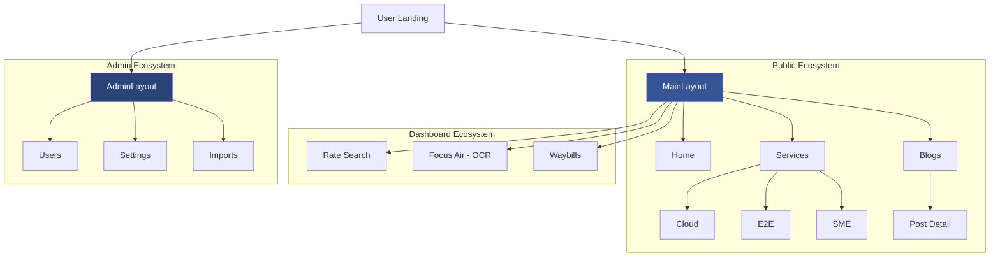

# 📘 Development Guide: F16s Platform Overhaul

This guide documents the comprehensive changes made to the F16s Freight Logistics platform, detailing the architectural shift, new features, and core dependencies.

---

## 🏛 Project Architecture (The "Tree")

### 📂 Repository Structure
A clean breakdown of the project's filesystem to help you navigate the codebase.

```text
📦 f16s_main (Root)
 ┣ 📂 app                       # 🧠 Backend Core (Laravel)
 ┃ ┣ 📂 Http/Controllers        # 🏛️ PSR-4 Tiered API Handlers
 ┃ ┃ ┣ 📂 Auth                  # 🔐 Login / Identity
 ┃ ┃ ┣ 📂 Admin                 # 🛠️ Business Management
 ┃ ┃ ┣ 📂 Logistics             # 📦 Waybill & Conversion
 ┃ ┃ ┣ 📂 Generators            # 📄 PDF Engine
 ┃ ┃ ┗ 📂 Data                  # 📊 Rates & Lookup Cache
 ┃ ┗ 📜 *.php                   # Models (User, Waybill, etc.)
 ┣ 📂 python                    # 🐍 OCR Extraction Pipeline
 ┣ 📂 public/media/assets       # 📂 Organized Semantic Assets
 ┃ ┣ 📂 banners                 # 🌇 Hero & Page Banners
 ┃ ┣ 📂 logos                   # 🏷️ Brand & Airline Marks
 ┃ ┣ 📂 vectors                 # 📐 Core Feature Icons (SVG)
 ┃ ┣ 📂 illustrations           # 🎨 Visual Components
 ┃ ┗ 📂 blog                    # 📰 Editorial Content
 ┣ 📂 resources/js/src          # 🎨 Frontend Source
 ┃ ┣ 📂 assets/sass             # 💅 Global Stylesheets
 ┃ ┃ ┣ 📜 public-custom.scss    # 🔥 Centralized View Architecture
 ┃ ┃ ┗ 📜 style.vue.scss        # Core Entry Theme
 ┣ 📂 resources/views           # 🏛️ Backend Templates
 ┃ ┣ 📂 emails                  # 📧 E-mail Manifests
 ┃ ┣ 📂 documents               # 📄 Legal PDF Templates (Renamed from pdf)
 ┃ ┣ 📂 tools/ocr               # 🛠️ Dev-Debug OCR Utilities
 ┃ ┗ 📜 welcome.blade.php       # 🚪 Main Application Entry
 ┃ ┣ 📂 view/layouts            # 🆕 Unified System Frames
 ┃ ┃ ┣ 📂 public                # 🏙 Public Engine
 ┃ ┃ ┗ 📂 admin                 # 🔐 Superadmin Engine
 ┃ ┣ 📂 view/pages              # 📄 Organized Domain Folders
 ┃ ┃ ┣ 📂 public                # 🌍 Public Ecosystem
 ┃ ┃ ┃ ┣ 📂 services           # 💼 Nested Service Pages
 ┃ ┃ ┃ ┣ 📂 legal              # ⚖️ Legal Policy Disclosures
 ┃ ┃ ┃ ┗ 📜 blogData.js        # 💾 Localized Data Source
 ┃ ┃ ┣ 📂 dashboard             # 🔐 User Portal Domain
 ┃ ┃ ┗ 📂 admin                 # 🛠 Unified Management Views
 ┃ ┣ 📜 router.js               # Client-side Routing Tree
 ┃ ┗ 📜 seo_helpers.js          # 🔍 SEO Schema Generator
 ┗ 📜 guide.md                  # 📘 This Documentation
```

### 🔗 Page Connection Hierarchy
Showing how the pages are interconnected through the main layout and dashboard systems.

```text
🌐 Root (/)
 ┣ 🏙 Public Experience (MainLayout)
 ┃ ┣ 🏠 Home (/)
 ┃ ┣ ℹ️ About Us (/about-us)
 ┃ ┣ 🛠 Services Ecosystem (/services)
 ┃ ┃ ┣ 📁 /services/CloudStorage (/cloud-storage)
 ┃ ┃ ┣ 📁 /services/EndToEnd (/end-to-end)
 ┃ ┃ ┗ 📁 /services/SmallBusiness (/small-business)
 ┃ ┣ 💡 Solutions (/solutions)
 ┃ ┣ 📞 Contact Us (/contact-us)
 ┃ ┣ 📰 Blogs & News (/blogs-and-news)
 ┃ ┃ ┗ 📝 Blog Post (/blog/:slug)
 ┃ ┗ ⚖️ Legal Ecosystem (Privacy, Terms)
 ┃   ┗ 📁 /legal/*
 ┃
 ┣ 🔐 User Dashboard (Auth Required)
 ┃ ┣ 📊 Rate Search (/rate)
 ┃ ┣ ✈️ Focus Air (/focus-air)        --> [OCR Document Upload]
 ┃ ┣ 🏠 House Way Bill (/house-way-bill)
 ┃ ┣ 📦 Consolidation (/consolidation)
 ┃ ┣ 📜 Message Log (/message-log)
 ┃ ┗ 📑 XML View (/xml-view/:id)
 ┃
 ┗ 🛠 Superadmin Panel (layouts/admin/Layout)
   ┗ 📂 Unified Registry (src/view/pages/admin/*)
     ┣ 👥 All Users (/superadmin/all-users)
     ┣ 🏢 All Company (/superadmin/all-company)
     ┣ 📥 Data Management (Imports, Deletes)
     ┣ ⚙️ Global Settings (/superadmin/setting)
     ┗ 📞 Contact Leads (/superadmin/all-contacts)
```

#### 📊 Visual Flow (Mermaid)


---

## 🎨 Branding & Visual Identity

The F16s platform follows a **Premium Modern Freight** aesthetic, characterized by clean lines, high contrast, and immersive "Glassmorphism" effects.

### 🌈 Color Palette
| Element | Color Code | Visual Role |
| :--- | :--- | :--- |
| **Brand Blue** | `#355594` | Primary identity, Headers, Main CTA background |
| **Hover Blue** | `#2a4476` | Interactive states, Deep contrast |
| **Text Muted** | `#5A6B8A` | Body copy, Secondary information |
| **Surface** | `#f8fafc` | Main body background |
| **Glass Layer**| `rgba(255, 255, 255, 0.95)` | Modal and Card backgrounds |

### 🔡 Typography
- **Primary Font**: `Inter` — Used for all public-facing pages for its clean, high-readability modern look.
- **Secondary Font**: `Nunito` — Used in dashboard and utility sections.
- **Data Font**: `Courier New` — Used exclusively in PDF generation for a professional, fixed-width "logistics" feel.

### ✨ Visual Style Guidelines
1. **Global CSS Strategy**:
   - Components MUST maintain clear decoupling of logic and style. Page-specific styling is centralizing within `public-custom.scss` instead of component-local `<style scoped>` tags.
2. **Performance-First Visuals**: 
   - Historically expensive `backdrop-filter: blur()` layers were phased out during the optimization sprint to restore seamless 60fps scrolling.
   - Rich, high-opacity layered backgrounds (`rgba(255, 255, 255, 0.9)`) achieve the same premium aesthetic without GPU taxation.
3. **Soft Atmospherics**:
   - Decorative backgrounds use centralized soft blurred ellipses (`.decorative-ellipses`) hosted globally to scale back resource consumption.
2. **Button Design**: 
   - All primary buttons are **Pill-shaped** (rounded-full) with `box-shadow` for elevation.
   - Hover state includes a slight lift (`translateY(-2px)`) and a horizontal icon shift.
3. **Card Aesthetics**:
   - Corner radius is standardized at `28px` or `32px` for a soft, premium feel.
   - Transitions are set to `0.4s ease` for fluid interaction.

---

## 🔄 Project Evolution
The platform has undergone a major transformation from a functional logistics tool to a **Modern Premium Freight Experience**. The focus was on high-fidelity UI, glassmorphism aesthetics, and superior mobile responsiveness.

---

## 📂 Core Changes & New Modules

### 🆕 New Service Pages
We have expanded the platform's service offerings with dedicated, high-fidelity pages:
- **Cloud Storage**: Modern data management interface.
- **End-to-End Service**: Comprehensive logistics lifecycle visualization.
- **Small Business Solutions**: Scalable freight options for SMEs.
- **Privacy Policy & Terms**: Legal pages updated with glassmorphism styling.

### 📰 Blogs & News Section
A complete blog ecosystem was integrated:
- `BlogsAndNews.vue`: Grid-based listing of latest updates.
- `BlogPost.vue`: Dynamic article view with reading progress bars and social sharing.

### 📱 Responsive Overhaul
- Optimized `Header.vue` and `Footer.vue` for seamless transitions between mobile, tablet, and desktop.
- Implemented horizontal carousels for service cards on mobile to prevent vertical clutter.
- Corrected text clipping and icon alignment issues in the "Solutions" section.
- **FocusAir UI Refresh**: Standardized the document upload modal with premium animations, loading states, and explicit file selection previews. (Note: The core document processing component and API routes were recently renamed from `WebDoc` to `FocusAir` to better align with the brand language).

---

## 🛠 Dependencies & Tech Stack

### Frontend (Vue.js 2 Ecosystem)
| Package | Purpose |
| :--- | :--- |
| `vue` ^2.6.11 | Core Frontend Framework |
| `bootstrap-vue` ^2.13.0 | UI Components & Grid System |
| `laravel-mix` ^6.0.49 | Asset Compilation |
| `vue-router` ^3.1.5 | Client-side Routing |
| `vuex` ^3.3.0 | State Management |
| `vue-meta` ^2.4.0 | Dynamic SEO & Meta Tag Management |
| `animate.css` ^4.1.0 | Motion & Transitions |
| `font-awesome` ^5.13.0 | Iconography |

### Backend (Laravel 9 Ecosystem)
| Package | Purpose |
| :--- | :--- |
| `laravel/framework` ^9.52 | Core Backend Framework |
| `tymon/jwt-auth` ^1.0 | Authentication & Security |
| `barryvdh/laravel-dompdf` | PDF Generation |
| `maatwebsite/excel` | Logistics Data Exports |

---

## 🚀 Recent Asset Updates
- **Logos**: Transitioned to `white-logo1.svg` and `blue-logo1.svg` for scalable branding. Specific logos (e.g., Air France, Etihad) are dynamically scaled in CSS to maintain visual balance.
- **Banners & Icons**: 
    - Implemented a **WebP-First** strategy. Banners (Plane, Ship, Truck) and Product Icons have been compressed to WebP (e.g., 2.7MB → 110KB) with high-quality JPG fallbacks.
    - Standardized naming convention: `banner-[type].[webp|jpg]` and `icon-name.webp`.
- **Media Location**: All optimized assets are centralized in the organized `public/media/assets/` repository system.

---

## 📊 Data Management & Content Updates

### 📰 Blog System (`blogData.js`)
All blog content is centralized in `resources/js/src/view/pages/public/blogData.js` to ensure easy updates without modifying Vue components.
- **How to update**: Add or modify objects in the `blogs` array.
- **Fields per post**:
    - `title`: The main headline.
    - `slug`: The URL-friendly identifier (e.g., `f16s-editorial`).
    - `image`: Path to the asset in `/media/assets/blog/`.
    - `content`: HTML string containing the body text and internal links.
    - `metaTitle` / `metaDescription`: Used by `vue-meta` for dynamic SEO rendering.
- **Internal Linking**: Ensure all content links back to `/services`, `/solutions`, or `/product-description` to maintain SEO authority.
- **Dynamic SEO**: All pages implement `metaInfo()` for unique titles and descriptions.

---

## 🔍 SEO Optimization & Structured Data

The platform is fully optimized for search engines using modern technical SEO practices:

### 🏷 Dynamic Meta Tags (`vue-meta`)
Each page has a unique Title, Description, and Open Graph (OG) tags to ensure rich previews on social media (LinkedIn, Twitter, Facebook).
- **Implementation**: Located in the `script` section of each Vue page under `metaInfo`.
- **Dynamic Blogs**: `BlogPost.vue` pulls meta data directly from `blogData.js`.

### 🗂 Schema.org (JSON-LD)
We have implemented structured data to help Google understand the business and platform:
- **Organization Schema**: Global business details (name, logo, social links).
- **SoftwareApplication Schema**: Injected into the Home page to highlight the F16s platform as a business application.
- **BlogPosting Schema**: Dynamically injected into each blog post for "Rich Results" in Google Search.
- **Utility**: All schema generation is centralized in `resources/js/src/seo_helpers.js`.

### 🗺 Sitemaps & Robots
- **Sitemap**: A comprehensive `public/sitemap.xml` is maintained to guide search engine crawlers.
- **Robots.txt**: Configured to allow full indexing and points directly to the sitemap.

---

## ⚡ Performance & Load Optimization

The platform uses a multi-layered approach to ensure a fast, "instant-feel" experience even on slower connections.

### 🖼 Intelligent Asset Loading & Optimization
- **WebP-First Strategy**: Established a batch conversion pipeline (Quality 82) that reduced banner and blog PNGs (1.3MB - 2.6MB) by ~70%. Using `<picture>` tags ensures WebP delivery with high-quality JPG fallbacks.
- **Progressive Rendering**: Applied `loading="lazy"` to all below-the-fold assets. Critical hero assets use `loading="eager"` to minimize Largest Contentful Paint (LCP).
- **Ready-State Guards**: Hero slideshows and interactive grids are "guarded" by an `imagesReady` state. The UI only transitions once primary assets are loaded, preventing layout shifts.

### 🦴 Perceived Speed (Skeleton Loaders)
- **Branded Placeholders**: Implemented shimmer-effect skeletons for the Hero section and Product grids.
- **UX Strategy**: Skeletons match the exact layout of the final content, eliminating layout shifts and providing immediate visual feedback during load.

### 🏎 Hardware Acceleration & Global Style Centralization
- **Scoped Style Eradication**: Eliminated all redundant `<style scoped>` blocks across primary landing pages. This drastically cuts CSS parse time, improves style injection speeds, and centralizes components' aesthetic maintenance to one file.
- **GPU Filter Deprecation**: Removed high-intensity `backdrop-filter` rendering contexts from repetitive grid containers to fully zero-out UI jank.
- **Layer Promoting**: Critical dynamic interactions utilize `will-change` prompting GPU allocation only when transitioning, reducing sustained processor footprint.

### 🌊 Branded Preloader & Build Optimization
- **Visuals**: A high-impact loading screen featuring a pulse-animated logo on a pure white background.
- **Build Hardening (Laravel Mix 6)**:
    - **Advanced Vendor Extraction**: Centralized `vue`, `vuetify`, and `bootstrap-vue` into a dedicated `vendor.js` for long-term browser caching.
    - **Granular Code Splitting**: Configured Webpack `splitChunks` with `maxInitialRequests: 6` to balance parallel loading and bundle size.
    - **Named Chunks**: All routes implement `/* webpackChunkName */`, grouping 40+ dynamic imports into logical clusters (`public`, `layout`, `superadmin`, `awb`) to reduce HTTP overhead.
- **Implementation**: 
    - Preloader located in `welcome.blade.php` to ensure it renders before the JS bundle is parsed.
    - Uses a `max-width: 300px` SVG (`blue-logo.svg`) with a CSS `@keyframes pulse` animation.
- **Transition**: Dual-guaranteed vanish sequence triggered by raw browser window load event AND explicitly finalized via the `mounted()` hook in `App.vue` once state is hydrated.

---

## ⚙️ Functional Architecture & Connectivity

### 📡 EDI & Messaging Standards
The platform's core logic revolves around automating IATA messaging standards for air freight:
- **FWB (Freight Waybill)**: Electronic version of the Air Waybill.
- **FHL (Freight House List)**: Detailed manifest for consolidated shipments (House level).
- **XML / EDI Integration**: The system facilitates the transition from legacy Cargo-IMP to modern **Cargo-XML**, allowing for direct, real-time communication with 100+ global airlines (Emirates, Qatar, Lufthansa, etc.).
- **e-Freight Roadmap**: All functional pages are designed to move the industry toward paperless, 100% digital e-AWB compliance.

---

## 🧠 Intelligent OCR & Document Processing

The platform features a sophisticated OCR pipeline to automate data entry from PDF Air Waybills:

### 🐍 Python-Powered Extraction (`extract_awb_new.py`)
- **Enhanced IATA Mapping**: Expanded dictionary to include global airport aliases (e.g., Mumbai/Bombay, Chicago O'Hare, Toronto).
- **Smart Address Parsing**: Logic to filter out legacy headers (e.g., "SHIPPER'S NAME AND ADDRESS") to extract clean entity names and locations.
- **Flight & Date Normalization**: 
    - Improved regex for diverse flight number formats.
    - Automatic date normalization (e.g., "05-MAY" to "05-MAY-2026") to ensure backend compatibility.
- **Border Artifact Removal**: Advanced cleaning of PDF-to-text artifacts like pipe characters (`|`) and redundant whitespace.

### 🔌 Backend Hardening (`OcrController.php`)
- **Robust Process Management**: Implemented fallback paths for Python environments and detailed logging for debugging.
- **JSON Validation**: Strict validation of OCR script output to prevent frontend crashes on malformed data.
- **Error Handling**: Graceful error responses with clear messaging for the frontend.

### 📄 FocusAir (Unified Document Interface)
- **Multi-Type Support**: Added support for various document templates (`ksr`, `ksr_house1`, `ksr_house2`, etc.).
- **Improved UX**: 
    - Real-time file selection feedback.
    - Integrated loading spinners (`b-spinner`) for long-running extraction tasks.
    - Validation checks to ensure files are selected before processing.

---

## 📄 Modernized PDF Rendering Engine

The platform's PDF generation (DomPDF) has been overhauled to move away from legacy, nested table layouts toward a clean, modular CSS utility-based system.

### 🛠 Architecture: `generate-awb-pdf.blade.php`
- **Flattened Hierarchy**: Replaced "table-in-table" nesting with flat containers, significantly improving rendering stability and alignment across different PDF engines.
- **CSS Design System**: Centralized all styling into a modular utility class block in the document `<head>`.
    - `.box-cell`: Standardized padding and layout for form fields.
    - `.label-text`: Consistent style for field labels.
    - `.value-text`: Uses **Courier New** for a professional, fixed-width "typewritten" look for data values.
    - `.border-l`, `.border-b`, etc.: Modular border controls for clean grid lines.
- **Maintainability**: Reduced code duplication by 40% and removed thousands of legacy `&nbsp;` hacks.
- **Multi-page Support**: Optimized the "Conditions of Contract" (Page 2) with a clean 2-column layout and enforced page breaks.

---

## 🛠 How to Continue Development
1. **Adding a New Page**:
   - Create the `.vue` file in `resources/js/src/view/pages/`.
   - Apply the `.glass-card` class to main containers.
   - Register the route in `router.js`.
2. **Updating the Blog**:
   - Add the new image to `public/media/assets/blog/`.
   - Update the array in `blogData.js`.
3. **Rebuilding Assets**:
   ```bash
   npm run dev    # Local development
   npm run prod   # Production build
   ```

---

## 🔮 Future Performance Roadmap

To maintain the platform's premium feel as it scales, the following architectural optimizations are planned for the next phase of development:

### 🧵 Asynchronous OCR Processing (Polling Architecture)
- **Problem**: OCR is currently a blocking synchronous process that ties up PHP workers for up to 120 seconds.
- **Solution**: 
    - Transition OCR extraction to a **Laravel Background Job** using the `database` queue driver.
    - Implement a **3-second Polling loop** in the Vue.js frontend to fetch results asynchronously.
    - Server will return an immediate `202 Accepted` response with a `job_id`, freeing up resources for other users.

### 🗄 Database Indexing Strategy
- **Goal**: Significantly reduce query execution time for document lists and rate searches.
- **Implementation**:
    - **`air_way_bills`**: Create composite and single indexes for `agent_id`, `awb_no`, `awb_code`, and `status`.
    - **`rates`**: Index `dest_airport_code`, `origin_airport_code`, and `carrier_code` to accelerate the "Search Rates" feature.
    - **`way_bill_consignment_data`**: Index `awb_id` to speed up the `with()` relationship loading.

### 🌐 Global Data Caching
- **Technology**: Utilize **Redis** or the built-in Laravel File Cache.
- **Strategy**: Cache static logistics data that rarely changes (e.g., Airline Prefix mappings, Airport IATA codes, and Currency reference tables) to bypass database queries entirely for common lookups.

### 🏗 Backend Refactoring (Service Pattern)
- **Goal**: De-bloat monolithic controllers (e.g., `ConversionController.php`) to improve maintainability and testability.
- **Implementation**:
    - Create a dedicated `CargoXmlService` to encapsulate complex XML generation logic.
    - Standardize the use of the **Service Pattern** for all business-heavy operations (PDF generation, EDI transmission).
    - Transition to **Blade-based XML templates** to replace manual DOM building in PHP.

---

## 🚀 Dynamic Blog Subsystem Setup

To migrate the blog data from the static JS file into your dynamic database environment, please follow these quick deployment steps:

### 🗄️ 1. Run Table Migration
Open your terminal in the project root and run the standard Laravel artisan command to construct the new `blogs` database table:

```bash
php artisan migrate
```

*(Note: This executes the generated `/database/migrations/2026_05_10_000000_create_blogs_table.php` blueprint automatically.)*

### 📤 2. Upload Folder Permissions
Ensure your server storage mechanism has write permissions set for the public assets folder where new user-generated blog WebP files are stored:

```bash
chmod -R 775 public/media/assets/blog/
```

---

*This guide serves as a living document for the F16s engineering team.*
