# 📘 Development Guide: F16s Platform Overhaul

This guide documents the comprehensive changes made to the F16s Freight Logistics platform, detailing the architectural shift, new features, and core dependencies.

---

## 🏛 Project Architecture (The "Tree")

### 📂 Repository Structure

A clean breakdown of the project's filesystem to help you navigate the codebase.

```text
📦 f16s_main (Root)
 ┣ 📂 app                       # 🧠 Backend Core (Laravel)
 ┃ ┣ 📂 Http/Controllers        # 🏛️ PSR-4 Tiered API Handlers
 ┃ ┃ ┣ 📂 Auth                  # 🔐 Login / Identity
 ┃ ┃ ┣ 📂 Admin                 # 🛠️ Business Management
 ┃ ┃ ┣ 📂 Logistics             # 📦 Waybill & Conversion
 ┃ ┃ ┣ 📂 Generators            # 📄 PDF Engine
 ┃ ┃ ┗ 📂 Data                  # 📊 Rates & Lookup Cache
 ┃ ┗ 📜 *.php                   # Models (User, Waybill, etc.)
 ┣ 📂 python                    # 🐍 OCR Extraction Pipeline
 ┣ 📂 public/media/assets       # 📂 Organized Semantic Assets
 ┃ ┣ 📂 banners                 # 🌇 Hero & Page Banners
 ┃ ┣ 📂 logos                   # 🏷️ Brand & Airline Marks
 ┃ ┣ 📂 vectors                 # 📐 Core Feature Icons (SVG)
 ┃ ┣ 📂 illustrations           # 🎨 Visual Components
 ┃ ┗ 📂 blog                    # 📰 Editorial Content
 ┣ 📂 resources/js/src          # 🎨 Frontend Source
 ┃ ┣ 📂 assets/sass             # 💅 Global Stylesheets
 ┃ ┃ ┣ 📜 public-custom.scss    # 🔥 Centralized View Architecture
 ┃ ┃ ┗ 📜 style.vue.scss        # Core Entry Theme
 ┣ 📂 resources/views           # 🏛️ Backend Templates
 ┃ ┣ 📂 emails                  # 📧 E-mail Manifests
 ┃ ┣ 📂 documents               # 📄 Legal PDF Templates (Renamed from pdf)
 ┃ ┣ 📂 tools/ocr               # 🛠️ Dev-Debug OCR Utilities
 ┃ ┗ 📜 welcome.blade.php       # 🚪 Main Application Entry
 ┃ ┣ 📂 view/layouts            # 🆕 Unified System Frames
 ┃ ┃ ┣ 📂 public                # 🏙 Public Engine
 ┃ ┃ ┗ 📂 admin                 # 🔐 Superadmin Engine
 ┃ ┣ 📂 view/pages              # 📄 Organized Domain Folders
 ┃ ┃ ┣ 📂 public                # 🌍 Public Ecosystem
 ┃ ┃ ┃ ┣ 📂 services           # 💼 Nested Service Pages
 ┃ ┃ ┃ ┣ 📂 legal              # ⚖️ Legal Policy Disclosures
 ┃ ┃ ┃ ┗ 📜 blogData.js        # 💾 Localized Data Source
 ┃ ┃ ┣ 📂 dashboard             # 🔐 User Portal Domain
 ┃ ┃ ┗ 📂 admin                 # 🛠 Unified Management Views
 ┃ ┣ 📜 router.js               # Client-side Routing Tree
 ┃ ┗ 📜 seo_helpers.js          # 🔍 SEO Schema Generator
 ┗ 📜 guide.md                  # 📘 This Documentation
```

### 🔗 Page Connection Hierarchy

Showing how the pages are interconnected through the main layout and dashboard systems.

```text
🌐 Root (/)
 ┣ 🏙 Public Experience (MainLayout)
 ┃ ┣ 🏠 Home (/)
 ┃ ┣ ℹ️ About Us (/about-us)
 ┃ ┣ 🛠 Services Ecosystem (/services)
 ┃ ┃ ┣ 📁 /services/CloudStorage (/cloud-storage)
 ┃ ┃ ┣ 📁 /services/EndToEnd (/end-to-end)
 ┃ ┃ ┗ 📁 /services/SmallBusiness (/small-business)
 ┃ ┣ 💡 Solutions (/solutions)
 ┃ ┣ 📞 Contact Us (/contact-us)
 ┃ ┣ 📰 Blogs & News (/blogs-and-news)
 ┃ ┃ ┗ 📝 Blog Post (/blog/:slug)
 ┃ ┗ ⚖️ Legal Ecosystem (Privacy, Terms)
 ┃   ┗ 📁 /legal/*
 ┃
 ┣ 🔐 User Dashboard (Auth Required)
 ┃ ┣ ✈️ Focus Air (/focus-air)        --> [OCR Document Upload]
 ┃ ┣ 🏠 House Way Bill (/house-way-bill)
 ┃ ┣ 📦 Consolidation (/consolidation)
 ┃ ┣ 📜 Message Log (/message-log)
 ┃ ┗ 📑 XML View (/xml-view/:id)
 ┃
 ┗ 🛠 Superadmin Panel (layouts/admin/Layout)
   ┗ 📂 Unified Registry (src/view/pages/admin/*)
     ┣ 👥 All Users (/superadmin/all-users)
     ┣ 🏢 All Company (/superadmin/all-company)
     ┣ 📋 OCR Templates (/superadmin/all-templates)
     ┣ ⚙️ Global Settings (/superadmin/setting)
     ┗ 📞 Contact Leads (/superadmin/all-contacts)
```

#### 📊 Visual Flow (Mermaid)

```mermaid
graph TD
    %% Entry Points
    Start[User Landing] --> MainL[MainLayout]
    Start --> AdminL[AdminLayout]

    %% Public Flow
    subgraph "Public Ecosystem"
        MainL --> H[Home]
        MainL --> S[Services]
        S --> S1[Cloud]
        S --> S2[E2E]
        S --> S3[SME]
        MainL --> B[Blogs]
        B --> BP[Post Detail]
    end

    %% User Flow
    subgraph "Dashboard Ecosystem"
        MainL --> D1[Rate Search]
        MainL --> D2[Focus Air - OCR]
        MainL --> D3[Waybills]
    end

    %% Admin Flow
    subgraph "Admin Ecosystem"
        AdminL --> A1[Users]
        AdminL --> A2[Settings]
        AdminL --> A3[Imports]
    end

    %% Styles
    style MainL fill:#355594,color:#fff
    style AdminL fill:#2a4476,color:#fff
```



---

## 🎨 Branding & Visual Identity

The F16s platform follows a **Premium Modern Freight** aesthetic, characterized by clean lines, high contrast, and immersive "Glassmorphism" effects.

### 🌈 Color Palette

| Element         | Color Code                  | Visual Role                                    |
| :-------------- | :-------------------------- | :--------------------------------------------- |
| **Brand Blue**  | `#355594`                   | Primary identity, Headers, Main CTA background |
| **Hover Blue**  | `#2a4476`                   | Interactive states, Deep contrast              |
| **Text Muted**  | `#5A6B8A`                   | Body copy, Secondary information               |
| **Surface**     | `#f8fafc`                   | Main body background                           |
| **Glass Layer** | `rgba(255, 255, 255, 0.95)` | Modal and Card backgrounds                     |

### 🔡 Typography

-   **Primary Font**: `Inter` — Used for all public-facing pages for its clean, high-readability modern look.
-   **Secondary Font**: `Nunito` — Used in dashboard and utility sections.
-   **Data Font**: `Courier New` — Used exclusively in PDF generation for a professional, fixed-width "logistics" feel.

### ✨ Visual Style Guidelines

1. **Global CSS Strategy**:
    - Components MUST maintain clear decoupling of logic and style. Page-specific styling is centralizing within `public-custom.scss` instead of component-local `<style scoped>` tags.
2. **Performance-First Visuals**:
    - Historically expensive `backdrop-filter: blur()` layers were phased out during the optimization sprint to restore seamless 60fps scrolling.
    - Rich, high-opacity layered backgrounds (`rgba(255, 255, 255, 0.9)`) achieve the same premium aesthetic without GPU taxation.
3. **Soft Atmospherics**:
    - Decorative backgrounds use centralized soft blurred ellipses (`.decorative-ellipses`) hosted globally to scale back resource consumption.
4. **Button Design**:
    - All primary buttons are **Pill-shaped** (rounded-full) with `box-shadow` for elevation.
    - Hover state includes a slight lift (`translateY(-2px)`) and a horizontal icon shift.
5. **Card Aesthetics**:
    - Corner radius is standardized at `28px` or `32px` for a soft, premium feel.
    - Transitions are set to `0.4s ease` for fluid interaction.

---

## 🔄 Project Evolution

The platform has undergone a major transformation from a functional logistics tool to a **Modern Premium Freight Experience**. The focus was on high-fidelity UI, glassmorphism aesthetics, and superior mobile responsiveness.

---

## 📂 Core Changes & New Modules

### 🆕 New Service Pages

We have expanded the platform's service offerings with dedicated, high-fidelity pages:

-   **Cloud Storage**: Modern data management interface.
-   **End-to-End Service**: Comprehensive logistics lifecycle visualization.
-   **Small Business Solutions**: Scalable freight options for SMEs.
-   **Privacy Policy & Terms**: Legal pages updated with glassmorphism styling.

### 📰 Blogs & News Section

A complete blog ecosystem was integrated:

-   `BlogsAndNews.vue`: Grid-based listing of latest updates.
-   `BlogPost.vue`: Dynamic article view with reading progress bars and social sharing.

### 📱 Responsive Overhaul

-   Optimized `Header.vue` and `Footer.vue` for seamless transitions between mobile, tablet, and desktop.
-   Implemented horizontal carousels for service cards on mobile to prevent vertical clutter.
-   Corrected text clipping and icon alignment issues in the "Solutions" section.
-   **FocusAir UI Refresh**: Standardized the document upload modal with premium animations, loading states, and explicit file selection previews. (Note: The core document processing component and API routes were recently renamed from `WebDoc` to `FocusAir` to better align with the brand language).

---

## 🛠 Dependencies & Tech Stack

### Frontend (Vue.js 2 Ecosystem)

| Package                 | Purpose                           |
| :---------------------- | :-------------------------------- |
| `vue` ^2.6.11           | Core Frontend Framework           |
| `bootstrap-vue` ^2.13.0 | UI Components & Grid System       |
| `laravel-mix` ^6.0.49   | Asset Compilation                 |
| `vue-router` ^3.1.5     | Client-side Routing               |
| `vuex` ^3.3.0           | State Management                  |
| `vue-meta` ^2.4.0       | Dynamic SEO & Meta Tag Management |
| `animate.css` ^4.1.0    | Motion & Transitions              |
| `font-awesome` ^5.13.0  | Iconography                       |

### Backend (Laravel 9 Ecosystem)

| Package                   | Purpose                   |
| :------------------------ | :------------------------ |
| `laravel/framework` ^9.52 | Core Backend Framework    |
| `tymon/jwt-auth` ^1.0     | Authentication & Security |
| `barryvdh/laravel-dompdf` | PDF Generation            |
| `maatwebsite/excel`       | Logistics Data Exports    |

---

## 🚀 Recent Asset Updates

-   **Logos**: Transitioned to `white-logo1.svg` and `blue-logo1.svg` for scalable branding. Specific logos (e.g., Air France, Etihad) are dynamically scaled in CSS to maintain visual balance.
-   **Banners & Icons**:
    -   Implemented a **WebP-First** strategy. Banners (Plane, Ship, Truck) and Product Icons have been compressed to WebP (e.g., 2.7MB → 110KB) with high-quality JPG fallbacks.
    -   Standardized naming convention: `banner-[type].[webp|jpg]` and `icon-name.webp`.
-   **Media Location**: All optimized assets are centralized in the organized `public/media/assets/` repository system.

---

## 📊 Data Management & Content Updates

### 📰 Blog System (`blogData.js`)

All blog content is centralized in `resources/js/src/view/pages/public/blogData.js` to ensure easy updates without modifying Vue components.

-   **How to update**: Add or modify objects in the `blogs` array.
-   **Fields per post**:
    -   `title`: The main headline.
    -   `slug`: The URL-friendly identifier (e.g., `f16s-editorial`).
    -   `image`: Path to the asset in `/media/assets/blog/`.
    -   `content`: HTML string containing the body text and internal links.
    -   `metaTitle` / `metaDescription`: Used by `vue-meta` for dynamic SEO rendering.
-   **Internal Linking**: Ensure all content links back to `/services`, `/solutions`, or `/product-description` to maintain SEO authority.
-   **Dynamic SEO**: All pages implement `metaInfo()` for unique titles and descriptions.

---

## 🔍 SEO Optimization & Structured Data

The platform is fully optimized for search engines using modern technical SEO practices:

### 🏷 Dynamic Meta Tags (`vue-meta`)

Each page has a unique Title, Description, and Open Graph (OG) tags to ensure rich previews on social media (LinkedIn, Twitter, Facebook).

-   **Implementation**: Located in the `script` section of each Vue page under `metaInfo`.
-   **Dynamic Blogs**: `BlogPost.vue` pulls meta data directly from `blogData.js`.

### 🗂 Schema.org (JSON-LD)

We have implemented structured data to help Google understand the business and platform:

-   **Organization Schema**: Global business details (name, logo, social links).
-   **SoftwareApplication Schema**: Injected into the Home page to highlight the F16s platform as a business application.
-   **BlogPosting Schema**: Dynamically injected into each blog post for "Rich Results" in Google Search.
-   **Utility**: All schema generation is centralized in `resources/js/src/seo_helpers.js`.

### 🗺 Sitemaps & Robots

-   **Sitemap**: A comprehensive `public/sitemap.xml` is maintained to guide search engine crawlers.
-   **Robots.txt**: Configured to allow full indexing and points directly to the sitemap.

---

## ⚡ Performance & Load Optimization

The platform uses a multi-layered approach to ensure a fast, "instant-feel" experience even on slower connections.

### 🖼 Intelligent Asset Loading & Optimization

-   **WebP-First Strategy**: Established a batch conversion pipeline (Quality 82) that reduced banner and blog PNGs (1.3MB - 2.6MB) by ~70%. Using `<picture>` tags ensures WebP delivery with high-quality JPG fallbacks.
-   **Progressive Rendering**: Applied `loading="lazy"` to all below-the-fold assets. Critical hero assets use `loading="eager"` to minimize Largest Contentful Paint (LCP).
-   **Ready-State Guards**: Hero slideshows and interactive grids are "guarded" by an `imagesReady` state. The UI only transitions once primary assets are loaded, preventing layout shifts.

### 🦴 Perceived Speed (Skeleton Loaders)

-   **Branded Placeholders**: Implemented shimmer-effect skeletons for the Hero section and Product grids.
-   **UX Strategy**: Skeletons match the exact layout of the final content, eliminating layout shifts and providing immediate visual feedback during load.

### 🏎 Hardware Acceleration & Global Style Centralization

-   **Scoped Style Eradication**: Eliminated all redundant `<style scoped>` blocks across primary landing pages. This drastically cuts CSS parse time, improves style injection speeds, and centralizes components' aesthetic maintenance to one file.
-   **GPU Filter Deprecation**: Removed high-intensity `backdrop-filter` rendering contexts from repetitive grid containers to fully zero-out UI jank.
-   **Layer Promoting**: Critical dynamic interactions utilize `will-change` prompting GPU allocation only when transitioning, reducing sustained processor footprint.

### 🌊 Branded Preloader & Build Optimization

-   **Visuals**: A high-impact loading screen featuring a pulse-animated logo on a pure white background.
-   **Build Hardening (Laravel Mix 6)**:
    -   **Advanced Vendor Extraction**: Centralized `vue`, `vuetify`, and `bootstrap-vue` into a dedicated `vendor.js` for long-term browser caching.
    -   **Granular Code Splitting**: Configured Webpack `splitChunks` with `maxInitialRequests: 6` to balance parallel loading and bundle size.
    -   **Named Chunks**: All routes implement `/* webpackChunkName */`, grouping 40+ dynamic imports into logical clusters (`public`, `layout`, `superadmin`, `awb`) to reduce HTTP overhead.
-   **Implementation**:
    -   Preloader located in `welcome.blade.php` to ensure it renders before the JS bundle is parsed.
    -   Uses a `max-width: 300px` SVG (`blue-logo.svg`) with a CSS `@keyframes pulse` animation.
-   **Transition**: Dual-guaranteed vanish sequence triggered by raw browser window load event AND explicitly finalized via the `mounted()` hook in `App.vue` once state is hydrated.

### 🗄️ Near-Instant Company Template Cache Invalidation Strategy

To balance extreme performance under high loads with the need for immediate visibility when superadmins make updates, the company templates configuration uses a dual-layer caching strategy:

1. **Short TTL Cache**: The `UserController::me()` endpoint caches the `templates_config` for a brief **60 seconds** (under the key `company_templates_{companyName}`). At high traffic (e.g. 20 req/s), this resolves ~1,199 out of 1,200 database reads from memory.
2. **Instant Invalidation on Admin Updates**: When a superadmin registers or edits a company in `CompanyController` (`register()` or `update()`), the system automatically invokes:
   ```php
   Cache::forget("company_templates_{$company->name}");
   ```
   This instantly purges the cache, guaranteeing that users see new templates on their very next request with **zero lag**, while retaining robust load protection.

---


## ⚙️ Functional Architecture & Connectivity

### 📡 EDI & Messaging Standards

The platform's core logic revolves around automating IATA messaging standards for air freight:

-   **FWB (Freight Waybill)**: Electronic version of the Air Waybill.
-   **FHL (Freight House List)**: Detailed manifest for consolidated shipments (House level).
-   **XML / EDI Integration**: The system facilitates the transition from legacy Cargo-IMP to modern **Cargo-XML**, allowing for direct, real-time communication with 100+ global airlines (Emirates, Qatar, Lufthansa, etc.).
-   **e-Freight Roadmap**: All functional pages are designed to move the industry toward paperless, 100% digital e-AWB compliance.

---

## 🧠 Intelligent OCR & Document Processing

The platform features a sophisticated OCR pipeline to automate data entry from PDF Air Waybills:

### 🐍 Python-Powered Extraction (`extract_awb_new.py`)

-   **Enhanced IATA Mapping**: Expanded dictionary to include global airport aliases (e.g., Mumbai/Bombay, Chicago O'Hare, Toronto).
-   **Smart Address Parsing**: Logic to filter out legacy headers (e.g., "SHIPPER'S NAME AND ADDRESS") to extract clean entity names and locations.
-   **Flight & Date Normalization**:
    -   Improved regex for diverse flight number formats.
    -   Automatic date normalization (e.g., "05-MAY" to "05-MAY-2026") to ensure backend compatibility.
-   **Border Artifact Removal**: Advanced cleaning of PDF-to-text artifacts like pipe characters (`|`) and redundant whitespace.

### 🔌 Backend Hardening (`OcrController.php`)

-   **Robust Process Management**: Implemented fallback paths for Python environments and detailed logging for debugging.
-   **JSON Validation**: Strict validation of OCR script output to prevent frontend crashes on malformed data.
-   **Error Handling**: Graceful error responses with clear messaging for the frontend.

### 📄 FocusAir (Unified Document Interface)

-   **Multi-Type Support**: Added support for various document templates (`ksr`, `ksr_house1`, `ksr_house2`, etc.).
-   **State Reset Mechanisms**: Explicit resetting of form state and component flags during successive OCR extractions to ensure a clean slate and prevent stale data.
-   **Improved UX**:
    -   Real-time file selection feedback.
    -   Integrated loading spinners (`b-spinner`) for long-running extraction tasks.
    -   Validation checks to ensure files are selected before processing.

---

## 📄 Modernized PDF Rendering Engine

The platform's PDF generation (DomPDF) has been overhauled to move away from legacy, nested table layouts toward a clean, modular CSS utility-based system.

### 🛠 Architecture: `generate-awb-pdf.blade.php`

-   **Flattened Hierarchy**: Replaced "table-in-table" nesting with flat containers, significantly improving rendering stability and alignment across different PDF engines.
-   **CSS Design System**: Centralized all styling into a modular utility class block in the document `<head>`.
    -   `.box-cell`: Standardized padding and layout for form fields.
    -   `.label-text`: Consistent style for field labels.
    -   `.value-text`: Uses **Courier New** for a professional, fixed-width "typewritten" look for data values.
    -   `.border-l`, `.border-b`, etc.: Modular border controls for clean grid lines.
-   **Maintainability**: Reduced code duplication by 40% and removed thousands of legacy `&nbsp;` hacks.
-   **Multi-page Support**: Optimized the "Conditions of Contract" (Page 2) with a clean 2-column layout and enforced page breaks.

---

## 🛠 How to Continue Development

1. **Adding a New Page**:
    - Create the `.vue` file in `resources/js/src/view/pages/`.
    - Apply the `.glass-card` class to main containers.
    - Register the route in `router.js`.
2. **Updating the Blog**:
    - Add the new image to `public/media/assets/blog/`.
    - Update the array in `blogData.js`.
3. **Rebuilding Assets**:
    ```bash
    npm run dev    # Local development
    npm run prod   # Production build
    ```

## 🚀 Dynamic Blog Subsystem Setup

To migrate the blog data from the static JS file into your dynamic database environment, please follow these quick deployment steps:

### 🗄️ 1. Run Table Migration

Open your terminal in the project root and run the standard Laravel artisan command to construct the new `blogs` database table:

```bash
php artisan migrate
```

_(Note: This executes the generated `/database/migrations/2026_05_10_000000_create_blogs_table.php` blueprint automatically.)_

### 📤 2. Upload Folder Permissions

Ensure your server storage mechanism has write permissions set for the public assets folder where new user-generated blog WebP files are stored:

```bash
chmod -R 775 public/media/assets/blog/
```

### 🔗 3. Connection Points Verified

The entire ecosystem has been wired end-to-end:
1. **Superadmin Controller**: Logic finalized in `BlogController.php` to automatically process image uploads, auto-slugify titles, and validate constraints.
2. **Public Blog Feed**: `BlogsAndNews.vue` prioritizes live database articles, dynamically filtering by Categories (Air Freight, Technology, etc.), and seamlessly defaulting to code-safe visual placeholders during connectivity transitions.
3. **Homepage Sync**: The `HomeNewsSection.vue` component has been hooked up to the exact same API endpoint. It dynamically updates the Featured Hero and Grid blocks globally the moment a post goes live in the database.

---

## 🔮 Future Performance Roadmap

To maintain the platform's premium feel as it scales, the following architectural optimizations are planned for the next phase of development:

### 🧵 Asynchronous OCR Processing (Polling Architecture)

-   **Problem**: OCR is currently a blocking synchronous process that ties up PHP workers for up to 120 seconds.
-   **Solution**:
    -   Transition OCR extraction to a **Laravel Background Job** using the `database` queue driver.
    -   Implement a **3-second Polling loop** in the Vue.js frontend to fetch results asynchronously.
    -   Server will return an immediate `202 Accepted` response with a `job_id`, freeing up resources for other users.

### 🗄 Database Indexing Strategy

-   **Goal**: Significantly reduce query execution time for document lists and rate searches.
-   **Implementation**:
    -   **`air_way_bills`**: Create composite and single indexes for `agent_id`, `awb_no`, `awb_code`, and `status`.
    -   **`rates`**: Index `dest_airport_code`, `origin_airport_code`, and `carrier_code` to accelerate the "Search Rates" feature.
    -   **`way_bill_consignment_data`**: Index `awb_id` to speed up the `with()` relationship loading.

### 🌐 Global Data Caching

-   **Technology**: Utilize **Redis** or the built-in Laravel File Cache.
-   **Strategy**: Cache static logistics data that rarely changes (e.g., Airline Prefix mappings, Airport IATA codes, and Currency reference tables) to bypass database queries entirely for common lookups.

### 🏗 Backend Refactoring (Service Pattern)

-   **Goal**: De-bloat monolithic controllers (e.g., `ConversionController.php`) to improve maintainability and testability.
-   **Implementation**:
    -   Create a dedicated `CargoXmlService` to encapsulate complex XML generation logic.
    -   Standardize the use of the **Service Pattern** for all business-heavy operations (PDF generation, EDI transmission).
    -   Transition to **Blade-based XML templates** to replace manual DOM building in PHP.

---

# Redis Queue + FastAPI Implementation Plan — PDF Plumber (FocusAir)

## F16s Freight Logistics Platform

## Overview

This plan covers the full implementation of an async Redis-backed queue with a persistent FastAPI microservice for PDF Plumber (OCR) processing.

**Why FastAPI alongside Redis?** Your extraction already runs in ~1 second for a single user. The problem being solved is keeping it at ~1 second when 20–50 users upload simultaneously. Without a queue, concurrent uploads all spawn Python subprocesses at once, causing CPU contention and timeouts. Without FastAPI, each queued job still pays a ~1 second Python cold-start cost on top of extraction. FastAPI keeps pdfplumber loaded in memory permanently — jobs call it over HTTP instead of spawning a new process each time.

**Result:** ~1 second extraction time maintained under concurrent load, with fair FIFO queuing protecting the server.

This plan covers:

-   Redis installation and Laravel queue configuration
-   `pdf_processing_jobs` table migration
-   Temp PDF file storage
-   FastAPI microservice wrapping existing `extract_awb_new.py`
-   Job dispatching via HTTP to FastAPI (replacing subprocess)
-   JSON result persistence
-   Vue.js polling frontend (1s interval)
-   Supervisor managing both Laravel workers and FastAPI
-   High-concurrency management strategy

---

## Phase 1: Redis Setup

> No changes from the original plan. Redis is still required — it's the queue that holds jobs while FastAPI is busy, and ensures fair FIFO ordering under load.

### 1.1 Install Redis (Ubuntu Server)

```bash
sudo apt update
sudo apt install -y redis-server
sudo systemctl enable redis-server
sudo systemctl start redis-server
redis-cli ping   # Should return: PONG
```

### 1.2 Install Laravel Redis Driver

```bash
composer require predis/predis
```

### 1.3 `.env` Configuration

```dotenv
REDIS_HOST=127.0.0.1
REDIS_PASSWORD=null
REDIS_PORT=6379

QUEUE_CONNECTION=redis

# Temp PDF storage path
PDF_TEMP_DISK=local
PDF_TEMP_PATH=pdf_temp
```

### 1.4 `config/queue.php` — Redis Connection

```php
'redis' => [
    'driver'      => 'redis',
    'connection'  => 'default',
    'queue'       => env('REDIS_QUEUE', 'pdf_processing'),
    'retry_after' => 110,       // MUST exceed job $timeout (90s) + buffer — prevents duplicate dispatch
    'block_for'   => null,
],
```

### 1.5 `config/filesystems.php` — Temp Disk

```php
'pdf_temp' => [
    'driver'     => 'local',
    'root'       => storage_path('app/pdf_temp'),
    'visibility' => 'private',
],
```

---

## Phase 2: Database Migration

### 2.1 Create Migration

```bash
php artisan make:migration create_pdf_processing_jobs_table
```

### 2.2 Migration Blueprint

```php
// database/migrations/2026_05_10_000001_create_pdf_processing_jobs_table.php

Schema::create('pdf_processing_jobs', function (Blueprint $table) {
    $table->id();
    $table->foreignId('user_id')->constrained()->onDelete('cascade');

    $table->string('original_filename');
    $table->string('temp_file_path')->nullable();    // e.g. pdf_temp/abc123.pdf
    $table->string('document_type')->nullable();     // ksr, ksr_house1, etc.
    $table->string('status')->default('pending');    // pending | processing | completed | failed
    $table->string('queue_job_id')->nullable();      // Laravel job UUID for tracking

    $table->json('extracted_data')->nullable();      // Final OCR JSON output
    $table->text('error_message')->nullable();

    $table->timestamp('started_at')->nullable();
    $table->timestamp('completed_at')->nullable();
    $table->timestamps();

    // Query performance indexes
    $table->index(['user_id', 'status']);
    $table->index(['status', 'created_at']);
    $table->index('queue_job_id');
});
```

```bash
php artisan migrate
```

### 2.3 Model: `PdfProcessingJob`

```php
// app/Models/PdfProcessingJob.php

namespace App\Models;

use Illuminate\Database\Eloquent\Model;

class PdfProcessingJob extends Model
{
    protected $fillable = [
        'user_id', 'original_filename', 'temp_file_path',
        'document_type', 'status', 'queue_job_id',
        'extracted_data', 'error_message',
        'started_at', 'completed_at',
    ];

    protected $casts = [
        'extracted_data' => 'array',
        'started_at'     => 'datetime',
        'completed_at'   => 'datetime',
    ];

    public function user()
    {
        return $this->belongsTo(User::class);
    }

    // Scope: only this user's jobs
    public function scopeForUser($query, $userId)
    {
        return $query->where('user_id', $userId);
    }
}
```

---

## Phase 3: FastAPI Microservice

This is the key addition over the original plan. Instead of the Laravel job spawning a fresh Python subprocess (cold start: ~1s), it calls this always-running FastAPI server over localhost HTTP. pdfplumber stays loaded in memory permanently — extraction starts immediately.

**Your existing `extract_awb_new.py` logic does not change.** FastAPI just wraps it.

### 3.1 Install Dependencies

```bash
cd /var/www/f16s_main/python

# Create a dedicated virtual environment for the server
python3 -m venv venv
source venv/bin/activate

pip install -r requirements.txt
```

### 3.2 Refactor `extract_awb_new.py` to be importable

Your existing script likely runs everything at the top level (no function wrapping). You need to wrap the main extraction logic in a callable function so FastAPI can import it. Minimal change:

```python
# python/extract_awb_new.py — add this at the bottom, wrapping your existing logic

def extract_awb(pdf_path: str) -> dict:
    """
    Wrap your existing extraction logic here.
    Move all current top-level code inside this function.
    Return the final extracted dict instead of printing it.
    """
    # --- your existing pdfplumber + IATA mapping code goes here ---
    # result = { ... }
    return result

# Keep this so the script still works standalone for testing
if __name__ == "__main__":
    import sys, json
    print(json.dumps(extract_awb(sys.argv[1])))
```

This means:

-   The script still works as a CLI tool for local testing (`python extract_awb_new.py file.pdf`)
-   FastAPI can import `extract_awb` directly without spawning a subprocess

### 3.3 FastAPI Server

```python
# python/ocr_server.py

from fastapi import FastAPI, UploadFile, File, HTTPException
from fastapi.responses import JSONResponse
import tempfile
import os
import logging

# pdfplumber and your extraction logic are imported ONCE at startup
# and stay in memory for the lifetime of the server
from extract_awb_new import extract_awb

logging.basicConfig(level=logging.INFO)
logger = logging.getLogger("ocr_server")

app = FastAPI(title="F16s OCR Microservice")


@app.get("/health")
def health():
    """Laravel workers call this on startup to confirm FastAPI is ready."""
    return {"status": "ok"}


@app.post("/extract")
async def extract(file: UploadFile = File(...)):
    """
    Accepts a PDF upload, runs pdfplumber extraction,
    returns structured JSON. No subprocess — pdfplumber is already loaded.
    """
    if not file.filename.lower().endswith(".pdf"):
        raise HTTPException(status_code=400, detail="Only PDF files are accepted.")

    # Write the upload to a temp file on disk (pdfplumber needs a file path)
    tmp_path = None
    try:
        with tempfile.NamedTemporaryFile(suffix=".pdf", delete=False) as tmp:
            contents = await file.read()
            tmp.write(contents)
            tmp_path = tmp.name

        logger.info(f"Extracting: {file.filename} ({len(contents)} bytes)")
        result = extract_awb(tmp_path)
        return JSONResponse(content=result)

    except Exception as e:
        logger.error(f"Extraction failed: {e}")
        raise HTTPException(status_code=500, detail=str(e))

    finally:
        # Always clean up the temp file
        if tmp_path and os.path.exists(tmp_path):
            os.unlink(tmp_path)
```

### 3.4 Test the Server Manually

```bash
cd /var/www/f16s_main/python
source venv/bin/activate

# Start the server on port 8001
uvicorn ocr_server:app --host 127.0.0.1 --port 8001

# In another terminal — test it works
curl -X POST http://127.0.0.1:8001/health
curl -X POST http://127.0.0.1:8001/extract \
  -F "file=@/path/to/test.pdf"
```

You should see your extracted JSON returned in ~1 second, same as your current local testing.

### 3.5 `.env` — Add FastAPI URL

```dotenv
OCR_SERVICE_URL=http://127.0.0.1:8001
```

---

## Phase 4: Job Class (Updated — HTTP call replaces subprocess)

> **This phase replaces the original Phase 3.** The job logic is identical in structure, but the extraction call is now an HTTP request to FastAPI instead of a subprocess. Timeout drops from 180s to 90s.

### 4.1 Create Job

```bash
php artisan make:job ProcessPdfOcrJob
```

### 4.2 Job Implementation

```php
// app/Jobs/ProcessPdfOcrJob.php

namespace App\Jobs;

use App\Models\PdfProcessingJob;
use Illuminate\Bus\Queueable;
use Illuminate\Contracts\Queue\ShouldQueue;
use Illuminate\Foundation\Bus\Dispatchable;
use Illuminate\Queue\InteractsWithQueue;
use Illuminate\Queue\SerializesModels;
use Illuminate\Support\Facades\Http;
use Illuminate\Support\Facades\Storage;
use Illuminate\Support\Facades\Log;

class ProcessPdfOcrJob implements ShouldQueue
{
    use Dispatchable, InteractsWithQueue, Queueable, SerializesModels;

    public int $tries   = 3;
    public int $timeout = 90;   // Must be > Http::timeout below (80s) + safety buffer
    public int $backoff = 5;    // retry after 5 seconds

    public function __construct(
        public readonly int $processingJobId
    ) {}

    public function handle(): void
    {
        $job = PdfProcessingJob::findOrFail($this->processingJobId);

        $job->update([
            'status'     => 'processing',
            'started_at' => now(),
        ]);

        $tempPath = Storage::disk('pdf_temp')->path($job->temp_file_path);

        if (!file_exists($tempPath)) {
            $job->update([
                'status'        => 'failed',
                'error_message' => 'Temp PDF file not found on disk.',
                'completed_at'  => now(),
            ]);
            return;
        }

        try {
            // Call FastAPI microservice — no subprocess, no cold start
            $ocrUrl   = rtrim(config('services.ocr.url'), '/') . '/extract';
            // Http timeout MUST be less than the job's $timeout property (90s) to ensure
            // the HTTP error path is hit cleanly before the worker process is force-killed.
            $response = Http::timeout(80)
                ->attach('file', file_get_contents($tempPath), basename($tempPath))
                ->post($ocrUrl, [
                    'document_type' => $job->document_type ?: 'ksr'
                ]);

            if ($response->failed()) {
                throw new \RuntimeException(
                    'FastAPI OCR error: ' . $response->status() . ' — ' . $response->body()
                );
            }

            $data = $response->json();

            if (!is_array($data)) {
                throw new \RuntimeException('OCR response is not valid JSON.');
            }

            $job->update([
                'status'         => 'completed',
                'extracted_data' => $data,
                'completed_at'   => now(),
            ]);

            // Temp PDF no longer needed
            Storage::disk('pdf_temp')->delete($job->temp_file_path);

        } catch (\Throwable $e) {
            Log::error('OCR Job Failed', [
                'job_id' => $this->processingJobId,
                'error'  => $e->getMessage(),
            ]);

            $job->update([
                'status'        => 'failed',
                'error_message' => $e->getMessage(),
                'completed_at'  => now(),
            ]);
        }
    }

    public function failed(\Throwable $e): void
    {
        PdfProcessingJob::where('id', $this->processingJobId)->update([
            'status'        => 'failed',
            'error_message' => 'Max retries exceeded: ' . $e->getMessage(),
            'completed_at'  => now(),
        ]);
    }
}
```

### 4.3 `config/services.php` — OCR Service URL

```php
'ocr' => [
    'url' => env('OCR_SERVICE_URL', 'http://127.0.0.1:8001'),
],
```

---

## Phase 5: Controller

### 5.1 OcrController — Upload & Dispatch

```php
// app/Http/Controllers/Logistics/OcrController.php

namespace App\Http\Controllers\Logistics;

use App\Http\Controllers\Controller;
use App\Jobs\ProcessPdfOcrJob;
use App\Models\PdfProcessingJob;
use Illuminate\Http\Request;
use Illuminate\Support\Facades\Auth;
use Illuminate\Support\Facades\Storage;
use Illuminate\Support\Str;

class OcrController extends Controller
{
    /**
     * POST /api/ocr/upload
     * Accepts PDF, saves to temp, dispatches job, returns job record ID.
     */
    public function upload(Request $request)
    {
        $request->validate([
            'pdf'           => 'required|file|mimes:pdf|max:20480',  // 20 MB max
            'document_type' => 'nullable|string|in:ksr,ksr_house1,ksr_house2',
        ]);

        $file         = $request->file('pdf');
        $tempFilename = Str::uuid() . '.pdf';

        // Store in private temp disk
        Storage::disk('pdf_temp')->putFileAs('', $file, $tempFilename);

        // Create tracking record
        $processingJob = PdfProcessingJob::create([
            'user_id'           => Auth::id(),
            'original_filename' => $file->getClientOriginalName(),
            'temp_file_path'    => $tempFilename,
            'document_type'     => $request->input('document_type', 'ksr'),
            'status'            => 'pending',
        ]);

        // Dispatch to Redis queue
        $laravelJob = ProcessPdfOcrJob::dispatch($processingJob->id)
            ->onQueue('pdf_processing');

        // Store the job ID for debugging (optional)
        $processingJob->update(['queue_job_id' => (string) $laravelJob]);

        return response()->json([
            'job_id'  => $processingJob->id,
            'status'  => 'pending',
            'message' => 'PDF uploaded and queued for processing.',
        ], 202);
    }

    /**
     * GET /api/ocr/status/{jobId}
     * Polling endpoint — returns current status and data when complete.
     */
    public function status(int $jobId)
    {
        $job = PdfProcessingJob::where('id', $jobId)
            ->where('user_id', Auth::id())   // ownership check
            ->firstOrFail();

        $response = [
            'job_id'            => $job->id,
            'status'            => $job->status,
            'original_filename' => $job->original_filename,
            'created_at'        => $job->created_at,
        ];

        if ($job->status === 'completed') {
            $response['extracted_data'] = $job->extracted_data;
            $response['completed_at']   = $job->completed_at;
        }

        if ($job->status === 'failed') {
            $response['error_message'] = $job->error_message;
        }

        return response()->json($response);
    }

    /**
     * GET /api/ocr/history
     * Returns a user's recent processing history (last 20).
     */
    public function history()
    {
        $jobs = PdfProcessingJob::forUser(Auth::id())
            ->select(['id', 'original_filename', 'status', 'document_type', 'created_at', 'completed_at'])
            ->orderByDesc('created_at')
            ->limit(20)
            ->get();

        return response()->json($jobs);
    }
}
```

### 5.2 Routes

```php
// routes/api.php

Route::middleware('auth:api')->group(function () {
    Route::post('/ocr/upload',       [OcrController::class, 'upload']);
    Route::get('/ocr/status/{jobId}',[OcrController::class, 'status']);
    Route::get('/ocr/history',       [OcrController::class, 'history']);
});
```

---

## Phase 6: Supervisor — Managing Both Workers and FastAPI

> **Updated from original plan.** Supervisor now manages two process groups: the Laravel queue workers (unchanged) and the FastAPI uvicorn server (new). Both must be running for the system to work.

### 6.1 FastAPI Supervisor Config

```ini
; /etc/supervisor/conf.d/f16s-ocr-fastapi.conf

[program:f16s-ocr-fastapi]
command=/var/www/f16s_main/python/venv/bin/uvicorn ocr_server:app --host 127.0.0.1 --port 8001 --workers 2
directory=/var/www/f16s_main/python
autostart=true
autorestart=true
user=www-data
redirect_stderr=true
stdout_logfile=/var/www/f16s_main/storage/logs/fastapi.log
stopwaitsecs=10
```

`--workers 2` means two uvicorn worker processes share port 8001. If you have more than ~10 concurrent jobs in flight at once, increase to 4. Each uvicorn worker can handle one extraction at a time (pdfplumber is CPU-bound).

### 6.2 Laravel Queue Workers Supervisor Config

```ini
; /etc/supervisor/conf.d/f16s-pdf-worker.conf

[program:f16s-pdf-worker]
process_name=%(program_name)s_%(process_num)02d
command=php /var/www/f16s_main/artisan queue:work redis --queue=pdf_processing --tries=3 --timeout=15 --sleep=1 --max-jobs=500
autostart=true
autorestart=true
user=www-data
numprocs=3
redirect_stderr=true
stdout_logfile=/var/www/f16s_main/storage/logs/worker.log
stopwaitsecs=20
```

Key changes from original: `--timeout=15` (down from 180 — FastAPI is fast), `--sleep=1` (reduces idle delay to at most 1s, while keeping workers from spinning continuously on an empty queue).

### 6.3 Start Everything

```bash
sudo supervisorctl reread
sudo supervisorctl update
sudo supervisorctl start f16s-ocr-fastapi:*
sudo supervisorctl start f16s-pdf-worker:*
sudo supervisorctl status

# Verify FastAPI is up before testing end-to-end
curl http://127.0.0.1:8001/health
```

### 6.4 Start Worker (Development — run both in separate terminals)

```bash
# Terminal 1: FastAPI
cd python && source venv/bin/activate
uvicorn ocr_server:app --host 127.0.0.1 --port 8001 --reload

# Terminal 2: Laravel worker
php artisan queue:work redis --queue=pdf_processing --tries=3 --timeout=15 --sleep=1
```

---

## Phase 7: Vue.js Polling (FocusAir Frontend)

> **Updated from original plan.** Poll interval dropped from 3000ms to 1000ms. Since FastAPI completes extraction in ~1 second, a 3s poll interval was wasting 2 seconds of perceived wait time on every job.

```javascript
// resources/js/src/view/pages/dashboard/FocusAir.vue (excerpt)

export default {
    data() {
        return {
            selectedFile: null,
            documentType: "ksr",
            jobId: null,
            jobStatus: null, // pending | processing | completed | failed
            extractedData: null,
            errorMessage: null,
            pollInterval: null,
            isUploading: false,
            loadingStage: "", // shown to user during processing
        };
    },

    methods: {
        async submitPdf() {
            if (!this.selectedFile) return;

            this.isUploading = true;
            this.jobStatus = null;
            this.extractedData = null;
            this.errorMessage = null;
            this.loadingStage = "Uploading document...";

            const form = new FormData();
            form.append("pdf", this.selectedFile);
            form.append("document_type", this.documentType);

            try {
                const { data } = await axios.post("/api/ocr/upload", form, {
                    headers: { "Content-Type": "multipart/form-data" },
                });

                this.jobId = data.job_id;
                this.jobStatus = "pending";
                this.loadingStage = "Analysing PDF structure...";
                this.startPolling();
            } catch (err) {
                this.errorMessage = "Upload failed. Please try again.";
            } finally {
                this.isUploading = false;
            }
        },

        startPolling() {
            // 1 second interval — matches FastAPI extraction speed
            this.pollInterval = setInterval(async () => {
                try {
                    const { data } = await axios.get(
                        `/api/ocr/status/${this.jobId}`
                    );
                    this.jobStatus = data.status;

                    // Update loading label based on status
                    if (data.status === "processing") {
                        this.loadingStage = "Extracting IATA fields...";
                    }

                    if (data.status === "completed") {
                        this.extractedData = data.extracted_data;
                        this.loadingStage = "";
                        this.stopPolling();
                    } else if (data.status === "failed") {
                        this.errorMessage =
                            data.error_message || "Processing failed.";
                        this.loadingStage = "";
                        this.stopPolling();
                    }
                } catch (err) {
                    console.error("Polling error:", err);
                    this.stopPolling();
                }
            }, 1000); // ← 1 second, down from 3
        },

        stopPolling() {
            if (this.pollInterval) {
                clearInterval(this.pollInterval);
                this.pollInterval = null;
            }
        },
    },

    beforeDestroy() {
        this.stopPolling();
    },
};
```

---

## Phase 8: High-Concurrency Strategy

### Worker & FastAPI Scaling

The two knobs to scale independently:

| Concurrent Users | Laravel Workers (`numprocs`) | FastAPI `--workers` | Expected wait per user           |
| :--------------- | :--------------------------- | :------------------ | :------------------------------- |
| 1–10             | 2                            | 2                   | ~1–2s                            |
| 10–30            | 3                            | 2                   | ~1–3s (queue absorbs bursts)     |
| 30–100           | 5                            | 4                   | ~2–5s (FIFO, fair ordering)      |
| 100+             | 10+                          | 8                   | scale horizontally or add server |

**Rule of thumb:** Laravel workers = FastAPI workers. Each Laravel worker calls FastAPI once at a time; if you have 3 Laravel workers but only 2 FastAPI workers, 1 Laravel worker will always be waiting. Keep them matched.

### Queue Priority (Optional)

```bash
# Premium users skip the regular queue
php artisan queue:work redis \
  --queue=pdf_processing_priority,pdf_processing \
  --tries=3 --timeout=15 --sleep=1
```

```php
ProcessPdfOcrJob::dispatch($job->id)
    ->onQueue($user->isPremium() ? 'pdf_processing_priority' : 'pdf_processing');
```

### Temp File Cleanup

```php
// app/Console/Kernel.php — reduced from 2 hours to 30 minutes
// since FastAPI jobs complete in seconds, anything older than 30 min is genuinely stuck

$schedule->call(function () {
    $stale = PdfProcessingJob::whereIn('status', ['pending', 'processing'])
        ->where('created_at', '<', now()->subMinutes(30))
        ->get();

    foreach ($stale as $job) {
        Storage::disk('pdf_temp')->delete($job->temp_file_path);
        $job->update([
            'status'        => 'failed',
            'error_message' => 'Timed out — cleaned up by scheduler.',
            'completed_at'  => now(),
        ]);
    }
})->everyFifteenMinutes();
```

### Monitoring

```bash
# Redis queue depth
redis-cli llen pdf_processing

# FastAPI health
curl http://127.0.0.1:8001/health

# Supervisor status (both process groups)
sudo supervisorctl status

# FastAPI logs
tail -f /var/www/f16s_main/storage/logs/fastapi.log

# Worker logs
tail -f /var/www/f16s_main/storage/logs/worker.log
```

---

## Phase 9: Security Hardening

1. **Ownership checks** — all status/history endpoints verify `user_id = Auth::id()`. Never expose other users' jobs.
2. **File type validation** — validate `mimes:pdf` server-side (never trust the client MIME type alone). Optionally check the PDF magic bytes: `%PDF`.
3. **Max file size** — enforce `max:20480` (20 MB) at the controller level.
4. **Temp file isolation** — store in `storage/app/pdf_temp/` (private disk, not public). Auto-delete after successful extraction.
5. **FastAPI localhost only** — bind uvicorn to `127.0.0.1`, never `0.0.0.0`. The FastAPI server should never be publicly reachable — only Laravel workers on the same machine call it.
6. **Rate limiting** — add throttle middleware to prevent abuse:
    ```php
    Route::post('/ocr/upload', [OcrController::class, 'upload'])
        ->middleware('throttle:10,1');  // 10 uploads per minute per user
    ```

---

## Summary of Files Created / Modified

| File                                                           | Action       | Notes                                  |
| :------------------------------------------------------------- | :----------- | :------------------------------------- |
| `database/migrations/..._create_pdf_processing_jobs_table.php` | New          | —                                      |
| `app/Models/PdfProcessingJob.php`                              | New          | —                                      |
| `app/Jobs/ProcessPdfOcrJob.php`                                | New          | HTTP call to FastAPI, not subprocess   |
| `app/Http/Controllers/Logistics/OcrController.php`             | Modified     | —                                      |
| `routes/api.php`                                               | Modified     | 3 new routes                           |
| `config/queue.php`                                             | Modified     | retry_after: 30s                       |
| `config/filesystems.php`                                       | Modified     | pdf_temp disk                          |
| `config/services.php`                                          | Modified     | OCR service URL                        |
| `.env`                                                         | Modified     | Redis + queue + OCR_SERVICE_URL        |
| `/etc/supervisor/conf.d/f16s-pdf-worker.conf`                  | New          | timeout: 15s, sleep: 1s                |
| `/etc/supervisor/conf.d/f16s-ocr-fastapi.conf`                 | **New**      | FastAPI process group                  |
| `python/ocr_server.py`                                         | **New**      | FastAPI microservice                   |
| `python/extract_awb_new.py`                                    | **Modified** | Wrap logic in `extract_awb()` function |
| `python/venv/`                                                 | **New**      | Dedicated venv for FastAPI deps        |
| `resources/js/src/view/pages/dashboard/FocusAir.vue`           | Modified     | 1s polling, loading stages             |
| `app/Console/Kernel.php`                                       | Modified     | Cleanup every 15 min                   |

---

_F16s Engineering Team — Implementation Plan v2.0 — May 2026_

---

_This guide serves as a living document for the F16s engineering team._

---

## 📑 Finalized Upgrades: Dashboard Design Unification & Site Speed (May 10)

This update harmonized visual interaction patterns across the administration dashboard components and addressed critical first-paint layout shifts in loading logic.

### 🎨 Component Dashboard Synchronization (FocusAir / HouseWayBill / Consolidation)

- **Unified Grid Wrappers**: All main functional containers now utilize uniform optimized inline-shadow blocks (`background: #ffffff`, `box-shadow: 0 10px 30px rgba(53, 85, 148, 0.1)`) standardizing the curvature to 32px and padding thresholds globally.
- **Advanced "Latest Messages" Modals**:
  - Scrubbed computationally expensive `backdrop-filter: blur()` declarations which caused recursive layout thrashing during modal activation.
  - Migrated modal layers to performant CSS compositing system using high-opacity fill vectors.
  - Restructured the button groups into modernized rounded-pill flex layout consistent with branding guide.
- **Logic & Link Preservation**: Fully ported technical logic for interactive elements (PDF downloads) to modern footer slots within the message item grid cards.

### ⚡ Performance & Asset Loading Acceleration

- **Optimized Preloader Layout Shift**:
  - **Hardcoded Boot Loader**: Modified [welcome.blade.php](file:///Users/jomygeorge/.gemini/antigravity/scratch/f16s_main_ssh/resources/views/welcome.blade.php) from browser fluid size to explicit `150px` dimensions preventing startup flicker.
  - **Vue Navigation Loader**: Recalibrated [PageLoader.vue](file:///Users/jomygeorge/.gemini/antigravity/scratch/f16s_main_ssh/resources/js/src/view/components/PageLoader.vue) inner image weights to dynamic `120px` and refined complementary text hierarchy to 1.3rem.
- **Native Styling Enforced**: Upgraded critical loader rendering path via direct inline CSS logic which bypasses latency overhead of delayed JS stylesheet injection.

---


## 🚀 IT & DEVOPS PRODUCTION ROLLOUT CHECKLIST

### 1. Server Software Prerequisites
Ensure your production Ubuntu/Linux server has Redis and Supervisor installed.
```bash
sudo apt update
sudo apt install redis-server supervisor -y
sudo systemctl enable redis-server.service
sudo systemctl start redis-server.service
```

### 2. Database Migration (Apply Table Schema)
Run standard Artisan migration to generate the new tracking tables:
```bash
php artisan migrate
```

### 3. Setup Dedicated Python Microservice Environment
Set up isolation and install all native dependencies using the requirements profile:
```bash
cd python
python3 -m venv venv
./venv/bin/pip install -r requirements.txt
```

### 4. Environment Configuration (.env)
Ensure the following keys are present in your production `.env` file:
```dotenv
# Switched from 'sync' to 'redis'
QUEUE_CONNECTION=redis

# Fast API configuration
OCR_SERVICE_URL=http://127.0.0.1:8001

# Storage configuration
REDIS_HOST=127.0.0.1
REDIS_PASSWORD=null
REDIS_PORT=6379
```

### 5. Supervisor Configurations (Keep processes alive forever)

**Config A: /etc/supervisor/conf.d/f16s-ocr-fastapi.conf**
```ini
[program:f16s-ocr-fastapi]
command=/var/www/f16s_main/python/venv/bin/uvicorn ocr_server:app --host 127.0.0.1 --port 8001 --workers 2
directory=/var/www/f16s_main/python
autostart=true
autorestart=true
user=www-data
redirect_stderr=true
stdout_logfile=/var/www/f16s_main/storage/logs/fastapi.log
stopwaitsecs=10
```

**Config B: /etc/supervisor/conf.d/f16s-pdf-worker.conf**
```ini
[program:f16s-pdf-worker]
process_name=%(program_name)s_%(process_num)02d
command=php /var/www/f16s_main/artisan queue:work redis --queue=pdf_processing --tries=3 --timeout=15 --sleep=1 --max-jobs=500
autostart=true
autorestart=true
user=www-data
numprocs=3
redirect_stderr=true
stdout_logfile=/var/www/f16s_main/storage/logs/worker.log
stopwaitsecs=20
```

### 6. Start Operations
Load and activate the background daemons:
```bash
sudo supervisorctl reread
sudo supervisorctl update
sudo supervisorctl start f16s-ocr-fastapi:*
sudo supervisorctl start f16s-pdf-worker:*
sudo supervisorctl status
```

### 7. Post-Deployment Validation
Confirm inner-loop connectivity by pinging the microservice healthcheck:
```bash
curl http://127.0.0.1:8001/health
```
*(Should respond with: {"status": "ok", "message": "OCR service online"})*

---
## Finalized Phase: Modular Frontend Architecture

To maintain zero-duplication DRY code practices, we fully extracted the OCR interaction loop into a single autonomous child component.

### Key Component
- **File**: `resources/js/src/view/components/OcrUploadModal.vue`
- **Purpose**: Manages dynamic file upload states, triggers background API jobs, and visualizes live analysis loops with high-fidelity Vue animations.

### Usage in Page Modules
Both `FocusAir.vue` and `HouseWayBill.vue` were refactored to remove custom polling logic and use the declarative hook:

```html
<!-- Import declaration -->
import OcrUploadModal from "@/view/components/OcrUploadModal.vue";

<!-- Usage within template -->
<OcrUploadModal initialType="ksr" @extracted="processExtractedData" />
```

### Automated Interactions
- **Null Guard**: Clicking "Extract" automatically fires standard OS file discovery if no payload loaded.
- **Encapsulated Lifecycle**: All state tracking (interval cleans up in `beforeDestroy`) stays confined, improving parent performance metrics.

---
## 📊 Finalized Phase: Coordinate Governance & Data Modeling

This final architectural layer shifted the source-of-truth for coordinate mappings from static JSON disk files into direct database relational tables, guaranteeing race-condition immunity and seamless superadmin editing capabilities.

### 1. Database-First Persistence
- **Model**: `App\SystemTemplate`
- **Strategy**: On every mutation, the model automatically writes to `boxes_config.json.tmp` and executes an atomic operating-system `rename` command. This supplies the Python parser with absolute consistent read cycles without locking overhead.
- **Protection**: Deletes are gated behind an Orphan Guardian. You cannot delete a template currently mapped into an active company configuration.

### 2. 🛠 User Creation Integrity Repair
Historically, certain critical user behaviors lacked physical storage in the relational engine. This was rectified via automatic schema expansion:
- **New Field `can_send`**: Governs direct XML dispatch authorization directly from user profile records.
- **New Field `pima_address`**: Formalizes storage for logical PIMA routing, successfully piping values directly into the `ram:PrimaryID` header generated in `ConversionController.php` for the first time.

### 3. Dynamic Coordinate Assignment UX
- **Component**: `NewCompany.vue`
- **Visual Injection**: Realized a "Pill Registry" system where Superadmins can instantly inject coordinate row mappings simply by clicking an active matrix tag.
- **Fallback Logic**: Fully integrated with client side input catchers, automatically converting flat-array legacy datasets into robust schema models seamlessly upon record mount.

---
## 📑 Finalized Upgrades: Global Error Formatting & PDF Image Stabilization (May 26)

This update addressed two core functional areas: visual image rendering within generated documents, and user-facing error clarity across all data entry forms.

### 1. 📄 PDF Image Stabilization (Base64 Inline Logo Injection)
- **Templates**: `generate-awb-pdf.blade.php` (Line 2736) and `generate-hawb-pdf.blade.php` (Line 2733)
- **Problem**: Absolute filesystem paths using `public_path()` were being blocked by DomPDF's internal `chroot` sandboxing restrictions, causing the IATA logo on page 2 of both generated PDFs to fail to load.
- **Solution**: Refactored both templates to read the raw image bytes from disk and dynamically inject the IATA logo as an inline Base64 data URI:
  ```html
  
  ```
  This eliminates all filesystem, sandbox, or protocol check overhead and guarantees 100% reliable rendering of the logo across all server environments.

### 2. 🛡️ Global Validation Error Optimization & Phrasing
- **Configuration**: `/resources/lang/en/validation.php`
- **Re-phrasing**: Cleaned up the raw Laravel validation messages globally. Phrasings have been shortened to a concise and modern standard (e.g., `:attribute is required.`, `:attribute format is invalid.`, and `:attribute cannot exceed :max characters.`), removing redundant prefixes such as "The" or "field".
- **Attribute Mapping Dictionary**: Populated the `'attributes'` localization block to dynamically map technical database columns into professional human-readable titles:
  - **AWB Attributes**: `awb_code` ➔ *AWB Prefix*, `awb_no` ➔ *AWB Number*
  - **Shipper/Consignee Info**: `ship_name` ➔ *Shipper Name*, `cons_address` ➔ *Consignee Address*, etc.
  - **Houseway specific Info**: `hawb_no` ➔ *House Airway Bill Number*, `master_origin` ➔ *Master Origin*, `master_destination` ➔ *Master Destination*, `master_pcs` ➔ *Master Pieces*, `master_weight` ➔ *Master Weight*.
- **Safety**: By maintaining identical key structures (retaining raw keys like `ship_name` for error mapping), the front-end inputs continue to dynamically highlight (using `:class="{ 'is-invalid': ... }"`) with zero risk of breaking any logical validation check systems.

---

## 📑 Finalized Upgrades: High-Performance Message Log, VCard Formats, Mobile Navigation & Memory Leak Protections (June 2026)

This update details backend optimization for logistics queries, layout synchronization for native mobile devices, card schema enhancements, and JavaScript-level resource lifecycle guards.

### 1. 📜 High-Performance Message Log & Server Pagination
- **Query Optimization & Eager Loading**: Eager-loads the nested `houseWaybills` relationship under paginated scopes in `MessageLogController@getAllAirwayBill`, preventing the $O(N)$ query loops (N+1 query issue) and eliminating the **Too Many Attempts** (Rate Limit) errors under high database loads.
- **Client-Side Rendering Speedup**: Moved computationally heavy data formatting mapping (e.g. moment parsing, status translations, and airport text mappings) out of the HTML render loop into Vue computed properties (`normalizedItems`) inside [MessageLog.vue](file:///Users/jomygeorge/.gemini/antigravity/scratch/f16s_main_ssh/resources/js/src/view/pages/dashboard/MessageLog.vue). This reduces CPU utilization by preventing redraw re-evaluations.
- **Server Pagination Integration**: Re-wired the table container to bind directly to Laravel's native paginator pages, updating on watcher callbacks dynamically on user clicks rather than pulling thousands of raw entries into client memory at once.

### 2. 🎴 Digital CEO Card Fixes & Enhancements
- **Components**: [JosephCard.vue](file:///Users/jomygeorge/.gemini/antigravity/scratch/f16s_main_ssh/resources/js/src/view/pages/public/JosephCard.vue) and [DeepanjanCard.vue](file:///Users/jomygeorge/.gemini/antigravity/scratch/f16s_main_ssh/resources/js/src/view/pages/public/DeepanjanCard.vue)
- **vCard RFC Compliance**: Cleaned up the phone number serialization array to output raw parameters (`TEL;TYPE=CELL,VOICE:+917011363516`) rather than the URI-wrapped syntax `VALUE=uri:tel:+917011363516`. This guarantees that contact records import correctly across all native iOS and Android contact managers without string truncation or formatting failures.
- **Visual Design Scale**: Increased the primary action button icon dimensions to `30px` (circles to `58px`) and adjusted sub-taglines and label spacing to ensure premium readability on mobile screens.

### 3. 📱 Mobile Navigation Overhaul
- **Component**: [Header.vue](file:///Users/jomygeorge/.gemini/antigravity/scratch/f16s_main_ssh/resources/js/src/view/layouts/public/Header.vue)
- **Hamburger Menu profile card**: Relocated the profile details from the top bar into the mobile hamburger menu.
- **Premium Card UI**: Styled the layout as a modern user profile card containing:
  - An origin badge pill using a soft blue background and `geo-alt-fill` icon (centered, middle-aligned, with greeting "Hi" and profile image removed to keep it sleek).
  - A red-themed premium **Sign out** button with a hover scaling effect.

### 4. 🧹 JavaScript Memory Leak Resolution
- **Component**: [HomeStatsSection.vue](file:///Users/jomygeorge/.gemini/antigravity/scratch/f16s_main_ssh/resources/js/src/view/pages/public/components/HomeStatsSection.vue)
- **Lifecycle Cleanups**: Configured the statistical counter animation intervals to store their handles within a mapped `this.activeTimers` object. Every active timer is cleared inside the `beforeDestroy()` hook. This prevents garbage collection blocks and reactivity updates on destroyed component scopes if the user navigates away before the counter finishes.

---

