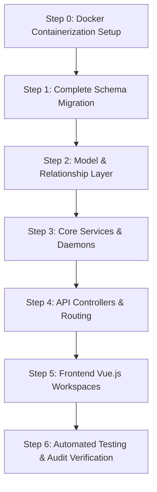

This guide outlines the optimal, step-by-step developer playbook to implement the entire operational and financial platform together, bypassing segment-by-segment division in favor of a cohesive, vertical-slice development sequence.

> [!IMPORTANT]
> **Key Architectural References:**
> - **Backend Database Schema & DDL:** [database_relations_tree.md](file:///Users/jomygeorge/Desktop/f16sefreight/database_relations_tree.md) (traces all 44 tables, foreign keys, and indexes).
> - **Operational & Product Roadmap:** [future_plan.md](file:///Users/jomygeorge/Desktop/f16sefreight/future_plan.md) (outlines product features, subscription tiers, and workflows).

---

## 🗺️ Step-by-Step Implementation Sequence



---

### Step 0: Docker Containerization Setup (Infrastructure Layer)
Establish the containerized infrastructure, domain routing, and VM boundaries for both local development and production. This ensures consistent developer environments, prepares multi-portal subdomains, and isolates complex services (like Python OCR and Ollama) from the main PHP application.

1. **Local Multi-Container Dev Setup (`docker-compose.yml`):**
   * Configured over a private bridge network (`f16s-network`).
   * **`web` container**: Laravel 7+ running on PHP-FPM behind Nginx. Exposes port `80` (or local mapped `8080`).
   * **`db` container**: MySQL 8.0 server, mounting the persistent host volume `db_data:/var/lib/mysql` to safeguard data against container cycles.
   * **`redis` container**: In-memory store for cache, Laravel Horizon workers, and distributed lock flags.
   * **`soketi` container**: Node-based WebSocket server enabling Pusher-compatible real-time dashboard triggers.
   * **`ai-server` container**: FastAPI microservice environment cohosting Python dependencies, ChromaDB, and a local Ollama service.
2. **Dynamic Name Resolution:**
   * Connection configurations in Laravel must reference the Docker network service name aliases rather than hardcoded IPs:
     * `DB_HOST=db` (port `3306`)
     * `REDIS_HOST=redis` (port `6379`)
     * `AI_SERVER_URL=http://ai-server:8000`
3. **Production DNS & Subdomains (CNAME Routing):**
   * Configure CNAME records on your DNS provider (e.g., Cloudflare, AWS Route 53) pointing the following subdomains to the web application's application load balancer (ALB) or primary web server public IP:
     * `focusair.f16sefreight.com` (Focus Air portal)
     * `focussea.f16sefreight.com` (Focus Sea portal)
     * `admin.f16sefreight.com` (SaaS Admin portal)
   * Configure Nginx virtual hosts (inside the Nginx configuration template of the `web` container) to listen to these subdomains and forward them to the Laravel entrypoint index page, enabling Laravel to resolve and bind the session scope (`active_portal_scope`) dynamically based on the incoming request host.
4. **AI Instance Provisioning (AWS EC2):**
   * **Instance Selection:** Provision a separate, dedicated AWS EC2 **`t4g.large` CPU instance** (2 vCPUs, 8 GB RAM, Graviton ARM-optimized) on AWS.
   * **Networking & Security Groups:** Deploy the instance in the private subnet of the VPC. Restrict the instance's Security Group to allow inbound TCP traffic strictly on port `11434` (Ollama) and port `8000` (FastAPI) from the IP addresses of the primary web/Horizon application servers.
   * **Deployment:** Install Docker and Docker Compose on this instance, clone the `/python` microservice repo, build/run the containers, and verify connectivity from the Laravel container.

---

### Step 1: Complete Schema Migration (Database Layer)
Initialize all database tables across **three ordered batches** with a verification checkpoint between each. Running all 44 migrations in one shot risks an unrecoverable partial schema if any FK reference fails mid-way.

#### Batch 1a — Prerequisite & Tenant Tables
These have no inbound foreign key dependencies — run these absolutely first:
* `sequence_counters` (must be first — all numbering depends on it)
* `ports` (UN/LOCODE master reference)
* Alter `companies` — add `tier`, `email_domain`, `ocr_credits_balance`, `ocr_credits_monthly_allowance`, `ocr_credits_limit`
* Create `customers` table (company_id FK → `companies.id`, default_port_id FK → `ports.id`, branch_id FK → `agents_info.id`, sales_rep_id FK → `users.id` via cyclic constraints, including tax/address/banking fields: `gst_no`, `pan_no`, `duns_no`, `address`, `phone`, `email`, `bank_name`, `bank_account_no`, `bank_ifsc_code`, `payment_terms_days`, `credit_limit`)
* Alter `users` — add `default_port_id` (Nullable FK → `ports.id`), `pima_address`, `designation`
* Alter `air_way_bills` & `house_way_bills` — add `uuid` (UUID unique), `job_id` (Nullable FK)

**Verify:** `php artisan migrate:status` — all batches show `Ran`.

#### Batch 1b — Core Operations & AI Tables
These depend on `agents_info`, `companies`, `users`, and `jobs` existing:
* `jobs` (includes `cargo_type`, `delivery_mode`, `booking_thru`, `pickup_address`, `delivery_address`, `planned_clearance_date`, `completed_at`, `is_sub_shipment`, `is_consolidation`, `extracted_pieces`, `extracted_weight`, `extracted_volume`, `cargo_description`)
* `mailbox_connections` (FK → `agents_info`, `users`)
* `inbound_emails` (FK → `agents_info`, `mailbox_connections`)
* `email_threads` (FK → `agents_info`, `users`, `jobs`)
* `inbound_attachments` (FK → `inbound_emails`)
* `job_documents` (FK → `agents_info`, `jobs`)
* `milestone_performance_logs` (FK → `agents_info`, `jobs`)
* `audit_logs` (append-only trigger registered here)
* `sea_containers` (FK → `agents_info`, `jobs`)
* `sea_container_items` (FK → `agents_info`, `sea_containers`, `jobs`)
* `cargo_arrival_notices` (FK → `agents_info`, `jobs`)
* `job_entities` (FK → `agents_info`, `jobs`, `customers`)
* `sea_shipment_details` (FK → `jobs`)
* `air_shipment_details` (FK → `jobs`)
* `llm_usage_logs` (FK → `jobs`)
* `pdf_processing_jobs` (FK → `users`)
* `manifest_filings` (FK → `agents_info`, `jobs`)
* `approved_drafts_queue` (FK → `agents_info`, `jobs`, `users`)
* `operational_cover_letters` (FK → `agents_info`, `jobs`, `customers`, `users`)
* `email_classification_rules` (FK → `agents_info.id`)
* `email_classification_overrides` (FK → `agents_info.id`, `email_threads.id`, `email_classification_rules.id`, `users.id`)
* `ocr_credit_transactions` (FK → `companies.id`, `jobs.id` ON DELETE SET NULL)
* `pdf_extraction_corrections` (FK → `pdf_processing_jobs.id` ON DELETE CASCADE, `users.id`)

**Verify:** `php artisan tinker` → `Job::count()`, `EmailThread::count()`, `EmailClassificationRule::count()` all return `0` without exceptions.

#### Batch 1c — Financial Ledger Tables
These depend on `agents_info`, `companies`, `users`, `jobs`, and `chart_of_accounts` existing:
* `chart_of_accounts` (self-referencing `parent_account_id`)
* `accounting_periods` (FK → `agents_info`)
* `accounts_invoices` (FK → `agents_info`, `jobs` ON DELETE RESTRICT, `customers`, `users`)
* `accounts_invoice_items` (FK → `accounts_invoices` CASCADE)
* `accounts_invoice_brokerage_details` (1-to-1 FK → `accounts_invoices`)
* `accounts_invoice_consol_details` (1-to-1 FK → `accounts_invoices`)
* `accounts_purchase_vouchers` (FK → `agents_info`, `jobs` ON DELETE RESTRICT, `companies`, `users`)
* `accounts_purchase_items` (FK → `accounts_purchase_vouchers` CASCADE)
* `accounts_ledger_entries` (FK → `agents_info`, `chart_of_accounts`, `accounting_periods`)
* `gst_ledger_entries` (FK → `agents_info`, `companies`)
* `unposted_transactions_queue` (FK → `agents_info`, `companies`, `users`)
* `bank_transactions` (FK → `agents_info`, `accounts_invoices` SET NULL, `accounts_purchase_vouchers` SET NULL)
* `financial_snapshots` (FK → `agents_info`, `accounting_period_id`)
* `accounts_cass_statements` (FK → `agents_info`, `companies`, `accounts_purchase_vouchers`)

**Verify:** `php artisan tinker` → `AccountsInvoice::count()`, `AccountsLedgerEntry::count()` return `0`. Confirm `RESTRICT` FK on invoice `job_id` by running a quick delete test on a job row — it must fail with an integrity constraint error.
  * Execute cyclic constraints via `ALTER TABLE` at the end of the script to link `customers` back to `ports`, `agents_info`, and `users` without migration dependency locks.

---

### Step 2: Model, Relationship, & Event Observer Layer
Create matching Eloquent models in `app/` and register observers to handle operational roll-ups and ledger automation:

1. **Define Relationships:**
   * Build relationships on the `Job` model (belongsTo client, operator, parent consolidation card; hasOne sea shipment details, hasOne air shipment details, hasMany invoices/vouchers).
   * Build relationships on `AccountsInvoice` and `AccountsPurchaseVoucher` (belongsTo job, vendor, parent debit/credit notes, hasMany items).
2. **Register Observers:**
   * **`JobObserver.php`**: Monitors job creation/updates. Triggers SLA log entries in `milestone_performance_logs` and debounces container roll-up counts.
   * **`InvoiceObserver.php`**: Listens for invoice posting events. Moves draft entries from `unposted_transactions_queue` to the permanent `accounts_ledger_entries` journal and computes `gst_ledger_entries` tax splits.
3. **Register Morph Maps:**
   * In `AppServiceProvider::boot()`, configure short-string mappings for polymorphic `source_type` and `voucher_type` lookups:
     ```php
     Relation::morphMap([
         'invoice' => 'App\AccountsInvoice',
         'purchase_voucher' => 'App\AccountsPurchaseVoucher',
         'awb' => 'App\AirwayBills',
         'hawb' => 'App\HousewayBills',
     ]);
     ```

---

### Step 3: Core Services & Daemons (Integration & Connections)
Implement the core background services, parsing microservices, and OAuth connection layers:

1. **Python FastAPI OCR Server & Vector Database (`python/ocr_server.py`):**
   * **ChromaDB Cohosting:** Setup ChromaDB as the vector database co-hosted on the dedicated AI Server instance (**AWS `t4g.large`**) alongside Ollama.
   * **In-Memory Speed Optimization:** Write logic to generate embeddings locally using `nomic-embed-text` and query ChromaDB over local memory/loopback. This keeps RAG latency sub-second and isolates compute loads from the Laravel server.
   * **VPC Security Isolation:** Lock down the AI instance within the private VPC. Block public ports and allow inbound port `11434` and FastAPI connections only from the primary web application server.
   * **Prompt Caching Nuances:**
     - *Gemini 2.5 Flash Context Caching (Cloud):* Cache the large Pydantic JSON schemas and SOP prompt instructions at the Gemini service layer with a cache TTL of 300 seconds to slash token costs by 50% and achieve sub-second visual OCR queries.
     - *Ollama Evaluation Caching (Local):* Enable native Ollama prompt context reuse (`num_ctx`) to cache system instructions in RAM, bypassing prompt parsing overhead for consecutive Gemma 4 E4B document extractions.
   * **FastAPI Extraction API:** Expose `/extract` JSON API linking selectable PDF parsing via PyMuPDF + Gemma 4.
2. **Laravel Background Ingestion Daemon (`PollMailboxes.php`):**
   * Schedule `php artisan mailboxes:poll` to run every minute via Kernel.
   * Connect to Microsoft Graph and Google OAuth channels. Parse attachments, generate thread keys, and sync local `email_threads`.
3. **Sequence Lock Service (`EnquirySequenceService.php`):**
   * Encapsulate counter increment logic. Run query-level lock transactions (`FOR UPDATE` row lock) on the `sequence_counters` table.
   * Integrate fiscal rollover helper:
     ```php
     protected function fiscalYear(): string {
         $now = now();
         return $now->month >= 4 ? $now->format('y') : $now->subYear()->format('y');
     }
     ```
4. **General Ledger & Plaid Reconciler Services:**
   * Build ledger poster services to generate balanced journal entries.
   * Build cash reconciliation services matching incoming `bank_transactions` credits against pending `accounts_invoices` balances.

---

### Step 4: API Controllers & Routing (REST API Layer)
Create REST APIs in `routes/api.php` linking dashboard pages to backend services:

1. **Triage API (`EmailInboxController.php`):**
   * `POST /api/inbox/threads/{thread_key}/classify` $\rightarrow$ handles manual operator classification overrides (Airline, Clearance, Trucking, Enquiry).
   * Automatically promo/demotes threads, spawning new Job cards or marking incorrect jobs as status `Lost`.
   * `POST /api/inbox/threads/{id}/claim` $\rightarrow$ atomic claim updates (`UPDATE jobs SET operator_id = ? WHERE id = ? AND operator_id IS NULL`). Returns `409 Conflict` if claiming fails.
2. **Kanban & Drawer API (`JobController.php`):**
   * `GET /api/jobs` $\rightarrow$ retrieves jobs. Supports named scopes for active portals (`scopeForActivePortal()`) and personal filters.
   * `PUT /api/jobs/{id}/status` $\rightarrow$ updates status milestones.
3. **Billing & Ledger API (`InvoiceController.php` / `PurchaseVoucherController.php`):**
   * Handles draft finalizations, tax evaluations, and posting ledger lines.
4. **Customs CGM API (`ManifestFilingController.php`):**
   * Generates flat-file customs CGM manifests for ICEGATE submission.
5. **Superadmin Health Check & Debug API (`AdminHealthController.php`):**
   * `GET /api/admin/health` $\rightarrow$ returns Redis state variables (`platform:status:ai_server`), local Horizon queue metrics, and system CPU/RAM indicators.
   * `GET /api/admin/logs` $\rightarrow$ reads and streams the last 100 log lines from `laravel.log` via streamed tail pointers.
   * Gated strictly behind global platform-level `superadmin` role middleware.

---

### Step 5: Frontend Vue.js Workspaces (UI/UX Interface)
Build the frontend dashboard portals using clean styles and responsive grid layouts:

1. **Inbox Workspace (`JobInbox.vue`):**
   * Build the three-column split-pane layout (Navigation $\rightarrow$ Inbox Threads $\rightarrow$ View Pane / Drawer Workspace).
   * Integrate the `"Classify As..."` dropdown and Claim/Take Over toolbar.
2. **Kanban Board (`OpsDashboard.vue`):**
   * Use `vuedraggable` to render columns (`Processing`, `Awaiting Customer`, `In Transit`, `Completed`).
   * Add the **"Unassigned Pool"** tab alongside the personal board view.
3. **Job Cost Sheet UI (`JobCostSheet.vue`):**
   * Build buy/sell pricing tables directly in the drawer workspace, enabling line updates without affecting IATA legal manifests.
4. **Sea Freight Forms (`FocusSeaMaster.vue` / `FocusSeaHouse.vue` / `FocusSeaConsol.vue`):**
   * Build ocean routing parameters, UN/LOCODE auto-completion forms, and stuffing grids mapping House waybills into Master containers.
5. **Subscription Teaser Modals (`ViperTeaser.vue`):**
   * Create lock screens to blur commanded pages if the client company's tier doesn't match standard prerequisites.
6. **Superadmin System Monitor (`SuperadminMonitor.vue`):**
   * Build the diagnostics and monitoring interface for the `admin.f16sefreight.com` sub-portal, displaying Redis health checks, system log feeds, and active failed queues.

---

### Step 6: Automated Testing & Audit Verification
Write and execute automated test coverage suites to verify integration stability:

1. **Database & Transaction Tests (`php artisan test`):**
   * **`JobTriageTest.php`:** Asserts enquiry code sequence assignments.
   * **`MultiPortalScopingTest.php`:** Asserts background scopes bypass portal checks.
   * **`ConcurrencyClaimingTest.php`:** Simulates race conditions on unassigned claims to verify `409` responses.
   * **`DoubleEntryLedgerTest.php`:** Asserts invoice finalization posts correct balanced lines to the general ledger.
2. **FastAPI Parser Tests (`pytest python/`):**
   * Mock PDF parser tests using sample airway bills and vendor invoice texts.
3. **Frontend Component Tests (`npm run test:unit`):**
   * Verify layout responsive shifts, drawer expansions, and ApexCharts loading.

---

## 📅 Phase-by-Phase Feature Implementation Plan

### Phase 1: Core Document Ingestion, Database Foundation & Models

-   **Step 1.0: Docker Infrastructure Foundation:** Create the `docker-compose.yml`, `Dockerfile.laravel`, and `Dockerfile.fastapi` configurations. Boot the containers locally (`docker compose up -d`) and verify that Nginx, PHP-FPM, MySQL, Redis, and Soketi are all online and communicating on `f16s-network`. Execute migration status checks (`docker compose exec web php artisan migrate:status`) to verify DB container accessibility.
-   **Step 1.1:** Upgrade FastAPI server to support `PyMuPDF` (`fitz`) and Pydantic validation schemas. Configure local Gemma 4 E4B hosting and connectivity as follows:
    -   **Server Provisioning & Networking:** Spin up a separate dedicated CPU instance (**AWS `t4g.large`** / 2 vCPUs, 8 GB RAM, Graviton ARM-optimized). Restrict its Security Group to allow inbound TCP connections on port `11434` only from the main web/FastAPI server IP address within the private VPC.
    -   **Ollama Installation & Configuration:** Install Ollama on the instance, run `ollama pull gemma-4b`, and configure the Ollama service system system environment variable `OLLAMA_KEEP_ALIVE=-1` to ensure the model remains permanently loaded in RAM.
    -   **Custom Modelfile Baking:** Build a local Ollama custom `Modelfile` (embedding the target invoice/packing list system parsing instructions and Pydantic JSON schemas) and build it (`ollama create gemma-custom -f ./Modelfile`) to minimize input token overhead.
    -   **FastAPI Linkage:** In the FastAPI `ocr_server.py`, route selectable PDF parsing queries to the local AI instance's API endpoint: `http://<ai-server-private-vpc-ip>:11434`.
    -   **Vision Fallback:** Configure the cloud Gemini 2.5 Flash API as a fallback vision OCR handler for high-resolution scanned PDFs and images, routing foreign documents to standard English. Check for python microservice connection errors.
-   **Step 1.2:** Run database migrations to add `tier`, `email_domain`, and `transport_mode` columns to `companies` and `pdf_processing_jobs` tables. Enforce SQLite/MySQL database triggers on user designation checks (operator must be `operations`, owner must be `pricing`).
-   **Step 1.3:** Run database migrations to add `origin_port_id` (referencing `ports.id`) and `pima_address` columns to the `users` table. Check for schema mapping errors.
-   **Step 1.4:** Create the drag-and-drop file upload handler inside `OcrUploadModal.vue`. The modal hits the backend, triggers the extraction task, saves the result to `pdf_processing_jobs.extracted_data` (storing original LLM data, confidence ratings, and manual adjustments for auditing), and returns the JSON payload to pre-populate form fields in `FocusAir.vue` and `HouseWayBill.vue` inline, highlighting low-confidence fields in orange.
-   **Step 1.5:** Run validation tests and sanity check each model and endpoint for errors before moving to Phase 2.

### Phase 2: Inbox Sync, OAuth Validation & Split-Screen Workspace UI

-   **Step 2.1:** Run migration tasks for `mailbox_connections`, `inbound_emails`, and `inbound_attachments`. Ensure constraints are verified.
-   **Step 2.2:** Build the scheduled `mailboxes:poll` Artisan command to sync Google/Microsoft accounts, extract attachments, and classify threads. Tracking notices and pre-alerts are marked as `airline` (airline mail), `clearance`, or `trucking_road` with `job_id = null` so they bypass auto-triage/tasks while remaining visible in the unified inbox feed. Calculate the SLA reply deadline countdown timers dynamically based on client subscription tier settings.
-   **Step 2.3:** Build `MailboxOAuthController` callbacks. Enforce corporate email domain verification against the company's multi-domain suffix list (e.g. `xyzcompany.com, xyzcompany.co.in`). Soft-deactivate connections (`is_active = false`) during plan downgrades, keeping tokens encrypted.
-   **Step 2.4:** Build `JobInbox.vue` (3-column inbox layout) and check routing endpoints. Add a **"Classify As..." dropdown selector** in the email detail view header toolbar to allow operators to manually change the mail type (customer enquiry, airline mail, clearance info, trucking/road mail).
-   **Step 2.5:** Implement the **Split-Pane Column Hiding Logic**: opening the drawer slides the sidebar/thread list off-screen and presents a 50/50 split of the email timeline on the left and form verification (Focus Air / HAWB) on the right. If the viewport is narrow (under 1200px), collapse the split to a full-width stacked form layout with a toggle back to the timeline.
-   **Step 2.6:** Execute verification tests for inbox sync and OAuth callbacks, ensuring domain verification behaves correctly, checking for errors after each step.

### Phase 3: Workflow Automation, Kanban & Job Cost Sheets

-   **Step 3.1:** Create `jobs` table migration. Implement triage actions (converting client inquiries to Jobs), manual override classification updates (promotions/demotions), and assign task dialog (clearance dates, assigned operator, AWB association). Implement responder-based auto-assignment (assigning `operator_id`/`assigned_operator_id` to the user who replies to the thread) and support reassigning to other pricing staff.
-   **Step 3.2:** Build `OpsDashboard.vue` (dual-view Kanban workspace):
    -   **Top Unassigned Tasks Header Scroll:** Implement a horizontal scroll bar with a `[+]` / `[-]` toggle. When expanded (`[+]`), clicking a card shows an assign overlay to either claim or select a staff member to assign it to.
    -   **Process View:** Implement exactly 4 columns: `Processing`, `Awaiting Customer`, `In Transit`, and `Completed`. Cards in all 4 columns feature a mail icon that navigates to the Mail page (`/inbox`). Cards in the `In Transit` column also feature a message log icon that navigates to the Message Log page (`/message-log`). Clicking a card in the `In Transit` column opens the **Drawer Workspace** directly on the **Routing & Voyage/Flight Details** tab. Add a prominent **"View Source Email" button** in the drawer toolbar to instantly navigate the operator back to the original email thread in the `JobInbox` for reference.
    -   **Staff View:** Implement a vertically paginated clearance grid matrix where the left Y-axis shows the Day and Date, and columns show the staff names. Intersecting cards show the AWB/Job number.
    -   **SLA Color-Coding:** Apply color styles: Red if clearance is today and AWB is not sent to airline; Yellow if clearance is tomorrow and AWB was not sent a day before; Green if everything is on track.
    -   **Magnetic Drag-and-Drop:** Enable dragging cards between staff columns and date rows, which automatically updates `operator_id` and `planned_clearance_date` and snaps the card to that grid cell like a magnet.
-   **Step 3.3:** Run migrations for `accounts_invoices`, `accounts_invoice_items`, `accounts_purchase_vouchers`, and `accounts_purchase_items`.
-   **Step 3.4:** Build the **Job Cost Sheet UI** inside the workspace drawer tab. Auto-populate charging quantities from AWB weight and DO details, implementing hierarchical cost sheets for HAWBs and consolidated MAWBs.
-   **Step 3.5:** Validate the integrity of database status logs, task allocations, and accounting ledger inputs, checking for errors.

### Phase 4: Multi-Portal Access Scoping & User Onboarding

-   **Step 4.0: Subdomain CNAME Resolution & Nginx Routing Configuration:**
    -   Configure CNAME records on AWS Route 53 or Cloudflare for subdomains `focusair.f16sefreight.com`, `focussea.f16sefreight.com`, and `admin.f16sefreight.com` pointing to the web application's load balancer or server IP.
    -   Update Nginx configuration files in the `web` container to listen on these server names and route requests to the central Laravel entrypoint.
    -   Verify DNS routing using command-line diagnostic tools (`dig focusair.f16sefreight.com`) to ensure correct virtual host mapping before writing application scopes.
-   **Step 4.1:** Build company registration and user self-registration/onboarding flows. Mandate selection of the designated origin port (`origin_port_id`) referencing `ports.id` during user registration. Verify input constraints for errors.
-   **Step 4.2:** Build the pre-login company selection dropdown page. Bind the selected `company_id` and the scoped `active_portal_scope` dynamically to user sessions. Check session storage operations for errors.
-   **Step 4.3:** Create user profile editing forms in the admin portal backend to allow administrators to assign/edit the `pima_address` for routing.
-   **Step 4.4:** Apply Local/Named Laravel Query Scopes (e.g. `scopeForActivePortal()`) to filter jobs, pdf processing jobs, and accounting tables contextually in web requests.
-   **Step 4.5:** Build sea templates (`FocusSeaMaster.vue` / `FocusSeaHouse.vue` / `FocusSeaConsol.vue`) to load dynamically inside the drawer workspace depending on the active portal. Register route navigation paths in `router.js` contextually.
-   **Step 4.6:** Verify session scoping, onboarding port selections, and admin edits, checking for errors in each step.
-   **Step 4.7:** Implement the Internal Docs RAG Interactive Help Guide, UI Tour Agent & Browser Assistant:
    -   *Vector Database Ingestion:* Populate ChromaDB with your company's user-facing SOP guidelines and manuals. Tag vector chunks with metadata linking sections to routing paths and DOM element selectors (e.g. `{"route": "/inbox", "steps": [{"selector": "#btn-upload-ocr", "instruction": "Click here"}]}`).
    -   *Backend Endpoint:* Expose a `POST /api/help/query` route in Laravel that performs similarity searches against ChromaDB and sends the context to Ollama (Gemma 4 E4B). Link this with a FastAPI `browser-use` sub-service that spins up a Playwright session to perform screen and DOM structure analysis.
    -   *Gemma 4 Translation Prompt:* Prompt Gemma to extract a text response, translate DOM metadata, and generate a structured JSON array of UI steps (`[{selector, instruction}]`) mapping the text guides to active selectors.
    -   *Vue Overlay Tour Panel:* Integrate a sidebar chatbot panel ([HelpCopilotChatbox.vue](file:///Users/jomygeorge/Desktop/f16sefreight/future_plan.md)) featuring a browser viewer/automation toggle. When enabled, it binds to a global walkthrough overlay controller (using [HighlightTourDriver.js](file:///Users/jomygeorge/Desktop/f16sefreight/future_plan.md) with Driver.js) to dim the screen and sequentially highlight elements, or trigger the backend browser-use agent to perform automated clicks and operations on the user's viewport.
-   **Step 4.8: Superadmin Health Monitor & Debugging Console:**
    -   *Backend Controller (`AdminHealthController.php`):* Build a secure controller gated by the global `superadmin` role middleware (independent of tenant company contexts).
    -   *Reactive Exception Catcher:* Wrap API service clients (FastAPI, Ollama) in a try-catch blocks that writes connection failures to the Redis key `platform:status:ai_server` and clears the key upon successful execution.
    -   *Tail Log Viewer:* Implement a file handler that securely streams the last 100 lines of `storage/logs/laravel.log` using resource-buffered pointers.
    -   *Horizon Failed Job Inspector:* Expose endpoints querying Horizon failed queues, allowing superadmins to inspect stack traces and trigger queue retries.
    -   *Frontend UI (`SuperadminMonitor.vue`):* Create the monitoring panel inside the `admin.f16sefreight.com` router to display Redis health states, system log feeds, and active failed queues.

### Phase 5: Automated Ledgers, CASS Reconciliations & Reports

-   **Step 5.1:** Run migrations for `accounts_ledger_entries` and `accounts_cass_statements` and audit triggers.
-   **Step 5.2:** Build Plaid/Setu sync service to poll raw bank statements every 3 days. Map bank accounts to specific branch ledger accounts centrally. Highlight payment discrepancies in the UI and allow one-click popup resolutions (Write-off, Short-Paid, Discount).
-   **Step 5.3:** Build CASS file upload portal. Reconcile reported AWB charges with estimated cost vouchers, flagging weight/rate mismatches.
-   **Step 5.4:** Compile financial balance sheets, trial balance sheets, and Profit & Loss reports from the ledger. Enforce strict period lockout constraints (late adjustments require explicitly opening, editing, and re-closing).
-   **Step 5.5:** Run reconciliation runs and report computations, validating results and checking for errors at each point.
-   **Step 5.6:** Register a scheduled Artisan command `php artisan snapshots:compute` running every 30 minutes to compute and update current-day performance aggregates in the `financial_snapshots` table.
