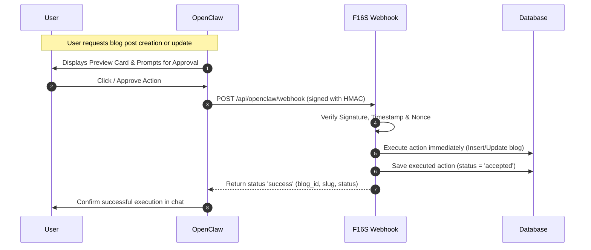

# OpenClaw API Documentation for F16S (Blog Section Only)

This document describes the webhook events and fields that OpenClaw can send to the F16S backend. For security, OpenClaw's access is strictly restricted to the blog section of this project. Any other event types will be rejected.

---

## 1. Webhook Endpoint & Authentication

* **Webhook Endpoint**: `POST /api/openclaw/webhook`
* **Telegram Callback Endpoint**: `POST /api/openclaw/telegram-callback` (Must be configured as the Webhook URL for the Telegram Bot)
* **Authentication**: HMAC-SHA256 signature + timestamp + nonce (replay prevention)

### Required Request Headers

| Header | Description |
| :--- | :--- |
| `x-openclaw-signature` | Hex-encoded HMAC-SHA256 of the raw string body of the request, hashed using the shared `OPENCLAW_HMAC_SECRET` |
| `x-openclaw-timestamp` | Current UTC timestamp / string representation (must be within 5 minutes of server time) |
| `x-openclaw-nonce` | Unique string per request (checked against previous nonces to prevent replay attacks) |

### Request JSON Envelope
All webhook events must be wrapped in this envelope:
```json
{
  "event_type": "<event_name>",
  "payload": { ... }
}
```

### Success Response
```json
{
  "status": "success",
  "event_type": "<event_name>",
  "message": "Action executed successfully.",
  "details": "Created Blog Post #15: ...",
  "blog_id": 15,
  "slug": "some-blog-post-slug",
  "blog_status": "Published"
}
```

---

## 2. Webhook Event Reference (Blog Section Only)

### A. Create Blog Post (`create_blog_post`)

Creates a new blog post.

```json
{
  "event_type": "create_blog_post",
  "payload": {
    "title": "Unlocking Efficiency in Air Freight Forwarding",
    "category": "Logistics",
    "read_time": "5 min read",
    "excerpt": "Discover how digital tools and automated workflows are transforming house waybill processing and logistics management.",
    "content": "<p>Air freight operations require high precision...</p>",
    "image_path": "/media/assets/blog/air-freight-efficiency.png",
    "meta_title": "Air Freight Forwarding Efficiency Guide",
    "meta_description": "Learn the best strategies to streamline air freight workflow management.",
    "takeaways": [
      "Digital tools reduce waybill processing times.",
      "Automation mitigates compliance risk."
    ],
    "is_draft": true
  }
}
```

| Parameter | Type | Required | Description / Allowed Values | Default |
| :--- | :--- | :--- | :--- | :--- |
| `title` | String | ✅ Yes | The title of the blog post | — |
| `content` | String | ✅ Yes | The HTML or rich text body of the post | — |
| `category` | String | No | Category name (e.g. `Logistics`, `Industry News`) | `General` |
| `read_time` | String | No | Estimated reading time (e.g. `4 min read`) | `5 min read` |
| `excerpt` | String | No | A short summary of the post | Auto-truncated from content |
| `image_path` | String | No | Relative public path or URL of the cover image | `""` |
| `cover_image_url` | String | No | Alias for `image_path` (used interchangeably) | `""` |
| `meta_title` | String | No | SEO meta title | Defaults to `title` |
| `meta_description` | String | No | SEO meta description | Defaults to `excerpt` |
| `takeaways` | Array | No | JSON array of key takeaways | `null` |
| `is_draft` | Boolean | No | If `true`, the post is saved as a draft (`published_at` set to `null`). If `false`, it publishes immediately. | `false` |

---

### B. Update Blog Post (`update_blog_post`)

Updates an existing blog post. To identify the target post, you must provide either `blog_id` OR `slug`.

```json
{
  "event_type": "update_blog_post",
  "payload": {
    "blog_id": 4,
    "title": "Unlocking Efficiency in Air Freight Forwarding (Updated)",
    "is_draft": true,
    "content": "<p>Air freight operations require high precision. In this update...</p>"
  }
}
```

| Parameter | Type | Required | Description / Allowed Values |
| :--- | :--- | :--- | :--- |
| `blog_id` | Integer | No* | The primary key ID of the blog post (*Required if `slug` is not provided) |
| `slug` | String | No* | The URL slug of the blog post (*Required if `blog_id` is not provided) |
| `title` | String | No | The updated title of the blog post. If modified, the URL slug is automatically regenerated. |
| `content` | String | No | The updated HTML or rich text body |
| `category` | String | No | The updated category |
| `read_time` | String | No | Updated reading time |
| `excerpt` | String | No | Updated short summary |
| `image_path` | String | No | Updated cover image path or URL |
| `cover_image_url` | String | No | Alias for updated cover image path or URL |
| `meta_title` | String | No | Updated SEO meta title |
| `meta_description` | String | No | Updated SEO meta description |
| `takeaways` | Array | No | Updated JSON array of key takeaways |
| `is_draft` | Boolean | No | If updated to `true`, saves the post as a draft (`published_at` set to `null`). If updated to `false`, sets `published_at` to the current timestamp. |

---

## 3. Workflow & Approval Flow


